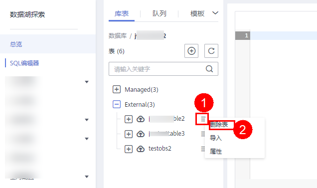

# 删除数据库和表

根据实际使用情况，您可以通过删除数据库和表。

## 注意事项

-   具有正在运行中的作业的数据库或者表不能删除。
-   管理员用户、数据库的所有者和具有删除数据库权限的用户可以删除数据库。管理员用户、表的所有者和具有删除表权限的用户可以删除表。

    > **说明：** 
    >数据库和表删除后，将不可恢复，请谨慎操作。

## 删除表

删除表的入口有两个，分别在“数据管理“和“SQL编辑器“页面。

-   在“数据管理“页面删除表。
    1.  在管理控制台左侧，单击“数据管理“\>“库表管理“。
    2.  单击需删除表的数据库名，进入该数据库的“表管理”页面。
    3.  选中目标表，单击“操作”栏中的“删除表“。
    4.  在弹出的确认对话框中，单击“确定“。

-   在“SQL编辑器“页面删除表。
    1.  在SQL作业管理控制台的顶部菜单栏中，选择“SQL编辑器“。
    2.  在左侧导航栏选择“库表”页签，鼠标左键单击需要删除表的数据库名，进入“表”区域。
    3.  鼠标左键单击对应表右侧的，在列表菜单中选择“删除表”。

        

    4.  在弹出的确认对话框中，单击“确定“。

## 删除数据库

1.  在管理控制台左侧，单击“数据管理“\>“库表管理“。
2.  单击需要删除的数据库“操作”栏中的“删除数据库“。

    > **说明：** 
    >需要删除的数据库中含有表时，不能执行删除操作。需要先删除其中的表。

3.  在弹出的确认对话框中，单击“确定“。

