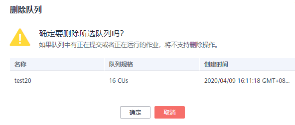

# 删除队列

## 操作场景

根据实际使用情况，您可以通过删除操作释放队列。

> **说明：**   
>如果待删除的队列中有正在提交或正在运行的作业，将不支持删除操作。  

## 操作步骤

1.  在DLI管理控制台的顶部菜单栏中，选择“队列管理“。
2.  选择待删除的队列，单击“操作“列的“删除“。

    如果“操作“列的“删除“为灰色，表示当前用户没有删除队列的权限。您可以向管理员申请删除队列的权限。

    **图 1**  删除队列  
    

3.  在弹出的确认对话框中，单击“确定“。

