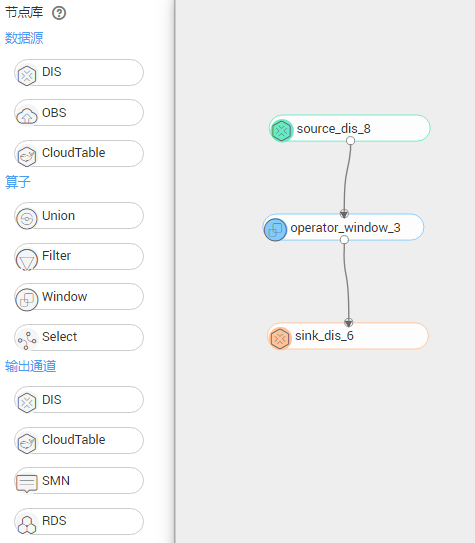

# 可视化编辑器

DLI针对不太熟悉SQL的用户，提供了可视化编辑器功能，可视化编辑器又可称为可视化SQL编辑器，它将DLI需要对接的上下游服务（如DIS、CloudTable等）和内部逻辑算子（如 filter、window等）封装成可拖拽的组件，用户只需要将其拖入画布中并用连线将各个节点连接，就能轻松的创建出一个作业的拓扑，再通过点击画布中的各个节点设置对应参数，就能轻松完成一个作业的编辑。可视化编辑器分三个区域：

-   节点库，暂时包含如下节点，后续会逐渐丰富数据源、算子和输出通道的种类以满足用户更多的场景需求。
    -   数据源：DIS、OBS、CloudTable。
    -   算子：Union、Filter、Window、Select。
    -   输出通道： DIS、CloudTable、SMN、RDS。

-   画布区
-   节点参数设置区

> **说明：**   
>该功能目前只支持创建Flink SQL作业。  

## 操作步骤

以DIS-DLI（Window）-DIS场景为例，使用可视化编辑器新建一个Flink SQL作业。

1.  登录DLI管理控制台。
2.  在DLI管理控制台的左侧导航栏中，单击“作业管理“\>“Flink作业“，进入“Flink作业“页面。
3.  单击页面右上角“新建作业“，弹出“新建作业“页面。
4.  选择“Flink SQL作业“并选择“可视化编辑器“。

    **图 1**  新建作业  
    

5.  单击“确认“，进入作业可视化编辑页面。
6.  将用到的节点，如数据源DIS，Window算子，输出通道DIS，从左侧“节点库“区中拖拽到中间“画布“区。

    **图 2**  拖拽节点到画布区  
    

    > **说明：**   
    >画布中不需要的节点，可以通过双击进行删除。  

7.  根据先后逻辑连接各节点。

    从一个节点的出端口拖出一条曲线指向其他节点的入端口，可连接的节点端口将变绿，端口颜色没有变化表示不能连接该节点，例如，数据源节点不能直接连接到输出通道节点上。

    > **说明：**   
    >画布中不需要的连线，可以通过双击连线进行删除。  

8.  设置节点参数。
    -   单击数据源节点，如source\_dis\_8，在页面右侧将自动显示该节点需要配置的参数，配置对应的数据流属性和节点参数。

        **表 1**  配置数据流属性

        
        <table><thead align="left"><tr id="row11500205713216"><th class="cellrowborder" valign="top" width="27.16%" id="mcps1.2.3.1.1">
参数

        </th>
        <th class="cellrowborder" valign="top" width="72.84%" id="mcps1.2.3.1.2">
参数说明

        </th>
        </tr>
        </thead>
        <tbody><tr id="row1750095719324"><td class="cellrowborder" valign="top" width="27.16%" headers="mcps1.2.3.1.1 ">
数据流属性设置

        </td>
        <td class="cellrowborder" valign="top" width="72.84%" headers="mcps1.2.3.1.2 "><ul id="ul10791321193311"><li>单击“增加一个属性”，输入属性名和属性类型新增一个数据流属性。<ul id="ul12792132173314"><li>“属性名”以英文字母开头，只能包含英文字母、数字和下划线，长度不超过20个字符。</li><li>“属性类型”包含如下：STRING、INT、BIGINT、BOOLEAN、DOUBLE、FLOAT和TIMESTAMP。</li><li>在“操作”列单击“删除”，可以删除对应的属性。</li></ul>
        </li><li>单击“插入测试数据”，插入属性的测试数据。</li><li>单击“删除测试数据”，删除属性的测试数据。</li></ul>
        </td>
        </tr>
        </tbody>
        </table>

        **表 2**  设置DIS数据源节点参数

        
        <table><thead align="left"><tr id="row6751193115518"><th class="cellrowborder" valign="top" width="20.14%" id="mcps1.2.3.1.1">
参数

        </th>
        <th class="cellrowborder" valign="top" width="79.86%" id="mcps1.2.3.1.2">
参数说明

        </th>
        </tr>
        </thead>
        <tbody><tr id="row875219311852"><td class="cellrowborder" valign="top" width="20.14%" headers="mcps1.2.3.1.1 ">
类型

        </td>
        <td class="cellrowborder" valign="top" width="79.86%" headers="mcps1.2.3.1.2 ">
节点的类型，DIS数据源为source-dis。

        </td>
        </tr>
        <tr id="row166619469214"><td class="cellrowborder" valign="top" width="20.14%" headers="mcps1.2.3.1.1 ">
当前作用域

        </td>
        <td class="cellrowborder" valign="top" width="79.86%" headers="mcps1.2.3.1.2 ">
用户所在的region域。

        </td>
        </tr>
        <tr id="row56618742219"><td class="cellrowborder" valign="top" width="20.14%" headers="mcps1.2.3.1.1 ">
分区数量

        </td>
        <td class="cellrowborder" valign="top" width="79.86%" headers="mcps1.2.3.1.2 ">
分区是吞吐容量的单位。每个分区的最高发送速度可达 1MB/秒及1000 条记录/秒，最高提取速度可达2MB/秒。

        </td>
        </tr>
        <tr id="row94515842210"><td class="cellrowborder" valign="top" width="20.14%" headers="mcps1.2.3.1.1 ">
编码

        </td>
        <td class="cellrowborder" valign="top" width="79.86%" headers="mcps1.2.3.1.2 ">
数据的编码方式，支持CSV和JSON。

        </td>
        </tr>
        <tr id="row1622331118555"><td class="cellrowborder" valign="top" width="20.14%" headers="mcps1.2.3.1.1 ">
字段分隔符

        </td>
        <td class="cellrowborder" valign="top" width="79.86%" headers="mcps1.2.3.1.2 ">
当编码方式为CSV时，该参数有效。

        
属性之间的分隔符，默认为逗号。

        </td>
        </tr>
        <tr id="row1672411811551"><td class="cellrowborder" valign="top" width="20.14%" headers="mcps1.2.3.1.1 ">
JSON配置

        </td>
        <td class="cellrowborder" valign="top" width="79.86%" headers="mcps1.2.3.1.2 ">
当编码方式为JSON时，该参数有效。

        
配置JSON字段和流定义字段的映射关系，例如：

        
"attr1=student.name;attr2=student.age;"

        </td>
        </tr>
        <tr id="row11361165133811"><td class="cellrowborder" valign="top" width="20.14%" headers="mcps1.2.3.1.1 ">
DIS通道

        </td>
        <td class="cellrowborder" valign="top" width="79.86%" headers="mcps1.2.3.1.2 ">
选择数据源的DIS通道。

        </td>
        </tr>
        </tbody>
        </table>

        **表 3**  设置OBS数据源节点参数

        
        <table><thead align="left"><tr id="row2791102517187"><th class="cellrowborder" valign="top" width="23%" id="mcps1.2.3.1.1">
参数

        </th>
        <th class="cellrowborder" valign="top" width="77%" id="mcps1.2.3.1.2">
参数说明

        </th>
        </tr>
        </thead>
        <tbody><tr id="row1685542581811"><td class="cellrowborder" valign="top" width="23%" headers="mcps1.2.3.1.1 ">
类型

        </td>
        <td class="cellrowborder" valign="top" width="77%" headers="mcps1.2.3.1.2 ">
节点的类型，OBS数据源为source-obs。

        </td>
        </tr>
        <tr id="row1089282551810"><td class="cellrowborder" valign="top" width="23%" headers="mcps1.2.3.1.1 ">
当前作用域

        </td>
        <td class="cellrowborder" valign="top" width="77%" headers="mcps1.2.3.1.2 ">
用户所在的region域。

        </td>
        </tr>
        <tr id="row15411266187"><td class="cellrowborder" valign="top" width="23%" headers="mcps1.2.3.1.1 ">
对象名称

        </td>
        <td class="cellrowborder" valign="top" width="77%" headers="mcps1.2.3.1.2 ">
选择输入源数据所在的OBS桶中的对象名。

        </td>
        </tr>
        <tr id="row5221526101819"><td class="cellrowborder" valign="top" width="23%" headers="mcps1.2.3.1.1 ">
行分隔符

        </td>
        <td class="cellrowborder" valign="top" width="77%" headers="mcps1.2.3.1.2 ">
行间的分隔符，默认为"\n"。

        </td>
        </tr>
        <tr id="row15434144610148"><td class="cellrowborder" valign="top" width="23%" headers="mcps1.2.3.1.1 ">
字段分隔符

        </td>
        <td class="cellrowborder" valign="top" width="77%" headers="mcps1.2.3.1.2 ">
属性之间的分隔符，默认为逗号。

        </td>
        </tr>
        </tbody>
        </table>

        **表 4**  设置CloudTable数据源节点参数

        
        <table><thead align="left"><tr id="row199322391231"><th class="cellrowborder" valign="top" width="23%" id="mcps1.2.3.1.1">
参数

        </th>
        <th class="cellrowborder" valign="top" width="77%" id="mcps1.2.3.1.2">
参数说明

        </th>
        </tr>
        </thead>
        <tbody><tr id="row159971239182312"><td class="cellrowborder" valign="top" width="23%" headers="mcps1.2.3.1.1 ">
类型

        </td>
        <td class="cellrowborder" valign="top" width="77%" headers="mcps1.2.3.1.2 ">
节点的类型，CloudTable数据源为source-cloudtable。

        </td>
        </tr>
        <tr id="row14286401238"><td class="cellrowborder" valign="top" width="23%" headers="mcps1.2.3.1.1 ">
当前作用域

        </td>
        <td class="cellrowborder" valign="top" width="77%" headers="mcps1.2.3.1.2 ">
用户所在的region域。

        </td>
        </tr>
        <tr id="row19499114215485"><td class="cellrowborder" valign="top" width="23%" headers="mcps1.2.3.1.1 ">
队列ID

        </td>
        <td class="cellrowborder" valign="top" width="77%" headers="mcps1.2.3.1.2 ">
待读取数据表所属队列ID。

        </td>
        </tr>
        <tr id="row4911440152317"><td class="cellrowborder" valign="top" width="23%" headers="mcps1.2.3.1.1 ">
待读列

        </td>
        <td class="cellrowborder" valign="top" width="77%" headers="mcps1.2.3.1.2 ">
具体形式如："rowKey,f1:c1,f1:c2,f2:c1"，并且保证与数据源属性个数相同。

        </td>
        </tr>
        <tr id="row9108340182313"><td class="cellrowborder" valign="top" width="23%" headers="mcps1.2.3.1.1 ">
表名

        </td>
        <td class="cellrowborder" valign="top" width="77%" headers="mcps1.2.3.1.2 ">
待读取数据表的表名。

        </td>
        </tr>
        </tbody>
        </table>

    -   单击算子节点，例如operator\_window\_3，在页面右侧将自动显示该节点需要配置的参数，配置对应的属性和参数。
        -   Union算子可将多个流合并起来，要求多个流的属性完全一致，包括属性类型和属性顺序。

            数据源少于两个时，不需要使用Union算子。

            **表 5**  设置Union算子节点参数

            
            <table><thead align="left"><tr id="row668385018586"><th class="cellrowborder" valign="top" width="24%" id="mcps1.2.3.1.1">
参数

            </th>
            <th class="cellrowborder" valign="top" width="76%" id="mcps1.2.3.1.2">
参数说明

            </th>
            </tr>
            </thead>
            <tbody><tr id="row36835504588"><td class="cellrowborder" valign="top" width="24%" headers="mcps1.2.3.1.1 ">
输出属性

            </td>
            <td class="cellrowborder" valign="top" width="76%" headers="mcps1.2.3.1.2 ">
显示输出属性名和类型。

            </td>
            </tr>
            </tbody>
            </table>

        -   Filter算子对应的SQL语句为WHERE，用于从数据流中过滤数据，过滤规则中支持算术运算符，关系运算符和逻辑运算符。

            **表 6**  设置Filter算子节点参数

            
            <table><thead align="left"><tr id="row44041252105512"><th class="cellrowborder" valign="top" width="17.46%" id="mcps1.2.3.1.1">
参数

            </th>
            <th class="cellrowborder" valign="top" width="82.54%" id="mcps1.2.3.1.2">
参数说明

            </th>
            </tr>
            </thead>
            <tbody><tr id="row184052052195516"><td class="cellrowborder" valign="top" width="17.46%" headers="mcps1.2.3.1.1 ">
源属性

            </td>
            <td class="cellrowborder" valign="top" width="82.54%" headers="mcps1.2.3.1.2 ">
显示在输入源中设置的所属源，属性名和类型。

            </td>
            </tr>
            <tr id="row8405165275510"><td class="cellrowborder" valign="top" width="17.46%" headers="mcps1.2.3.1.1 ">
过滤规则

            </td>
            <td class="cellrowborder" valign="top" width="82.54%" headers="mcps1.2.3.1.2 "><ul id="ul56859491219"><li>单击“添加一个规则”，在“规则”列输入过滤规则。支持添加多条规则。</li><li>单击“操作”列中的“删除”，可以删除对应的过滤规则。</li></ul>
            </td>
            </tr>
            <tr id="row740575245510"><td class="cellrowborder" valign="top" width="17.46%" headers="mcps1.2.3.1.1 ">
输出属性

            </td>
            <td class="cellrowborder" valign="top" width="82.54%" headers="mcps1.2.3.1.2 ">
显示输出属性名和类型。

            </td>
            </tr>
            </tbody>
            </table>

        -   Window算子支持两种时间类型做窗口：Event Time和Processing Time。每种类型下，又分别支持三种窗口类型：滚动窗口（TUMBLE），滑动窗口（HOP）和会话窗口（SESSION）。支持用户对窗口内的数据进行计算，例如对窗口内数据进行求和、求平均等操作。

            **表 7**  设置Window算子节点参数

            
            <table><thead align="left"><tr id="row1144619311555"><th class="cellrowborder" valign="top" width="24%" id="mcps1.2.3.1.1">
参数

            </th>
            <th class="cellrowborder" valign="top" width="76%" id="mcps1.2.3.1.2">
参数说明

            </th>
            </tr>
            </thead>
            <tbody><tr id="row9449163165517"><td class="cellrowborder" valign="top" width="24%" headers="mcps1.2.3.1.1 ">
源属性

            </td>
            <td class="cellrowborder" valign="top" width="76%" headers="mcps1.2.3.1.2 ">
显示在输入源中设置的所属源，属性名和类型。

            </td>
            </tr>
            <tr id="row134494317555"><td class="cellrowborder" valign="top" width="24%" headers="mcps1.2.3.1.1 ">
窗口聚合参数配置

            </td>
            <td class="cellrowborder" valign="top" width="76%" headers="mcps1.2.3.1.2 "><ul id="ul1235019537920"><li>时间类型：支持两种时间类型。<ul id="ul524619011105"><li>Event Time</li><li>Processing Time。</li></ul>
            </li><li>时间属性：<ul id="ul13514163711103"><li>当时间类型为Event Time时，时间属性为用户提供的事件时间即源属性中类型为timestamp的数据；
 说明： 

如果显示“不存在timestamp属性”，请在选择一个数据源，在其“节点属性设置”&gt;“数据源属性设置”中增加“TIMESTAMP”属性，具体请参考<a href="#table9499195714322">表1</a>。

            

            </li><li>当时间类型为Processing Time时，时间属性为系统对事件进行处理的本地系统时间proctime。，</li></ul>
            </li></ul>
            </td>
            </tr>
            <tr id="row3449235553"><td class="cellrowborder" valign="top" width="24%" headers="mcps1.2.3.1.1 ">
GroupBy

            </td>
            <td class="cellrowborder" valign="top" width="76%" headers="mcps1.2.3.1.2 "><ul id="ul1940913731113"><li>窗口类型：每种时间类型下分别支持三种窗口类型。<ul id="ul1098985310111"><li>滚动窗口</li><li>滑动窗口</li><li>会话窗口</li></ul>
            </li><li>窗口周期：窗口将每个节点分配到一个指定窗口大小的窗口，指定的窗口大小即为窗口周期。默认值为1天。</li><li>分组属性：根据时间窗分组外还可以通过属性进行分组。分组属性为在输入源中设置的属性，支持多选。</li><li>滑动周期：
当“窗口类型”为“滑动窗口”时，该参数有效。

            
滑动窗口有两个参数：

            <ul id="ul16271341191215"><li>size：指窗口的大小(即窗口周期)</li><li>slide： 指每次滑动的步长(即滑动周期)</li></ul>
            
如果slide &lt; size，则窗口会重叠，每个节点会被分配到多个窗口；

            
如果 slide = size，则等同于滚动窗口；

            
如果 slide &gt; size，则为跳跃窗口，窗口之间没有重叠且有间隙。

            </li></ul>
            </td>
            </tr>
            <tr id="row645793185512"><td class="cellrowborder" valign="top" width="24%" headers="mcps1.2.3.1.1 ">
Select属性

            </td>
            <td class="cellrowborder" valign="top" width="76%" headers="mcps1.2.3.1.2 ">
单击“添加一个Select属性”，选择函数和类型。<ul id="ul1949415431141"><li>“函数类型”可以选择“窗口函数”、“聚合函数”和“不绑定”。</li></ul>
            

            <ul id="ul7723191153518"><li>“类型”包含如下：STRING、INT、BIGINT、BOOLEAN、DOUBLE、FLOAT和TIMESTAMP。</li></ul>
            
单击“操作”列的“删除”，可以删除对应的select属性。

            </td>
            </tr>
            </tbody>
            </table>

        -   Select算子对应的SQL语句为Select，用于从数据流中选取数据，Select中选取的属性名，必须是导入Select算子的源数据中存在的属性。

            **表 8**  设置Select算子节点参数

            
            <table><thead align="left"><tr id="row193233451551"><th class="cellrowborder" valign="top" width="24%" id="mcps1.2.3.1.1">
参数

            </th>
            <th class="cellrowborder" valign="top" width="76%" id="mcps1.2.3.1.2">
参数说明

            </th>
            </tr>
            </thead>
            <tbody><tr id="row832384513552"><td class="cellrowborder" valign="top" width="24%" headers="mcps1.2.3.1.1 ">
源属性

            </td>
            <td class="cellrowborder" valign="top" width="76%" headers="mcps1.2.3.1.2 ">
显示在输入源中设置的所属源，属性名和类型。

            </td>
            </tr>
            <tr id="row18324154515510"><td class="cellrowborder" valign="top" width="24%" headers="mcps1.2.3.1.1 ">
输出属性

            </td>
            <td class="cellrowborder" valign="top" width="76%" headers="mcps1.2.3.1.2 ">
单击“增加一个属性”，输入Select字段，选择属性类型。

            
Select算子用于选取输出数据流，每个输出属性可以是：

            <ul id="ul1232420454552"><li>数据源的输入属性；</li><li>数据源各属性间的逻辑集合（如属性相加、相减等）；</li><li>对源属性的函数运算；</li><li>其他；</li></ul>
            
“类型”包含如下：STRING、INT、BIGINT、BOOLEAN、DOUBLE、FLOAT和TIMESTAMP。

            
单击“操作”列“删除”，可以删除对应的属性。

            </td>
            </tr>
            </tbody>
            </table>

    -   单击输出通道节点，如sink\_dis\_6，在页面右侧将自动显示该节点需要配置的参数，配置对应数据流属性和节点参数。

        **表 9**  设置数据流属性

        
        <table><thead align="left"><tr id="row755724494010"><th class="cellrowborder" valign="top" width="23.45%" id="mcps1.2.3.1.1">
参数

        </th>
        <th class="cellrowborder" valign="top" width="76.55%" id="mcps1.2.3.1.2">
参数说明

        </th>
        </tr>
        </thead>
        <tbody><tr id="row2557544114018"><td class="cellrowborder" valign="top" width="23.45%" headers="mcps1.2.3.1.1 ">
数据流属性设置

        </td>
        <td class="cellrowborder" valign="top" width="76.55%" headers="mcps1.2.3.1.2 ">
单击“增加一个属性”，输入属性名和属性类型新增一个数据流属性。

        <ul id="ul61599399415"><li>“属性名”以英文字母开头，只能包含英文字母、数字和下划线，长度不超过20个字符。</li><li>“属性类型”包含如下：STRING、INT、BIGINT、BOOLEAN、DOUBLE、FLOAT和TIMESTAMP。</li></ul>
        
在“操作”列单击“删除”，可以删除对应的属性。

        </td>
        </tr>
        </tbody>
        </table>

        **表 10**  设置DIS输出通道节点参数

        
        <table><thead align="left"><tr id="row174711112404"><th class="cellrowborder" valign="top" width="24%" id="mcps1.2.3.1.1">
参数

        </th>
        <th class="cellrowborder" valign="top" width="76%" id="mcps1.2.3.1.2">
参数说明

        </th>
        </tr>
        </thead>
        <tbody><tr id="row449141120400"><td class="cellrowborder" valign="top" width="24%" headers="mcps1.2.3.1.1 ">
类型

        </td>
        <td class="cellrowborder" valign="top" width="76%" headers="mcps1.2.3.1.2 ">
节点的类型，DIS输出通道为sink-dis。

        </td>
        </tr>
        <tr id="row849411194020"><td class="cellrowborder" valign="top" width="24%" headers="mcps1.2.3.1.1 ">
当前作用域

        </td>
        <td class="cellrowborder" valign="top" width="76%" headers="mcps1.2.3.1.2 ">
用户所在的region域。

        </td>
        </tr>
        <tr id="row175071174012"><td class="cellrowborder" valign="top" width="24%" headers="mcps1.2.3.1.1 ">
Partition Key

        </td>
        <td class="cellrowborder" valign="top" width="76%" headers="mcps1.2.3.1.2 ">
输出到DIS通道时用于分发到不同分区的Key值。

        
当通道有多个分区时用来分发的Key，多个Key用逗号分隔。

        </td>
        </tr>
        <tr id="row1350101111403"><td class="cellrowborder" valign="top" width="24%" headers="mcps1.2.3.1.1 ">
编码

        </td>
        <td class="cellrowborder" valign="top" width="76%" headers="mcps1.2.3.1.2 ">
数据的编码方式，支持CSV和JSON。

        </td>
        </tr>
        <tr id="row172521114194420"><td class="cellrowborder" valign="top" width="24%" headers="mcps1.2.3.1.1 ">
DIS通道

        </td>
        <td class="cellrowborder" valign="top" width="76%" headers="mcps1.2.3.1.2 ">
选择一个输入源的DIS通道。

        </td>
        </tr>
        <tr id="row55181116405"><td class="cellrowborder" valign="top" width="24%" headers="mcps1.2.3.1.1 ">
字段分隔符

        </td>
        <td class="cellrowborder" valign="top" width="76%" headers="mcps1.2.3.1.2 ">
编码方式选择CSV时，该参数有效。

        
属性之间的分隔符，默认为逗号。

        </td>
        </tr>
        <tr id="row17639143417465"><td class="cellrowborder" valign="top" width="24%" headers="mcps1.2.3.1.1 ">
输出空字段

        </td>
        <td class="cellrowborder" valign="top" width="76%" headers="mcps1.2.3.1.2 ">
编码方式选择JSON时，该参数有效。默认为“False”。

        <ul id="ul5648195913533"><li>若为“true”表示输出空字段(值为null)。</li><li>若为“false”表示不输出空字段。</li></ul>
        </td>
        </tr>
        </tbody>
        </table>

        **表 11**  设置CloudTable输出通道节点参数

        
        <table><thead align="left"><tr id="row85171134014"><th class="cellrowborder" valign="top" width="24%" id="mcps1.2.3.1.1">
参数

        </th>
        <th class="cellrowborder" valign="top" width="76%" id="mcps1.2.3.1.2">
参数说明

        </th>
        </tr>
        </thead>
        <tbody><tr id="row1153111114014"><td class="cellrowborder" valign="top" width="24%" headers="mcps1.2.3.1.1 ">
类型

        </td>
        <td class="cellrowborder" valign="top" width="76%" headers="mcps1.2.3.1.2 ">
节点的类型，CloudTable输出通道sink-cloudtable。

        </td>
        </tr>
        <tr id="row253511154020"><td class="cellrowborder" valign="top" width="24%" headers="mcps1.2.3.1.1 ">
当前作用域

        </td>
        <td class="cellrowborder" valign="top" width="76%" headers="mcps1.2.3.1.2 ">
用户所在的region域。

        </td>
        </tr>
        <tr id="row105431164014"><td class="cellrowborder" valign="top" width="24%" headers="mcps1.2.3.1.1 ">
队列ID

        </td>
        <td class="cellrowborder" valign="top" width="76%" headers="mcps1.2.3.1.2 ">
待读取数据表所属集群ID。

        </td>
        </tr>
        <tr id="row115461174015"><td class="cellrowborder" valign="top" width="24%" headers="mcps1.2.3.1.1 ">
待读列

        </td>
        <td class="cellrowborder" valign="top" width="76%" headers="mcps1.2.3.1.2 ">
具体形式如："rowKey,f1:c1,f1:c2,f2:c1",并且保证与source相同的列数。

        </td>
        </tr>
        <tr id="row159498481274"><td class="cellrowborder" valign="top" width="24%" headers="mcps1.2.3.1.1 ">
表名

        </td>
        <td class="cellrowborder" valign="top" width="76%" headers="mcps1.2.3.1.2 ">
待读取数据表的表名。

        </td>
        </tr>
        <tr id="row35431115408"><td class="cellrowborder" valign="top" width="24%" headers="mcps1.2.3.1.1 ">
异常数据表

        </td>
        <td class="cellrowborder" valign="top" width="76%" headers="mcps1.2.3.1.2 ">
转储异常数据的表，用来存储无法按照用户指定的配置写入HBase的数据，如果指定该表，异常数据会写入该表，否则会丢弃。

        </td>
        </tr>
        <tr id="row155161164013"><td class="cellrowborder" valign="top" width="24%" headers="mcps1.2.3.1.1 ">
创建空表

        </td>
        <td class="cellrowborder" valign="top" width="76%" headers="mcps1.2.3.1.2 ">
待写入的表或者列族不存在时，是否创建空表，默认值为FALSE。

        </td>
        </tr>
        <tr id="row155514118408"><td class="cellrowborder" valign="top" width="24%" headers="mcps1.2.3.1.1 ">
数据量

        </td>
        <td class="cellrowborder" valign="top" width="76%" headers="mcps1.2.3.1.2 ">
表示一次性批量写入的数据量，值必须为正整数，上限为100，默认值为10。

        </td>
        </tr>
        </tbody>
        </table>

        **表 12**  设置SMN输出通道节点参数

        
        <table><thead align="left"><tr id="row956111114010"><th class="cellrowborder" valign="top" width="24%" id="mcps1.2.3.1.1">
参数

        </th>
        <th class="cellrowborder" valign="top" width="76%" id="mcps1.2.3.1.2">
参数说明

        </th>
        </tr>
        </thead>
        <tbody><tr id="row15701115406"><td class="cellrowborder" valign="top" width="24%" headers="mcps1.2.3.1.1 ">
类型

        </td>
        <td class="cellrowborder" valign="top" width="76%" headers="mcps1.2.3.1.2 ">
节点的类型，SMN输出通道为sink-smn。

        </td>
        </tr>
        <tr id="row185781154012"><td class="cellrowborder" valign="top" width="24%" headers="mcps1.2.3.1.1 ">
当前作用域

        </td>
        <td class="cellrowborder" valign="top" width="76%" headers="mcps1.2.3.1.2 ">
用户所在的region域。

        </td>
        </tr>
        <tr id="row95841164012"><td class="cellrowborder" valign="top" width="24%" headers="mcps1.2.3.1.1 ">
消息标题

        </td>
        <td class="cellrowborder" valign="top" width="76%" headers="mcps1.2.3.1.2 ">
发往SMN服务的消息标题。

        </td>
        </tr>
        <tr id="row2581411174011"><td class="cellrowborder" valign="top" width="24%" headers="mcps1.2.3.1.1 ">
输出流列名

        </td>
        <td class="cellrowborder" valign="top" width="76%" headers="mcps1.2.3.1.2 ">
输出流的列名，其内容作为消息的内容。

        </td>
        </tr>
        <tr id="row329013217298"><td class="cellrowborder" valign="top" width="24%" headers="mcps1.2.3.1.1 ">
主题URN

        </td>
        <td class="cellrowborder" valign="top" width="76%" headers="mcps1.2.3.1.2 ">
输入主题URN。

        </td>
        </tr>
        </tbody>
        </table>

        **表 13**  设置RDS输出通道节点参数

        
        <table><thead align="left"><tr id="row4591611184010"><th class="cellrowborder" valign="top" width="24%" id="mcps1.2.3.1.1">
参数

        </th>
        <th class="cellrowborder" valign="top" width="76%" id="mcps1.2.3.1.2">
参数说明

        </th>
        </tr>
        </thead>
        <tbody><tr id="row1061151104013"><td class="cellrowborder" valign="top" width="24%" headers="mcps1.2.3.1.1 ">
类型

        </td>
        <td class="cellrowborder" valign="top" width="76%" headers="mcps1.2.3.1.2 ">
节点的类型，RDS输出通道为sink-rds。

        </td>
        </tr>
        <tr id="row26141194016"><td class="cellrowborder" valign="top" width="24%" headers="mcps1.2.3.1.1 ">
当前作用域

        </td>
        <td class="cellrowborder" valign="top" width="76%" headers="mcps1.2.3.1.2 ">
用户所在的region域。

        </td>
        </tr>
        <tr id="row162111118409"><td class="cellrowborder" valign="top" width="24%" headers="mcps1.2.3.1.1 ">
密码

        </td>
        <td class="cellrowborder" valign="top" width="76%" headers="mcps1.2.3.1.2 ">
创建RDS数据库实例时填写的密码。

        </td>
        </tr>
        <tr id="row14633114405"><td class="cellrowborder" valign="top" width="24%" headers="mcps1.2.3.1.1 ">
数据库URL

        </td>
        <td class="cellrowborder" valign="top" width="76%" headers="mcps1.2.3.1.2 ">
数据库所在节点内网IP、端口和DB名称的组合，格式如：mysql://192.168.0.12:8635/dbName

        </td>
        </tr>
        <tr id="row14860171003717"><td class="cellrowborder" valign="top" width="24%" headers="mcps1.2.3.1.1 ">
用户名

        </td>
        <td class="cellrowborder" valign="top" width="76%" headers="mcps1.2.3.1.2 ">
创建RDS数据库实例时的用户名root。

        </td>
        </tr>
        <tr id="row863511164017"><td class="cellrowborder" valign="top" width="24%" headers="mcps1.2.3.1.1 ">
数据库表名

        </td>
        <td class="cellrowborder" valign="top" width="76%" headers="mcps1.2.3.1.2 ">
数据库所在节点中创建的表名。

        </td>
        </tr>
        </tbody>
        </table>

9.  （可选）单击画布上方的“SQL“，可以将可视化编辑器信息转换成SQL语句。
10. （可选）单击页面右上角的“保存“，可保存所设置的作业参数。
11. 单击页面右上角的“提交“，可运行作业。

