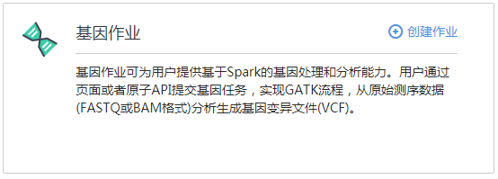
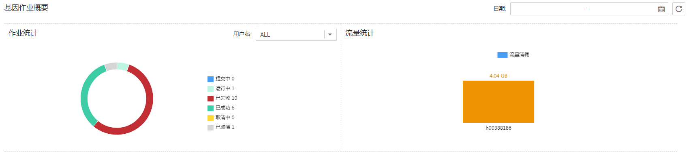

# 基因作业总览

DLI基因作业可为用户提供基于原子API的基因测序服务。用户通过页面或者原子API提交基因任务，DLI则会将用户指定的FASTQ或BAM格式的测序原始数据进行挖掘，并计算出VCF格式的基因变异点数据。

> **说明：**   
>目前只有华北-北京一和华南-广州两个区域开放了此功能。  

单击[图1](#fig83043311294)或其右上角的，可进入“创建作业”页面。

**图 1**  基因作业介绍  

在“基因作业概要”中可查看“作业统计”和“流量统计”，如[图2](#fig15341544172319)所示。

**图 2**  基因作业概要  

