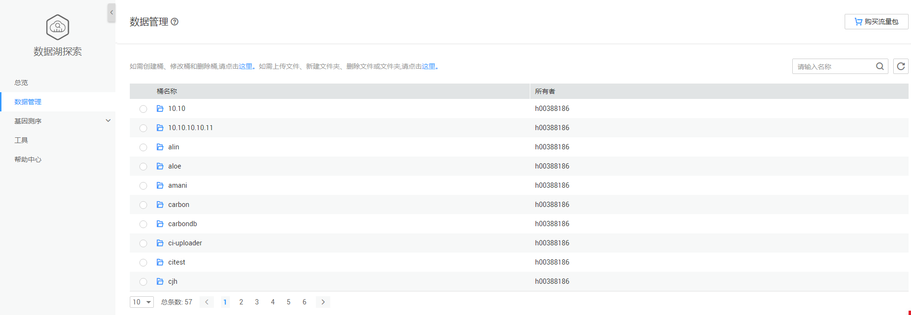
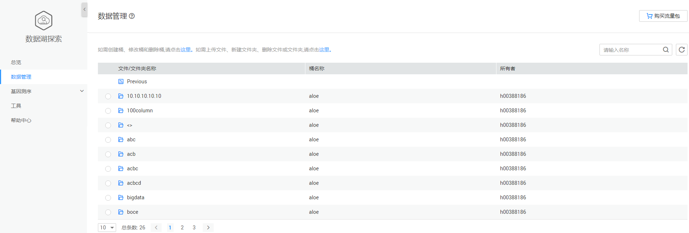

# 基因数据管理

在数据管理页面，用户可以查找所建的OBS桶及上传至OBS桶中的文件夹或文件。如[图1](#fig48381724346)和[图2](#fig16325739114614)所示。

-   如果需要创建桶、修改桶和删除桶，或者上传文件、新建文件夹和删除文件或文件夹，可单击[图1](#fig48381724346)中对应的链接。

    > **说明：**   
    >上传文件、新建文件夹和删除文件或文件夹，需要先选择对应的桶，再单击链接。  

-   如果需要购买基因测序作业套餐包，可单击[图1](#fig48381724346)页面右上角。

    **图 1**  数据管理-桶列表  
    

-   单击[图1](#fig48381724346)中任意桶名称，可查看该桶中的文件或文件夹。

    **图 2**  数据管理-文件/文件夹列表  
    

