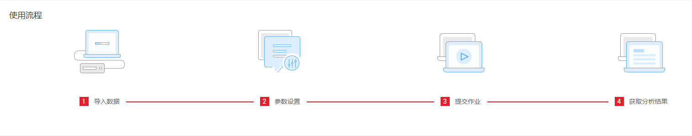
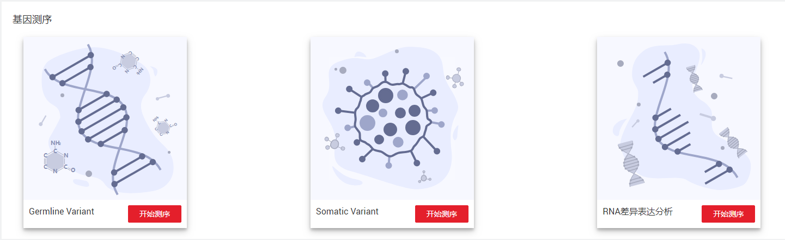

# 基因测序

## 使用流程

基因测序的使用流程请参考[图1](#fig102771329151716)。

**图 1**  基因测序使用流程  

## 基因测序

目前提供三种基因测序功能：Germline Variant，Somatic Variant和RNA差异表达分析。

**图 2**  基因测序  

单击所需测序功能右下角的，即可进入对应测序功能“创建作业”页面。

-   **[Germline Variant](Germline-Variant.md)**  

-   **[Somatic Variant](Somatic-Variant.md)**  

-   **[RNA差异表达分析](RNA差异表达分析.md)**  

