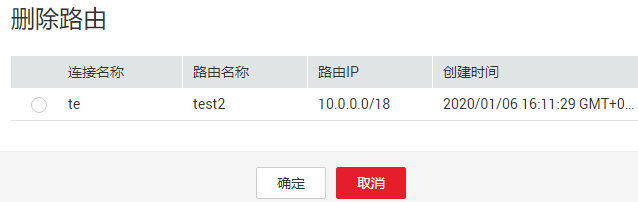

# 增强型跨源连接

## 操作场景

DLI 增强型跨源连接底层采用对等连接，直接打通DLI集群与目的数据源的vpc网络，通过点对点的方式实现数据互通，能够提供比经典型跨源更加灵活的使用场景与更加强劲的性能。增强型跨源支持所有DLI服务已实现的跨源业务，并且通过UDF、Spark作业等方式能够实现与自建/线下数据源之间的访问。

开发SQL作业请参考《数据湖探索SQL语法参考》\>[HBase表](https://support.huaweicloud.com/sqlreference-dli/dli_08_0119.html)，[OpenTSDB表](https://support.huaweicloud.com/sqlreference-dli/dli_08_0122.html)，[DWS表](https://support.huaweicloud.com/sqlreference-dli/dli_08_0193.html)，[RDS表](https://support.huaweicloud.com/sqlreference-dli/dli_08_0197.html)和[CSS表](https://support.huaweicloud.com/sqlreference-dli/dli_08_0201.html)。开发Spark作业请参考《数据湖探索开发指南》\>[《使用DLI跨源能力》](https://support.huaweicloud.com/devg-dli/dli_09_0020.html)。

> **说明：**   
>增强型跨源仅支持包年包月队列。  

增强型跨源主要包括如下功能：

-   [创建连接](#section73391334165211)
-   [查找连接](#section9644161019415)
-   [查看连接详情](#section1960402414173)
-   [查看绑定队列详情](#section48371514207)
-   [删除连接](#section8647175812179)
-   [绑定队列](#section027361173415)
-   [解绑队列](#section16495153616367)
-   [修改主机信息](#section636281512389)
-   [自定义路由信息](#section19599154272217)

## 增强型跨源页面

显示所有的增强型跨源连接，连接数量较多时，系统分页显示。

**表 1**  跨源连接列表参数

<table><thead align="left"><tr id="row2555468715120"><th class="cellrowborder" valign="top" width="11.64%" id="mcps1.2.3.1.1">
参数

</th>
<th class="cellrowborder" valign="top" width="88.36%" id="mcps1.2.3.1.2">
参数说明

</th>
</tr>
</thead>
<tbody><tr id="row46758327132"><td class="cellrowborder" valign="top" width="11.64%" headers="mcps1.2.3.1.1 ">
连接名称

</td>
<td class="cellrowborder" valign="top" width="88.36%" headers="mcps1.2.3.1.2 ">
所创建的跨源连接名称。

</td>
</tr>
<tr id="row32873162171713"><td class="cellrowborder" valign="top" width="11.64%" headers="mcps1.2.3.1.1 ">
连接状态

</td>
<td class="cellrowborder" valign="top" width="88.36%" headers="mcps1.2.3.1.2 ">
跨源连接的状态信息，目前控制台仅显示“已激活”状态的连接。

</td>
</tr>
<tr id="row31011923151038"><td class="cellrowborder" valign="top" width="11.64%" headers="mcps1.2.3.1.1 ">
虚拟私有云

</td>
<td class="cellrowborder" valign="top" width="88.36%" headers="mcps1.2.3.1.2 ">
目的数据源所使用的虚拟私有云。具体请参考《<a href="https://support.huaweicloud.com/productdesc-vpc/zh-cn_topic_0013748729.html" target="_blank" rel="noopener noreferrer">虚拟私有云产品介绍</a>》。

</td>
</tr>
<tr id="row36301606171658"><td class="cellrowborder" valign="top" width="11.64%" headers="mcps1.2.3.1.1 ">
子网

</td>
<td class="cellrowborder" valign="top" width="88.36%" headers="mcps1.2.3.1.2 ">
目的数据源所使用的子网。具体请参考《<a href="https://support.huaweicloud.com/productdesc-vpc/zh-cn_topic_0030969424.html" target="_blank" rel="noopener noreferrer">虚拟私有云产品介绍</a>》。

</td>
</tr>
<tr id="row2449114254419"><td class="cellrowborder" valign="top" width="11.64%" headers="mcps1.2.3.1.1 ">
创建时间

</td>
<td class="cellrowborder" valign="top" width="88.36%" headers="mcps1.2.3.1.2 ">
每个连接的创建时间，可按创建时间顺序或倒序显示连接列表。

</td>
</tr>
<tr id="row1662880815250"><td class="cellrowborder" valign="top" width="11.64%" headers="mcps1.2.3.1.1 ">
操作

</td>
<td class="cellrowborder" valign="top" width="88.36%" headers="mcps1.2.3.1.2 "><ul id="ul516210510267"><li>删除连接：用于删除已创建的跨源连接。</li><li>路由信息：查看跨源连接自定义的路由信息。</li><li>修改主机信息：用户自定义配置主机/域名对应的IP信息。</li><li>更多：<ul id="ul449719339214"><li>绑定队列：仅支持绑定包周期队列；执行绑定队列后，被绑定的队列即可使用增强型跨源访问数据源。</li><li>解绑队列：用于解除跨源连接与队列之间的绑定关系。</li><li>添加路由：添加跨源连接的自定义路由。</li><li>删除路由：删除跨源连接的自定义路由。</li></ul>
</li></ul>
</td>
</tr>
</tbody>
</table>

## 创建连接

以创建MRS服务HBase跨源连接为例进行说明。

> **说明：**   
>只支持通过增强型跨源访问MRS HBase。  

1.  在MRS服务中购买集群。

    如果已有可用集群，可不用重新购买。

2.  在SQL作业或Spark作业的顶部菜单栏中，选择“跨源连接“。
3.  选择“增强型跨源”页签，单击左上角的“创建”按钮。

    输入连接名称，选择绑定队列（可选），虚拟私有云，子网，输入主机信息（可选），详细参数介绍请参见[表2](#table24931148155220)。

    **图 1**  创建连接  
    

    **表 2**  参数说明

    
    <table><thead align="left"><tr id="row1149712486527"><th class="cellrowborder" valign="top" width="15.920000000000002%" id="mcps1.2.3.1.1">
参数

    </th>
    <th class="cellrowborder" valign="top" width="84.08%" id="mcps1.2.3.1.2">
参数说明

    </th>
    </tr>
    </thead>
    <tbody><tr id="row1350324845215"><td class="cellrowborder" valign="top" width="15.920000000000002%" headers="mcps1.2.3.1.1 ">
连接名称

    </td>
    <td class="cellrowborder" valign="top" width="84.08%" headers="mcps1.2.3.1.2 ">
所创建的跨源连接名称。

    <ul id="ul185072486523"><li>名称只能包含数字、英文字母、下划线。不能为空。</li><li>输入长度不能超过64个字符。</li></ul>
    </td>
    </tr>
    <tr id="row113282120419"><td class="cellrowborder" valign="top" width="15.920000000000002%" headers="mcps1.2.3.1.1 ">
绑定队列

    </td>
    <td class="cellrowborder" valign="top" width="84.08%" headers="mcps1.2.3.1.2 ">
可选参数，用于绑定需要使用跨源的包年包月队列。

    </td>
    </tr>
    <tr id="row7764655142317"><td class="cellrowborder" valign="top" width="15.920000000000002%" headers="mcps1.2.3.1.1 ">
虚拟私有云

    </td>
    <td class="cellrowborder" valign="top" width="84.08%" headers="mcps1.2.3.1.2 ">
目的数据源所使用的虚拟私有云。

    </td>
    </tr>
    <tr id="row1095810374248"><td class="cellrowborder" valign="top" width="15.920000000000002%" headers="mcps1.2.3.1.1 ">
子网

    </td>
    <td class="cellrowborder" valign="top" width="84.08%" headers="mcps1.2.3.1.2 ">
目的数据源所使用的子网。

    </td>
    </tr>
    <tr id="row135261748155213"><td class="cellrowborder" valign="top" width="15.920000000000002%" headers="mcps1.2.3.1.1 ">
主机信息

    </td>
    <td class="cellrowborder" valign="top" width="84.08%" headers="mcps1.2.3.1.2 ">
可选参数，用户自定义配置主机/域名对应的IP信息。每行填写一条记录，填写格式为：“IP 主机名/域名”。访问MRS的HBase集群时需要配置Zookeeper实例的主机名与对应的IP地址。MRS集群主机名与IP地址获取方式请参考下图。

    
<b>图1 </b>MRS ZK IP地址信息 

    
进入MRS集群管理界面的步骤为：

    <ol id="ol203845913189"><li>在MRS集群列表中，单击所使用的集群名称，进入集群“概览”页。</li><li>在集群“基本信息”中找到“集群管理页面”，单击“点击查看”。</li><li>输入用户名和密码（“用户名”和“密码”为购买MRS集群时设置，“用户名”默认为“admin”），单击“登录”进入“MRS Manager”页面。</li><li>选择“服务管理”页签；</li><li>进入“Zookeeper”服务；</li><li>选择“实例”页签，可以查看对应业务IP，可选择任意一个业务IP。</li></ol>
    
 说明： 

如果MapReduce服务集群存在多个IP，创建跨源连接时填写其中任意一个业务IP即可。

    

    </td>
    </tr>
    </tbody>
    </table>

4.  单击“确定“，完成连接创建。

## 查找连接

在“增强型跨源“页面，可在搜索框中输入连接名称关键字，查找与之匹配的连接。

## 查看连接详情

在“增强型跨源“页面，选中一条连接，单击该连接对应的，可查看该条连接的详细信息。包括：连接ID和主机信息。

## 查看绑定队列详情

在“增强型跨源“页面，选中一条连接，单击选中的连接名称，可以查看绑定队列相关信息。

**表 3**  跨源连接队列详情列表参数

<table><thead align="left"><tr id="row135891123145816"><th class="cellrowborder" valign="top" width="13.850000000000001%" id="mcps1.2.3.1.1">
参数

</th>
<th class="cellrowborder" valign="top" width="86.15%" id="mcps1.2.3.1.2">
参数说明

</th>
</tr>
</thead>
<tbody><tr id="row259022345814"><td class="cellrowborder" valign="top" width="13.850000000000001%" headers="mcps1.2.3.1.1 ">
对等连接ID

</td>
<td class="cellrowborder" valign="top" width="86.15%" headers="mcps1.2.3.1.2 ">
增强型跨源在该队列所在集群中创建的对等连接ID。

 说明： 

每一个增强型跨源对每一个绑定的队列都会创建一个对等连接。该对等连接用于实现跨VPC通信，请确保数据源使用的安全组开放了DLI队列网段的访问，并且在使用跨源过程中不要删除该对等连接。

</td>
</tr>
<tr id="row0590172375818"><td class="cellrowborder" valign="top" width="13.850000000000001%" headers="mcps1.2.3.1.1 ">
队列名称

</td>
<td class="cellrowborder" valign="top" width="86.15%" headers="mcps1.2.3.1.2 ">
已绑定的队列名称。

</td>
</tr>
<tr id="row165901238588"><td class="cellrowborder" valign="top" width="13.850000000000001%" headers="mcps1.2.3.1.1 ">
连接状态

</td>
<td class="cellrowborder" valign="top" width="86.15%" headers="mcps1.2.3.1.2 ">
跨源连接的状态信息，包括以下三种状态：

<ul id="ul15899620876"><li>创建中</li><li>已激活</li><li>已失败</li></ul>

 说明： 

当连接状态显示为“已失败”时，点击左边对应的，可查看详细的错误信息。

</td>
</tr>
<tr id="row18590123185815"><td class="cellrowborder" valign="top" width="13.850000000000001%" headers="mcps1.2.3.1.1 ">
创建时间

</td>
<td class="cellrowborder" valign="top" width="86.15%" headers="mcps1.2.3.1.2 ">
每个连接的创建时间，可按创建时间顺序或倒序显示连接列表。

</td>
</tr>
<tr id="row15590152315812"><td class="cellrowborder" valign="top" width="13.850000000000001%" headers="mcps1.2.3.1.1 ">
操作

</td>
<td class="cellrowborder" valign="top" width="86.15%" headers="mcps1.2.3.1.2 ">
解绑队列：用于解除跨源连接与队列之间的绑定关系。

</td>
</tr>
</tbody>
</table>

## 删除连接

在“增强型跨源“页面，可单击“操作”列的“删除“，删除不需要的连接。

> **说明：**   
>当“连接状态“为“创建中“时，连接不可删除。  

## 绑定队列

-   方式一

    在“增强型跨源“页面，选中一条连接，单击该连接对应的，在弹出的对话框中，选择要绑定的队列（支持多选），单击“确定”。

-   方式二

    单击选中的连接名称，进入“绑定队列详情”页面。单击左上角的，在弹出的对话框中，选择要绑定的队列（支持多选），单击“确定”。

## 解绑队列

-   方式一

    在“增强型跨源“页面，选中一条连接，单击该连接对应的，在弹出的对话框中，选择要解绑的队列（支持多选），单击“确定”。

-   方式二

    单击选中的连接名称，进入“绑定队列详情”页面。选择要解绑的队列，单击该连接右侧的，在弹出的对话框中，选择要绑定的队列（支持多选），单击“确定”。

## 修改主机信息

在“增强型跨源“页面，选中一条连接，单击该连接对应的，在弹出的对话框中，填写主机信息。格式为：“IP 主机名/域名”，多条配置之间以换行分隔。

> **说明：**   
>-   修改主机配置每次均为全量覆盖。  
>-   主机名/域名限制为长度128，数字字母下划线\("\_"\)横杠\("-"\)句点\("."\)组成，字母开头。  

## 自定义路由信息

-   查看路由信息

    在“增强型跨源“页面，选中一条连接，单击该连接对应的，可以查看该跨源自定义的路由信息，如[图 路由信息](#fig134041318286)所示。

    **图 3**  路由信息  
    

-   添加路由

    在“增强型跨源“页面，选中一条连接，单击该连接对应的，或者在“路由信息“页面单击，可以添加该跨源的自定义路由。在弹出的对话框中，填写路由名称与路由网段即可，详细参数请参考参数说明。

    **表 4**  自定义路由详情列表参数

    
    <table><thead align="left"><tr id="row1624410615313"><th class="cellrowborder" valign="top" width="17.46%" id="mcps1.2.3.1.1">
参数

    </th>
    <th class="cellrowborder" valign="top" width="82.54%" id="mcps1.2.3.1.2">
参数说明

    </th>
    </tr>
    </thead>
    <tbody><tr id="row624518623112"><td class="cellrowborder" valign="top" width="17.46%" headers="mcps1.2.3.1.1 ">
路由名称

    </td>
    <td class="cellrowborder" valign="top" width="82.54%" headers="mcps1.2.3.1.2 ">
自定义路由的名称，在同一个增强型跨源中唯一。名称规则为：长度1~64字节，数字、字母、下划线（"_"）、中划线（"-"）组成。

    </td>
    </tr>
    <tr id="row122452064312"><td class="cellrowborder" valign="top" width="17.46%" headers="mcps1.2.3.1.1 ">
路由IP

    </td>
    <td class="cellrowborder" valign="top" width="82.54%" headers="mcps1.2.3.1.2 ">
自定义路由网段，允许不同路由的网段之间有交集，但不允许完全相同。

    </td>
    </tr>
    <tr id="row124515614319"><td class="cellrowborder" valign="top" width="17.46%" headers="mcps1.2.3.1.1 ">
创建时间

    </td>
    <td class="cellrowborder" valign="top" width="82.54%" headers="mcps1.2.3.1.2 ">
每个路由的创建时间。

    </td>
    </tr>
    <tr id="row132469619315"><td class="cellrowborder" valign="top" width="17.46%" headers="mcps1.2.3.1.1 ">
操作

    </td>
    <td class="cellrowborder" valign="top" width="82.54%" headers="mcps1.2.3.1.2 ">
删除路由：用于删除自定义路由信息。

    </td>
    </tr>
    </tbody>
    </table>

-   删除路由
    1.  在“增强型跨源“页面，选中一条连接，单击该连接对应的，在弹出的对话框中选择要删除的路由信息，单击，如[图 删除路由信息](#fig168712304297)所示。

        **图 4**  删除路由信息  
        

    2.  在“路由信息“页面，选中一条自定义路由信息，单击该路由对应的。

