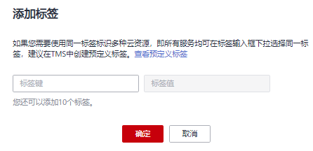

# 增强型跨源连接标签管理

## 标签管理

标签是用户自定义的、用于标识云资源的键值对，它可以帮助用户对云资源进行分类和搜索。标签由标签“键”和标签“值”组成。

如果用户在其他云服务中使用了标签，建议用户为同一个业务所使用的云资源创建相同的标签键值对以保持一致性。

DLI支持以下两类标签：

-   资源标签：在DLI中创建的非全局的标签。

-   预定义标签：在标签管理服务（简称TMS）中创建的预定义标签，属于全局标签。有关预定义标签的更多信息，请参见《[标签管理服务用户指南](https://support.huaweicloud.com/usermanual-tms/zh-cn_topic_0056266269.html)》。

以下介绍如何为跨源连接添加标签、修改标签和删除标签。

1.  在DLI管理控制台的左侧导航栏中，单击“跨源连接”，选择“增强型跨源”页签。
2.  在对应连接的“操作”列，选择“更多”\>“标签”。
3.  进入标签管理页面，显示当前连接的标签信息。
4.  单击“添加标签“，弹出“添加标签“对话框，配置参数。

    **图 1**  添加标签  
    

    **表 1**  标签配置参数

    
    <table><thead align="left"><tr id="row1640724610160"><th class="cellrowborder" valign="top" width="12.94%" id="mcps1.2.3.1.1">
参数

    </th>
    <th class="cellrowborder" valign="top" width="87.06%" id="mcps1.2.3.1.2">
参数说明

    </th>
    </tr>
    </thead>
    <tbody><tr id="row13417154613164"><td class="cellrowborder" valign="top" width="12.94%" headers="mcps1.2.3.1.1 ">
标签键

    </td>
    <td class="cellrowborder" valign="top" width="87.06%" headers="mcps1.2.3.1.2 ">
您可以选择：

    <ul id="ul6423144611162"><li>在输入框的下拉列表中选择预定义标签键。
 说明： 

如果添加预定义标签，用户需要预先在标签管理服务中创建好预定义标签，然后在“标签键”的下拉框中进行选择。用户可以通过单击“查看预定义标签”进入标签管理服务的“预定义标签”页面，然后单击“创建标签”来创建新的预定义标签，具体请参见《标签管理服务用户指南》中的“<a href="https://support.huaweicloud.com/usermanual-tms/zh-cn_topic_0144368884.html" target="_blank" rel="noopener noreferrer">创建预定义标签</a>”章节。

    

    </li></ul>
    <ul id="ul643911462165"><li>在输入框中输入标签键名称。
 说明： 

标签键的最大长度为36个字符 ，只能包含大小写字母，数字，中划线“-”，下划线“_”，中文，且首尾字符不能为空格。

    

    </li></ul>
    </td>
    </tr>
    <tr id="row645064691617"><td class="cellrowborder" valign="top" width="12.94%" headers="mcps1.2.3.1.1 ">
标签值

    </td>
    <td class="cellrowborder" valign="top" width="87.06%" headers="mcps1.2.3.1.2 ">
您可以选择：

    <ul id="ul1045720469162"><li>在输入框的下拉列表中选择预定义标签值。</li><li>在输入框中输入标签值。
 说明： 

标签值的最大长度为43个字符，只能包含大小写字母，数字，中划线“-”，下划线“_”，点“.”中文，且首尾字符不能为空格。

    

    </li></ul>
    </td>
    </tr>
    </tbody>
    </table>

    > **说明：** 
    >-   最多支持10个标签。
    >-   一个“键”只能添加一个“值”。
    >-   每个资源中的键名不能重复。

5.  单击“确定“。
6.  （可选）在标签列表中，单击“操作“列中“编辑“可对选中标签的值进行编辑。
7.  （可选）在标签列表中，单击“操作“列中“删除“可对选中的标签进行删除。

