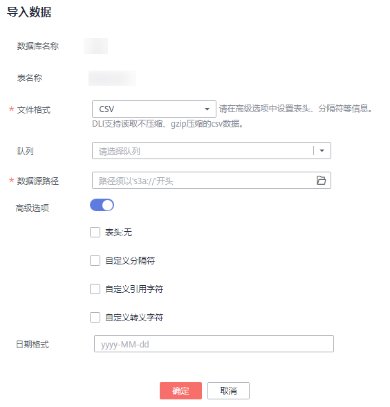

# 导入数据

支持将OBS上的数据导入到DLI中创建的表中。

## 注意事项

-   创建OBS表时指定的路径必须是文件夹，若建表路径是文件将导致导入数据失败。
-   导入数据时只能指定一个路径，路径中不能包含逗号。
-   当OBS的目录下有同名文件夹和文件时，数据导入指向该路径会优先指向文件而非文件夹。
-   若将CSV格式数据导入分区表，需在数据源中将分区列放在最后一列。
-   不建议对同一张表并发导入数据，因为有一定概率发生并发冲突，导致导入失败。
-   导入文件支持CSV，Parquet，ORC，JSON和Avro格式，且文本格式仅支持UTF-8。

## 前提条件

待导入的数据已存储到OBS上。

## 导入数据步骤

1.  导入数据的入口有两个，分别在“数据管理“和“SQL编辑器“页面。
    -   在“数据管理“页面导入数据。
        1.  在管理控制台的左侧，选择“数据管理“\>“库表管理“。
        2.  单击需导入数据的表对应的数据库名称，进入该数据库的“表管理”页面。
        3.  在目标表“操作”栏中选择“更多”中的“导入”，弹出“导入数据“页面。

    -   在“SQL编辑器“页面导入数据。
        1.  在管理控制台的左侧，单击“SQL编辑器“。
        2.  在“SQL编辑器“页面左侧导航栏选择“库表”页签，鼠标左键单击需要导入数据的表对应的数据库名，进入“表”区域。
        3.  鼠标左键单击对应表右侧的，在列表菜单中选择“导入”，弹出“导入数据“页面。

2.  在“导入数据”页面，参见[表1](#table48581581434)填写相关信息。

    **图 1**  导入CSV数据至DLI表  
    

    **表 1**  参数说明

    
    <table><thead align="left"><tr id="row3843181339"><th class="cellrowborder" valign="top" width="20.3%" id="mcps1.2.4.1.1">
参数名称

    </th>
    <th class="cellrowborder" valign="top" width="64.2%" id="mcps1.2.4.1.2">
描述

    </th>
    <th class="cellrowborder" valign="top" width="15.5%" id="mcps1.2.4.1.3">
示例

    </th>
    </tr>
    </thead>
    <tbody><tr id="row158441581431"><td class="cellrowborder" valign="top" width="20.3%" headers="mcps1.2.4.1.1 ">
数据库名称

    </td>
    <td class="cellrowborder" valign="top" width="64.2%" headers="mcps1.2.4.1.2 ">
当前表所在的数据库。

    </td>
    <td class="cellrowborder" valign="top" width="15.5%" headers="mcps1.2.4.1.3 ">
-

    </td>
    </tr>
    <tr id="row17844387312"><td class="cellrowborder" valign="top" width="20.3%" headers="mcps1.2.4.1.1 ">
表名称

    </td>
    <td class="cellrowborder" valign="top" width="64.2%" headers="mcps1.2.4.1.2 ">
当前表名称。

    </td>
    <td class="cellrowborder" valign="top" width="15.5%" headers="mcps1.2.4.1.3 ">
-

    </td>
    </tr>
    <tr id="row18459820311"><td class="cellrowborder" valign="top" width="20.3%" headers="mcps1.2.4.1.1 ">
文件格式

    </td>
    <td class="cellrowborder" valign="top" width="64.2%" headers="mcps1.2.4.1.2 ">
导入数据源的文件格式。导入支持CSV，Parquet，ORC，JSON，Avro格式。

    </td>
    <td class="cellrowborder" valign="top" width="15.5%" headers="mcps1.2.4.1.3 ">
CSV

    </td>
    </tr>
    <tr id="row138451587312"><td class="cellrowborder" valign="top" width="20.3%" headers="mcps1.2.4.1.1 ">
队列

    </td>
    <td class="cellrowborder" valign="top" width="64.2%" headers="mcps1.2.4.1.2 ">
选择队列。

    </td>
    <td class="cellrowborder" valign="top" width="15.5%" headers="mcps1.2.4.1.3 ">
-

    </td>
    </tr>
    <tr id="row13845148639"><td class="cellrowborder" valign="top" width="20.3%" headers="mcps1.2.4.1.1 ">
数据源路径

    </td>
    <td class="cellrowborder" valign="top" width="64.2%" headers="mcps1.2.4.1.2 ">
直接输入路径或单击选择OBS的路径，若没有合适的桶可直接跳转OBS创建。路径须以“s3a://”开头。

    
 说明： 

路径同时支持文件和文件夹。

    

    </td>
    <td class="cellrowborder" valign="top" width="15.5%" headers="mcps1.2.4.1.3 ">
s3a://DLI/sampledata.csv

    </td>
    </tr>
    <tr id="row17846481431"><td class="cellrowborder" valign="top" width="20.3%" headers="mcps1.2.4.1.1 ">
表头:无/有

    </td>
    <td class="cellrowborder" valign="top" width="64.2%" headers="mcps1.2.4.1.2 ">
当“数据格式”为“CSV”时该参数有效。设置导入数据源是否含表头。

    
选中“高级选项”，勾选“表头:无”前的方框，“表头:无”显示为“表头:有”，表示有表头；去勾选即为“表头:无”，表示无表头。

    </td>
    <td class="cellrowborder" valign="top" width="15.5%" headers="mcps1.2.4.1.3 ">
-

    </td>
    </tr>
    <tr id="row17848281439"><td class="cellrowborder" valign="top" width="20.3%" headers="mcps1.2.4.1.1 ">
自定义分隔符

    </td>
    <td class="cellrowborder" valign="top" width="64.2%" headers="mcps1.2.4.1.2 ">
当“数据格式”为“CSV”，勾选自定义分隔符前的方框时，该参数有效。

    
支持选择如下分隔符。

    <ul id="ul284815816316"><li>逗号(,)</li><li>竖线(|)</li><li>制表符(\t)</li><li>其他：输入自定义分隔符</li></ul>
    </td>
    <td class="cellrowborder" valign="top" width="15.5%" headers="mcps1.2.4.1.3 ">
默认值：逗号(,)

    </td>
    </tr>
    <tr id="row58497819310"><td class="cellrowborder" valign="top" width="20.3%" headers="mcps1.2.4.1.1 ">
自定义引用字符

    </td>
    <td class="cellrowborder" valign="top" width="64.2%" headers="mcps1.2.4.1.2 ">
当“数据格式”为“CSV”，勾选自定义引用字符前的方框时，该参数有效。

    
支持选择如下引用字符。

    <ul id="ul15849288318"><li>单引号(')</li><li>双引号(")</li><li>其他：输入自定义引用字符</li></ul>
    </td>
    <td class="cellrowborder" valign="top" width="15.5%" headers="mcps1.2.4.1.3 ">
默认值：单引号(')

    </td>
    </tr>
    <tr id="row15850884319"><td class="cellrowborder" valign="top" width="20.3%" headers="mcps1.2.4.1.1 ">
自定义转义字符

    </td>
    <td class="cellrowborder" valign="top" width="64.2%" headers="mcps1.2.4.1.2 ">
当“数据格式”为“CSV”，并在自定义转义字符前的方框打勾时，该参数有效。

    
选中高级选项，支持选择如下转义字符。

    <ul id="ul9850081736"><li>反斜杠(\)</li><li>其他：输入自定义转义字符</li></ul>
    </td>
    <td class="cellrowborder" valign="top" width="15.5%" headers="mcps1.2.4.1.3 ">
默认值：反斜杠(\)

    </td>
    </tr>
    <tr id="row88514818311"><td class="cellrowborder" valign="top" width="20.3%" headers="mcps1.2.4.1.1 ">
日期格式

    </td>
    <td class="cellrowborder" valign="top" width="64.2%" headers="mcps1.2.4.1.2 ">
当“数据格式”为“CSV”和“JSON”时此参数有效。

    
选中“高级选项”，该参数表示表中日期的格式，默认格式为“yyyy-MM-dd”。日期格式字符定义详见<a href="https://support.huaweicloud.com/sqlreference-dli/dli_08_0100.html" target="_blank" rel="noopener noreferrer">加载数据</a>中的“表3 日期及时间模式字符定义”。

    </td>
    <td class="cellrowborder" valign="top" width="15.5%" headers="mcps1.2.4.1.3 ">
2000-01-01

    </td>
    </tr>
    <tr id="row1685317817310"><td class="cellrowborder" valign="top" width="20.3%" headers="mcps1.2.4.1.1 ">
时间戳格式

    </td>
    <td class="cellrowborder" valign="top" width="64.2%" headers="mcps1.2.4.1.2 ">
当“数据格式”为“CSV”和“JSON”时此参数有效。

    
选中“高级选项”，该参数表示表中时间戳的格式，默认格式为“yyyy-MM-dd HH:mm:ss”。时间戳格式字符定义详见<a href="https://support.huaweicloud.com/sqlreference-dli/dli_08_0100.html" target="_blank" rel="noopener noreferrer">加载数据</a>中的“表3 日期及时间模式字符定义”。

    </td>
    <td class="cellrowborder" valign="top" width="15.5%" headers="mcps1.2.4.1.3 ">
2000-01-01 09:00:00

    </td>
    </tr>
    <tr id="row1285810818311"><td class="cellrowborder" valign="top" width="20.3%" headers="mcps1.2.4.1.1 ">
错误数据存储路径

    </td>
    <td class="cellrowborder" valign="top" width="64.2%" headers="mcps1.2.4.1.2 ">
当“数据格式”为“CSV”和“JSON”时此参数有效。

    
选中“高级选项”，该参数表示可将错误数据保存到对应的OBS路径中。

    </td>
    <td class="cellrowborder" valign="top" width="15.5%" headers="mcps1.2.4.1.3 ">
s3a://DLI/

    </td>
    </tr>
    </tbody>
    </table>

3.  单击“确定“，系统开始导入数据。
4.  有两种方式可查看导入的数据。

    > **说明：**   
    >目前预览只显示导入的前十条数据。  

    -   在“数据管理”\>“库表管理”\>“表管理”页面，在对应表的“操作”栏选择“更多”中的“属性”，在弹框的“预览”页签中，可查看导入的数据
    -   在“SQL编辑器”的“库表”页签中，单击数据库名称，进入对应的表列表，鼠标左键单击对应表右侧的，在列表菜单中选择“属性”，在弹框的“预览”页签中，可查看导入的数据。

5.  （可选）可以在“作业管理“页面，查看该导入作业的状态以及执行结果。

