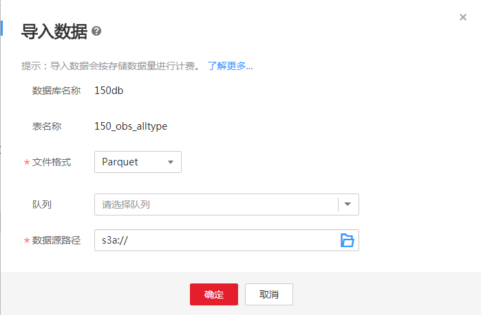

# 导入数据至OBS表

## 操作场景

-   支持将OBS上的数据导入到DLI中创建的OBS表中。
-   导入数据的OBS表可为分区表，也可为非分区表。
-   创建OBS表时指定的路径必须是文件夹，若建表路径是文件将导致导入数据失败。
-   若将csv格式数据导入分区表，需在数据源中将分区列放在最后一列。
-   导入数据时只能指定一个路径，路径中不能包含逗号。
-   当OBS的目录下有同名文件夹和文件时，数据导入指向该路径会优先指向文件而非文件夹。
-   不支持并发提交同一张表的导入任务。
-   导入文件支持CSV，Parquet，ORC和JSON四种格式，且文本格式仅支持UTF-8。

## 前提条件

待导入的数据已存储到OBS上。

## 操作步骤

1.  在DLI管理控制台顶部菜单栏中，选择“数据管理“。
2.  单击需导入数据的OBS表对应的数据库，展开该数据库下的表。
3.  选中目标OBS表，在“详情“页面，单击“导入“，弹出“导入数据“对话框。

    **图 1**  导入数据至OBS  
    

4.  参见[表1](#table49355631144515)填写导入数据相关信息。

    **表 1**  参数说明

    
    <table><thead align="left"><tr id="row54525213144515"><th class="cellrowborder" valign="top" width="13%" id="mcps1.2.4.1.1">
参数名称

    </th>
    <th class="cellrowborder" valign="top" width="71%" id="mcps1.2.4.1.2">
描述

    </th>
    <th class="cellrowborder" valign="top" width="16%" id="mcps1.2.4.1.3">
示例

    </th>
    </tr>
    </thead>
    <tbody><tr id="row26115376112250"><td class="cellrowborder" valign="top" width="13%" headers="mcps1.2.4.1.1 ">
数据库名称

    </td>
    <td class="cellrowborder" valign="top" width="71%" headers="mcps1.2.4.1.2 ">
当前表所在的数据库。

    </td>
    <td class="cellrowborder" valign="top" width="16%" headers="mcps1.2.4.1.3 ">
-

    </td>
    </tr>
    <tr id="row14920175112255"><td class="cellrowborder" valign="top" width="13%" headers="mcps1.2.4.1.1 ">
表名称

    </td>
    <td class="cellrowborder" valign="top" width="71%" headers="mcps1.2.4.1.2 ">
当前表名称。

    </td>
    <td class="cellrowborder" valign="top" width="16%" headers="mcps1.2.4.1.3 ">
-

    </td>
    </tr>
    <tr id="row21841419112331"><td class="cellrowborder" valign="top" width="13%" headers="mcps1.2.4.1.1 ">
文件格式

    </td>
    <td class="cellrowborder" valign="top" width="71%" headers="mcps1.2.4.1.2 ">
导入数据源的文件格式。导入支持CSV，Parquet，ORC和JSON四种格式。

    </td>
    <td class="cellrowborder" valign="top" width="16%" headers="mcps1.2.4.1.3 ">
Parquet

    </td>
    </tr>
    <tr id="row249814981126"><td class="cellrowborder" valign="top" width="13%" headers="mcps1.2.4.1.1 ">
队列

    </td>
    <td class="cellrowborder" valign="top" width="71%" headers="mcps1.2.4.1.2 ">
选择队列。

    </td>
    <td class="cellrowborder" valign="top" width="16%" headers="mcps1.2.4.1.3 ">
-

    </td>
    </tr>
    <tr id="row6511315111245"><td class="cellrowborder" valign="top" width="13%" headers="mcps1.2.4.1.1 ">
数据源路径

    </td>
    <td class="cellrowborder" valign="top" width="71%" headers="mcps1.2.4.1.2 ">
直接输入路径或单击选择OBS的路径，若没有合适的桶可直接跳转OBS创建。路径须以<b>s3a://</b>开头。

    </td>
    <td class="cellrowborder" valign="top" width="16%" headers="mcps1.2.4.1.3 ">
s3a://DLI/sampledata.csv

    </td>
    </tr>
    <tr id="row54051486144515"><td class="cellrowborder" valign="top" width="13%" headers="mcps1.2.4.1.1 ">
表头

    </td>
    <td class="cellrowborder" valign="top" width="71%" headers="mcps1.2.4.1.2 ">
当<b>数据格式</b>为<b>CSV</b>时该参数有效。

    
设置导入数据源是否含表头。选中<b>高级选项</b>，勾选表头前的方框表示有表头，去勾选表示无表头。

    </td>
    <td class="cellrowborder" valign="top" width="16%" headers="mcps1.2.4.1.3 ">
-

    </td>
    </tr>
    <tr id="row10344328144515"><td class="cellrowborder" valign="top" width="13%" headers="mcps1.2.4.1.1 ">
自定义分隔符

    </td>
    <td class="cellrowborder" valign="top" width="71%" headers="mcps1.2.4.1.2 ">
当<b>数据格式</b>为<b>CSV</b>，勾选自定义分隔符前的方框时，该参数有效。

    
支持选择如下分隔符。

    <ul id="ul2131564615213"><li>逗号(,)</li><li>竖线(|)</li><li>制表符(\t)</li><li>控制符(\001)</li><li>其他：输入自定义分隔符</li></ul>
    </td>
    <td class="cellrowborder" valign="top" width="16%" headers="mcps1.2.4.1.3 ">
默认值：逗号(,)

    </td>
    </tr>
    <tr id="row52424162144515"><td class="cellrowborder" valign="top" width="13%" headers="mcps1.2.4.1.1 ">
自定义引用字符

    </td>
    <td class="cellrowborder" valign="top" width="71%" headers="mcps1.2.4.1.2 ">
当<b>数据格式</b>为<b>CSV</b>，勾选自定义引用字符前的方框时，该参数有效。

    
支持选择如下引用字符。

    <ul id="ul33790457152252"><li>单引号(')</li><li>双引号(")</li><li>其他：输入自定义引用字符</li></ul>
    </td>
    <td class="cellrowborder" valign="top" width="16%" headers="mcps1.2.4.1.3 ">
默认值：单引号(')

    </td>
    </tr>
    <tr id="row63070367144515"><td class="cellrowborder" valign="top" width="13%" headers="mcps1.2.4.1.1 ">
自定义转义字符

    </td>
    <td class="cellrowborder" valign="top" width="71%" headers="mcps1.2.4.1.2 ">
当<b>数据格式</b>为<b>CSV</b>，并在自定义转义字符前的方框打勾时，该参数有效。

    
选中高级选项，支持选择如下转义字符。

    <ul id="ul806711515245"><li>反斜杠(\)</li><li>其他：输入自定义转义字符</li></ul>
    </td>
    <td class="cellrowborder" valign="top" width="16%" headers="mcps1.2.4.1.3 ">
默认值：反斜杠(\)

    </td>
    </tr>
    <tr id="row27500407144515"><td class="cellrowborder" valign="top" width="13%" headers="mcps1.2.4.1.1 ">
日期格式

    </td>
    <td class="cellrowborder" valign="top" width="71%" headers="mcps1.2.4.1.2 ">
当<b>数据格式</b>为<b>CSV</b>和<b>JSON</b>时此参数有效。

    
选中<b>高级选项</b>，该参数表示表中日期的格式，默认格式为<b>yyyy-MM-dd</b>。日期格式字符定义详见<a href="https://support.huaweicloud.com/sqlreference-uquery/uquery_08_0100.html" target="_blank" rel="noopener noreferrer">加载数据</a>中的“表3 日期及时间模式字符定义”。

    </td>
    <td class="cellrowborder" valign="top" width="16%" headers="mcps1.2.4.1.3 ">
2000-01-01

    </td>
    </tr>
    <tr id="row639781049130"><td class="cellrowborder" valign="top" width="13%" headers="mcps1.2.4.1.1 ">
时间戳格式

    </td>
    <td class="cellrowborder" valign="top" width="71%" headers="mcps1.2.4.1.2 ">
当<b>数据格式</b>为<b>CSV</b>和<b>JSON</b>时此参数有效。

    
选中<b>高级选项</b>，该参数表示表中时间戳的格式，默认格式为<b>yyyy-MM-dd HH:mm:ss</b>。时间戳格式字符定义详见<a href="https://support.huaweicloud.com/sqlreference-uquery/uquery_08_0100.html" target="_blank" rel="noopener noreferrer">加载数据</a>中的“表3 日期及时间模式字符定义”。

    </td>
    <td class="cellrowborder" valign="top" width="16%" headers="mcps1.2.4.1.3 ">
2000-01-01 09:00:00

    </td>
    </tr>
    </tbody>
    </table>

5.  单击“确定“，系统开始导入数据。
6.  （可选）可以在“作业管理“页面，查看该导入作业的状态以及执行结果。
7.  在“预览“页面，可查看导入的内容。

