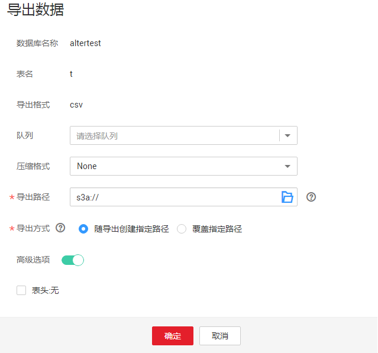

# 将DLI数据导出至OBS

支持将数据从DLI表中导出到OBS服务中，导出操作将在OBS服务新建文件夹，或覆盖已有文件夹中的内容。

## 注意事项

-   支持导出json格式的文件，且文本格式仅支持UTF-8。
-   只支持将DLI表（表类型为“Managed”）中的数据导出到OBS桶中，且导出的路径必须指定到文件夹级别。
-   支持跨账号导出数据，即，如果B账户对A账户授权后，A账户拥有B账户OBS桶的元数据信息和权限信息的读取权限，以及路径的读写权限，则A账户可将数据导出至B账户的OBS路径中。

## 导出数据步骤

1.  导出数据的入口有两个，分别在“数据管理“和“SQL编辑器“页面。
    -   在“数据管理“页面导入数据。
        1.  在管理控制台左侧，单击“数据管理“\>“库表管理“。
        2.  单击需导出数据的表对应的数据库，进入该数据的“表管理”页面。
        3.  在对应表（DLI表）的“操作”栏中选择“更多”中的“导出”，弹出“导出数据“页面。

    -   在“SQL编辑器“页面导出数据。
        1.  在管理控制台左侧，单击“SQL编辑器“。
        2.  在左侧导航栏选择“库表”页签，鼠标左键单击需要导出数据的表对应的数据库名，进入“表”区域。
        3.  鼠标左键单击需要导出数据的表（Managed表，即DLI表）右侧的，在列表菜单中选择“导出”，选择弹出“导出数据“页面。

2.  在“导出数据“对话框，参考[表1](#table7742063143659)填写导出数据相关信息。

    **图 1**  导出数据  
    

    **表 1**  参数说明

    
    <table><thead align="left"><tr id="row48986708143659"><th class="cellrowborder" valign="top" width="13.8%" id="mcps1.2.3.1.1">
参数名称

    </th>
    <th class="cellrowborder" valign="top" width="86.2%" id="mcps1.2.3.1.2">
描述

    </th>
    </tr>
    </thead>
    <tbody><tr id="row55162434145333"><td class="cellrowborder" valign="top" width="13.8%" headers="mcps1.2.3.1.1 ">
数据库名称

    </td>
    <td class="cellrowborder" valign="top" width="86.2%" headers="mcps1.2.3.1.2 ">
当前表所在的数据库。

    </td>
    </tr>
    <tr id="row54786783145255"><td class="cellrowborder" valign="top" width="13.8%" headers="mcps1.2.3.1.1 ">
表名

    </td>
    <td class="cellrowborder" valign="top" width="86.2%" headers="mcps1.2.3.1.2 ">
当前表名称。

    </td>
    </tr>
    <tr id="row59287839143659"><td class="cellrowborder" valign="top" width="13.8%" headers="mcps1.2.3.1.1 ">
导出格式

    </td>
    <td class="cellrowborder" valign="top" width="86.2%" headers="mcps1.2.3.1.2 ">
导出数据的文件格式。当前只支持json格式。

    </td>
    </tr>
    <tr id="row33984858114535"><td class="cellrowborder" valign="top" width="13.8%" headers="mcps1.2.3.1.1 ">
队列

    </td>
    <td class="cellrowborder" valign="top" width="86.2%" headers="mcps1.2.3.1.2 ">
选择队列。

    </td>
    </tr>
    <tr id="row1774342414552"><td class="cellrowborder" valign="top" width="13.8%" headers="mcps1.2.3.1.1 ">
压缩格式

    </td>
    <td class="cellrowborder" valign="top" width="86.2%" headers="mcps1.2.3.1.2 ">
导出数据的压缩方式，选择如下压缩方式。

    <ul id="ul35000658144913"><li>none</li><li>bzip2</li><li>deflate</li><li>gzip</li></ul>
    </td>
    </tr>
    <tr id="row6367025143659"><td class="cellrowborder" valign="top" width="13.8%" headers="mcps1.2.3.1.1 ">
导出路径

    </td>
    <td class="cellrowborder" valign="top" width="86.2%" headers="mcps1.2.3.1.2 "><ul id="ul194291955145519"><li>输入或选择OBS路径。</li><li>导出路径必须为OBS桶中不存在的文件夹，即用户需在OBS目标路径后创建一个新文件夹。</li><li>文件夹名称不能包含下列特殊字符：\ / : * ? " &lt; &gt; |，并且不能以“.”开头和结尾。</li></ul>
    </td>
    </tr>
    <tr id="row48430784114641"><td class="cellrowborder" valign="top" width="13.8%" headers="mcps1.2.3.1.1 ">
导出方式

    </td>
    <td class="cellrowborder" valign="top" width="86.2%" headers="mcps1.2.3.1.2 ">
导出数据的保存方式。

    <ul id="ul625034191496"><li>随导出创建指定路径：指定的导出目录必须不存在，如果指定目录已经存在，系统将返回错误信息，无法执行导出操作。</li><li>覆盖指定路径：在指定目录下新建文件，会删除已有文件。</li></ul>
    </td>
    </tr>
    <tr id="row1218154413337"><td class="cellrowborder" valign="top" width="13.8%" headers="mcps1.2.3.1.1 ">
表头:无/有

    </td>
    <td class="cellrowborder" valign="top" width="86.2%" headers="mcps1.2.3.1.2 ">
当“导出格式”为“json”时该参数有效。当前只支持json格式。设置导出数据是否含表头。

    
选中“高级选项”，勾选“表头:无”前的方框，“表头:无”显示为“表头:有”，表示有表头；去勾选即为“表头:无”，表示无表头。

    </td>
    </tr>
    </tbody>
    </table>

3.  单击“确定“即可导出数据。
4.  （可选）您可以在“作业管理“\>“SQL作业”页面查看导出作业的“作业状态“、“执行语句“等信息。
    1.  在“作业类型“中选择“EXPORT“，输入导出数据的时间段，即可查询出对应条件下的作业列表。
    2.  单击导出作业名称前的，可查看导出作业的详细信息。

