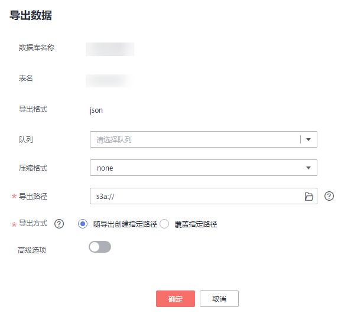

# 将DLI数据导出至OBS

## 操作场景

-   支持将数据从DLI表或OBS表导出到OBS服务，导出操作将在OBS服务新建文件夹，导出结果存储在此文件夹中。
-   支持导出CSV格式的文件，且文本格式仅支持UTF-8。

## 操作步骤

1.  导出数据的操作入口有两个，分别在“数据管理“和“作业编辑器“页面。
    -   在“数据管理“页面导出数据。
        1.  在SQL作业管理控制台的顶部菜单栏中，选择“数据管理“。
        2.  在“数据管理“页面，单击需导出数据对应数据库名称，进入该数据库“表管理”页面。
        3.  选中目标表，单击“操作”栏中的“更多“，选择“导出“。

    -   在“作业编辑器“页面导出数据。
        1.  在SQL作业管理控制台的顶部菜单栏中，选择“作业编辑器“。
        2.  SQL语句执行成功后，在执行结果窗口右侧，单击“导出结果“，弹出“导出数据“对话框。

2.  在“导出数据“对话框，参考[表1](#table7742063143659)填写导出数据相关信息。

    **图 1**  导出数据  
    

    **表 1**  参数说明

    
    <table><thead align="left"><tr id="row48986708143659"><th class="cellrowborder" valign="top" width="13.8%" id="mcps1.2.3.1.1">
参数名称

    </th>
    <th class="cellrowborder" valign="top" width="86.2%" id="mcps1.2.3.1.2">
描述

    </th>
    </tr>
    </thead>
    <tbody><tr id="row55162434145333"><td class="cellrowborder" valign="top" width="13.8%" headers="mcps1.2.3.1.1 ">
数据库名称

    </td>
    <td class="cellrowborder" valign="top" width="86.2%" headers="mcps1.2.3.1.2 ">
当前表所在的数据库，该值不可修改。

    </td>
    </tr>
    <tr id="row54786783145255"><td class="cellrowborder" valign="top" width="13.8%" headers="mcps1.2.3.1.1 ">
表名

    </td>
    <td class="cellrowborder" valign="top" width="86.2%" headers="mcps1.2.3.1.2 ">
当前表名称，该值不可修改。

    </td>
    </tr>
    <tr id="row59287839143659"><td class="cellrowborder" valign="top" width="13.8%" headers="mcps1.2.3.1.1 ">
导出格式

    </td>
    <td class="cellrowborder" valign="top" width="86.2%" headers="mcps1.2.3.1.2 ">
导出数据的文件格式。当前只支持csv格式。

    </td>
    </tr>
    <tr id="row33984858114535"><td class="cellrowborder" valign="top" width="13.8%" headers="mcps1.2.3.1.1 ">
队列

    </td>
    <td class="cellrowborder" valign="top" width="86.2%" headers="mcps1.2.3.1.2 ">
选择队列。

    </td>
    </tr>
    <tr id="row1774342414552"><td class="cellrowborder" valign="top" width="13.8%" headers="mcps1.2.3.1.1 ">
压缩格式

    </td>
    <td class="cellrowborder" valign="top" width="86.2%" headers="mcps1.2.3.1.2 ">
导出数据的压缩方式，选择如下压缩方式。

    <ul id="ul35000658144913"><li>none</li><li>bzip2</li><li>deflate</li><li>gzip</li></ul>
    </td>
    </tr>
    <tr id="row6367025143659"><td class="cellrowborder" valign="top" width="13.8%" headers="mcps1.2.3.1.1 ">
导出路径

    </td>
    <td class="cellrowborder" valign="top" width="86.2%" headers="mcps1.2.3.1.2 "><ul id="ul194291955145519"><li>直接输入OBS路径或单击选择OBS的路径。路径须以“s3a://”开头。</li><li>导出路径必须为OBS桶中不存在的文件夹，即用户需在OBS目标路径后创建一个新文件夹。</li><li>文件夹名称不能包含下列特殊字符：\ / : * ? " &lt; &gt; |，并且不能以“.”开头和结尾。</li></ul>
    </td>
    </tr>
    <tr id="row48430784114641"><td class="cellrowborder" valign="top" width="13.8%" headers="mcps1.2.3.1.1 ">
导出方式

    </td>
    <td class="cellrowborder" valign="top" width="86.2%" headers="mcps1.2.3.1.2 ">
导出数据的保存方式。

    <ul id="ul625034191496"><li>导出到已有OBS目录：在指定目录下新建文件，会删除已有文件。</li><li>随导出自建OBS目录：指定的导出目录必须不存在，如果指定目录已经存在，系统将返回错误信息，无法执行导出操作。</li></ul>
    </td>
    </tr>
    <tr id="row1218154413337"><td class="cellrowborder" valign="top" width="13.8%" headers="mcps1.2.3.1.1 ">
表头

    </td>
    <td class="cellrowborder" valign="top" width="86.2%" headers="mcps1.2.3.1.2 ">
当“导出格式”为“CSV”时该参数有效。当前只支持CSV格式。

    
设置导出数据是否含表头。选中“高级选项”，勾选表头前的方框表示有表头，去勾选表示无表头。

    </td>
    </tr>
    </tbody>
    </table>

3.  单击“确定“即可导出数据。
4.  （可选）您可以在“作业管理“查看导出作业的“作业状态“、“执行语句“等信息。
    1.  在“作业类型“中选择“EXPORT“，输入导出数据的时间段，即可查询出对应条件下的作业列表。
    2.  单击导出作业的，可查看导出作业的详细信息。

