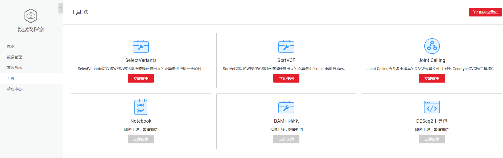
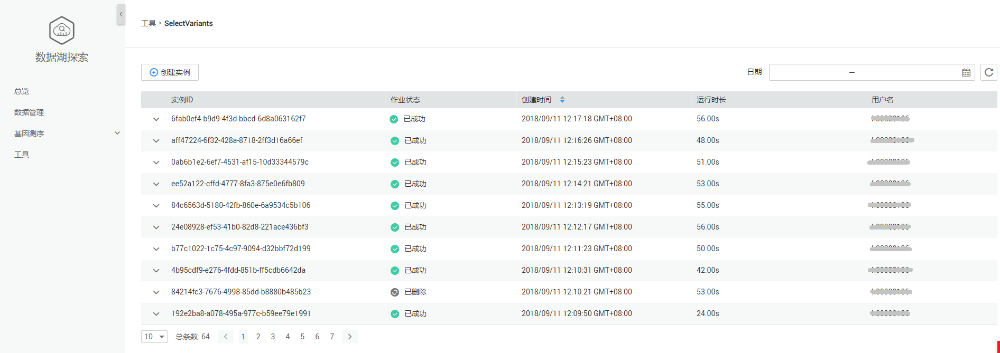
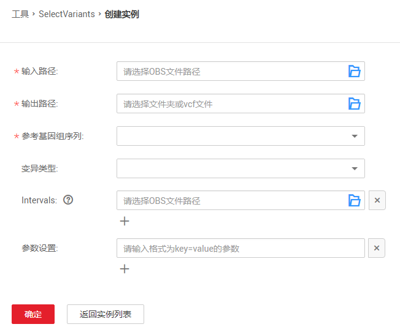
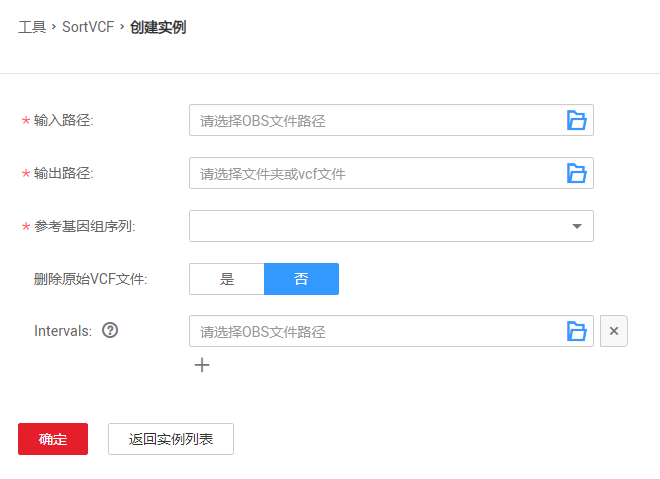
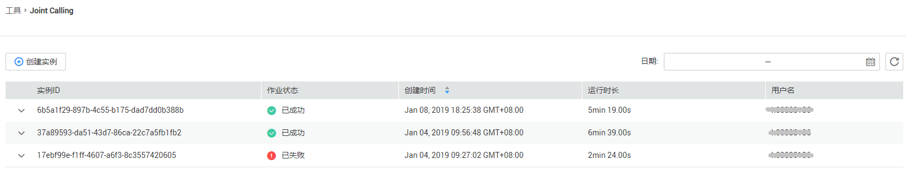

# 工具

DLI基因操作工具集,让用户更方便对数据进行处理和分析。目前提供三种基因测序工具：SelectVariants，SortVcf和Joint Calling。

**图 1**  基因工具集  

## SelectVariants

SelectVariants可以将WES/WGS测序流程计算出来的变异集进行进一步的过滤分类。 最常用的应用场景, 就是就使用该工具计算变异集中变异类型为SNP, 或者变异类型为INDEL的位点

**图 2**  SelectVariants实例列表  

SelectVariants实例页面显示所创建的SelectVariants实例，实例数量较多时，系统分页显示，您可以查看所有历史提交的实例。实例列表默认按创建时间排列，可选择升序或降序排列。

**表 1**  作业列表参数

<table><thead align="left"><tr id="row2555468715120"><th class="cellrowborder" valign="top" width="21.18%" id="mcps1.2.3.1.1">
参数

</th>
<th class="cellrowborder" valign="top" width="78.82000000000001%" id="mcps1.2.3.1.2">
参数说明

</th>
</tr>
</thead>
<tbody><tr id="row32873162171713"><td class="cellrowborder" valign="top" width="21.18%" headers="mcps1.2.3.1.1 ">
实例ID

</td>
<td class="cellrowborder" valign="top" width="78.82000000000001%" headers="mcps1.2.3.1.2 ">
所创建的实例的ID，由系统默认生成的唯一标识。

</td>
</tr>
<tr id="row31011923151038"><td class="cellrowborder" valign="top" width="21.18%" headers="mcps1.2.3.1.1 ">
作业状态

</td>
<td class="cellrowborder" valign="top" width="78.82000000000001%" headers="mcps1.2.3.1.2 ">
作业的状态信息，包括如下六种状态。

<ul id="ul32930526154023"><li>提交中（launching）</li><li>运行中（running）</li><li>已成功（finished）</li><li>已失败（failed）</li><li>已删除（deleted）</li><li>未知异常（unknown）</li></ul>
</td>
</tr>
<tr id="row36301606171658"><td class="cellrowborder" valign="top" width="21.18%" headers="mcps1.2.3.1.1 ">
创建时间

</td>
<td class="cellrowborder" valign="top" width="78.82000000000001%" headers="mcps1.2.3.1.2 ">
每个实例的创建时间，目前按创建时间倒序显示作业列表。

</td>
</tr>
<tr id="row174162332402"><td class="cellrowborder" valign="top" width="21.18%" headers="mcps1.2.3.1.1 ">
运行时长

</td>
<td class="cellrowborder" valign="top" width="78.82000000000001%" headers="mcps1.2.3.1.2 ">
作业运行的时间长度。

</td>
</tr>
<tr id="row2019117553311"><td class="cellrowborder" valign="top" width="21.18%" headers="mcps1.2.3.1.1 ">
用户名

</td>
<td class="cellrowborder" valign="top" width="78.82000000000001%" headers="mcps1.2.3.1.2 ">
提交实例的用户名称。

</td>
</tr>
</tbody>
</table>

单击[图2](#fig13997123214265)中，进入[图3](#fig1068084944916)页面。

**图 3**  创建SelectVariants实例  

参见[表2](#table34159998103738)输入相关参数。

**表 2**  参数说明

<table><thead align="left"><tr id="row18398987103738"><th class="cellrowborder" valign="top" width="16%" id="mcps1.2.4.1.1">
参数名称

</th>
<th class="cellrowborder" valign="top" width="70%" id="mcps1.2.4.1.2">
描述

</th>
<th class="cellrowborder" valign="top" width="14.000000000000002%" id="mcps1.2.4.1.3">
示例

</th>
</tr>
</thead>
<tbody><tr id="row16142559103738"><td class="cellrowborder" valign="top" width="16%" headers="mcps1.2.4.1.1 ">
输入路径

</td>
<td class="cellrowborder" valign="top" width="70%" headers="mcps1.2.4.1.2 ">
指定OBS上vcf文件路径。

</td>
<td class="cellrowborder" valign="top" width="14.000000000000002%" headers="mcps1.2.4.1.3 ">
-

</td>
</tr>
<tr id="row37659849105931"><td class="cellrowborder" valign="top" width="16%" headers="mcps1.2.4.1.1 ">
输出路径

</td>
<td class="cellrowborder" valign="top" width="70%" headers="mcps1.2.4.1.2 ">
选择结果输出的文件夹或vcf文件。

</td>
<td class="cellrowborder" valign="top" width="14.000000000000002%" headers="mcps1.2.4.1.3 ">
-

</td>
</tr>
<tr id="row16943758105944"><td class="cellrowborder" valign="top" width="16%" headers="mcps1.2.4.1.1 ">
参考基因

</td>
<td class="cellrowborder" valign="top" width="70%" headers="mcps1.2.4.1.2 ">
基因行业内标准的基因库，目前支持hg19和hg38。

</td>
<td class="cellrowborder" valign="top" width="14.000000000000002%" headers="mcps1.2.4.1.3 ">
hg38

</td>
</tr>
<tr id="row8664577112415"><td class="cellrowborder" valign="top" width="16%" headers="mcps1.2.4.1.1 ">
变异类型

</td>
<td class="cellrowborder" valign="top" width="70%" headers="mcps1.2.4.1.2 ">
根据给定的下拉框，选择需要的变异类型。

</td>
<td class="cellrowborder" valign="top" width="14.000000000000002%" headers="mcps1.2.4.1.3 ">
-

</td>
</tr>
<tr id="row8247624145218"><td class="cellrowborder" valign="top" width="16%" headers="mcps1.2.4.1.1 ">
Intervals

</td>
<td class="cellrowborder" valign="top" width="70%" headers="mcps1.2.4.1.2 ">
Intervals文件。

</td>
<td class="cellrowborder" valign="top" width="14.000000000000002%" headers="mcps1.2.4.1.3 ">
-

</td>
</tr>
<tr id="row562270711021"><td class="cellrowborder" valign="top" width="16%" headers="mcps1.2.4.1.1 ">
参数设置

</td>
<td class="cellrowborder" valign="top" width="70%" headers="mcps1.2.4.1.2 ">
整个基因变异检测过程中，需要指定的参数。具体参数请参考《提交基因作业》&gt;《执行流程》中的<a href="执行流程.md#table56408147518">表1</a>。单击，可增加多个参数。

</td>
<td class="cellrowborder" valign="top" width="14.000000000000002%" headers="mcps1.2.4.1.3 ">
-

</td>
</tr>
</tbody>
</table>

## SortVcf

SortVcf可以将WES/WGS测序流程计算出来的变异集中的records进行排序。依据比对文件的字典（reference dictionary）先对vcf头文件中的重叠群（contigs）进行排序，再依据排序后的contigs对vcf中的记录（records）进行排序。

**图 4**  SortVcf实例列表  

SortVcf实例页面显示所创建的SortVcf实例，实例数量较多时，系统分页显示，您可以查看所有历史提交的实例。实例列表默认按创建时间排列，可选择升序或降序排列。

**表 3**  作业列表参数

<table><thead align="left"><tr id="row98715434379"><th class="cellrowborder" valign="top" width="21.18%" id="mcps1.2.3.1.1">
参数

</th>
<th class="cellrowborder" valign="top" width="78.82000000000001%" id="mcps1.2.3.1.2">
参数说明

</th>
</tr>
</thead>
<tbody><tr id="row17875194315373"><td class="cellrowborder" valign="top" width="21.18%" headers="mcps1.2.3.1.1 ">
实例ID

</td>
<td class="cellrowborder" valign="top" width="78.82000000000001%" headers="mcps1.2.3.1.2 ">
所创建的实例的ID，由系统默认生成的唯一标识。

</td>
</tr>
<tr id="row1488014316371"><td class="cellrowborder" valign="top" width="21.18%" headers="mcps1.2.3.1.1 ">
作业状态

</td>
<td class="cellrowborder" valign="top" width="78.82000000000001%" headers="mcps1.2.3.1.2 ">
作业的状态信息，包括如下六种状态。

<ul id="ul18882194323720"><li>提交中（launching）</li><li>运行中（running）</li><li>已成功（finished）</li><li>已失败（failed）</li><li>已删除（deleted）</li><li>未知异常（unknown）</li></ul>
</td>
</tr>
<tr id="row48913435375"><td class="cellrowborder" valign="top" width="21.18%" headers="mcps1.2.3.1.1 ">
创建时间

</td>
<td class="cellrowborder" valign="top" width="78.82000000000001%" headers="mcps1.2.3.1.2 ">
每个实例的创建时间，目前按创建时间倒序显示作业列表。

</td>
</tr>
<tr id="row1489513435375"><td class="cellrowborder" valign="top" width="21.18%" headers="mcps1.2.3.1.1 ">
运行时长

</td>
<td class="cellrowborder" valign="top" width="78.82000000000001%" headers="mcps1.2.3.1.2 ">
作业运行的时间长度。

</td>
</tr>
<tr id="row989634303716"><td class="cellrowborder" valign="top" width="21.18%" headers="mcps1.2.3.1.1 ">
用户名

</td>
<td class="cellrowborder" valign="top" width="78.82000000000001%" headers="mcps1.2.3.1.2 ">
提交实例的用户名称。

</td>
</tr>
</tbody>
</table>

单击[图4](#fig2097265303619)中，进入[图5](#fig1900104333713)页面。

**图 5**  创建SortVcf实例  

参见[表4](#table1190254373718)输入相关参数。

**表 4**  参数说明

<table><thead align="left"><tr id="row390554318379"><th class="cellrowborder" valign="top" width="19.74%" id="mcps1.2.4.1.1">
参数名称

</th>
<th class="cellrowborder" valign="top" width="66.25999999999999%" id="mcps1.2.4.1.2">
描述

</th>
<th class="cellrowborder" valign="top" width="14.000000000000002%" id="mcps1.2.4.1.3">
示例

</th>
</tr>
</thead>
<tbody><tr id="row10908104316379"><td class="cellrowborder" valign="top" width="19.74%" headers="mcps1.2.4.1.1 ">
输入路径

</td>
<td class="cellrowborder" valign="top" width="66.25999999999999%" headers="mcps1.2.4.1.2 ">
指定OBS上vcf文件路径。

</td>
<td class="cellrowborder" valign="top" width="14.000000000000002%" headers="mcps1.2.4.1.3 ">
-

</td>
</tr>
<tr id="row159131243183719"><td class="cellrowborder" valign="top" width="19.74%" headers="mcps1.2.4.1.1 ">
输出路径

</td>
<td class="cellrowborder" valign="top" width="66.25999999999999%" headers="mcps1.2.4.1.2 ">
选择文件夹或vcf文件。

</td>
<td class="cellrowborder" valign="top" width="14.000000000000002%" headers="mcps1.2.4.1.3 ">
-

</td>
</tr>
<tr id="row2917543103711"><td class="cellrowborder" valign="top" width="19.74%" headers="mcps1.2.4.1.1 ">
参考基因

</td>
<td class="cellrowborder" valign="top" width="66.25999999999999%" headers="mcps1.2.4.1.2 ">
基因行业内标准的基因库，目前支持hg19和hg38。

</td>
<td class="cellrowborder" valign="top" width="14.000000000000002%" headers="mcps1.2.4.1.3 ">
hg38

</td>
</tr>
<tr id="row692110439379"><td class="cellrowborder" valign="top" width="19.74%" headers="mcps1.2.4.1.1 ">
删除原始VCF文件

</td>
<td class="cellrowborder" valign="top" width="66.25999999999999%" headers="mcps1.2.4.1.2 ">
是否删除原始VCF文件。

</td>
<td class="cellrowborder" valign="top" width="14.000000000000002%" headers="mcps1.2.4.1.3 ">
-

</td>
</tr>
<tr id="row69232043183713"><td class="cellrowborder" valign="top" width="19.74%" headers="mcps1.2.4.1.1 ">
Intervals

</td>
<td class="cellrowborder" valign="top" width="66.25999999999999%" headers="mcps1.2.4.1.2 ">
Intervals文件。

</td>
<td class="cellrowborder" valign="top" width="14.000000000000002%" headers="mcps1.2.4.1.3 ">
-

</td>
</tr>
</tbody>
</table>

## Joint Calling

Joint Calling合并多个样本的G.VCF变异文件, 并经过GenotypeGVCFs工具将GVCF文件转为VCF格式。

**图 6**  Joint Calling实例列表  

Joint Calling实例页面显示所创建的Joint Calling实例，实例数量较多时，系统分页显示，您可以查看所有历史提交的实例。实例列表默认按创建时间排列，可选择升序或降序排列。

**表 5**  作业列表参数

<table><thead align="left"><tr id="row1259561384415"><th class="cellrowborder" valign="top" width="21.18%" id="mcps1.2.3.1.1">
参数

</th>
<th class="cellrowborder" valign="top" width="78.82000000000001%" id="mcps1.2.3.1.2">
参数说明

</th>
</tr>
</thead>
<tbody><tr id="row35993135443"><td class="cellrowborder" valign="top" width="21.18%" headers="mcps1.2.3.1.1 ">
实例ID

</td>
<td class="cellrowborder" valign="top" width="78.82000000000001%" headers="mcps1.2.3.1.2 ">
所创建的实例的ID，由系统默认生成的唯一标识。

</td>
</tr>
<tr id="row16602191334412"><td class="cellrowborder" valign="top" width="21.18%" headers="mcps1.2.3.1.1 ">
作业状态

</td>
<td class="cellrowborder" valign="top" width="78.82000000000001%" headers="mcps1.2.3.1.2 ">
作业的状态信息，包括如下六种状态。

<ul id="ul86051313194419"><li>提交中（launching）</li><li>运行中（running）</li><li>已成功（finished）</li><li>已失败（failed）</li><li>已删除（deleted）</li><li>未知异常（unknown）</li></ul>
</td>
</tr>
<tr id="row136202132442"><td class="cellrowborder" valign="top" width="21.18%" headers="mcps1.2.3.1.1 ">
创建时间

</td>
<td class="cellrowborder" valign="top" width="78.82000000000001%" headers="mcps1.2.3.1.2 ">
每个实例的创建时间，目前按创建时间倒序显示作业列表。

</td>
</tr>
<tr id="row166249132448"><td class="cellrowborder" valign="top" width="21.18%" headers="mcps1.2.3.1.1 ">
运行时长

</td>
<td class="cellrowborder" valign="top" width="78.82000000000001%" headers="mcps1.2.3.1.2 ">
作业运行的时间长度。

</td>
</tr>
<tr id="row5627201364410"><td class="cellrowborder" valign="top" width="21.18%" headers="mcps1.2.3.1.1 ">
用户名

</td>
<td class="cellrowborder" valign="top" width="78.82000000000001%" headers="mcps1.2.3.1.2 ">
提交实例的用户名称。

</td>
</tr>
</tbody>
</table>

单击[图6](#fig25801913124417)中，进入[图7](#fig1263471319444)页面。

**图 7**  创建JointCalling实例  

参见[表6](#table116411613164415)输入相关参数。

**表 6**  参数说明

<table><thead align="left"><tr id="row1264716135447"><th class="cellrowborder" valign="top" width="11.41%" id="mcps1.2.4.1.1">
参数名称

</th>
<th class="cellrowborder" valign="top" width="80.33%" id="mcps1.2.4.1.2">
描述

</th>
<th class="cellrowborder" valign="top" width="8.260000000000002%" id="mcps1.2.4.1.3">
示例

</th>
</tr>
</thead>
<tbody><tr id="row18654113174419"><td class="cellrowborder" valign="top" width="11.41%" headers="mcps1.2.4.1.1 ">
输入路径

</td>
<td class="cellrowborder" valign="top" width="80.33%" headers="mcps1.2.4.1.2 ">
指定OBS上GVCF文件路径。

</td>
<td class="cellrowborder" valign="top" width="8.260000000000002%" headers="mcps1.2.4.1.3 ">
-

</td>
</tr>
<tr id="row16659191324412"><td class="cellrowborder" valign="top" width="11.41%" headers="mcps1.2.4.1.1 ">
输出路径

</td>
<td class="cellrowborder" valign="top" width="80.33%" headers="mcps1.2.4.1.2 ">
选择文件夹或vcf文件。

</td>
<td class="cellrowborder" valign="top" width="8.260000000000002%" headers="mcps1.2.4.1.3 ">
-

</td>
</tr>
<tr id="row966211138443"><td class="cellrowborder" valign="top" width="11.41%" headers="mcps1.2.4.1.1 ">
参考基因

</td>
<td class="cellrowborder" valign="top" width="80.33%" headers="mcps1.2.4.1.2 ">
基因行业内标准的基因库，目前支持hg19和hg38。

</td>
<td class="cellrowborder" valign="top" width="8.260000000000002%" headers="mcps1.2.4.1.3 ">
hg38

</td>
</tr>
<tr id="row17667181344414"><td class="cellrowborder" valign="top" width="11.41%" headers="mcps1.2.4.1.1 ">
参数设置

</td>
<td class="cellrowborder" valign="top" width="80.33%" headers="mcps1.2.4.1.2 ">
整个基因变异检测过程中，需要指定的参数。具体参数请参考《提交基因作业》&gt;《执行流程》中的<a href="执行流程.md#table56408147518">表1</a>。单击，可增加多个参数。

</td>
<td class="cellrowborder" valign="top" width="8.260000000000002%" headers="mcps1.2.4.1.3 ">
-

</td>
</tr>
<tr id="row4673313184416"><td class="cellrowborder" valign="top" width="11.41%" headers="mcps1.2.4.1.1 ">
Intervals

</td>
<td class="cellrowborder" valign="top" width="80.33%" headers="mcps1.2.4.1.2 ">
Intervals文件。

</td>
<td class="cellrowborder" valign="top" width="8.260000000000002%" headers="mcps1.2.4.1.3 ">
-

</td>
</tr>
</tbody>
</table>

