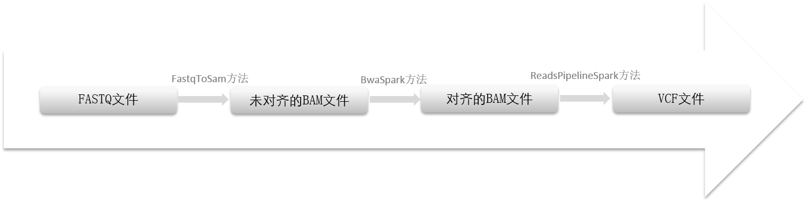

# 执行流程

FASTQ文件到VCF文件的内部执行流程可参考[图1](#fig14720530102016)，分为三个步骤：

**图 1**  执行流程  

1.  FASTQ文件转为未对齐的BAM文件，采用GATK工具包的FastqToSam \(Picard\)方法，具体介绍请参考：

    [https://software.broadinstitute.org/gatk/documentation/tooldocs/current/picard\_sam\_FastqToSam.php](https://software.broadinstitute.org/gatk/documentation/tooldocs/current/picard_sam_FastqToSam.php)

    目前已有的默认配置项如[表1](#table56408147518)所示：

    **表 1**  配置项说明

    
    <table><tbody><tr id="row369211419518"><td class="cellrowborder" valign="top" width="14.000000000000002%">
配置项

    </td>
    <td class="cellrowborder" valign="top" width="18%">
默认值

    </td>
    <td class="cellrowborder" valign="top" width="68%">
说明

    </td>
    </tr>
    <tr id="row56921141155"><td class="cellrowborder" valign="top" width="14.000000000000002%">
RG

    </td>
    <td class="cellrowborder" valign="top" width="18%">
A

    </td>
    <td class="cellrowborder" valign="top" width="68%">
读取组的名称

    </td>
    </tr>
    <tr id="row14692171417512"><td class="cellrowborder" valign="top" width="14.000000000000002%">
SM

    </td>
    <td class="cellrowborder" valign="top" width="18%">
SM1

    </td>
    <td class="cellrowborder" valign="top" width="68%">
样本名称，将写入BAM文件头中

    </td>
    </tr>
    <tr id="row36921114658"><td class="cellrowborder" valign="top" width="14.000000000000002%">
PL

    </td>
    <td class="cellrowborder" valign="top" width="18%">
illumina

    </td>
    <td class="cellrowborder" valign="top" width="68%">
平台类型，将写入BAM文件头中

    </td>
    </tr>
    <tr id="row16692214859"><td class="cellrowborder" valign="top" width="14.000000000000002%">
SO

    </td>
    <td class="cellrowborder" valign="top" width="18%">
queryname

    </td>
    <td class="cellrowborder" valign="top" width="68%">
BAM文件的排序方式.

    </td>
    </tr>
    <tr id="row19692141419511"><td class="cellrowborder" valign="top" width="14.000000000000002%">
MR

    </td>
    <td class="cellrowborder" valign="top" width="18%">
200000

    </td>
    <td class="cellrowborder" valign="top" width="68%">
每个BAM文件中包含的记录数。

    </td>
    </tr>
    </tbody>
    </table>

2.  未对齐的BAM文件转为对齐BAM文件，采用GATK工具包的BwaSpark方法，具体介绍请参考：

    [https://software.broadinstitute.org/gatk/documentation/tooldocs/current/org\_broadinstitute\_hellbender\_tools\_spark\_bwa\_BwaSpark.php](https://software.broadinstitute.org/gatk/documentation/tooldocs/current/org_broadinstitute_hellbender_tools_spark_bwa_BwaSpark.php)

3.  对齐BAM文件转为VCF文件，采用GATK工具包的ReadsPipelineSpark方法，具体介绍请参考：

    [https://software.broadinstitute.org/gatk/documentation/tooldocs/current/org\_broadinstitute\_hellbender\_tools\_spark\_pipelines\_ReadsPipelineSpark.php](https://software.broadinstitute.org/gatk/documentation/tooldocs/current/org_broadinstitute_hellbender_tools_spark_pipelines_ReadsPipelineSpark.php)

