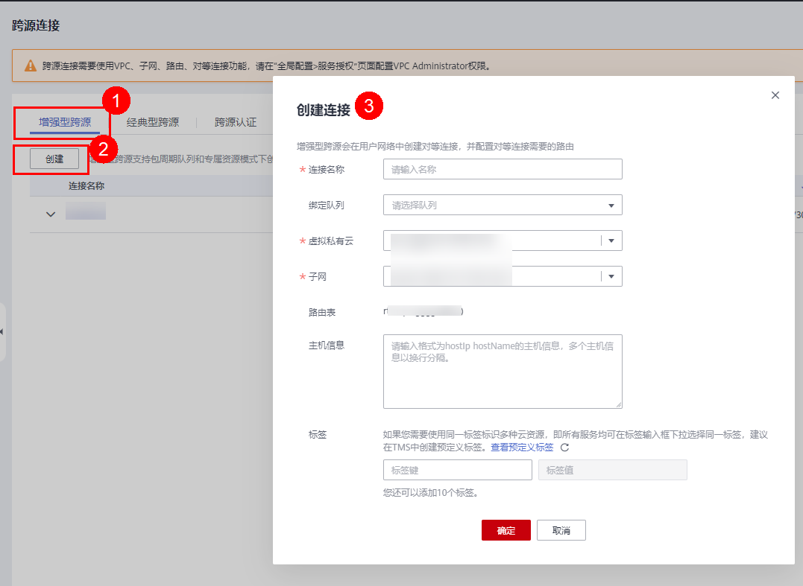
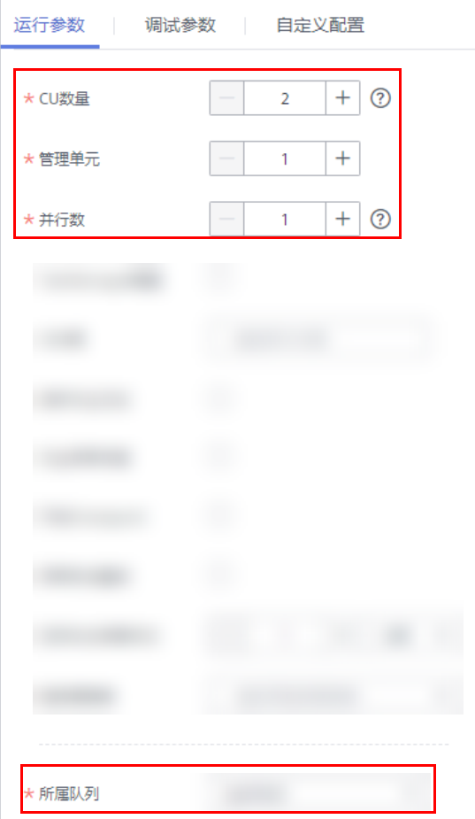

# 提交Flink SQL作业<a name="dli_01_0481"></a>

使用DLI提交Flink SQL作业进行实时计算。基本流程如下：

[步骤1：登录华为云](#section3751181910618)

[步骤2：准备数据源和数据输出通道](#section10891114913473)

[步骤3：创建OBS桶保存输出数据](#section18912701608)

[步骤4：登录DLI管理控制台](#section15452192134917)

[步骤5：创建队列](#section122981023152710)

[步骤6：创建增强型跨源连接](#section19012773105034)

[步骤7：创建跨源认证](#section21433273112656)

[步骤8：创建Flink SQL作业](#section21590507141153)

样例场景需要创建一个Flink SQL作业，并且该作业有一个输入流和一个输出流。输入流用于从DIS读取数据，输出流用于将数据写入到Kafka中。

## 步骤1：登录华为云<a name="section3751181910618"></a>

使用DLI服务，首先要登录华为云。

1.  打开[华为云](https://www.huaweicloud.com/)首页。
2.  在登录页面输入“帐号名“和“密码“，单击“登录“。

## 步骤2：准备数据源和数据输出通道<a name="section10891114913473"></a>

DLI Flink作业支持其他服务作为数据源和数据输出通道，具体内容请参见[准备Flink作业数据](准备Flink作业数据.md)  。

本样例中，假设作业名称为“JobSample”，采用DIS服务作为数据源，开通数据接入服务（DIS），具体操作请参见[《数据接入服务用户指南》](https://support.huaweicloud.com/usermanual-dis/dis_01_0601.html)中的“开通DIS通道“章节。采用分布式消息服务Kafka作为数据输出通道，创建Kafka专享版实例，具体操作请参见[《分布式消息服务Kafka用户指南》](https://support.huaweicloud.com/usermanual-kafka/kafka-ug-180604013.html)中的“购买实例“章节。

-   创建用于作业输入流的DIS通道：
    1.  登录DIS管理控制台。
    2.  在管理控制台左上角选择区域和项目。
    3.  单击“购买接入通道”配置相关参数。通道信息如下：
        -   区域：选择与DLI服务相同的区域
        -   通道名称：csinput
        -   通道类型：普通
        -   分区数量：1
        -   生命周期（小时）：24
        -   源数据类型：BLOB
        -   自动扩缩容：关闭
        -   企业项目：default
        -   高级配置：暂不配置

    4.  单击“立即购买”，进入“规格确认”页面。
    5.  单击“提交”，完成通道接入。

-   创建用于作业输出流的Kafka专享版实例：
    1.  在创建Kafka实例前您需要提前准备相关依赖资源，包括VPC、子网和安全组，并配置安全组。

        -   创建VPC和子网的操作指导请参考[创建虚拟私有云和子网](https://support.huaweicloud.com/usermanual-vpc/zh-cn_topic_0013935842.html)，若需要在已有VPC上创建和使用新的子网，请参考[为虚拟私有云创建新的子网](https://support.huaweicloud.com/usermanual-vpc/zh-cn_topic_0013748726.html)。

            > **说明：** 
            >-   创建的VPC与使用的Kafka服务应在相同的区域。
            >-   创建VPC和子网时，如无特殊需求，配置参数使用默认配置即可。

        -   创建安全组的操作指导请参考[创建安全组](https://support.huaweicloud.com/usermanual-vpc/zh-cn_topic_0013748715.html)，为安全组添加规则的操作指导请参考[添加安全组规则](https://support.huaweicloud.com/usermanual-vpc/zh-cn_topic_0030969470.html)。

        更多信息请参考《分布式消息服务Kafka用户指南》中的“[准备实例依赖资源](https://support.huaweicloud.com/usermanual-kafka/kafka-ug-180604012.html)”章节。

    2.  登录分布式消息服务Kafka管理控制台。
    3.  在管理控制台左上角选择区域。
    4.  在“Kafka专享版“页面，单击右上角“购买Kafka实例”配置相关参数。实例信息如下：
        -   计费模式：按需付费
        -   区域：选择与DLI服务相同的区域
        -   项目：默认
        -   可用区：默认
        -   实例名称：kafka-dliflink
        -   企业项目：default
        -   版本：默认
        -   CPU架构：默认
        -   规格：选择对应的规格
        -   代理个数：默认
        -   存储空间：默认
        -   容量阈值策略：默认
        -   虚拟私有云： vpc-dli，子网：dli-subnet
        -   安全组：default
        -   Manager用户名：dliflink（用于登录实例管理页面）
        -   密码：\*\*\*\*（请妥善管理密码，系统无法获取您设置的密码内容）
        -   确认密码：\*\*\*\*
        -   更多配置：暂不配置

    5.  单击“立即购买”，弹出“规格确认”页面。
    6.  单击“提交”，完成实例创建。


## 步骤3：创建OBS桶保存输出数据<a name="section18912701608"></a>

在本样例中，需要为作业“JobSample”开通对象存储服务（OBS），为DLI Flink作业提供Checkpoint、保存作业日志和调试测试数据的存储功能。

具体操作请参见《对象存储服务控制台指南》中的“[创建桶](https://support.huaweicloud.com/usermanual-obs/zh-cn_topic_0045829088.html)”章节。

1.  在OBS管理控制台左侧导航栏选择“对象存储”。
2.  在页面右上角单击“创建桶”，配置桶参数。
    -   区域：选择与DLI服务相同的区域
    -   桶名称：smoke-test
    -   存储类别：标准存储
    -   桶策略：私有
    -   默认加密：关闭
    -   归档数据直读：关闭
    -   企业项目：default
    -   标签：不填写

3.  单击“立即创建”。

## 步骤4：登录DLI管理控制台<a name="section15452192134917"></a>

1.  在华为云官网首页的上方导航栏中，单击“产品“页签。
2.  在列表中，选择“大数据“\>“大数据计算“中的“数据湖探索 DLI“。
3.  在DLI服务产品页，单击“进入控制台“，进入DLI管理控制台页面。第一次进入数据湖探索管理控制台需要进行授权，以获取访问OBS的权限。

## 步骤5：创建队列<a name="section122981023152710"></a>

创建DLI Flink SQL作业，不能使用系统已有的default队列，需要您创建队列，例如创建名为“Flinktest”的队列。创建队列详细介绍请参考[创建队列](创建队列.md)。

1.  在DLI管理控制台总览页，单击右上角“购买队列”进入购买队列页面。
2.  配置参数。
    -   计费模式：按需计费
    -   当前区域：默认区域
    -   队列名称：Flinktest
    -   队列类型：通用队列。勾选“专属资源模式”。
    -   AZ策略：单AZ
    -   队列规格：16CUs
    -   企业项目：default
    -   描述：不填
    -   高级配置：自定义配置
    -   网段：配置的网段不能与Kafka的子网网段冲突
    -   标签：不填

3.  单击“立即购买”，确认配置。
4.  配置确认无误，提交请求。

## 步骤6：创建增强型跨源连接<a name="section19012773105034"></a>

创建DLI Flink作业，还需要创建增强型跨源连接。具体操作请参考[创建增强型跨源连接](创建-查找-删除增强型跨源连接.md#section73391334165211)。

> **说明：** 
>-   增强型跨源仅支持包年包月队列和按需专属队列。
>-   绑定跨源的DLI队列网段和数据源网段不能重合。
>-   系统default队列不支持创建跨源连接。
>-   访问跨源表需要使用已经创建跨源连接的队列。

1.  在DLI管理控制台左侧导航栏中，选择“跨源连接”。
2.  选择“增强型跨源”页签，单击左上角的“创建”按钮。配置参数：

    

    -   连接名称：diskafka
    -   绑定队列：Flinktest
    -   虚拟私有云：vpc-dli
    -   子网：dli-subnet

3.  单击“确定“，完成创建增强型跨源连接。
4.  在“增强型跨源”页签，单击创建的连接名称：diskafka，查看对等连接ID及连接状态，连接状态为“已激活”表示连接成功。

## 步骤7：创建跨源认证<a name="section21433273112656"></a>

创建Kafka集群，需要开启SSL访问配置。下载“认证凭证”并上传到自定义的OBS桶中。创建跨源认证的具体操作请参考[跨源认证](跨源认证.md)。

1.  在DLI管理控制台选择“跨源连接”。
2.  在“跨源认证”页签，单击“创建”，创建认证信息。配置参数：

    -   认证信息名称：Flink
    -   类型：Kafka\_SSL
    -   Truststore路径：obs://smoke-test/client.truststore.jks。
    -   Truststore密码：\*\*\*\*\*\*\*\*\*

    其余参数可不用配置。

3.  单击“确定“，完成创建跨源认证。

## 步骤8：创建Flink SQL作业<a name="section21590507141153"></a>

准备好数据源和数据输出通道之后，就可以创建Flink SQL作业了。

1.  在DLI管理控制台的左侧导航栏中，单击“作业管理”\>“Flink作业”，进入“Flink作业”页面。
2.  在“Flink作业”页面右上角单击“创建作业”，弹出“创建作业”对话框。配置参数：
    -   类型：Flink SQL
    -   名称：DIS-Flink-Kafka
    -   描述：不填
    -   模板名称：不选择
    -   标签：不填

3.  单击“确定“，进入作业“编辑”页面。
4.  编辑SQL作业。

    在SQL语句编辑区域，输入详细的SQL语句。具体如下：

    ```
    CREATE sink STREAM car_info (
      a1 string,
      a2 string,
      a3 string,
      a4 INT
    )
    WITH (
      type = "dis",
      region = "cn-north-4",
      channel = "csinput",
      encode = "csv",
      FIELD_DELIMITER = ";"
    );
    
    insert into car_info select 'id','owner','brand',1;
    insert into car_info select 'id','owner','brand',2;
    insert into car_info select 'id','owner','brand',3;
    insert into car_info select 'id','owner','brand',4;
    insert into car_info select 'id','owner','brand',5;
    insert into car_info select 'id','owner','brand',6;
    insert into car_info select 'id','owner','brand',7;
    insert into car_info select 'id','owner','brand',8;
    insert into car_info select 'id','owner','brand',9;
    insert into car_info select 'id','owner','brand',10;
    
    CREATE SOURCE STREAM car_info (
      a1 string,
      a2 string,
      a3 string,
      a4 INT
    )
    
    WITH (
      type = "dis",
      region = "cn-north-4",
      channel = "csinput",
      encode = "csv",
      FIELD_DELIMITER = ";"
    );
    
     CREATE SINK STREAM kafka_sink ( 
      a1 string,
      a2 string,
      a3 string,
      a4 INT
    ) // 输出字段
    
    WITH (
      type="kafka",
      kafka_bootstrap_servers =  "192.x.x.x:9093, 192.x.x.x:9093, 192.x.x.x:9093",
      kafka_topic = "testflink", // 写入的topic
      encode = "csv", // 编码格式，支持json/csv
      kafka_certificate_name = "Flink",
      kafka_properties_delimiter = ",",
      kafka_properties = "sasl.jaas.config=org.apache.kafka.common.security.plain.PlainLoginModule required username=\"xxx\" password=\"xxx\";,sasl.mechanism=PLAIN,security.protocol=SASL_SSL"
    );
    
    INSERT INTO kafka_sink
    SELECT * FROM car_info;
    ```

5.  单击“语义校验”，确保语义校验成功。
6.  设置作业运行参数。配置必选参数：

    -   CU数量：2
    -   管理单元：1
    -   并行数：1
    -   所属队列：Flinktest

        

    其余参数可不用配置。

7.  单击“保存”，保存作业和相关参数。
8.  单击“启动”，进入“启动Flink作业”页面，确认作业规格和费用后，单击“立即启动”，启动作业。

    启动作业后，系统将自动跳转到Flink作业管理页面，新创建的作业将显示在作业列表中，在“状态”列中可以查看作业状态。作业提交成功后，状态将由“提交中”变为“运行中”。运行完成后显示“已完成”。

    如果作业状态为“提交失败”或“运行异常”，表示作业提交或运行失败。用户可以在作业列表中的“状态”列中，将鼠标移动到状态图标上查看错误信息，单击可以复制错误信息。根据错误信息解决故障后，重新提交。

9.  作业运行完成后，可登录分布式消息服务Kafka管理控制台，查看对应的Kafka专享实例。单击实例名称，选择“消息查询”页签查看消息正文。

更多Flink作业样例代码请通过[DLI样例代码](https://uquery-sdk.obs-website.cn-north-1.myhuaweicloud.com/dli-example-code_1.0.0.zip)获取。

