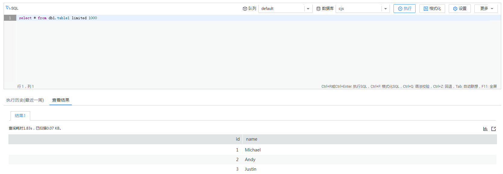

# 提交SQL作业

介绍用户初次快速开始使用DLI提交SQL作业查询数据。基本流程如下：

1.  [上传数据](#section61379418181550)
2.  [登录DLI](#section19012773105034)
3.  [创建数据库](#section21433273112656)
4.  [创建表](#section21590507141153)
5.  [查询数据](#section37788816112733)

如下操作以查询OBS的数据为例，DLI的数据查询操作类同。

## 上传数据

DLI可以查询来自OBS的数据，查询数据前，需要在OBS上传数据文件。

1.  登录OBS管理控制台。
2.  创建一个桶，桶名全局唯一，这里以桶名“obs1”为例。
    1.  单击“创建桶“。
    2.  进入“创建桶”页面，选择“区域”，输入“桶名称”。
    3.  单击“立即创建”。

3.  单击所建桶“obs1”，进入“概览”页面。
4.  单击左侧列表中的“对象”，选择“上传文件”，将需要上传的文件“sampledata.csv“上传到指定目录，单击“确定“。

    文件上传成功后，待分析的文件路径为“s3a://obs1/sampledata.csv“。

## 登录DLI

1.  登录[公有云](https://www.huaweicloud.com/)。
2.  在公有云页面的上方导航栏，选择“产品“。
3.  在“EI企业智能“列表中，单击“数据湖探索“。
4.  单击“进入控制台“，进入数据湖探索管理控制台页面。
5.  输入“帐户名“和“密码“，单击“登录“。进入数据湖探索管理控制台总览页面。
6.  单击总览页面“SQL作业”框或其右侧的，可进入SQL作业“作业编辑器”页面。

## 创建队列

DLI有预置的可用队列“default“。若使用default队列，将按照扫描量计费。用户也可根据需要自己创建队列，使用自建队列将按照CU时计费。

-   创建队列详细介绍请参考[创建队列](创建队列.md)。
-   具体计费方式请参考[《数据湖探索购买指南》](https://support.huaweicloud.com/pg-uquery/uquery_06_0001.html)。

## 创建数据库

进行数据查询之前首先需要创建一个数据库，例如db1。

> **说明：**   
>“default”为内置数据库，不能创建名为“default”的数据库。  

在“作业编辑器”页面右侧的编辑窗口中，输入如下SQL语句，单击。

**create database db1**

数据库创建成功后，新建的数据库db1会在左侧“数据库“列表中出现。

## 创建表

数据库创建完成后，需要在数据库db1里基于OBS上的样本数据“s3a://obs1/sampledata.csv“创建一个表，例如table1。

1.  在“作业编辑器“页面，单击，选择新创建的数据库db1。
2.  在右侧的编辑窗口中，输入如下SQL语句，单击。

    **create table table1 \(id int, name string\) using csv options \(path 's3a://obs1/sampledata.csv'\)**

    表创建成功后，单击，再单击db1，新创建的表table1会在“表“区域下方显示。

## 查询数据

1.  在“作业编辑器“页面的“表“区域，选择新创建的表table1，双击表，在右侧编辑窗口中，自动输入SQL查询语句，例如查询table1表的1000条数据：

    **select \* from db1.table1 limit 1000**。

2.  单击，系统开始查询。

    SQL语句执行成功后，可在SQL作业编辑窗口下方查看查询结果。

    **图 1**  查询结果  
    

