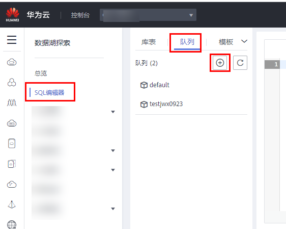

# 提交SQL作业<a name="dli_01_0002"></a>

使用DLI提交SQL作业查询数据。基本流程如下：

[步骤1：登录华为云](#section3751181910618)

[步骤2：上传数据至OBS](#section61379418181550)

[步骤3：登录DLI管理控制台](#section19012773105034)

[步骤4：创建队列](#section10742144985011)

[步骤5：创建数据库](#section21433273112656)

[步骤6：创建表](#section21590507141153)

[步骤7：查询数据](#section37788816112733)

如下操作以查询OBS的数据为例，DLI的数据查询操作类同。

## 步骤1：登录华为云<a name="section3751181910618"></a>

1.  打开[华为云](https://www.huaweicloud.com/)首页。
2.  在登录页面输入“帐号名“和“密码“，单击“登录“。

## 步骤2：上传数据至OBS<a name="section61379418181550"></a>

DLI可以查询存储在OBS中的数据，查询数据前，需要将数据文件上传至OBS中。

1.  在华为云页面的上方导航栏中，选择“产品“。
2.  在基础服务列表中，单击“存储”中的“对象存储服务OBS”。
3.  在OBS服务产品页，单击“进入控制台“，进入OBS管理控制台页面。
4.  创建一个桶，桶名全局唯一，这里以桶名“obs1”为例。
    1.  单击页面右上角“创建桶“。
    2.  进入“创建桶”页面，选择“区域”，输入“桶名称”。

        > **说明：** 
        >创建OBS桶时，需要选择与DLI管理控制台相同的区域，不可跨区域执行操作。

    3.  单击“立即创建”。

5.  单击所建桶“obs1”，进入“概览”页面。
6.  单击左侧列表中的“对象”，选择“上传对象”，将需要上传的文件“sampledata.csv“上传到指定目录，单击“上传“。其中，“sampledata.csv“为样例数据，可以使用Excel工具输入对应的数据后，保存为“CSV（逗号分隔）（\*.csv）”格式。例如：

    **图 1**  CSV文件示例<a name="fig5756191813350"></a>  
    

    文件上传成功后，待分析的文件路径为“obs://obs1/sampledata.csv“。

    关于OBS管理控制台更多操作请参考《[对象存储服务控制台指南](https://support.huaweicloud.com/usermanual-obs/obs_03_0054.html)》。

    OBS上传文件指导，请参见《[OBS工具指南](https://support.huaweicloud.com/tg-obs/obs_09_0001.html)》。

    > **说明：** 
    >针对大文件场景，由于OBS管理控制台对文件大小和数量限制较多，所以推荐使用OBS工具上传大文件，如OBS Browser+或obsutil工具上传。
    >-   OBS Browser+是一个比较常用的图形化工具，支持完善的桶管理和对象管理操作。推荐使用此工具创建桶或上传对象。
    >-   obsutil是一款用于访问管理OBS的命令行工具，对于熟悉命令行程序的用户，obsutil是执行批量处理、自动化任务的好的选择。

    您可以通过以下多种方式将文件上传至桶，OBS最终将这些文件以对象的形式存储在桶中。

    **表 1**  OBS上传对象的不同访问方式

    <a name="table19415205722915"></a>
    <table><thead align="left"><tr id="row5412105702914"><th class="cellrowborder" valign="top" width="20.71%" id="mcps1.2.3.1.1"><p id="p12411957102914"><a name="p12411957102914"></a><a name="p12411957102914"></a>访问方式</p>
    </th>
    <th class="cellrowborder" valign="top" width="79.29%" id="mcps1.2.3.1.2"><p id="p114111657142912"><a name="p114111657142912"></a><a name="p114111657142912"></a>上传对象方法</p>
    </th>
    </tr>
    </thead>
    <tbody><tr id="row241385752915"><td class="cellrowborder" valign="top" width="20.71%" headers="mcps1.2.3.1.1 "><p id="p24131857132917"><a name="p24131857132917"></a><a name="p24131857132917"></a>控制台</p>
    </td>
    <td class="cellrowborder" valign="top" width="79.29%" headers="mcps1.2.3.1.2 "><p id="p341395732917"><a name="p341395732917"></a><a name="p341395732917"></a><a href="https://support.huaweicloud.com/usermanual-obs/obs_03_0307.html" target="_blank" rel="noopener noreferrer">通过控制台上传对象</a> </p>
    </td>
    </tr>
    <tr id="row19414165719294"><td class="cellrowborder" valign="top" width="20.71%" headers="mcps1.2.3.1.1 "><p id="p1341405792914"><a name="p1341405792914"></a><a name="p1341405792914"></a>OBS Browser+</p>
    </td>
    <td class="cellrowborder" valign="top" width="79.29%" headers="mcps1.2.3.1.2 "><p id="p1941435712295"><a name="p1941435712295"></a><a name="p1941435712295"></a><a href="https://support.huaweicloud.com/browsertg-obs/obs_03_1006.html" target="_blank" rel="noopener noreferrer">通过OBS Browser+上传对象</a> </p>
    </td>
    </tr>
    <tr id="row10414135711298"><td class="cellrowborder" valign="top" width="20.71%" headers="mcps1.2.3.1.1 "><p id="p1441495718291"><a name="p1441495718291"></a><a name="p1441495718291"></a>obsutil</p>
    </td>
    <td class="cellrowborder" valign="top" width="79.29%" headers="mcps1.2.3.1.2 "><p id="p24141557162913"><a name="p24141557162913"></a><a name="p24141557162913"></a><a href="https://support.huaweicloud.com/utiltg-obs/obs_11_0013.html" target="_blank" rel="noopener noreferrer">通过obsutil上传对象</a> </p>
    </td>
    </tr>
    <tr id="row1541485762914"><td class="cellrowborder" valign="top" width="20.71%" headers="mcps1.2.3.1.1 "><p id="p19414857182910"><a name="p19414857182910"></a><a name="p19414857182910"></a>SDK</p>
    </td>
    <td class="cellrowborder" valign="top" width="79.29%" headers="mcps1.2.3.1.2 "><p id="p1641417576293"><a name="p1641417576293"></a><a name="p1641417576293"></a><a href="https://support.huaweicloud.com/sdkreference-obs/obs_02_0001.html" target="_blank" rel="noopener noreferrer">使用SDK上传对象</a> ，具体参考各语言开发指南的上传对象章节</p>
    </td>
    </tr>
    <tr id="row241518574298"><td class="cellrowborder" valign="top" width="20.71%" headers="mcps1.2.3.1.1 "><p id="p12415185722913"><a name="p12415185722913"></a><a name="p12415185722913"></a>API</p>
    </td>
    <td class="cellrowborder" valign="top" width="79.29%" headers="mcps1.2.3.1.2 "><p id="p1641513574296"><a name="p1641513574296"></a><a name="p1641513574296"></a><a href="https://support.huaweicloud.com/api-obs/obs_04_0080.html" target="_blank" rel="noopener noreferrer">PUT上传</a> 、<a href="https://support.huaweicloud.com/api-obs/obs_04_0081.html" target="_blank" rel="noopener noreferrer">POST上传</a> </p>
    </td>
    </tr>
    </tbody>
    </table>


## 步骤3：登录DLI管理控制台<a name="section19012773105034"></a>

1.  在华为云页面的上方导航栏中，选择“产品“。
2.  在列表中，选择“大数据“\>“大数据计算“中的“数据湖探索 DLI“。
3.  在DLI服务产品页，单击“进入控制台“，进入DLI管理控制台页面。第一次进入数据湖探索管理控制台需要进行授权，以获取访问OBS的权限。

## 步骤4：创建队列<a name="section10742144985011"></a>

队列是使用DLI服务的基础，执行SQL作业前需要先创建队列。

-   DLI有预置的可用队列“default“。若使用default队列，将按照扫描量计费。
-   用户也可根据需要自己创建队列。使用自建队列，将按照CU时或包年包月计费。
    1.  在DLI管理控制台，单击左侧导航栏中的“SQL编辑器”，可进入SQL作业“SQL编辑器”页面。
    2.  在左侧导航栏，选择队列页签，单击右侧的创建队列。

        

        创建队列详细介绍请参考[创建队列](创建队列.md)。

        具体计费方式请参考[《数据湖探索产品介绍》](https://support.huaweicloud.com/productdesc-dli/dli_07_0008.html)。


## 步骤5：创建数据库<a name="section21433273112656"></a>

在进行数据查询之前还需要创建一个数据库，例如db1。

> **说明：** 
>“default”为内置数据库，不能创建名为“default”的数据库。

1.  在DLI管理控制台，单击左侧导航栏中的“SQL编辑器”，可进入SQL作业“SQL编辑器”页面。
2.  在“SQL编辑器”页面右侧的编辑窗口中，输入如下SQL语句，单击“执行”。阅读并同意隐私协议，单击“确定”。

    ```
    create database db1;
    ```

    数据库创建成功后，新建的数据库db1会在左侧“数据库“列表中出现。

    > **说明：** 
    >在DLI管理控制台第一次单击“执行”操作时，需要阅读隐私协议，确认同意后才能执行作业，且后续“执行”操作将不会再提示阅读隐私协议。


## 步骤6：创建表<a name="section21590507141153"></a>

数据库创建完成后，需要在数据库db1中基于OBS上的样本数据“obs://obs1/sampledata.csv“创建一个表，例如table1。

1.  在“SQL编辑器“页面右侧的编辑窗口上方，选择队列“default”和数据库“db1”。
2.  在编辑窗口中，输入如下SQL语句，单击“执行”。

    ```
    create table table1 (id int, name string) using csv options (path 'obs://obs1/sampledata.csv');
    ```

    表table1创建成功后，单击左侧“库表”页签，再单击db1，新创建的表table1会在“表“区域下方显示。


## 步骤7：查询数据<a name="section37788816112733"></a>

完成以上步骤后，就可以开始进行数据查询了。

1.  单击“SQL编辑器“页面左侧的“库表“页签，选择新创建的表table1，双击表，在右侧编辑窗口中，自动输入SQL查询语句，例如查询table1表的1000条数据：

    ```
    select * from db1.table1 limit 1000;
    ```

2.  单击“执行”，系统开始查询。

    SQL语句执行成功后，可在SQL作业编辑窗口下方“查看结果”页签查看查询结果。


