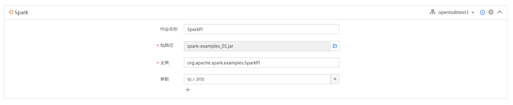

# 提交Spark作业

介绍用户初次快速开始使用DLI提交Spark作业。基本流程如下：

1.  [登录DLI](#section19012773105034)
2.  [创建集群](#section122981023152710)
3.  [上传数据到OBS](#section61379418181550)
4.  [创建包](#section21433273112656)
5.  [提交Spark作业](#section21590507141153)

## 登录DLI

1.  登录[公有云](https://www.huaweicloud.com/)。
2.  在公有云页面的上方导航栏，选择“产品“。
3.  在“EI企业智能“列表中，单击“数据湖探索“。
4.  单击“进入控制台“，进入数据湖探索管理控制台页面。
5.  输入“帐户名“和“密码“，单击“登录“。进入数据湖探索管理控制台总览页面。
6.  单击总览页面“Spark作业”框或其右侧的，进入Spark作业“作业编辑器”页面。

## 创建集群

第一次提交Spark作业，需要先创建集群，详细介绍请参考[创建集群](创建集群.md)。

## 上传数据到OBS

1.  登录OBS管理控制台。
2.  单击“创建桶“，命名为“obs1“。

    > **说明：**   
    >OBS的桶名是全局唯一的，这里命名的桶名为用户实际使用的桶名。  

3.  单击所建桶“obs1”，进入“概览”页面。
4.  单击左侧列表中的“对象”，选择“上传文件”，将需要上传的文件，例如“spark-examples\_01.jar“上传到指定目录，单击“确定“。

    文件上传成功后，待分析的文件路径为“s3a://obs1/spark-examples\_01.jar“。

## 创建包

提交Spark作业之前需要创建包，例如“spark-examples\_01.jar”。详细介绍请参考[创建程序包](创建程序包.md)。

## 提交Spark作业

1.  在“作业编辑器”页面，将鼠标移到上，新增一个Spark作业编辑窗口。
2.  在当前Spark作业编辑窗口右上方选择所使用的集群。
3.  在Spark作业编辑窗口中，输入相关参数，具体如[图1](#fig138651058151411)所示。

    **图 1**  Spark作业  
    

4.  单击Spark作业编辑窗口右上方，提交作业，页面显示“批量提交成功”。
5.  （可选）可到“作业管理”页面查看提交作业的状态及日志。

    > **说明：**   
    >作业执行成功后，作业记录只保存6小时。  

