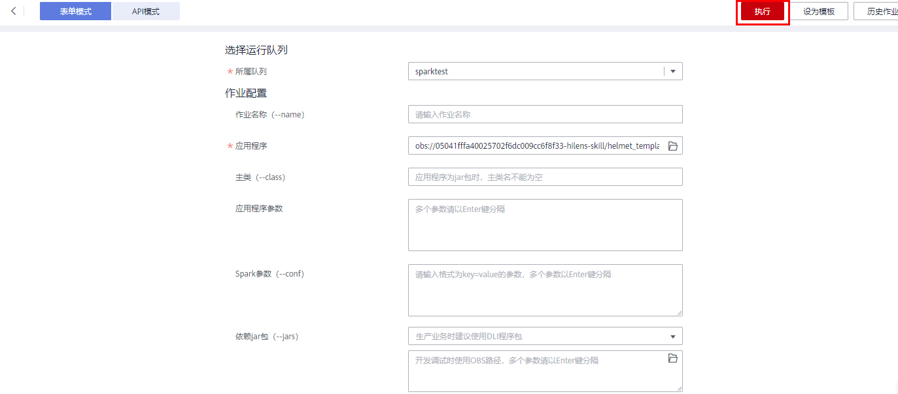

# 提交Spark作业

使用DLI提交Spark作业进行实时计算。基本流程如下：

[步骤1：登录华为云](#section3751181910618)

[步骤2：上传数据至OBS](#section10891114913473)

[步骤3：登录DLI管理控制台](#section19012773105034)

[步骤4：创建队列](#section122981023152710)

[步骤5：创建程序包](#section21433273112656)

[步骤6：提交Spark作业](#section21590507141153)

## 步骤1：登录华为云

使用DLI服务，首先要登录华为云。

1.  打开[华为云](https://www.huaweicloud.com/)首页。
2.  在登录页面输入“帐号名“和“密码“，单击“登录“。

## 步骤2：上传数据至OBS

提交Spark作业之前，需要在OBS中上传数据文件。

1.  在华为云页面的上方导航栏中，选择“产品“。
2.  在基础服务列表中，单击“存储”中的“对象存储服务OBS”。
3.  在OBS服务产品页，单击“管理控制台“，进入OBS管理控制台页面。
4.  创建一个桶，桶名全局唯一，这里以桶名“obs1”为例。
    1.  单击“创建桶“。
    2.  进入“创建桶”页面，选择“区域”，输入“桶名称”。

        > **说明：** 
        >创建OBS桶时，需要选择与DLI管理控制台相同的区域，不可跨区域执行操作。

    3.  单击“立即创建”。

5.  单击所建桶“obs1”，进入“概览”页面。
6.  单击左侧列表中的“对象”，选择“上传文件”，将需要上传的文件，例如“spark-examples.jar“上传到指定目录，单击“确定“。

    文件上传成功后，待分析的文件路径为“obs://obs1/spark-examples.jar“。

    关于OBS管理控制台更多操作请参考《[对象存储服务控制台指南](https://support.huaweicloud.com/usermanual-obs/obs_03_0054.html)》。

    OBS上传文件指导，请参见《[OBS工具指南](https://support.huaweicloud.com/tg-obs/obs_09_0001.html)》。

    > **说明：** 
    >针对大文件场景，由于OBS管理控制台对文件大小和数量限制较多，所以推荐使用OBS工具上传大文件，如OBS Browser+或obsutil工具上传。
    >-   OBS Browser+是一个比较常用的图形化工具，，支持完善的桶管理和对象管理操作。推荐使用此工具创建桶或上传对象。
    >-   obsutil是一款用于访问管理OBS的命令行工具，对于熟悉命令行程序的用户，obsutil是执行批量处理、自动化任务的好的选择。

    您可以通过以下多种方式将文件上传至桶，OBS最终将这些文件以对象的形式存储在桶中。

    **表 1**  OBS上传对象的不同访问方式

    
    <table><thead align="left"><tr id="row19190712132219"><th class="cellrowborder" valign="top" width="32.36%" id="mcps1.2.3.1.1">
访问方式

    </th>
    <th class="cellrowborder" valign="top" width="67.64%" id="mcps1.2.3.1.2">
上传对象方法

    </th>
    </tr>
    </thead>
    <tbody><tr id="row719011262211"><td class="cellrowborder" valign="top" width="32.36%" headers="mcps1.2.3.1.1 ">
控制台

    </td>
    <td class="cellrowborder" valign="top" width="67.64%" headers="mcps1.2.3.1.2 ">
<a href="https://support.huaweicloud.com/usermanual-obs/obs_03_0307.html" target="_blank" rel="noopener noreferrer">通过控制台上传对象</a> 

    </td>
    </tr>
    <tr id="row17190141232210"><td class="cellrowborder" valign="top" width="32.36%" headers="mcps1.2.3.1.1 ">
OBS Browser+

    </td>
    <td class="cellrowborder" valign="top" width="67.64%" headers="mcps1.2.3.1.2 ">
<a href="https://support.huaweicloud.com/browsertg-obs/obs_03_1006.html" target="_blank" rel="noopener noreferrer">通过OBS Browser+上传对象</a> 

    </td>
    </tr>
    <tr id="row11902123224"><td class="cellrowborder" valign="top" width="32.36%" headers="mcps1.2.3.1.1 ">
obsutil

    </td>
    <td class="cellrowborder" valign="top" width="67.64%" headers="mcps1.2.3.1.2 ">
<a href="https://support.huaweicloud.com/utiltg-obs/obs_11_0013.html" target="_blank" rel="noopener noreferrer">通过obsutil上传对象</a> 

    </td>
    </tr>
    <tr id="row151901312112210"><td class="cellrowborder" valign="top" width="32.36%" headers="mcps1.2.3.1.1 ">
SDK

    </td>
    <td class="cellrowborder" valign="top" width="67.64%" headers="mcps1.2.3.1.2 ">
<a href="https://support.huaweicloud.com/sdkreference-obs/obs_02_0001.html" target="_blank" rel="noopener noreferrer">使用SDK上传对象</a> ，具体参考各语言开发指南的上传对象章节

    </td>
    </tr>
    <tr id="row819051212214"><td class="cellrowborder" valign="top" width="32.36%" headers="mcps1.2.3.1.1 ">
API

    </td>
    <td class="cellrowborder" valign="top" width="67.64%" headers="mcps1.2.3.1.2 ">
<a href="https://support.huaweicloud.com/api-obs/obs_04_0080.html" target="_blank" rel="noopener noreferrer">PUT上传</a> 、<a href="https://support.huaweicloud.com/api-obs/obs_04_0081.html" target="_blank" rel="noopener noreferrer">POST上传</a> 

    </td>
    </tr>
    </tbody>
    </table>

## 步骤3：登录DLI管理控制台

使用DLI提交Spark作业，需要先进入Spark作业编辑页面。

1.  在华为云页面的上方导航栏，选择“产品“。
2.  在列表中，选择“大数据“\>“大数据计算“中的“数据湖探索 DLI“。
3.  在DLI服务产品页，单击“进入控制台“，进入DLI管理控制台页面。

    > **说明：** 
    >第一次进入数据湖探索管理控制台需要进行授权，以获取访问OBS的权限。请参考[服务授权](服务授权.md)。

## 步骤4：创建队列

第一次提交Spark作业，需要先创建队列，例如创建名为“test”的队列。创建队列详细介绍请参考[创建队列](创建队列.md)。

## 步骤5：创建程序包

提交Spark作业之前需要创建程序包，例如“spark-examples.jar”。详细介绍请参考[创建程序包](创建程序包.md)。

## 步骤6：提交Spark作业

1.  在DLI管理控制台，单击左侧导航栏中的“作业管理”\>“Spark作业”，进入创建Spark作业页面。
2.  在Spark作业编辑页面中，输入相关参数，具体请参考[界面说明](创建Spark作业.md#zh-cn_topic_0115200017_zh-cn_topic_0093946815_section56922894165137)中关于Spark作业编辑页面的说明。
3.  单击Spark作业编辑页面右上方“执行”，阅读并同意隐私协议，单击“确定”。提交作业，页面显示“作业提交成功”。

    

4.  （可选）可到“作业管理”\>“Spark作业”页面查看提交作业的状态及日志。

    > **说明：** 
    >在DLI管理控制台第一次单击“执行”操作时，需要阅读隐私协议，同意确定后，后续操作将不会再提示。
    >更多Spark作业样例代码请通过[DLI样例代码](https://uquery-sdk.obs-website.cn-north-1.myhuaweicloud.com/dli-example-code_1.0.0.zip)获取。

