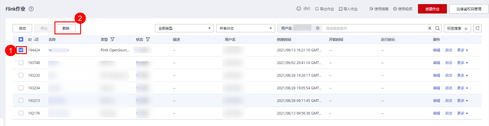
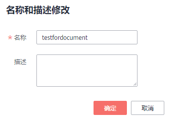

# 操作Flink作业

用户创建了新作业后，需要根据用户的实际需求对作业进行操作，具体操作有如下几种：

-   [编辑作业](#section1950210297542)
-   [启动作业](#section20957159163012)
-   [停止作业](#section8678193324114)
-   [删除作业](#section1691624195713)
-   [导出作业](#section135831511323)
-   [导入作业](#section75781665389)
-   [名称和描述修改](#section15861321183619)
-   [导入保存点](#section83412445175)
-   [触发保存点](#section11401152191015)
-   [运行时配置](#section48961252113110)

## 编辑作业

用户可以对已经创建的作业进行编辑，如修改SQL语句、作业名称和描述、作业配置信息等。

1.  在DLI管理控制台的左侧导航栏中，单击“作业管理“\>“Flink作业“，进入Flink作业管理页面。
2.  在需要编辑作业对应的“操作“列中，单击“编辑“，进入作业“编辑“页面。
3.  根据实际需求编辑作业。

    对于Flink SQL类型作业，编辑页面详情请参见[创建Flink SQL作业](创建Flink-SQL作业.md)中的步骤5\~步骤7。

    对于Flink自定义类型作业，编辑页面详情请参见[创建Flink Jar作业](创建Flink-Jar作业.md)中的步骤5\~步骤7。

    对于Flink OpenSource SQL作业，编辑页面详情请参见[创建Flink OpenSource SQL作业](创建Flink-OpenSource-SQL作业.md)中的步骤5\~步骤7。

    对于Flink SQL边缘类型作业，编辑页面详情请参见[创建Flink SQL边缘作业](创建Flink-SQL边缘作业.md)中的步骤5\~步骤7。

## 启动作业

用户可以启动已创建保存的作业或已经停止的作业。

1.  在DLI管理控制台的左侧导航栏中，单击“作业管理“\>“Flink作业“，进入Flink作业管理页面。
2.  启动作业，有以下两种方式：

    -   启动单个作业

        选择一个作业，在对应的“操作“列中，单击“启动“。

        也可以在作业列表中，勾选一个作业，单击作业列表左上方的“启动“。

    -   批量启动作业

        勾选多个作业，单击作业列表左上方的“启动“，可以启动多个作业。

    单击“启动“后，跳转至“作业配置清单“页面。

1.  在“作业配置清单“页面，确认作业信息及价格，若无误，单击“立即启动“。

    作业启动后，可在对应作业的“状态“列中查看运行成功或失败。

## 停止作业

当用户不需要运行某个作业时，用户可以将状态为“运行中“和“提交中“的作业停止。

1.  在DLI管理控制台的左侧导航栏中，单击“作业管理“\>“Flink作业“，进入Flink作业管理页面。
2.  停止作业，有以下两种方式：
    -   停止单个作业

        选择需要停止的作业，在对应的“操作“列中，单击“更多 \> 停止“。

        也可以在作业列表中，勾选一个作业，单击作业列表左上方的“停止“。

    -   批量停止作业

        勾选多个需要停止作业，单击作业列表左上方的“停止“。可以停止多个作业。

3.  在弹出的“停止作业“窗口中，单击“确认“，停止作业。

    **图 1**  停止作业  
    

    > **说明：** 
    >-   在停止作业之前，用户可以触发保存点，保存作业的状态信息。当该作业再次启动时用户可以选择是否从保存点恢复。
    >-   勾选“触发保存点”表示创建保存点。不勾选“触发保存点”表示不创建保存点。默认不创建保存点。
    >-   保存点的生命周期从触发保存点并停止作业开始，重启作业后结束。保存点在重启作业后自动删除，不会一直保存。

    停止作业过程中，在作业列表的“状态”列中将显示作业状态，说明如下：

    -   如果在“状态“中显示“停止中“，表示正在停止作业。
    -   如果在“状态“中显示“已停止“，表示停止作业成功。
    -   如果在“状态“中显示“停止失败“，表示停止作业失败。

## 删除作业

当用户不再需要使用某个作业时，可以参考如下操作删除该作业。作业删除后，将不可恢复，请谨慎操作。

1.  在DLI管理控制台的左侧导航栏中，单击“作业管理“\>“Flink作业“，进入Flink作业管理页面。

1.  删除作业，有以下两种方式：
    -   删除单个作业

        在需要删除作业对应的“操作“列中，单击“更多 \> 删除“，弹出“删除作业“页面。

        也可以在作业列表中，勾选一个作业，单击作业列表左上方的“删除“，弹出“删除作业“页面。

        

    -   批量删除作业

        勾选多个需要删除作业，单击作业列表左上方的“删除“，弹出“删除作业“页面，可以删除多个作业。

2.  单击“确定“，完成作业的删除。

## 导出作业

用户可以将所创建的Flink作业导出至OBS桶中。

适用于当用户切换区域、项目或用户时，需要创建相同的作业，而作业比较多的情况。此时，不需要重新创建作业，只需要将原有的作业导出，再在新的区域、项目或者使用新的用户登录后，导入作业即可。

> **说明：** 
>切换项目或用户时，需要对新项目或用户授权，具体请参考[Flink作业权限管理](Flink作业权限管理.md)。

1.  在DLI管理控制台的左侧导航栏中，单击“作业管理“\>“Flink作业“，进入Flink作业管理页面。

1.  单击右上角“导出作业“，打开“导出作业“对话框。

    

2.  选择保存作业的OBS桶。单击“下一步“。
3.  选择待导出的作业。

    默认导出所有作业，也可以勾选“自定义导出“选择需要导出的作业。

4.  单击“确认导出“，完成导出作业。

## 导入作业

用户可以将保存在OBS桶中的Flink作业配置文件导入至DLI的Flink作业管理中。

适用于当用户切换区域、项目或用户时，需要创建相同的作业，而作业比较多的情况。此时，不需要重新创建作业，只需要将原有的作业导出，再在新的区域、项目或者使用新的用户登录后，导入作业即可。

如果需要导入自建的作业，建议使用创建作业的功能。具体请参考[创建Flink SQL作业](创建Flink-SQL作业.md)，[创建Flink Jar作业](创建Flink-Jar作业.md)，[创建Flink OpenSource SQL作业](创建Flink-OpenSource-SQL作业.md)和[创建Flink SQL边缘作业](创建Flink-SQL边缘作业.md)。

> **说明：** 
>-   切换项目或用户时，需要对新项目或用户授权，具体请参考[Flink作业权限管理](Flink作业权限管理.md)。
>-   仅支持导入与从DLI导出的Flink作业相同数据格式的作业。

1.  在DLI管理控制台的左侧导航栏中，单击“作业管理“\>“Flink作业“，进入Flink作业管理页面。

1.  单击右上角“导入作业“，打开“导入作业“对话框。

    

2.  选择需导入的作业配置文件所在的OBS桶。单击“下一步“。
3.  配置同名作业策略。单击“下一步“。
    -   勾选“配置同名替换“，若待导入的作业名已存在，则覆盖已存在的作业配置，并且作业状态重置为草稿。
    -   不勾选“配置同名替换“，若待导入的作业名已存在，则不导入同名作业的配置。

4.  确认“配置文件”和“同名作业策略”配置无误。单击“确认导入“，完成导入作业。

## 名称和描述修改

用户可以根据需要修改作业名称和描述。

1.  在DLI管理控制台的左侧导航栏中，单击“作业管理“\>“Flink作业“，进入Flink作业管理页面。
2.  在需要修改名称和描述的作业对应的“操作“列中，单击“更多 \> 名称和描述修改“，弹出“属性修改“页面。修改作业名称和描述。

    **图 2**  名称和描述修改  
    

3.  单击“确定“完成修改。

## 导入保存点

用户将作业从实时流计算服务（CS）迁入数据湖探索（DLI）时，可通过导入保存点，导入作业数据。

## 触发保存点

状态为“运行中”的作业可以“触发保存点”，保存作业的状态信息。

## 运行时配置

用户可通过选择“运行时配置”配置作业异常告警和重启选项。

> **说明：** 
>支持Flink SQL作业，Flink jar作业和Flink OpenSource SQL作业。

1.  在对应Flink作业“操作”列\>“更多”中单击“运行时配置”。
2.  在“运行时配置”页面配置以下参数。

    **图 3**  运行时配置  
    

    **表 1**  作业运行参数说明

    
    <table><thead align="left"><tr id="row9220121016203"><th class="cellrowborder" valign="top" width="22.189999999999998%" id="mcps1.2.3.1.1">
参数

    </th>
    <th class="cellrowborder" valign="top" width="77.81%" id="mcps1.2.3.1.2">
参数说明

    </th>
    </tr>
    </thead>
    <tbody><tr id="row9415135074517"><td class="cellrowborder" valign="top" width="22.189999999999998%" headers="mcps1.2.3.1.1 ">
作业异常告警

    </td>
    <td class="cellrowborder" valign="top" width="77.81%" headers="mcps1.2.3.1.2 ">
设置是否将作业异常告警信息，如作业出现运行异常或者欠费情况，以SMN的方式通知用户。

    
勾选后需配置下列参数：

    
“SMN主题”：

    
选择一个自定义的SMN主题。如何自定义SMN主题，请参见<a href="https://support.huaweicloud.com/usermanual-smn/smn_ug_42000.html" target="_blank" rel="noopener noreferrer">《消息通知服务用户指南》</a>中“创建主题”章节。

    </td>
    </tr>
    <tr id="row12227171052018"><td class="cellrowborder" valign="top" width="22.189999999999998%" headers="mcps1.2.3.1.1 ">
异常自动重启

    </td>
    <td class="cellrowborder" valign="top" width="77.81%" headers="mcps1.2.3.1.2 ">
设置是否启动异常自动重启功能，当作业异常时将自动重启并恢复作业。

    
勾选后需配置下列参数：

    <ul id="ul12114713615"><li>“异常重试最大次数”：配置异常重试最大次数。单位为“次/小时”。<ul id="ul1442116221967"><li>无限：无限次重试。</li><li>有限：自定义重试次数。</li></ul>
    </li><li>“从Checkpoint恢复”：从已保存的checkpoint恢复作业。
 说明： 

Flink SQL作业和Flink OpenSource SQL作业需要在编辑页面勾选“开启Checkpoint”才可配置该参数。

    

    
勾选该参数后，Flink&nbsp;jar作业还需要选择“Checkpoint路径”。

    
“Checkpoint路径”：选择checkpoint保存路径。必须和应用程序中配置的Checkpoint地址相对应。且不同作业的路径不可一致，否则无法获取准确的Checkpoint。

    </li></ul>
    </td>
    </tr>
    </tbody>
    </table>

