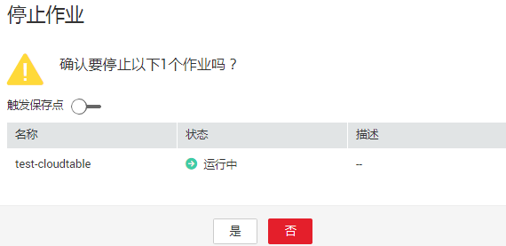
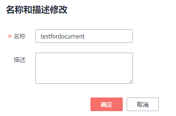

# 操作作业

用户创建了新作业后，需要根据用户的实际需求对作业进行操作，具体操作有如下几种：

-   [编辑作业](#section1950210297542)
-   [启动作业](#section20957159163012)
-   [停止作业](#section8678193324114)
-   [删除作业](#section1691624195713)
-   [名称和描述修改](#section15861321183619)

## 编辑作业

用户可以对已经创建的作业进行编辑，如修改SQL语句、作业名称和描述、作业配置信息等。

1.  在DLI管理控制台的左侧导航栏中，单击“作业管理“\>“Flink作业“，进入Flink作业管理页面。
2.  在需要编辑作业对应的“操作“列中，单击“编辑“，进入作业“编辑“页面。
3.  根据实际需求编辑作业。

    对于Flink SQL类型作业，编辑页面详情请参见[创建Flink SQL作业](创建Flink-SQL作业.md)中的步骤5\~步骤7。

    对于Flink自定义类型作业，编辑页面详情请参见[创建Flink自定义作业](创建Flink自定义作业.md)中的步骤5\~步骤7。

## 启动作业

用户可以启动已创建保存的作业或已经停止的作业。

1.  在DLI管理控制台的左侧导航栏中，单击“作业管理“\>“Flink作业“，进入Flink作业管理页面。
2.  启动作业，有以下两种方式：

    -   启动单个作业

        选择一个作业，在对应的“操作“列中，单击“启动“。

        也可以在作业列表中，勾选一个作业，单击作业列表左上方的“启动“。

    -   批量启动作业

        勾选多个作业，单击作业列表左上方的“启动“，可以启动多个作业。

    单击“启动“后，跳转至“作业配置清单“页面。

1.  在“作业配置清单“页面，确认作业信息及价格，若无误，单击“确认“。

    作业启动后，可在对应作业的“状态“列中查看运行成功或失败。

## 停止作业

当用户不需要运行某个作业时，用户可以将状态为“运行中“和“提交中“的作业停止。

1.  在DLI管理控制台的左侧导航栏中，单击“作业管理“\>“Flink作业“，进入Flink作业管理页面。
2.  停止作业，有以下两种方式：
    -   停止单个作业

        选择需要停止的作业，在对应的“操作“列中，单击“更多 \> 停止“。

        也可以在作业列表中，勾选一个作业，单击作业列表左上方的“停止“。

    -   批量停止作业

        勾选多个需要停止作业，单击作业列表左上方的“停止“。可以停止多个作业。

3.  在弹出的“停止作业“窗口中，单击“确认“，停止作业。

    **图 1**  停止作业  
    

    > **说明：**   
    >-   在停止作业之前，用户可以触发保存点，保存作业的状态信息。当该作业再次启动时用户可以选择是否从保存点恢复。  
    >-   表示创建保存点。表示不创建保存点。默认不创建保存点 。  
    >-   保存点的生命周期从触发保存点并停止作业开始，重启作业后结束。保存点在重启作业后自动删除，不会一直保存  

    停止作业过程中，在作业列表的“状态”列中将显示作业状态，说明如下：

    -   如果在“状态“中显示“停止中“，表示正在停止作业。
    -   如果在“状态“中显示“已停止“，表示停止作业成功。
    -   如果在“状态“中显示“停止失败“，表示停止作业失败。

## 删除作业

当用户不再需要使用某个作业时，可以参考如下操作删除该作业。作业删除后，将不可恢复，请谨慎操作。

1.  在DLI管理控制台的左侧导航栏中，单击“作业管理“\>“Flink作业“，进入Flink作业管理页面。

1.  删除作业，有以下两种方式：
    -   删除单个作业

        在需要删除作业对应的“操作“列中，单击“更多 \> 删除“，弹出“删除作业“页面。

        也可以在作业列表中，勾选一个作业，单击作业列表左上方的“删除“，弹出“删除作业“页面。

    -   批量删除作业

        勾选多个需要删除作业，单击作业列表左上方的“删除“，弹出“删除作业“页面，可以删除多个作业。

2.  单击“确定“，完成作业的删除。

## 名称和描述修改

用户可以根据需要修改作业名称和描述。

1.  在DLI管理控制台的左侧导航栏中，单击“作业管理“\>“Flink作业“，进入Flink作业管理页面。
2.  在需要修改名称和描述的作业对应的“操作“列中，单击“更多 \> 名称和描述修改“，弹出“属性修改“页面。修改作业名称和描述。

    **图 2**  名称和描述修改  
    

3.  单击“确认“完成修改。

