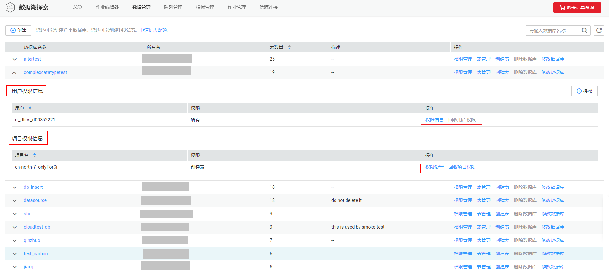
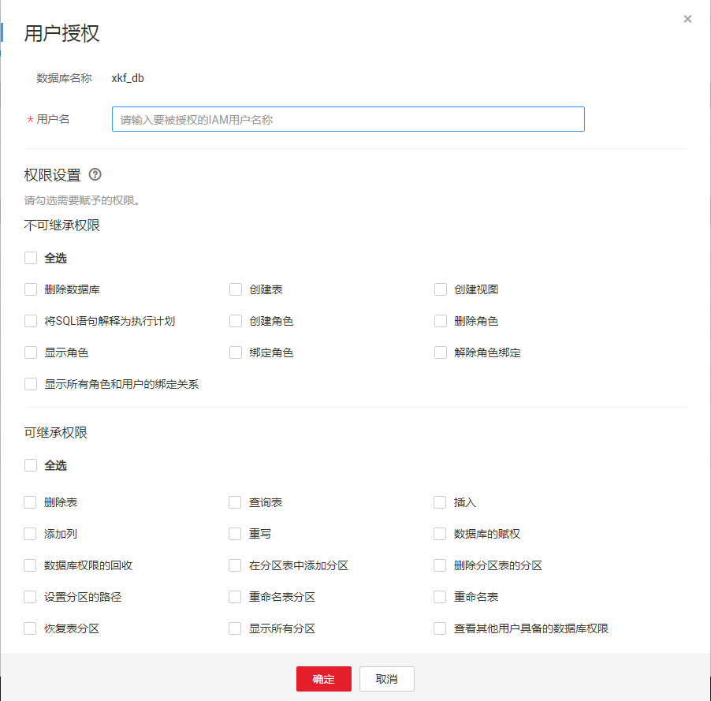
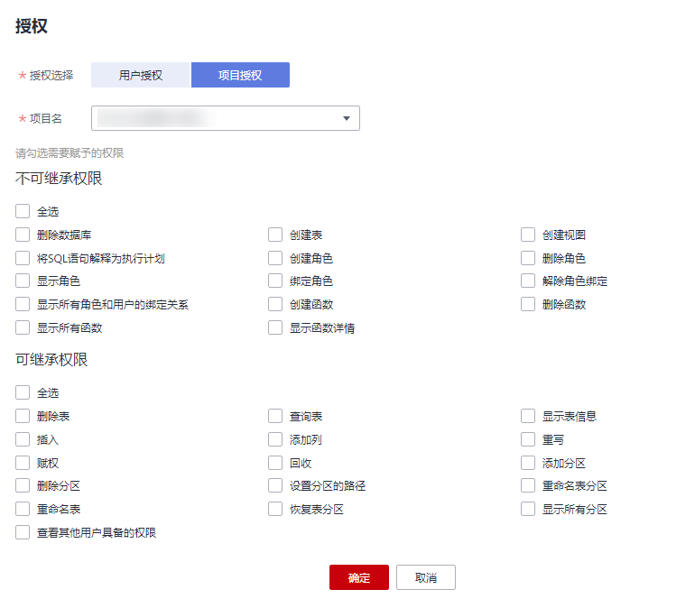

# 数据库权限管理

## 数据库权限操作场景

-   针对不同用户，可以通过权限设置分配不同的数据库，不同用户之间的作业效率互不影响，保障作业性能。
-   管理员用户和数据库的所有者拥有所有权限，不需要进行权限设置且其他用户无法修改其数据库权限。
-   给新用户设置数据库权限时，该用户所在用户组的所属区域需具有Tenant Guest权限。关于Tenant Guest权限的介绍和开通方法，详细参见《[权限策略](https://support.huaweicloud.com/usermanual-permissions/iam_01_0001.html)》和《统一身份认证服务用户指南》中的[创建用户组](https://support.huaweicloud.com/usermanual-iam/iam_03_0001.html)。

## 注意事项

-   如果需要查看管理员或者其他用户帐号下的数据库，需要对当前用户授权（显示权限），具体请参考[常用操作与系统权限关系](常用操作与系统权限关系.md)。
-   数据库和表赋权对象具有层级关系，用户赋予上一层级的权限会自动继承到下一层级对象上，层级关系为：数据库\>表\>列。
-   数据库所有者、表所有者、被赋予“赋权权限“的用户都可以对数据库和表赋权。
-   列只能继承查询权限。“可继承权限“详细信息请参见[数据库权限管理](数据库权限管理.md)。
-   回收权限时，只能在初始赋权的层级上回收。在哪一层赋权的，在哪一层进行权限回收。赋予权限和回收权限需要在同一层级操作。例如：在数据库上给用户赋予插入权限，那么在数据库下面的表就有了插入权限，回收这个插入权限，只能在数据库上回收，不能在表上回收。

## 查看数据库权限

1.  在管理控制台左侧，单击“数据管理“\>“库表管理“。
2.  单击所选数据库“操作”栏中的“权限管理”，将显示该数据库对应的权限信息。

    **图 1**  数据库权限管理  
    

    权限设置有3种场景：为新用户或项目赋予权限、为已有权限的用户或项目修改权限、回收某用户或项目具备的所有权限。

## 为新用户或项目赋予权限

为新用户或新项目赋予权限，新用户或新项目指之前不具备此数据库权限的用户或项目。

1.  在数据库权限管理页面右上角单击“授权“。
2.  在“授权“弹出框中，选择“用户授权”或“项目授权”，填写需要授权的用户名或选择需要授权的项目，选择相应的权限。具体权限说明请参考[表1](#table88751410195512)。

    **图 2**  数据库用户授权  
    

    **图 3**  数据库项目授权  
    

    **表 1**  参数说明

    
    <table><thead align="left"><tr id="row1387220108558"><th class="cellrowborder" valign="top" width="19.49%" id="mcps1.2.3.1.1">
参数

    </th>
    <th class="cellrowborder" valign="top" width="80.51%" id="mcps1.2.3.1.2">
描述

    </th>
    </tr>
    </thead>
    <tbody><tr id="row3373112565"><td class="cellrowborder" valign="top" width="19.49%" headers="mcps1.2.3.1.1 ">
授权选择

    </td>
    <td class="cellrowborder" valign="top" width="80.51%" headers="mcps1.2.3.1.2 ">
选择“用户授权”或“项目授权”。

    </td>
    </tr>
    <tr id="row10873810105520"><td class="cellrowborder" valign="top" width="19.49%" headers="mcps1.2.3.1.1 ">
用户名/项目名

    </td>
    <td class="cellrowborder" valign="top" width="80.51%" headers="mcps1.2.3.1.2 "><ul id="ul672018215573"><li>选择“用户授权”时，输入数据库新增用户对应的IAM用户名称。
 说明： 

该用户名称是已存在的IAM用户名称且该用户登录过DLI管理控制台。

    

    </li><li>选择“项目授权”时，选择当前区域下需要授权的项目。
 说明： 

选择“项目授权”时：

    <ul id="ul129422515351"><li>如果赋权选择不可继承权限，则在该项目中无法查看对应数据库中表的信息。</li><li>如果赋权选择可继承权限，则在该项目中可查看该数据库内所有表的信息。</li></ul>
    

    </li></ul>
    </td>
    </tr>
    <tr id="row12874910135518"><td class="cellrowborder" valign="top" width="19.49%" headers="mcps1.2.3.1.1 ">
不可继承权限

    </td>
    <td class="cellrowborder" valign="top" width="80.51%" headers="mcps1.2.3.1.2 ">
选中权限即对用户或项目进行赋权，取消勾选即对用户权限或项目权限进行回收。

    
不可继承权限只作用于当前数据库。

    <ul id="ul3874131035512"><li>同时适用于“用户授权”和“项目授权”的权限包括：<ul id="ul84811976339"><li>删除数据库：删除当前数据库。</li><li>创建表：在当前数据库创建表。</li><li>创建视图：在当前数据库创建视图。</li><li>将SQL语句解释为执行计划：执行explain语句。</li><li>创建角色：在当前数据库创建角色。</li><li>删除角色：删除当前数据库中的角色。</li><li>显示角色：显示当前用户的角色。</li><li>绑定角色：在当前数据库绑定角色。</li><li>解除角色绑定：在当前数据库解除角色绑定。</li><li>显示所有角色和用户的绑定关系：显示所有角色和用户的绑定关系。</li><li>创建函数：在当前数据库创建函数。</li><li>删除函数：删除当前数据库中的函数。</li><li>显示所有函数：显示当前数据库中的所有函数。</li><li>显示函数详情：显示当前函数详情。</li></ul>
    </li><li>只适用于“用户授权”的权限包括：<ul id="ul13771941103214"><li>显示所有表：显示当前数据库下的所有表。</li><li>显示数据库：显示当前数据库的信息。</li></ul>
    </li></ul>
    </td>
    </tr>
    <tr id="row487561075512"><td class="cellrowborder" valign="top" width="19.49%" headers="mcps1.2.3.1.1 ">
可继承权限

    </td>
    <td class="cellrowborder" valign="top" width="80.51%" headers="mcps1.2.3.1.2 ">
选中权限即对用户进行赋权，取消勾选即对用户权限进行回收。

    
可继承权限可作用到当前数据库及其所有的表上，但是表中的列只能继承其中的查询权限。

    
以下权限同时适用于“用户授权”和“项目授权”。

    <ul id="ul14875111065516"><li>删除表：删除数据库下的表。</li><li>查询表：在当前表内查询。</li><li>显示表信息：显示当前表的信息。</li><li>插入：在当前表内插入数据。</li><li>添加列：在当前表中增加列。</li><li>重写：在当前表内插入覆盖数据。</li><li>赋权：用户可将数据库的权限赋予其他用户或项目。</li><li>回收：用户可回收其他用户或项目具备的此数据库的权限，但是不能回收数据库所有者的权限。</li><li>添加分区：在分区表中添加新的分区。</li><li>删除分区：删除分区表中已有的分区。</li><li>设置分区的路径：将分区表中的某个分区路径设置为用户指定的OBS路径。</li><li>重命名表分区：对分区表中的分区重新命名。</li><li>重命名表：对表重新命名。</li><li>恢复表分区：从文件系统中导出分区信息保存到元数据中。</li><li>显示所有分区：显示分区表中的所有分区。</li><li>查看其他用户具备的权限：查看其他用户或项目具备的当前数据库的权限。</li></ul>
    </td>
    </tr>
    </tbody>
    </table>

3.  单击“确定“，完成授权。

## 为已有权限的用户或项目修改权限

某用户或项目已具备此数据库的一些权限时，可为此用户或项目赋予或取消权限。

> **说明：** 
>当“权限设置“中的选项为灰色时，表示对应帐号不具备修改此数据库的权限。可以向管理员用户、数据库所有者等具有赋权权限的用户申请数据库的“赋权“和数据库权限的“回收“权限。

1.  在“用户权限信息“列表中找到需要设置权限的用户：

    -   若用户为子用户，可进行“权限设置”。
    -   若用户为管理员用户，只能查看“权限信息”。

    在“项目权限信息“列表中找到需要设置权限的项目，进行“权限设置”。

2.  在子用户或项目的“操作”栏中单击“权限设置“，可弹出数据库“权限设置“对话框。

    数据库用户或项目详细的权限描述请参考[表1](#table88751410195512)。

3.  单击“确定“，完成权限设置。

## 回收某用户或项目具备的所有权限

回收某用户具备的所有权限，或回收某项目具备的所有权限。

-   在“用户权限信息“区域的用户列表中，选择需要回收权限的子用户，在“操作“栏中单击“回收“，在“回收用户权限”对话框中单击“确定“后，此用户将不具备数据库的任意权限。

    > **说明：** 
    >用户为管理员用户时，“回收”为灰色，表示不可回收该用户的权限。

-   在“项目权限信息“区域的项目列表中，选择需要回收权限的项目，在“操作“栏中单击“回收“，在“回收项目权限”对话框中单击“确定“后，此项目将不具备数据库的任意权限。

