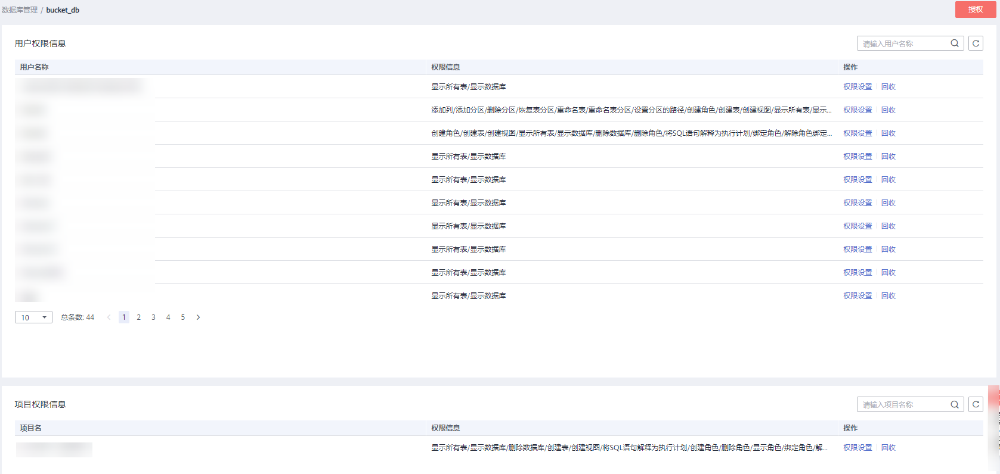
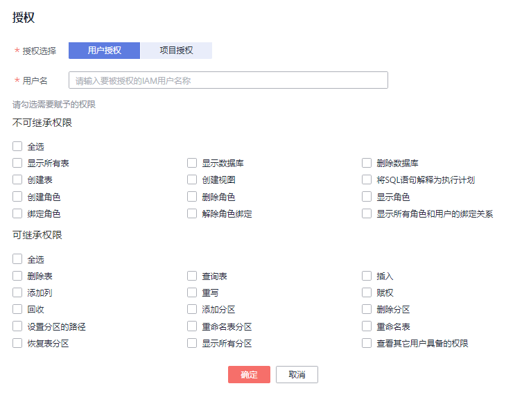

# 数据库权限管理

## 注意事项

-   数据库和表赋权对象具有层级关系，用户赋予上一层级的权限会自动继承到下一层级对象上，层级关系为：数据库\>表\>列。
-   数据库所有者、表所有者、被赋予“赋权权限“的用户都可以对数据库和表赋权。
-   管理员用户和数据库所有者拥有所有数据库权限，不需要再进行赋权和权限回收操作。
-   列只能继承查询权限。“可继承权限“详细信息请参见[数据库权限管理](数据库权限管理.md)。
-   给新用户设置数据库和表权限时，该用户所在用户组的所属区域需具有DLI Service User权限。关于DLI Service User权限的介绍和开通方法，请参见[权限概览](权限概览.md)和[创建用户并授权使用DLI](创建用户并授权使用DLI.md)，更多内容可参考《统一身份认证服务用户指南》中的[创建用户组](https://support.huaweicloud.com/usermanual-iam/zh-cn_topic_0046611269.html)。
-   回收权限时，只能在初始赋权的层级上回收。在哪一层赋权的，在哪一层进行权限回收。赋予权限和回收权限需要在同一层级操作。例如：在数据库上给用户赋予插入权限，那么在数据库下面的表就有了插入权限，回收这个插入权限，只能在数据库上回收，不能在表上回收。

## 查看数据库权限

1.  在SQL作业管理控制台的顶部菜单栏中，选择“数据管理“。
2.  单击所选数据库名称左侧，或“操作”栏中的“权限管理”，将显示该数据库对应的权限信息。

    **图 1**  数据库权限管理  
    

    权限设置有3种场景：为新用户或项目赋予权限、为已有权限的用户或项目修改权限、回收某用户或项目具备的所有权限。

## 为新用户或项目赋予权限

为新用户或新项目赋予权限，新用户或新项目指之前不具备此数据库权限的用户或项目。

1.  在“权限信息“右侧，单击“授权“。
2.  在“授权“弹出框中，选择“用户授权”或“项目授权”，填写用户名，选择相应的权限。具体权限说明请参考[表1](#table88751410195512)。

    **图 2**  数据库用户/项目授权  
    

    **表 1**  参数说明

    
    <table><thead align="left"><tr id="row1387220108558"><th class="cellrowborder" valign="top" width="19.49%" id="mcps1.2.3.1.1">
参数

    </th>
    <th class="cellrowborder" valign="top" width="80.51%" id="mcps1.2.3.1.2">
描述

    </th>
    </tr>
    </thead>
    <tbody><tr id="row108739104559"><td class="cellrowborder" valign="top" width="19.49%" headers="mcps1.2.3.1.1 ">
数据库名称

    </td>
    <td class="cellrowborder" valign="top" width="80.51%" headers="mcps1.2.3.1.2 ">
待设置权限的数据库名称。

    </td>
    </tr>
    <tr id="row3373112565"><td class="cellrowborder" valign="top" width="19.49%" headers="mcps1.2.3.1.1 ">
授权选择

    </td>
    <td class="cellrowborder" valign="top" width="80.51%" headers="mcps1.2.3.1.2 ">
选择“用户授权”或“用户授权”。

    </td>
    </tr>
    <tr id="row10873810105520"><td class="cellrowborder" valign="top" width="19.49%" headers="mcps1.2.3.1.1 ">
用户名/项目名

    </td>
    <td class="cellrowborder" valign="top" width="80.51%" headers="mcps1.2.3.1.2 "><ul id="ul672018215573"><li>选择“用户授权”时，对数据库新增用户，输入对应的IAM用户名称。</li><li>选择“项目授权”时，选择当前区域下需要授权的项目。</li></ul>
    </td>
    </tr>
    <tr id="row12874910135518"><td class="cellrowborder" valign="top" width="19.49%" headers="mcps1.2.3.1.1 ">
不可继承权限

    </td>
    <td class="cellrowborder" valign="top" width="80.51%" headers="mcps1.2.3.1.2 ">
选中权限即对用户进行赋权，取消勾选即对用户权限进行回收。

    
不可继承权限是只作用在当前数据库的权限。不可继承权限有以下类别。

    <ul id="ul3874131035512"><li>删除数据库：删除当前数据库。</li><li>创建表：在当前数据库创建表。</li><li>创建视图：在当前数据库下创建视图。</li><li>将SQL语句解释为执行计划：执行explain语句。</li><li>创建角色：在当前数据库创建角色。</li><li>删除角色：删除当前数据库下的角色。</li><li>显示角色：显示当前用户的角色。</li><li>绑定角色：在当前数据库绑定角色。</li><li>解除角色绑定：在当前数据库解除角色绑定。</li><li>显示所有角色和用户的绑定关系：显示所有角色和用户的绑定关系。</li></ul>
    </td>
    </tr>
    <tr id="row487561075512"><td class="cellrowborder" valign="top" width="19.49%" headers="mcps1.2.3.1.1 ">
可继承权限

    </td>
    <td class="cellrowborder" valign="top" width="80.51%" headers="mcps1.2.3.1.2 ">
选中权限即对用户进行赋权，取消勾选即对用户权限进行回收。

    
可继承权限可作用到当前数据库及其所有的表上，但是表中的列只能继承其中的查询权限。可继承权限有以下类别。

    <ul id="ul14875111065516"><li>删除表：删除数据库下的表。</li><li>查询表：在当前表内查询。</li><li>插入：在当前表内插入数据。</li><li>添加列：在当前表中增加列。</li><li>重写：在当前表内插入覆盖数据。</li><li>数据库的赋权：用户可将数据库的权限赋予其他用户。</li><li>数据库权限的回收：用户可回收其他用户具备的此数据库的权限，并且不能回收数据库所有者的权限。</li><li>在分区表中添加分区：在分区表中添加新的分区。单表分区数最多允许7000个。</li><li>删除分区表的分区：删除分区表中已有的分区。</li><li>设置分区的路径：将分区表中的某个分区路径设置为用户指定的OBS路径。</li><li>重命名表分区：对分区表中的分区重新命名。</li><li>重命名表：对表重新命名。</li><li>恢复表分区：从文件系统中导出分区信息保存到元数据中。</li><li>显示所有分区：显示分区表中的所有分区。</li><li>查看其他用户具备的数据库权限：用户可查看其他用户具备的当前数据库的权限。</li></ul>
    </td>
    </tr>
    </tbody>
    </table>

3.  单击“确定“，完成授权。

## 为已有权限的用户或项目修改权限

某用户或项目已具备此数据库的一些权限时，可为此用户或项目赋予或取消权限。

> **说明：**   
>当“权限设置“中的选项为灰色时，表示对应账号不具备修改此数据库的权限。可以向管理员用户、数据库所有者等具有赋权权限的用户申请“数据库的赋权“和“数据库权限的回收“权限。  

1.  在“用户权限信息“列表中找到需要设置权限的用户：

    -   若用户为子用户，可进行“权限设置”；
    -   若用户为管理员用户，只能查看“权限信息”。

    在“项目权限信息“列表中找到需要设置权限的项目，进行“权限设置”。

2.  在子用户或项目的“操作”栏中单击“权限设置“，可弹出“数据库权限设置“对话框。

    具体权限说明请参考[表2](#table13880181016556)。

    **图 3**  数据库用户权限设置  
    

    **图 4**  数据库项目权限设置  
    

    **表 2**  参数说明

    
    <table><thead align="left"><tr id="row6876141017552"><th class="cellrowborder" valign="top" width="17.71%" id="mcps1.2.3.1.1">
参数

    </th>
    <th class="cellrowborder" valign="top" width="82.28999999999999%" id="mcps1.2.3.1.2">
描述

    </th>
    </tr>
    </thead>
    <tbody><tr id="row1387816108555"><td class="cellrowborder" valign="top" width="17.71%" headers="mcps1.2.3.1.1 ">
数据库名称

    </td>
    <td class="cellrowborder" valign="top" width="82.28999999999999%" headers="mcps1.2.3.1.2 ">
待设置权限的数据库名称。

    </td>
    </tr>
    <tr id="row7878131095510"><td class="cellrowborder" valign="top" width="17.71%" headers="mcps1.2.3.1.1 ">
用户名/项目名

    </td>
    <td class="cellrowborder" valign="top" width="82.28999999999999%" headers="mcps1.2.3.1.2 ">
待设置权限的用户或项目名称。

    </td>
    </tr>
    <tr id="row1687941019557"><td class="cellrowborder" valign="top" width="17.71%" headers="mcps1.2.3.1.1 ">
不可继承权限

    </td>
    <td class="cellrowborder" valign="top" width="82.28999999999999%" headers="mcps1.2.3.1.2 ">
选中权限即对用户进行赋权，取消勾选即对用户权限进行回收。

    
不可继承权限是只作用在当前数据库的权限。不可继承权限有以下类别。

    <ul id="ul88796102555"><li>删除数据库：删除当前数据库。</li><li>创建表：在当前数据库创建表。</li><li>创建视图：在当前数据库下创建视图。</li><li>将SQL语句解释为执行计划：执行explain语句。</li><li>创建角色：在当前数据库创建角色。</li><li>删除角色：删除当前数据库下的角色。</li><li>显示角色：显示当前用户的角色。</li><li>绑定角色：在当前数据库绑定角色。</li><li>解除角色绑定：在当前数据库解除角色绑定。</li><li>显示所有角色和用户的绑定关系：显示所有角色和用户的绑定关系。</li></ul>
    </td>
    </tr>
    <tr id="row1988011075514"><td class="cellrowborder" valign="top" width="17.71%" headers="mcps1.2.3.1.1 ">
可继承权限

    </td>
    <td class="cellrowborder" valign="top" width="82.28999999999999%" headers="mcps1.2.3.1.2 ">
选中权限即对用户进行赋权，取消勾选即对用户权限进行回收。

    
可继承权限可作用到当前数据库及其所有的表上，但是表中的列只能继承其中的查询权限。可继承权限有以下类别。

    <ul id="ul1288041035514"><li>删除表：删除数据库下的表。</li><li>查询表：在当前表内查询。</li><li>插入：在当前表内插入数据。</li><li>添加列：在当前表中增加列。</li><li>重写：在当前表内插入覆盖数据。</li><li>数据库的赋权：用户可将数据库的权限赋予其他用户。</li><li>数据库权限的回收：用户可回收其他用户具备的此数据库的权限，并且不能回收数据库所有者的权限。</li><li>在分区表中添加分区：在分区表中添加新的分区。单表分区数最多允许7000个。</li><li>删除分区表的分区：删除分区表中已有的分区。</li><li>设置分区的路径：将分区表中的某个分区路径设置为用户指定的OBS路径。</li><li>重命名表分区：对分区表中的分区重新命名。</li><li>重命名表：对表重新命名。</li><li>恢复表分区：从文件系统中导出分区信息保存到元数据中。</li><li>显示所有分区：显示分区表中的所有分区。</li><li>查看其他用户具备的数据库权限：用户可查看其他用户具备的当前数据库的权限。</li></ul>
    </td>
    </tr>
    </tbody>
    </table>

3.  单击“确定“，完成权限设置。

## 回收某用户或项目具备的所有权限

回收某用户具备的所有权限，或回收某项目具备的所有权限。

-   在“用户权限信息“区域的用户列表中，选择需要回收权限的子用户，在“操作“栏中单击“回收用户权限“，确定后，此用户将不具备数据库的任意权限。

    > **说明：**   
    >用户为管理员用户时，“回收用户权限”为灰色，表示不可回收该用户的权限。  

-   在“项目权限信息“区域的项目列表中，选择需要回收权限的项目，在“操作“栏中单击“回收项目权限“，确定后，此项目将不具备数据库的任意权限。

