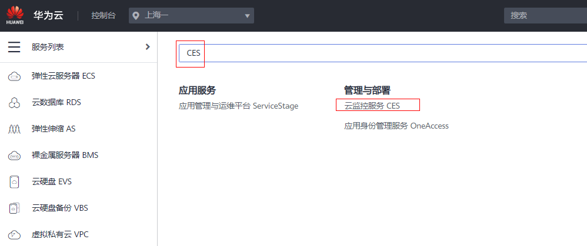
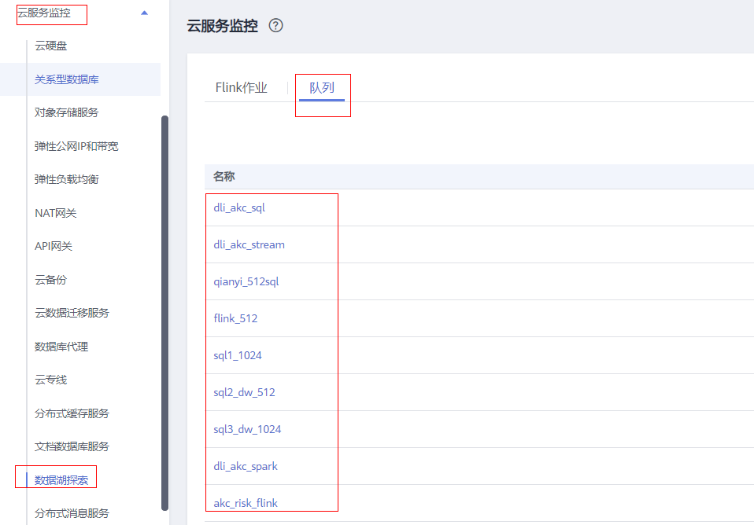
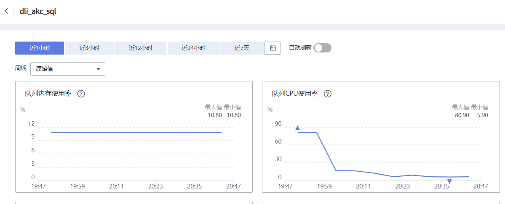

# 数据湖探索监控指标说明

## 功能说明

本章节定义了数据湖探索服务上报云监控的监控指标的命名空间，监控指标列表和维度定义，用户可以通过云监控服务提供的管理控制台或API接口来检索数据湖探索服务产生的监控指标和告警信息。

## 命名空间

SYS.DLI

## 监控指标

**表 1**  数据湖探索监控指标

<table><thead align="left"><tr id="row365473774712"><th class="cellrowborder" valign="top" width="17.580000000000002%" id="mcps1.2.7.1.1">
<strong id="b165443724715">指标ID</strong>

</th>
<th class="cellrowborder" valign="top" width="14.48%" id="mcps1.2.7.1.2">
<strong id="b7654037134718">指标名称</strong>

</th>
<th class="cellrowborder" valign="top" width="16.53%" id="mcps1.2.7.1.3">
<strong id="b9654123716472">含义</strong>

</th>
<th class="cellrowborder" valign="top" width="10.59%" id="mcps1.2.7.1.4">
<strong id="b1665443717479">取值范围</strong>

</th>
<th class="cellrowborder" valign="top" width="18.58%" id="mcps1.2.7.1.5">
<strong id="b176551537124713">测量对象&amp;维度</strong>

</th>
<th class="cellrowborder" valign="top" width="22.24%" id="mcps1.2.7.1.6">
<strong id="b166551437114714">监控周期（原始指标）</strong>

</th>
</tr>
</thead>
<tbody><tr id="row112641837173515"><td class="cellrowborder" valign="top" width="17.580000000000002%" headers="mcps1.2.7.1.1 ">
queue_cu_num

</td>
<td class="cellrowborder" valign="top" width="14.48%" headers="mcps1.2.7.1.2 ">
队列CU使用量

</td>
<td class="cellrowborder" valign="top" width="16.53%" headers="mcps1.2.7.1.3 ">
展示用户队列申请的CU数

</td>
<td class="cellrowborder" valign="top" width="10.59%" headers="mcps1.2.7.1.4 ">
≥0

</td>
<td class="cellrowborder" valign="top" width="18.58%" headers="mcps1.2.7.1.5 ">
测量对象：队列

测量维度：queue_id

</td>
<td class="cellrowborder" valign="top" width="22.24%" headers="mcps1.2.7.1.6 ">
5分钟

</td>
</tr>
<tr id="row2655163724717"><td class="cellrowborder" valign="top" width="17.580000000000002%" headers="mcps1.2.7.1.1 ">
queue_job_launching_num

</td>
<td class="cellrowborder" valign="top" width="14.48%" headers="mcps1.2.7.1.2 ">
提交中作业数

</td>
<td class="cellrowborder" valign="top" width="16.53%" headers="mcps1.2.7.1.3 ">
展示用户队列中状态为提交中的作业数。

</td>
<td class="cellrowborder" valign="top" width="10.59%" headers="mcps1.2.7.1.4 ">
≥0

</td>
<td class="cellrowborder" valign="top" width="18.58%" headers="mcps1.2.7.1.5 ">
测量对象：队列

测量维度：queue_id

</td>
<td class="cellrowborder" valign="top" width="22.24%" headers="mcps1.2.7.1.6 ">
5分钟

</td>
</tr>
<tr id="row26553372477"><td class="cellrowborder" valign="top" width="17.580000000000002%" headers="mcps1.2.7.1.1 ">
queue_job_running_num

</td>
<td class="cellrowborder" valign="top" width="14.48%" headers="mcps1.2.7.1.2 ">
运行中作业数

</td>
<td class="cellrowborder" valign="top" width="16.53%" headers="mcps1.2.7.1.3 ">
展示用户队列中状态为运行中的作业数。

</td>
<td class="cellrowborder" valign="top" width="10.59%" headers="mcps1.2.7.1.4 ">
≥0

</td>
<td class="cellrowborder" valign="top" width="18.58%" headers="mcps1.2.7.1.5 ">
测量对象：队列

测量维度：queue_id

</td>
<td class="cellrowborder" valign="top" width="22.24%" headers="mcps1.2.7.1.6 ">
5分钟

</td>
</tr>
<tr id="row065519376479"><td class="cellrowborder" valign="top" width="17.580000000000002%" headers="mcps1.2.7.1.1 ">
queue_job_succeed_num

</td>
<td class="cellrowborder" valign="top" width="14.48%" headers="mcps1.2.7.1.2 ">
已完成作业数

</td>
<td class="cellrowborder" valign="top" width="16.53%" headers="mcps1.2.7.1.3 ">
展示用户队列中状态为已完成的作业数。

</td>
<td class="cellrowborder" valign="top" width="10.59%" headers="mcps1.2.7.1.4 ">
≥0

</td>
<td class="cellrowborder" valign="top" width="18.58%" headers="mcps1.2.7.1.5 ">
测量对象：队列

测量维度：queue_id

</td>
<td class="cellrowborder" valign="top" width="22.24%" headers="mcps1.2.7.1.6 ">
5分钟

</td>
</tr>
<tr id="row1628165954414"><td class="cellrowborder" valign="top" width="17.580000000000002%" headers="mcps1.2.7.1.1 ">
queue_job_failed_num

</td>
<td class="cellrowborder" valign="top" width="14.48%" headers="mcps1.2.7.1.2 ">
已失败作业数

</td>
<td class="cellrowborder" valign="top" width="16.53%" headers="mcps1.2.7.1.3 ">
展示用户队列中状态为已失败的作业数。

</td>
<td class="cellrowborder" valign="top" width="10.59%" headers="mcps1.2.7.1.4 ">
≥0

</td>
<td class="cellrowborder" valign="top" width="18.58%" headers="mcps1.2.7.1.5 ">
测量对象：队列

测量维度：queue_id

</td>
<td class="cellrowborder" valign="top" width="22.24%" headers="mcps1.2.7.1.6 ">
5分钟

</td>
</tr>
<tr id="row2291459104414"><td class="cellrowborder" valign="top" width="17.580000000000002%" headers="mcps1.2.7.1.1 ">
queue_job_cancelled_num

</td>
<td class="cellrowborder" valign="top" width="14.48%" headers="mcps1.2.7.1.2 ">
已取消作业数

</td>
<td class="cellrowborder" valign="top" width="16.53%" headers="mcps1.2.7.1.3 ">
展示用户队列中状态为已取消的作业数。

</td>
<td class="cellrowborder" valign="top" width="10.59%" headers="mcps1.2.7.1.4 ">
≥0

</td>
<td class="cellrowborder" valign="top" width="18.58%" headers="mcps1.2.7.1.5 ">
测量对象：队列

测量维度：queue_id

</td>
<td class="cellrowborder" valign="top" width="22.24%" headers="mcps1.2.7.1.6 ">
5分钟

</td>
</tr>
<tr id="row43035910446"><td class="cellrowborder" valign="top" width="17.580000000000002%" headers="mcps1.2.7.1.1 ">
queue_cpu_usage

</td>
<td class="cellrowborder" valign="top" width="14.48%" headers="mcps1.2.7.1.2 ">
队列CPU使用率

</td>
<td class="cellrowborder" valign="top" width="16.53%" headers="mcps1.2.7.1.3 ">
展示用户队列的CPU使用率。

</td>
<td class="cellrowborder" valign="top" width="10.59%" headers="mcps1.2.7.1.4 ">
0~100

</td>
<td class="cellrowborder" valign="top" width="18.58%" headers="mcps1.2.7.1.5 ">
测量对象：队列

测量维度：queue_id

</td>
<td class="cellrowborder" valign="top" width="22.24%" headers="mcps1.2.7.1.6 ">
5分钟

</td>
</tr>
<tr id="row150019844719"><td class="cellrowborder" valign="top" width="17.580000000000002%" headers="mcps1.2.7.1.1 ">
queue_disk_usage

</td>
<td class="cellrowborder" valign="top" width="14.48%" headers="mcps1.2.7.1.2 ">
队列磁盘使用率

</td>
<td class="cellrowborder" valign="top" width="16.53%" headers="mcps1.2.7.1.3 ">
展示用户队列的磁盘使用率。

</td>
<td class="cellrowborder" valign="top" width="10.59%" headers="mcps1.2.7.1.4 ">
0~100

</td>
<td class="cellrowborder" valign="top" width="18.58%" headers="mcps1.2.7.1.5 ">
测量对象：队列

测量维度：queue_id

</td>
<td class="cellrowborder" valign="top" width="22.24%" headers="mcps1.2.7.1.6 ">
5分钟

</td>
</tr>
<tr id="row45004813472"><td class="cellrowborder" valign="top" width="17.580000000000002%" headers="mcps1.2.7.1.1 ">
queue_mem_usage

</td>
<td class="cellrowborder" valign="top" width="14.48%" headers="mcps1.2.7.1.2 ">
队列内存使用率

</td>
<td class="cellrowborder" valign="top" width="16.53%" headers="mcps1.2.7.1.3 ">
展示用户队列的内存使用率。

</td>
<td class="cellrowborder" valign="top" width="10.59%" headers="mcps1.2.7.1.4 ">
0~100

</td>
<td class="cellrowborder" valign="top" width="18.58%" headers="mcps1.2.7.1.5 ">
测量对象：队列

测量维度：queue_id

</td>
<td class="cellrowborder" valign="top" width="22.24%" headers="mcps1.2.7.1.6 ">
5分钟

</td>
</tr>
<tr id="row1550120819479"><td class="cellrowborder" valign="top" width="17.580000000000002%" headers="mcps1.2.7.1.1 ">
flink_read_records_per_second

</td>
<td class="cellrowborder" valign="top" width="14.48%" headers="mcps1.2.7.1.2 ">
Flink作业数据输入速率

</td>
<td class="cellrowborder" valign="top" width="16.53%" headers="mcps1.2.7.1.3 ">
展示用户Flink作业的数据输入速率，供监控和调试使用。

</td>
<td class="cellrowborder" valign="top" width="10.59%" headers="mcps1.2.7.1.4 ">
≥0

</td>
<td class="cellrowborder" valign="top" width="18.58%" headers="mcps1.2.7.1.5 ">
测量对象：Flink作业

测量维度：flink_job_id

</td>
<td class="cellrowborder" valign="top" width="22.24%" headers="mcps1.2.7.1.6 ">
10秒钟

</td>
</tr>
<tr id="row45011820477"><td class="cellrowborder" valign="top" width="17.580000000000002%" headers="mcps1.2.7.1.1 ">
flink_write_records_per_second

</td>
<td class="cellrowborder" valign="top" width="14.48%" headers="mcps1.2.7.1.2 ">
Flink作业数据输出速率

</td>
<td class="cellrowborder" valign="top" width="16.53%" headers="mcps1.2.7.1.3 ">
展示用户Flink作业的数据输出速率，供监控和调试使用。

</td>
<td class="cellrowborder" valign="top" width="10.59%" headers="mcps1.2.7.1.4 ">
≥0

</td>
<td class="cellrowborder" valign="top" width="18.58%" headers="mcps1.2.7.1.5 ">
测量对象：Flink作业

测量维度：flink_job_id

</td>
<td class="cellrowborder" valign="top" width="22.24%" headers="mcps1.2.7.1.6 ">
10秒钟

</td>
</tr>
<tr id="row4502128194718"><td class="cellrowborder" valign="top" width="17.580000000000002%" headers="mcps1.2.7.1.1 ">
flink_read_records_total

</td>
<td class="cellrowborder" valign="top" width="14.48%" headers="mcps1.2.7.1.2 ">
Flink作业数据输入总数

</td>
<td class="cellrowborder" valign="top" width="16.53%" headers="mcps1.2.7.1.3 ">
展示用户Flink作业的数据输入总数，供监控和调试使用。

</td>
<td class="cellrowborder" valign="top" width="10.59%" headers="mcps1.2.7.1.4 ">
≥0

</td>
<td class="cellrowborder" valign="top" width="18.58%" headers="mcps1.2.7.1.5 ">
测量对象：Flink作业

测量维度：flink_job_id

</td>
<td class="cellrowborder" valign="top" width="22.24%" headers="mcps1.2.7.1.6 ">
10秒钟

</td>
</tr>
<tr id="row1450311834711"><td class="cellrowborder" valign="top" width="17.580000000000002%" headers="mcps1.2.7.1.1 ">
flink_write_records_total

</td>
<td class="cellrowborder" valign="top" width="14.48%" headers="mcps1.2.7.1.2 ">
Flink作业数据输出总数

</td>
<td class="cellrowborder" valign="top" width="16.53%" headers="mcps1.2.7.1.3 ">
展示用户Flink作业的数据输出总数，供监控和调试使用。

</td>
<td class="cellrowborder" valign="top" width="10.59%" headers="mcps1.2.7.1.4 ">
≥0

</td>
<td class="cellrowborder" valign="top" width="18.58%" headers="mcps1.2.7.1.5 ">
测量对象：Flink作业

测量维度：flink_job_id

</td>
<td class="cellrowborder" valign="top" width="22.24%" headers="mcps1.2.7.1.6 ">
10秒钟

</td>
</tr>
<tr id="row171211525115212"><td class="cellrowborder" valign="top" width="17.580000000000002%" headers="mcps1.2.7.1.1 ">
flink_read_bytes_per_second

</td>
<td class="cellrowborder" valign="top" width="14.48%" headers="mcps1.2.7.1.2 ">
Flink作业字节输入速率

</td>
<td class="cellrowborder" valign="top" width="16.53%" headers="mcps1.2.7.1.3 ">
展示用户Flink作业每秒输入的字节数。

</td>
<td class="cellrowborder" valign="top" width="10.59%" headers="mcps1.2.7.1.4 ">
≥0

</td>
<td class="cellrowborder" valign="top" width="18.58%" headers="mcps1.2.7.1.5 ">
测量对象：Flink作业

测量维度：flink_job_id

</td>
<td class="cellrowborder" valign="top" width="22.24%" headers="mcps1.2.7.1.6 ">
10秒钟

</td>
</tr>
<tr id="row61221925135213"><td class="cellrowborder" valign="top" width="17.580000000000002%" headers="mcps1.2.7.1.1 ">
flink_write_bytes_per_second

</td>
<td class="cellrowborder" valign="top" width="14.48%" headers="mcps1.2.7.1.2 ">
Flink作业字节输出速率

</td>
<td class="cellrowborder" valign="top" width="16.53%" headers="mcps1.2.7.1.3 ">
展示用户Flink作业每秒输出的字节数。

</td>
<td class="cellrowborder" valign="top" width="10.59%" headers="mcps1.2.7.1.4 ">
≥0

</td>
<td class="cellrowborder" valign="top" width="18.58%" headers="mcps1.2.7.1.5 ">
测量对象：Flink作业

测量维度：flink_job_id

</td>
<td class="cellrowborder" valign="top" width="22.24%" headers="mcps1.2.7.1.6 ">
10秒钟

</td>
</tr>
<tr id="row1123112518529"><td class="cellrowborder" valign="top" width="17.580000000000002%" headers="mcps1.2.7.1.1 ">
flink_read_bytes_total

</td>
<td class="cellrowborder" valign="top" width="14.48%" headers="mcps1.2.7.1.2 ">
Flink作业字节输入总数

</td>
<td class="cellrowborder" valign="top" width="16.53%" headers="mcps1.2.7.1.3 ">
展示用户Flink作业字节的输入总数。

</td>
<td class="cellrowborder" valign="top" width="10.59%" headers="mcps1.2.7.1.4 ">
≥0

</td>
<td class="cellrowborder" valign="top" width="18.58%" headers="mcps1.2.7.1.5 ">
测量对象：Flink作业

测量维度：flink_job_id

</td>
<td class="cellrowborder" valign="top" width="22.24%" headers="mcps1.2.7.1.6 ">
10秒钟

</td>
</tr>
<tr id="row16123625185219"><td class="cellrowborder" valign="top" width="17.580000000000002%" headers="mcps1.2.7.1.1 ">
flink_write_bytes_total

</td>
<td class="cellrowborder" valign="top" width="14.48%" headers="mcps1.2.7.1.2 ">
Flink作业字节输出总数

</td>
<td class="cellrowborder" valign="top" width="16.53%" headers="mcps1.2.7.1.3 ">
展示用户Flink作业字节的输出总数。

</td>
<td class="cellrowborder" valign="top" width="10.59%" headers="mcps1.2.7.1.4 ">
≥0

</td>
<td class="cellrowborder" valign="top" width="18.58%" headers="mcps1.2.7.1.5 ">
测量对象：Flink作业

测量维度：flink_job_id

</td>
<td class="cellrowborder" valign="top" width="22.24%" headers="mcps1.2.7.1.6 ">
10秒钟

</td>
</tr>
<tr id="row151541195513"><td class="cellrowborder" valign="top" width="17.580000000000002%" headers="mcps1.2.7.1.1 ">
flink_cpu_usage

</td>
<td class="cellrowborder" valign="top" width="14.48%" headers="mcps1.2.7.1.2 ">
Flink作业CPU使用率

</td>
<td class="cellrowborder" valign="top" width="16.53%" headers="mcps1.2.7.1.3 ">
展示用户Flink作业的CPU使用率。

</td>
<td class="cellrowborder" valign="top" width="10.59%" headers="mcps1.2.7.1.4 ">
0~100

</td>
<td class="cellrowborder" valign="top" width="18.58%" headers="mcps1.2.7.1.5 ">
测量对象：Flink作业

测量维度：flink_job_id

</td>
<td class="cellrowborder" valign="top" width="22.24%" headers="mcps1.2.7.1.6 ">
10秒钟

</td>
</tr>
<tr id="row916911145517"><td class="cellrowborder" valign="top" width="17.580000000000002%" headers="mcps1.2.7.1.1 ">
flink_mem_usage

</td>
<td class="cellrowborder" valign="top" width="14.48%" headers="mcps1.2.7.1.2 ">
Flink作业内存使用率

</td>
<td class="cellrowborder" valign="top" width="16.53%" headers="mcps1.2.7.1.3 ">
展示用户Flink作业的内存使用率。

</td>
<td class="cellrowborder" valign="top" width="10.59%" headers="mcps1.2.7.1.4 ">
0~100

</td>
<td class="cellrowborder" valign="top" width="18.58%" headers="mcps1.2.7.1.5 ">
测量对象：Flink作业

测量维度：flink_job_id

</td>
<td class="cellrowborder" valign="top" width="22.24%" headers="mcps1.2.7.1.6 ">
10秒钟

</td>
</tr>
<tr id="row41619113559"><td class="cellrowborder" valign="top" width="17.580000000000002%" headers="mcps1.2.7.1.1 ">
flink_max_op_latency

</td>
<td class="cellrowborder" valign="top" width="14.48%" headers="mcps1.2.7.1.2 ">
Flink作业最大算子延迟

</td>
<td class="cellrowborder" valign="top" width="16.53%" headers="mcps1.2.7.1.3 ">
展示用户Flink作业的最大算子延迟时间，单位ms。

</td>
<td class="cellrowborder" valign="top" width="10.59%" headers="mcps1.2.7.1.4 ">
≥0

</td>
<td class="cellrowborder" valign="top" width="18.58%" headers="mcps1.2.7.1.5 ">
测量对象：Flink作业

测量维度：flink_job_id

</td>
<td class="cellrowborder" valign="top" width="22.24%" headers="mcps1.2.7.1.6 ">
10秒钟

</td>
</tr>
<tr id="row141771111556"><td class="cellrowborder" valign="top" width="17.580000000000002%" headers="mcps1.2.7.1.1 ">
flink_max_op_backpressure_level

</td>
<td class="cellrowborder" valign="top" width="14.48%" headers="mcps1.2.7.1.2 ">
Flink作业最大算子反压

</td>
<td class="cellrowborder" valign="top" width="16.53%" headers="mcps1.2.7.1.3 ">
展示用户Flink作业的最大算子反压值，数值越大，反压越严重。

0：表示OK

50：表示Low

100：表示High

</td>
<td class="cellrowborder" valign="top" width="10.59%" headers="mcps1.2.7.1.4 ">
0~100

</td>
<td class="cellrowborder" valign="top" width="18.58%" headers="mcps1.2.7.1.5 ">
测量对象：Flink作业

测量维度：flink_job_id

</td>
<td class="cellrowborder" valign="top" width="22.24%" headers="mcps1.2.7.1.6 ">
10秒钟

</td>
</tr>
</tbody>
</table>

## 维度

**表 2**  维度

<table><thead align="left"><tr id="row45471830141315"><th class="cellrowborder" valign="top" width="50%" id="mcps1.2.3.1.1">
Key

</th>
<th class="cellrowborder" valign="top" width="50%" id="mcps1.2.3.1.2">
Value

</th>
</tr>
</thead>
<tbody><tr id="row125472030181314"><td class="cellrowborder" valign="top" width="50%" headers="mcps1.2.3.1.1 ">
queue_id

</td>
<td class="cellrowborder" valign="top" width="50%" headers="mcps1.2.3.1.2 ">
队列

</td>
</tr>
<tr id="row112033141738"><td class="cellrowborder" valign="top" width="50%" headers="mcps1.2.3.1.1 ">
flink_job_id

</td>
<td class="cellrowborder" valign="top" width="50%" headers="mcps1.2.3.1.2 ">
Flink作业

</td>
</tr>
</tbody>
</table>

## 通过云监控服务CES查看DLI监控指标

1.  在控制台搜索“云监控服务 CES”。

    **图 1**  搜索CES  
    

2.  进入CES后，在页面左侧“云服务监控”列表中，单击“数据湖探索”。

    **图 2**  云服务监控  
    

3.  选择队列进行查看。

    **图 3**  查看队列负载  
    

