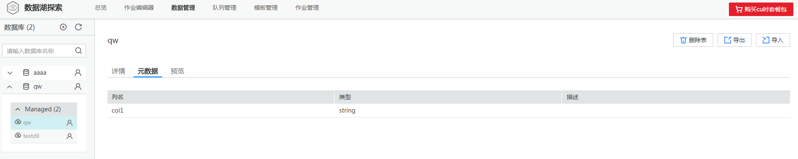

# 查看元数据

## 操作场景

-   元数据（Metadata）是用来定义数据类型的数据。主要是描述数据自身信息，包含源、大小、格式或其它数据特征。数据库字段中，元数据用于诠释数据仓库的内容。
-   创建表时，会定义元数据，由列名、类型、描述三列组成。

## 操作步骤

1.  查看元数据的入口有两个，分别在“数据管理“和“作业编辑器“页面。
    -   在“数据管理“页面查看元数据。
        1.  在DLI管理控制台的顶部菜单栏中，选择“数据管理“。
        2.  在“数据管理“页面，单击对应数据库的 ，可展开该数据库下的表列表。
        3.  选中目标表，切换到“元数据“页面，即可查看该表元数据信息。

            **图 1**  查看元数据-数据管理页面  
            

    -   在“作业编辑器“页面查看元数据。
        1.  在DLI管理控制台的顶部菜单栏中，选择“作业编辑器“。
        2.  在“作业编辑器“页面的左侧导航栏中，单击选择数据库，单击对应数据库名，将展开该数据库下的表列表。
        3.  单击目标表右侧的，即可查看该表的元数据信息。

            **图 2**  查看元数据-作业编辑器页面  
            

2.  “元数据“页面显示目标表的列名、类型和描述。

