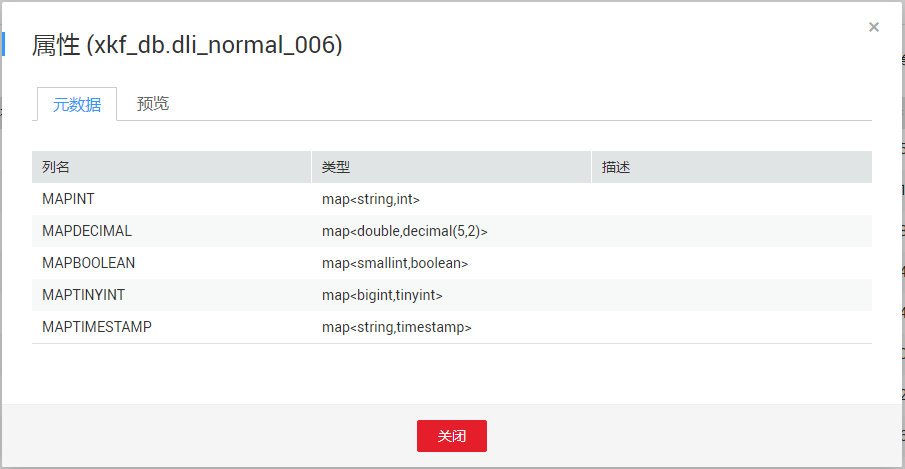

# 查看元数据

## 操作场景

-   元数据（Metadata）是用来定义数据类型的数据。主要是描述数据自身信息，包含源、大小、格式或其它数据特征。数据库字段中，元数据用于诠释数据仓库的内容。
-   创建表时，会定义元数据，由列名、类型、描述三列组成。

## 操作步骤

查看元数据的入口有两个，分别在“数据管理“和“作业编辑器“页面。

-   在“数据管理“页面查看元数据。
    1.  在SQL作业管理控制台的顶部菜单栏中，选择“数据管理“。
    2.  在“数据管理“页面，单击需导出数据对应数据库名称，进入该数据库“表管理”页面。
    3.  选中目标表，单击“操作”栏中的“更多“，选择“属性“。

-   在“作业编辑器“页面查看元数据。
    1.  在SQL作业管理控制台的顶部菜单栏中，选择“作业编辑器“。
    2.  在“作业编辑器“页面的左侧导航栏中，单击选择数据库。
    3.  单击对应数据库名，将展开该数据库下的表列表。
    4.  鼠标右键单击对应表名，或者鼠标左键单击对应表右侧的，在列表菜单中选择“属性”，即可查看该表的元数据信息。

**图 1**  查看元数据  

“元数据“页面显示目标表的列名、类型和描述。

