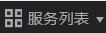
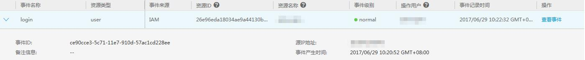
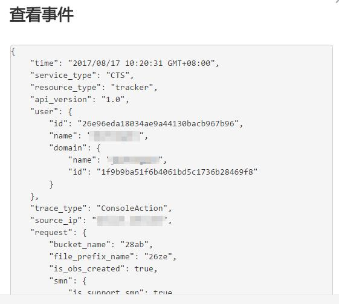

# 查看审计日志

## **操作场景**

在您开启了云审计服务后，系统开始记录云服务资源的操作。云审计服务管理控制台保存最近7天的操作记录。

本节介绍如何在云审计服务管理控制台查看最近7天的操作记录。

## **操作步骤**

1.  登录管理控制台。
2.  在管理控制台左上角单击图标，选择区域和项目。
3.  单击，选择“管理与部署 \> 云审计服务”，进入云审计服务信息页面。
4.  单击左侧导航树的“事件列表”，进入事件列表信息页面。
5.  事件列表支持通过筛选来查询对应的操作事件。当前事件列表支持四个维度的组合查询，详细信息如下：
    -   事件来源、资源类型和筛选类型。

        在下拉框中选择查询条件。

        其中筛选类型选择事件名称时，还需选择某个具体的事件名称。

        选择资源ID时，还需选择或者手动输入某个具体的资源ID。

        选择资源名称时，还需选择或手动输入某个具体的资源名称。

    -   操作用户：在下拉框中选择某一具体的操作用户，此操作用户指用户级别，而非租户级别。
    -   事件级别：可选项为“所有事件级别”、“normal”、“warning”、“incident”，只可选择其中一项。
    -   起始时间、结束时间：可通过选择时间段查询操作事件。

6.  在需要查看的记录左侧，单击展开该记录的详细信息，展开记录如[图1](#fig4604151818493)所示。

    **图 1**  展开记录  
    

7.  在需要查看的记录右侧，单击“查看事件”，弹出一个窗口，如[图2](#fig225942617510)所示，显示了该操作事件结构的详细信息。

    **图 2**  查看事件  
    

    关于云审计服务事件结构的关键字段详解，请参见《云审计服务用户指南》中的[事件结构](https://support.huaweicloud.com/usermanual-cts/zh-cn_topic_0030598500.html)和[事件样例](https://support.huaweicloud.com/usermanual-cts/zh-cn_topic_0044019595.html)。

