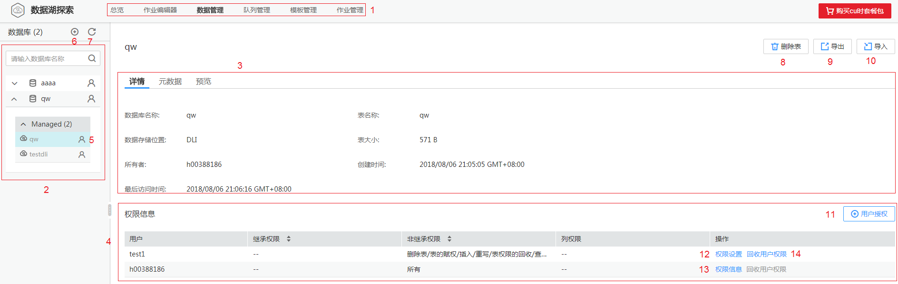

# 概述

## DLI表和OBS表的介绍

DLI表的数据存储在DLI服务内部，查询性能更好，适用于对时延敏感类的业务，如交互类的查询等；OBS表的数据存储在OBS上，适用于对时延不敏感的业务，如历史数据统计分析等。

## 界面说明

介绍“数据管理“页面中的区域、图标和按键功能。

**图 1**  数据管理页面  

**表 1**  区域说明

<table><thead align="left"><tr id="row1036345517655"><th class="cellrowborder" valign="top" width="7.5200000000000005%" id="mcps1.2.4.1.1">
序号

</th>
<th class="cellrowborder" valign="top" width="17.57%" id="mcps1.2.4.1.2">
区域

</th>
<th class="cellrowborder" valign="top" width="74.91%" id="mcps1.2.4.1.3">
描述

</th>
</tr>
</thead>
<tbody><tr id="row784562017655"><td class="cellrowborder" valign="top" width="7.5200000000000005%" headers="mcps1.2.4.1.1 ">
1

</td>
<td class="cellrowborder" valign="top" width="17.57%" headers="mcps1.2.4.1.2 ">
菜单栏

</td>
<td class="cellrowborder" valign="top" width="74.91%" headers="mcps1.2.4.1.3 ">
SQL作业的菜单栏，包括总览、作业编辑器、数据管理、队列管理、模板管理和作业管理。

</td>
</tr>
<tr id="row2353099317655"><td class="cellrowborder" valign="top" width="7.5200000000000005%" headers="mcps1.2.4.1.1 ">
2

</td>
<td class="cellrowborder" valign="top" width="17.57%" headers="mcps1.2.4.1.2 ">
数据库列表

</td>
<td class="cellrowborder" valign="top" width="74.91%" headers="mcps1.2.4.1.3 ">
已创建的数据库及数据库的表/视图列表。

</td>
</tr>
<tr id="row5973810617655"><td class="cellrowborder" valign="top" width="7.5200000000000005%" headers="mcps1.2.4.1.1 ">
3

</td>
<td class="cellrowborder" valign="top" width="17.57%" headers="mcps1.2.4.1.2 ">
数据库/表/视图详情

</td>
<td class="cellrowborder" valign="top" width="74.91%" headers="mcps1.2.4.1.3 ">
显示数据库/表/视图详细信息。

<ul id="ul10947161719492"><li>鼠标单击数据库名时，显示“数据库名称”、“所有者”、“描述”和“表数量”。</li><li>鼠标单击表/视图名时，包含以下三个页签。<ul id="ul19542132744915"><li>详情：显示“数据库名称”、“表名称”、“数据存储位置”、“表大小”、“所有者”、“创建时间”和“最后访问时间”。
 NOTE: 

视图没有“数据存储位置”和“表大小”信息。

</li><li>元数据：显示对应表/视图的“列名”、“类型”和“描述”。</li><li>预览：显示对应表/视图的具体内容。</li></ul>
</li></ul>
</td>
</tr>
<tr id="row7717485113422"><td class="cellrowborder" valign="top" width="7.5200000000000005%" headers="mcps1.2.4.1.1 ">
4

</td>
<td class="cellrowborder" valign="top" width="17.57%" headers="mcps1.2.4.1.2 ">
权限信息

</td>
<td class="cellrowborder" valign="top" width="74.91%" headers="mcps1.2.4.1.3 ">
显示用户列表，相关权限信息及操作。

</td>
</tr>
</tbody>
</table>

**表 2**  图标说明

<table><thead align="left"><tr id="row5083125514343"><th class="cellrowborder" valign="top" width="8%" id="mcps1.2.4.1.1">
序号

</th>
<th class="cellrowborder" valign="top" width="21%" id="mcps1.2.4.1.2">
图标

</th>
<th class="cellrowborder" valign="top" width="71%" id="mcps1.2.4.1.3">
描述

</th>
</tr>
</thead>
<tbody><tr id="row1228456214343"><td class="cellrowborder" valign="top" width="8%" headers="mcps1.2.4.1.1 ">
5

</td>
<td class="cellrowborder" valign="top" width="21%" headers="mcps1.2.4.1.2 ">

</td>
<td class="cellrowborder" valign="top" width="71%" headers="mcps1.2.4.1.3 ">
当前用户所具有的表权限，包括以下4种情况：

：表示用户是当前表的所有者。

：当前子用户具备当前表的赋权或者回收权限。

：当前子用户具备当前表的某种权限。

：当前子用户不具备当前表的任何权限。

</td>
</tr>
<tr id="row1142758214343"><td class="cellrowborder" valign="top" width="8%" headers="mcps1.2.4.1.1 ">
6

</td>
<td class="cellrowborder" valign="top" width="21%" headers="mcps1.2.4.1.2 ">

</td>
<td class="cellrowborder" valign="top" width="71%" headers="mcps1.2.4.1.3 ">
创建数据库。

</td>
</tr>
<tr id="row771839414343"><td class="cellrowborder" valign="top" width="8%" headers="mcps1.2.4.1.1 ">
7

</td>
<td class="cellrowborder" valign="top" width="21%" headers="mcps1.2.4.1.2 ">

</td>
<td class="cellrowborder" valign="top" width="71%" headers="mcps1.2.4.1.3 ">
刷新数据库、表、视图列表。

</td>
</tr>
</tbody>
</table>

**表 3**  按键说明

<table><thead align="left"><tr id="row2857873111248"><th class="cellrowborder" valign="top" width="7.5200000000000005%" id="mcps1.2.4.1.1">
序号

</th>
<th class="cellrowborder" valign="top" width="20.8%" id="mcps1.2.4.1.2">
按键

</th>
<th class="cellrowborder" valign="top" width="71.67999999999999%" id="mcps1.2.4.1.3">
描述

</th>
</tr>
</thead>
<tbody><tr id="row3282441811248"><td class="cellrowborder" valign="top" width="7.5200000000000005%" headers="mcps1.2.4.1.1 ">
8

</td>
<td class="cellrowborder" valign="top" width="20.8%" headers="mcps1.2.4.1.2 ">
删除表

</td>
<td class="cellrowborder" valign="top" width="71.67999999999999%" headers="mcps1.2.4.1.3 ">
删除已存在表。

</td>
</tr>
<tr id="row1090021711248"><td class="cellrowborder" valign="top" width="7.5200000000000005%" headers="mcps1.2.4.1.1 ">
9

</td>
<td class="cellrowborder" valign="top" width="20.8%" headers="mcps1.2.4.1.2 ">
导出

</td>
<td class="cellrowborder" valign="top" width="71.67999999999999%" headers="mcps1.2.4.1.3 ">
将DLI表的数据导出至OBS。

</td>
</tr>
<tr id="row581111811248"><td class="cellrowborder" valign="top" width="7.5200000000000005%" headers="mcps1.2.4.1.1 ">
10

</td>
<td class="cellrowborder" valign="top" width="20.8%" headers="mcps1.2.4.1.2 ">
导入

</td>
<td class="cellrowborder" valign="top" width="71.67999999999999%" headers="mcps1.2.4.1.3 ">
向DLI表导入数据。

</td>
</tr>
<tr id="row1312401611248"><td class="cellrowborder" valign="top" width="7.5200000000000005%" headers="mcps1.2.4.1.1 ">
11

</td>
<td class="cellrowborder" valign="top" width="20.8%" headers="mcps1.2.4.1.2 ">
用户授权

</td>
<td class="cellrowborder" valign="top" width="71.67999999999999%" headers="mcps1.2.4.1.3 ">
对用户进行数据库/表的授权。

</td>
</tr>
<tr id="row1180469111512"><td class="cellrowborder" valign="top" width="7.5200000000000005%" headers="mcps1.2.4.1.1 ">
12

</td>
<td class="cellrowborder" valign="top" width="20.8%" headers="mcps1.2.4.1.2 ">
权限设置

</td>
<td class="cellrowborder" valign="top" width="71.67999999999999%" headers="mcps1.2.4.1.3 ">
对子用户进行权限设置。

</td>
</tr>
<tr id="row1357079111522"><td class="cellrowborder" valign="top" width="7.5200000000000005%" headers="mcps1.2.4.1.1 ">
13

</td>
<td class="cellrowborder" valign="top" width="20.8%" headers="mcps1.2.4.1.2 ">
权限信息

</td>
<td class="cellrowborder" valign="top" width="71.67999999999999%" headers="mcps1.2.4.1.3 ">
查看用户的权限信息。

</td>
</tr>
<tr id="row235073014409"><td class="cellrowborder" valign="top" width="7.5200000000000005%" headers="mcps1.2.4.1.1 ">
14

</td>
<td class="cellrowborder" valign="top" width="20.8%" headers="mcps1.2.4.1.2 ">
回收用户权限

</td>
<td class="cellrowborder" valign="top" width="71.67999999999999%" headers="mcps1.2.4.1.3 ">
回收子用户的权限。

</td>
</tr>
</tbody>
</table>

