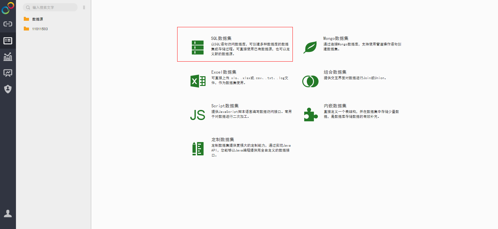
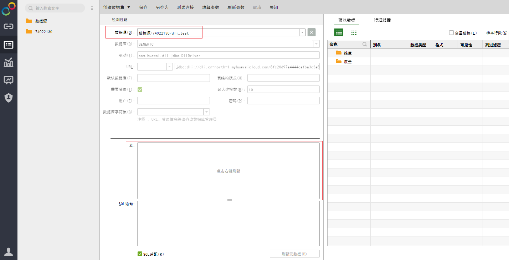
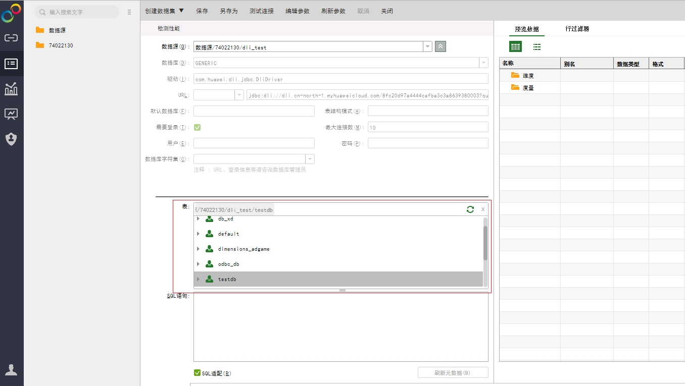
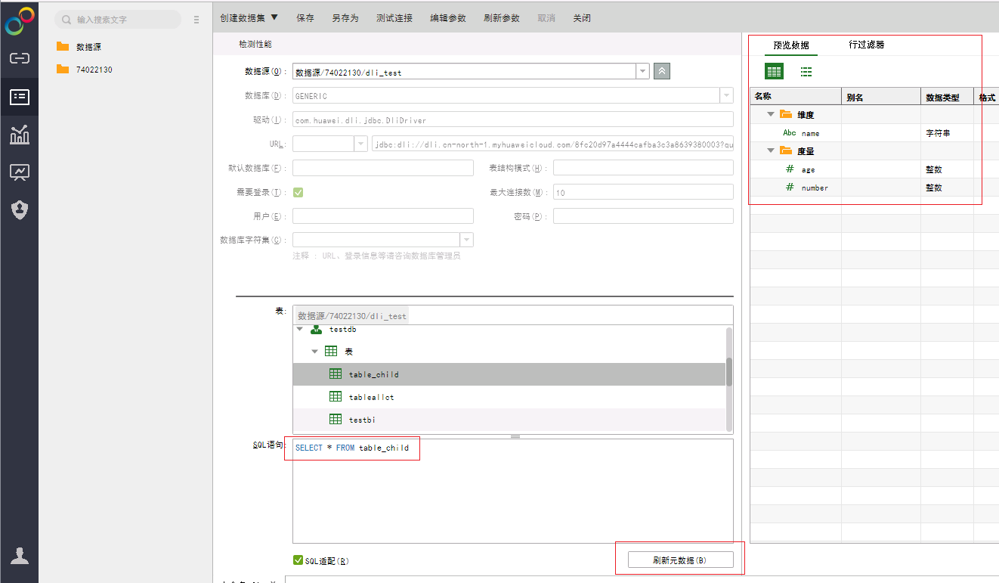
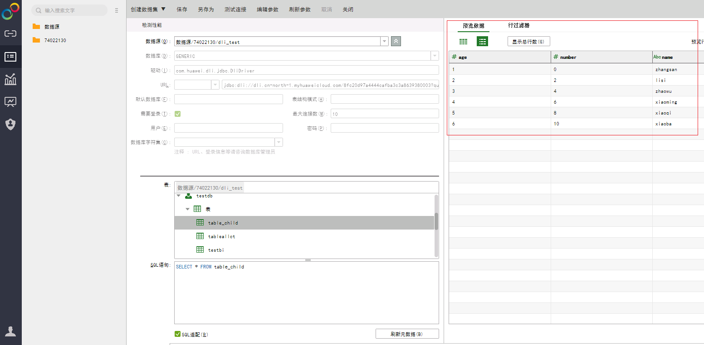

# 永洪BI创建数据集

## 操作场景

在永洪SaaS生产环境中创建DLI的数据集。

## 操作步骤

1.  在永洪SaaS生产环境主页，单击左侧导航栏中的“创建数据集”，请参见[图1](#fig4211415082250)。

    **图 1**  创建数据集  
    

2.  在“数据集类型”页面中，选择创建“SQL数据集”，请参见[图2](#fig1465197582631)。

    **图 2**  创建SQL数据集  
    

3.  在“创建数据集”页面中，左侧“数据源“栏选择已添加的DLI数据源，请参见[图3](#fig1842401582723)。

    **图 3**  选择数据源  
    

4.  左侧“表”栏中点击右键，刷新表，将列出所有数据库及数据库下面的数据表（这是添加数据源时，“表结构模式”没有配置时的情况），请参见[图4](#fig728945783040)。

    **图 4**  刷新数据表  
    

5.  在左侧“SQL语句”栏中执行表查询命令”select \* from table\_name“，点击“刷新元数据”，再单击右侧“预览数据”栏下左侧的“预览元数据”，可查询出该表的元数据（包括字段，字段类型等），请参见[图5](#fig886237583851)。

    **图 5**  查询数据表  
    

6.  单击右侧“预览数据”栏下右侧的“数据细节”，可查询出该表的数据，请参见[图6](#fig4635614384015)。

    **图 6**  查询数据表数据  
    

7.  在“创建数据集”页面工具栏中单击“保存”，完成创建数据集。

