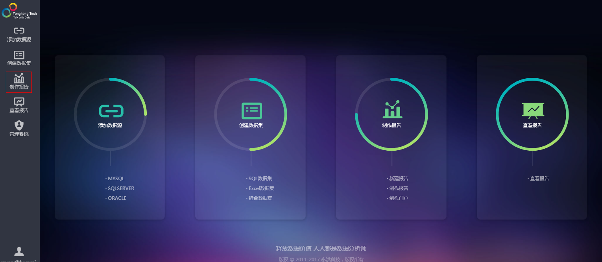
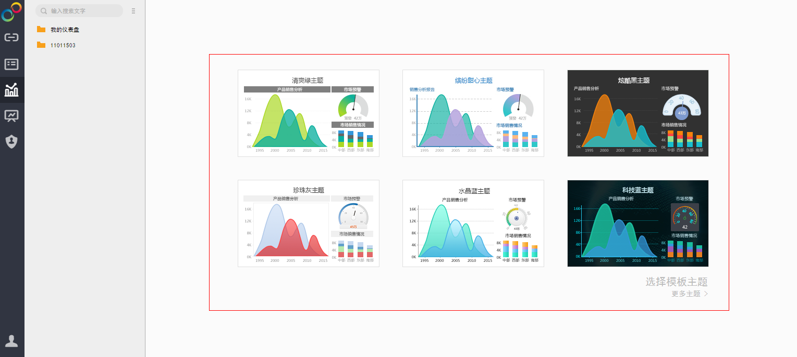
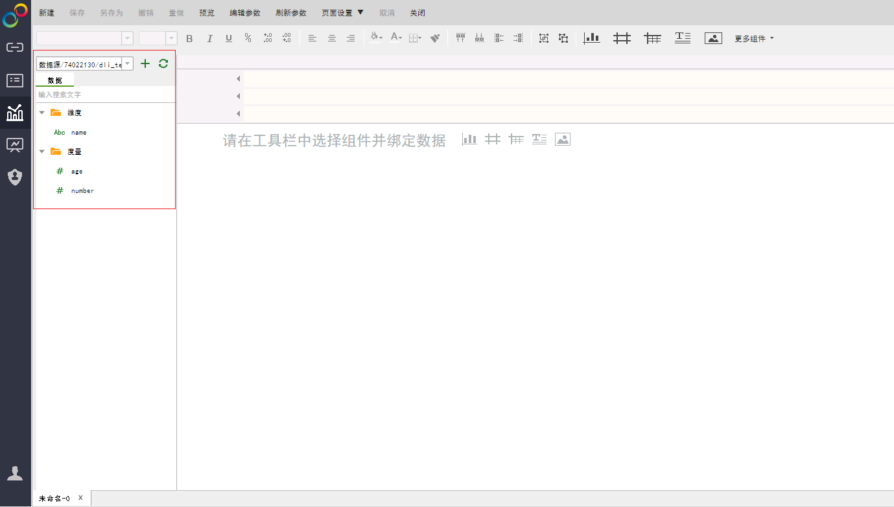
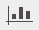
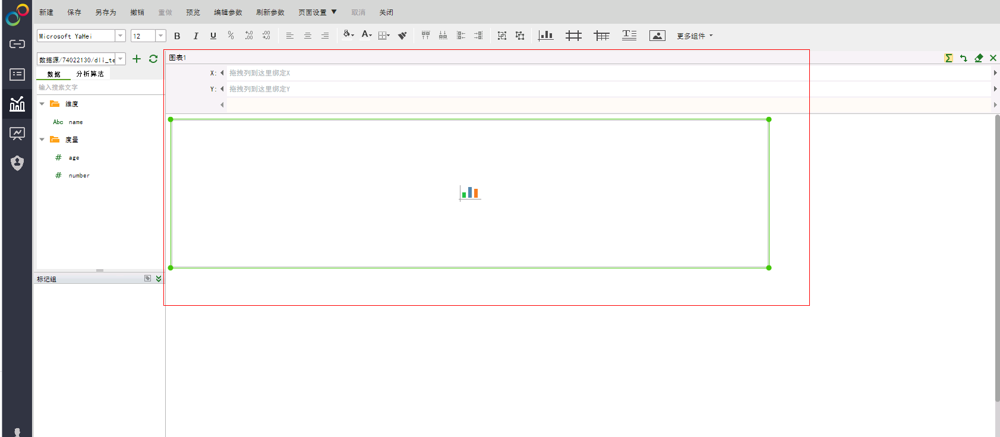
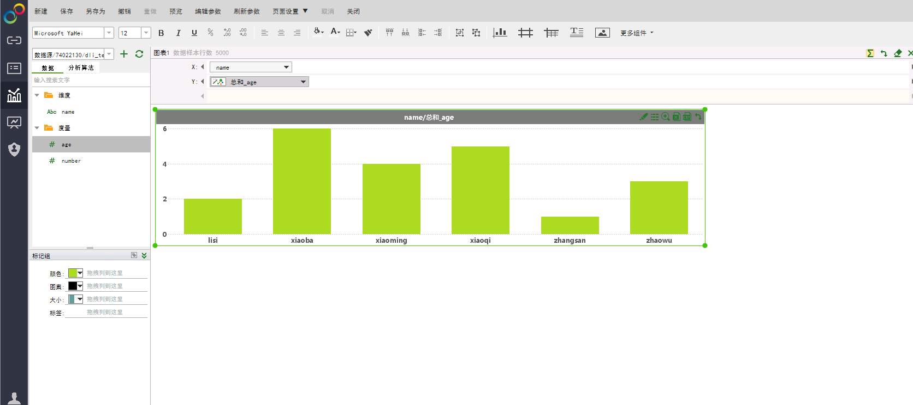

# 永洪BI制作图表

## 操作场景

在永洪SaaS生产环境中制作图表。

## 操作步骤

1.  在永洪SaaS生产环境主页，单击左侧导航栏中的“制作报告”，请参见[图1](#fig984750184512)。

    **图 1**  制作报告  
    

2.  选择图表风格，请参见[图2](#fig5689860384555)。

    **图 2**  选择报告风格  
    

3.  选择“清爽绿主题”为例，在界面左侧下拉选择添加已创建的数据集，选择其中的一个表（例如table\_child）作为数据源，会在下方的“数据”栏显示出该表的元数据（包括字段和字段类型），请参见[图3](#fig3564869785136)。

    **图 3**  选择表数据源  
    

4.  在制作报告界面，制表组件主要包括图表、表、交叉表、列表过滤等，以新建图表为例，单击工具栏中的“新建图表 ”，将其拖入编辑区域，请参见[图4](#fig93223185930)。

    **图 4**  新建图表  
    

5.  选择“name”作为X变量，“age”作为Y变量，将其直接拖入对应的位置，系统将自动生成对应的柱状图，请参见[图5](#fig65332935923)。

    **图 5**  生成图表  
    

6.  在“制作图表”页面工具栏中单击“保存”，完成制作图表。

