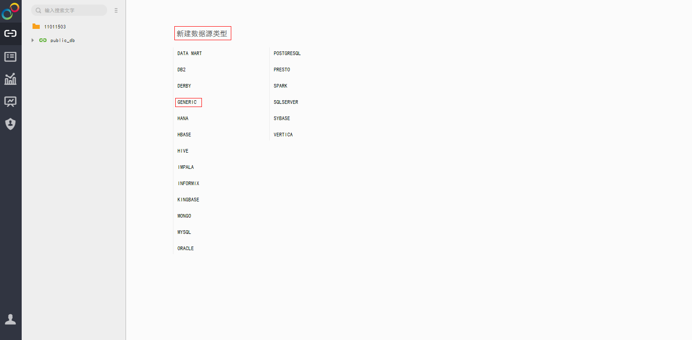
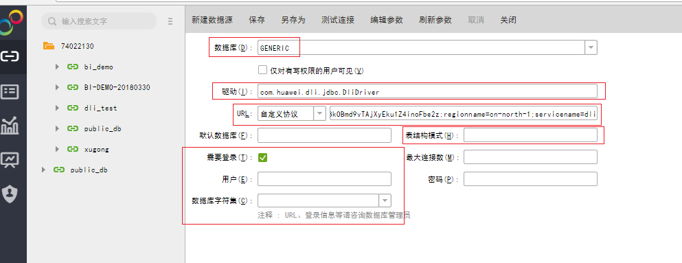

# 永洪BI添加数据源

## 操作场景

在永洪SaaS生产环境中添加DLI的数据源。

## 操作步骤

1.  在永洪SaaS生产环境主页，单击左侧导航栏中的“添加数据源”，请参见[图1](#fig276520981542)。

    **图 1**  添加数据源  
    

2.  “选择数据源类型”页面中，新建数据源类型选择“GENERIC”。请参见[图2](#fig697408381542)。

    **图 2**  选择数据源类型  
    

3.  添加数据源的相关配置，请参见[图3](#fig3754626481542)。

    “驱动“栏填写DLI JDBC的驱动：com.huawei.dli.jdbc.DliDriver。

    “URL“ 栏选择“自定义协议“，后面填写DLI jdbc的URL，URL的格式见[表1](#table1128019181542)，属性配置项说明见[表2](#table3788775181542)。

    > **说明：**   
    >-   “表结构模式“可填写需访问的数据库名称，如果填写，后续创建数据集时，刷新表，页面上只可见该数据库下的表。如果不填写，后续创建数据集时，刷新表，页面上会显示所有数据库下的表。创建数据集请参考[永洪BI创建数据集](永洪BI创建数据集.md)。  
    >-   其他选项不需要填写，也无需勾选“需要登录”选项。  

    **图 3**  添加数据源配置  
    

    **表 1**  数据库连接参数

    
    <table><thead align="left"><tr id="row968146681542"><th class="cellrowborder" valign="top" width="50%" id="mcps1.2.3.1.1">
参数

    </th>
    <th class="cellrowborder" valign="top" width="50%" id="mcps1.2.3.1.2">
描述

    </th>
    </tr>
    </thead>
    <tbody><tr id="row3370798981542"><td class="cellrowborder" valign="top" width="50%" headers="mcps1.2.3.1.1 ">
URL

    </td>
    <td class="cellrowborder" valign="top" width="50%" headers="mcps1.2.3.1.2 ">
URL的格式如下。

    
<strong id="b6522801516319"><em id="i5018122416319">jdbc:dli://&lt;endPoint&gt;/&lt;projectId&gt;?&lt;key1&gt;=&lt;val1&gt;;&lt;key2&gt;=&lt;val2&gt;</em><em id="i2577107481542">…</em></strong>

    
 NOTE: 
<ul id="ul4598221081542"><li>endpoint指DLI的域名，具体请参考<a href="https://developer.huaweicloud.com/endpoint" target="_blank" rel="noopener noreferrer">地区和终端节点</a>。</li><li>projectId指项目编号，从公有云“基本信息&gt;我的凭证”页面获取项编号。</li><li>“？”后面接其他配置项，每个配置项以“key=value”的形式列出，配置项之间以“;”隔开，详见<a href="#dli_01_0233__table3788775181542">表2</a></li></ul>
    

    </td>
    </tr>
    </tbody>
    </table>

    **表 2**  属性配置项

    
    <table><thead align="left"><tr id="row863464781542"><th class="cellrowborder" valign="top" width="22%" id="mcps1.2.5.1.1">
属性项（key）

    </th>
    <th class="cellrowborder" valign="top" width="23%" id="mcps1.2.5.1.2">
必须配置

    </th>
    <th class="cellrowborder" valign="top" width="12%" id="mcps1.2.5.1.3">
默认值（value）

    </th>
    <th class="cellrowborder" valign="top" width="43%" id="mcps1.2.5.1.4">
描述

    </th>
    </tr>
    </thead>
    <tbody><tr id="row5183638581542"><td class="cellrowborder" valign="top" width="22%" headers="mcps1.2.5.1.1 ">
queuename

    </td>
    <td class="cellrowborder" valign="top" width="23%" headers="mcps1.2.5.1.2 ">
是

    </td>
    <td class="cellrowborder" valign="top" width="12%" headers="mcps1.2.5.1.3 ">
-

    </td>
    <td class="cellrowborder" valign="top" width="43%" headers="mcps1.2.5.1.4 ">
DLI服务的队列名称。

    </td>
    </tr>
    <tr id="row540118381542"><td class="cellrowborder" valign="top" width="22%" headers="mcps1.2.5.1.1 ">
databasename

    </td>
    <td class="cellrowborder" valign="top" width="23%" headers="mcps1.2.5.1.2 ">
否

    </td>
    <td class="cellrowborder" valign="top" width="12%" headers="mcps1.2.5.1.3 ">
-

    </td>
    <td class="cellrowborder" valign="top" width="43%" headers="mcps1.2.5.1.4 ">
默认访问的数据库，URL中若不填此项，访问数据库的表时需采用db.table方式（如 select * from dbother.tabletest）。

    </td>
    </tr>
    <tr id="row3788276181542"><td class="cellrowborder" valign="top" width="22%" headers="mcps1.2.5.1.1 ">
authenticationmode

    </td>
    <td class="cellrowborder" valign="top" width="23%" headers="mcps1.2.5.1.2 ">
是

    </td>
    <td class="cellrowborder" valign="top" width="12%" headers="mcps1.2.5.1.3 ">
token

    </td>
    <td class="cellrowborder" valign="top" width="43%" headers="mcps1.2.5.1.4 ">
身份认证方式，可以是token或aksk，永洪BI对接建议采用aksk认证方式。

    </td>
    </tr>
    <tr id="row1841039881542"><td class="cellrowborder" valign="top" width="22%" headers="mcps1.2.5.1.1 ">
accesskey

    </td>
    <td class="cellrowborder" valign="top" width="23%" headers="mcps1.2.5.1.2 ">
authenticationmode=aksk时必须配置

    </td>
    <td class="cellrowborder" valign="top" width="12%" headers="mcps1.2.5.1.3 ">
-

    </td>
    <td class="cellrowborder" valign="top" width="43%" headers="mcps1.2.5.1.4 ">
参考<a href="永洪BI对接准备工作.md">永洪BI对接准备工作</a>。

    </td>
    </tr>
    <tr id="row2363432781542"><td class="cellrowborder" valign="top" width="22%" headers="mcps1.2.5.1.1 ">
secretkey

    </td>
    <td class="cellrowborder" valign="top" width="23%" headers="mcps1.2.5.1.2 ">
authenticationmode=aksk时必须配置

    </td>
    <td class="cellrowborder" valign="top" width="12%" headers="mcps1.2.5.1.3 ">
-

    </td>
    <td class="cellrowborder" valign="top" width="43%" headers="mcps1.2.5.1.4 ">
参考<a href="永洪BI对接准备工作.md">永洪BI对接准备工作</a>。

    </td>
    </tr>
    <tr id="row4106431681542"><td class="cellrowborder" valign="top" width="22%" headers="mcps1.2.5.1.1 ">
regionname

    </td>
    <td class="cellrowborder" valign="top" width="23%" headers="mcps1.2.5.1.2 ">
authenticationmode=aksk时必须配置

    </td>
    <td class="cellrowborder" valign="top" width="12%" headers="mcps1.2.5.1.3 ">
-

    </td>
    <td class="cellrowborder" valign="top" width="43%" headers="mcps1.2.5.1.4 ">
具体请参考http://developer.huaweicloud.com/dev/endpoint。

    </td>
    </tr>
    <tr id="row1800290281542"><td class="cellrowborder" valign="top" width="22%" headers="mcps1.2.5.1.1 ">
servicename

    </td>
    <td class="cellrowborder" valign="top" width="23%" headers="mcps1.2.5.1.2 ">
authenticationmode=aksk时必须配置

    </td>
    <td class="cellrowborder" valign="top" width="12%" headers="mcps1.2.5.1.3 ">
-

    </td>
    <td class="cellrowborder" valign="top" width="43%" headers="mcps1.2.5.1.4 ">
由于是对接DLI，所以servicename=dli。

    </td>
    </tr>
    <tr id="row1747364324213"><td class="cellrowborder" valign="top" width="22%" headers="mcps1.2.5.1.1 ">
dli.sql.checkNoResultQuery

    </td>
    <td class="cellrowborder" valign="top" width="23%" headers="mcps1.2.5.1.2 ">
否

    </td>
    <td class="cellrowborder" valign="top" width="12%" headers="mcps1.2.5.1.3 ">
false

    </td>
    <td class="cellrowborder" valign="top" width="43%" headers="mcps1.2.5.1.4 ">
是否允许调用executeQuery接口执行没有返回结果的语句（如DDL）。

    <ul id="ul1147419597345"><li>“false”表示允许调用。</li><li>“true”表示不允许调用。</li></ul>
    
 NOTE: 

当dli.sql.checkNoResultQuery=false时，非查询语句会执行两次。

    

    </td>
    </tr>
    </tbody>
    </table>

4.  在“添加数据源配置”页面工具栏中单击“测试连接”，测试通过后，单击“保存”，填写数据源名称，保存该数据源。

    > **说明：**   
    >目前没有根目录保存权限，需保存到已建文件夹目录下。  

