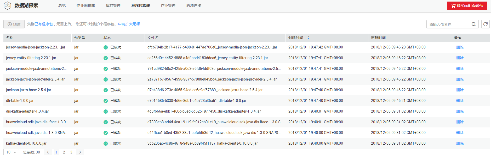

# 程序包管理概述

在程序包管理页面，您可以创建程序包或删除程序包。

**图 1**  程序包列表  

**表 1**  表列表参数

<table><thead align="left"><tr id="row666212153915"><th class="cellrowborder" valign="top" width="19.35%" id="mcps1.2.3.1.1">
参数

</th>
<th class="cellrowborder" valign="top" width="80.65%" id="mcps1.2.3.1.2">
参数说明

</th>
</tr>
</thead>
<tbody><tr id="row11671191143912"><td class="cellrowborder" valign="top" width="19.35%" headers="mcps1.2.3.1.1 ">
名称

</td>
<td class="cellrowborder" valign="top" width="80.65%" headers="mcps1.2.3.1.2 ">
程序包名称。

</td>
</tr>
<tr id="row611412316405"><td class="cellrowborder" valign="top" width="19.35%" headers="mcps1.2.3.1.1 ">
包类型

</td>
<td class="cellrowborder" valign="top" width="80.65%" headers="mcps1.2.3.1.2 ">
程序包的类型。包括以下三种类型：

<ul id="ul4538122617457"><li>jar</li><li>PyFile</li><li>File</li></ul>
</td>
</tr>
<tr id="row368271163910"><td class="cellrowborder" valign="top" width="19.35%" headers="mcps1.2.3.1.1 ">
状态

</td>
<td class="cellrowborder" valign="top" width="80.65%" headers="mcps1.2.3.1.2 ">
创建程序包的状态。

<ul id="ul32851446111915"><li>已成功</li></ul>
</td>
</tr>
<tr id="row85734934613"><td class="cellrowborder" valign="top" width="19.35%" headers="mcps1.2.3.1.1 ">
数据存储位置

</td>
<td class="cellrowborder" valign="top" width="80.65%" headers="mcps1.2.3.1.2 ">
包括DLI和OBS两种存储位置。

</td>
</tr>
<tr id="row2068751103914"><td class="cellrowborder" valign="top" width="19.35%" headers="mcps1.2.3.1.1 ">
表大小

</td>
<td class="cellrowborder" valign="top" width="80.65%" headers="mcps1.2.3.1.2 ">
表中数据的大小。

</td>
</tr>
<tr id="row1691131143918"><td class="cellrowborder" valign="top" width="19.35%" headers="mcps1.2.3.1.1 ">
OBS路径

</td>
<td class="cellrowborder" valign="top" width="80.65%" headers="mcps1.2.3.1.2 "><ul id="ul11123856135213"><li>数据存储位置为OBS时，显示对应的OBS路径。</li><li>数据存储位置为DLI时，则显示“-”。</li></ul>
</td>
</tr>
<tr id="row164492116534"><td class="cellrowborder" valign="top" width="19.35%" headers="mcps1.2.3.1.1 ">
创建时间

</td>
<td class="cellrowborder" valign="top" width="80.65%" headers="mcps1.2.3.1.2 ">
创建表的时间。

</td>
</tr>
<tr id="row1808175125310"><td class="cellrowborder" valign="top" width="19.35%" headers="mcps1.2.3.1.1 ">
最后访问时间

</td>
<td class="cellrowborder" valign="top" width="80.65%" headers="mcps1.2.3.1.2 ">
最后对表进行操作的时间。

</td>
</tr>
<tr id="row1695151133915"><td class="cellrowborder" valign="top" width="19.35%" headers="mcps1.2.3.1.1 ">
操作

</td>
<td class="cellrowborder" valign="top" width="80.65%" headers="mcps1.2.3.1.2 "><ul id="ul76971143914"><li>权限管理：可查看“权限信息”，进行“用户授权”、“权限设置”和“回收用户权限”。</li><li>删除表：在对应数据库中删除表。</li><li>更多。<ul id="ul8699103915813"><li>导入：将存储在OBS上的数据导入至DLI表。</li><li>导出：将DLI表或OBS表中的数据导出至OBS。</li><li>属性：
DLI表可查看“元数据”和“预览”。

OBS表只能“预览”。

</li></ul>
</li></ul>
</td>
</tr>
</tbody>
</table>

