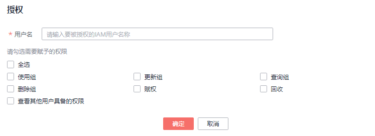
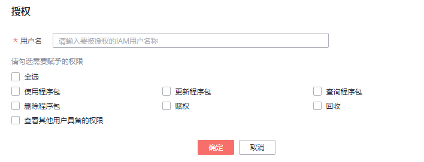

# 程序包组和程序包权限管理

## 程序包组和程序包权限操作场景

-   针对不同用户，可以通过权限设置分配不同的程序包组或程序包，不同用户之间的作业效率互不影响，保障作业性能。
-   管理员用户和程序包组或程序包的所有者拥有所有权限，不需要进行权限设置且其他用户无法修改其程序包组或程序包权限。
-   给新用户设置程序包组或程序包权限时，该用户所在用户组的所属区域需具有Tenant Guest权限。关于Tenant Guest权限的介绍和开通方法，详细参见《[权限策略](https://support.huaweicloud.com/usermanual-permissions/iam_01_0001.html)》和《统一身份认证服务用户指南》中的[创建用户组](https://support.huaweicloud.com/usermanual-iam/iam_03_0001.html)。

在“程序包管理“页面，单击程序包“操作”列中的“权限管理“，进入“用户权限信息”页面，可以对用户进行程序包组或程序包的授权、设置权限和回收权限。

> **说明：** 
>-   如果创建程序包时选择了分组，则权限管理为对应程序包组的权限管理。
>-   如果创建程序包时选择了不分组，则权限管理为对应程序包的权限管理。

## 程序包组/程序包用户授权

单击页面右上角“授权”可对用户进行程序包组/程序包授权。

-   程序包组授权

    **图 1**  程序包组授权  
    

    **表 1**  程序包组授权参数说明

    
    <table><thead align="left"><tr id="row5974123362914"><th class="cellrowborder" valign="top" width="20%" id="mcps1.2.3.1.1">
参数名称

    </th>
    <th class="cellrowborder" valign="top" width="80%" id="mcps1.2.3.1.2">
描述

    </th>
    </tr>
    </thead>
    <tbody><tr id="row397519332291"><td class="cellrowborder" valign="top" width="20%" headers="mcps1.2.3.1.1 ">
用户名

    </td>
    <td class="cellrowborder" valign="top" width="80%" headers="mcps1.2.3.1.2 ">
被授权的IAM用户的名称。

    
 说明： 

该用户名称是已存在的IAM用户名称。

    

    </td>
    </tr>
    <tr id="row897593352911"><td class="cellrowborder" valign="top" width="20%" headers="mcps1.2.3.1.1 ">
权限设置

    </td>
    <td class="cellrowborder" valign="top" width="80%" headers="mcps1.2.3.1.2 "><ul id="ul1773202816344"><li>使用组：使用该组的程序包。</li><li>更新组：更新该组内程序包，包含创建组内程序包。</li><li>查询组：查询组内程序包详情。</li><li>删除组：删除该组的程序包。</li><li>赋权：当前用户可将组的权限赋予其他用户。</li><li>回收：当前用户可回收其他用户具备的该组的权限，但不能回收该组所有者的权限。</li><li>查看其他用户具备的权限：当前用户可查看其他用户具备的该组的权限。</li></ul>
    </td>
    </tr>
    </tbody>
    </table>

-   程序包授权

    **图 2**  程序包授权  
    

    **表 2**  程序包授权参数说明

    
    <table><thead align="left"><tr id="row9823334141919"><th class="cellrowborder" valign="top" width="20%" id="mcps1.2.3.1.1">
参数名称

    </th>
    <th class="cellrowborder" valign="top" width="80%" id="mcps1.2.3.1.2">
描述

    </th>
    </tr>
    </thead>
    <tbody><tr id="row5824133411918"><td class="cellrowborder" valign="top" width="20%" headers="mcps1.2.3.1.1 ">
用户名

    </td>
    <td class="cellrowborder" valign="top" width="80%" headers="mcps1.2.3.1.2 ">
被授权的IAM用户的名称。

    
 说明： 

该用户名称是已存在的IAM用户名称。

    

    </td>
    </tr>
    <tr id="row19825173412194"><td class="cellrowborder" valign="top" width="20%" headers="mcps1.2.3.1.1 ">
权限设置

    </td>
    <td class="cellrowborder" valign="top" width="80%" headers="mcps1.2.3.1.2 "><ul id="ul582573416199"><li>使用程序包：使用该程序包。</li><li>更新程序包：更新该程序包。</li><li>查询程序包：查询该程序包。</li><li>删除程序包：删除该程序包。</li><li>赋权：当前用户可将程序包的权限赋予其他用户。</li><li>回收：当前用户可回收其他用户具备的该程序包的权限，但不能回收该程序包所有者的权限。</li><li>查看其他用户具备的权限：当前用户可查看其他用户具备的该程序包的权限。</li></ul>
    </td>
    </tr>
    </tbody>
    </table>

## 设置程序包组和程序包权限

单击对应子用户“操作”列中的“权限设置”可修改该用户的权限。详细权限描述如[表1](#table197423318295)和[表2](#table1382533416195)所示。

当“权限设置”中的选项为灰色时，表示您不具备修改此程序包组或程序包权限的权限。可以向管理员用户、组所有者等具有赋权权限的用户申请“程序包组或程序包的赋权”和“程序包组或程序包权限的回收”权限。

## 回收程序包组和程序包权限

单击对应子用户“操作”列中的“回收”将删除该用户的权限。该子用户将不具备该程序包组或程序包的任意权限。

## 程序包组和程序包权限使用说明

-   程序包组

    查询权限，用户可以查看该用户创建的程序包组以及该组下的所有程序包，也可以查看被赋权任意权限的程序包组。

    程序包组作为一个单元，用于管理行为一致的程序包，所以只能赋权给用户程序包组相关权限。

-   程序包

    查询权限，用户可以查看该用户创建的程序包，也可以查看被赋权任意权限的程序包。

