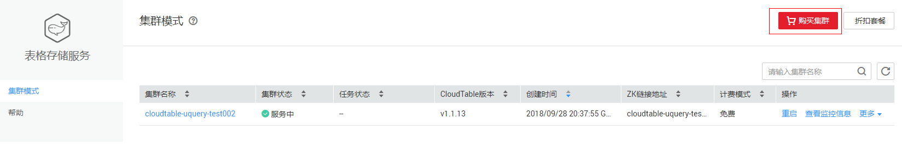
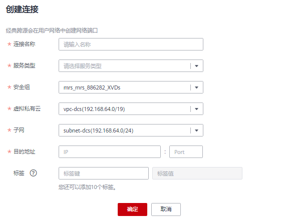
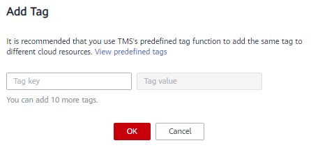

# 经典型跨源连接

DLI 经典型跨源连接可用于访问CloudTable的Hbase和OpenTSDB，MRS的OpenTSDB，DWS，RDS，CSS数据源。

-   开发SQL作业请参考《数据湖探索SQL语法参考》\>[《HBase表》](https://support.huaweicloud.com/sqlreference-dli/dli_08_0119.html)、[《OpenTSDB表》](https://support.huaweicloud.com/sqlreference-dli/dli_08_0122.html)、[《DWS表》](https://support.huaweicloud.com/sqlreference-dli/dli_08_0193.html)、[《RDS表》](https://support.huaweicloud.com/sqlreference-dli/dli_08_0197.html)、[《CSS表》](https://support.huaweicloud.com/sqlreference-dli/dli_08_0201.html)。
-   开发Spark作业请参考《数据湖探索开发指南》\>[《使用Spark作业开发DLI跨源连接》](https://support.huaweicloud.com/devg-dli/dli_09_0020.html)。

> **说明：** 
>-   经典型跨源只适用于用户自建队列。使用前需要先绑定队列。
>-   系统default队列不支持创建跨源连接。
>-   访问跨源表需要使用已经创建跨源连接的队列。
>-   跨源表不支持Preview预览功能。

经典型跨源主要包括如下功能：

-   [创建连接](#section73391334165211)
-   [查找连接](#section9644161019415)
-   [查看连接详情](#section1960402414173)
-   [删除连接](#section8647175812179)
-   [绑定队列](#section027361173415)
-   [解绑队列](#section16495153616367)
-   [标签管理](#section58487591312)

## 经典型跨源页面

显示所有的经典型跨源连接，连接数量较多时，系统分页显示。

**表 1**  跨源连接列表参数

<table><thead align="left"><tr id="row2555468715120"><th class="cellrowborder" valign="top" width="16.009999999999998%" id="mcps1.2.3.1.1">
参数

</th>
<th class="cellrowborder" valign="top" width="83.99%" id="mcps1.2.3.1.2">
参数说明

</th>
</tr>
</thead>
<tbody><tr id="row46758327132"><td class="cellrowborder" valign="top" width="16.009999999999998%" headers="mcps1.2.3.1.1 ">
连接名称

</td>
<td class="cellrowborder" valign="top" width="83.99%" headers="mcps1.2.3.1.2 ">
所创建的跨源连接名称。

</td>
</tr>
<tr id="row32873162171713"><td class="cellrowborder" valign="top" width="16.009999999999998%" headers="mcps1.2.3.1.1 ">
连接状态

</td>
<td class="cellrowborder" valign="top" width="83.99%" headers="mcps1.2.3.1.2 ">
跨源连接的状态信息，具体如下：

<ul id="ul32930526154023"><li>创建中</li><li>已激活</li><li>已失败</li><li>已失效</li></ul>
</td>
</tr>
<tr id="row31011923151038"><td class="cellrowborder" valign="top" width="16.009999999999998%" headers="mcps1.2.3.1.1 ">
服务类型

</td>
<td class="cellrowborder" valign="top" width="83.99%" headers="mcps1.2.3.1.2 ">
目前支持访问的数据源类型如下：

<ul id="ul127459715563"><li>表格存储服务 CloudTable和CloudTable.OPENTSDB</li><li>MapReduce服务 MRS.OPENTSDB</li><li>数据仓库服务 DWS</li><li>云数据库（关系型数据库） RDS</li><li>云搜索服务 CSS</li></ul>
</td>
</tr>
<tr id="row36301606171658"><td class="cellrowborder" valign="top" width="16.009999999999998%" headers="mcps1.2.3.1.1 ">
连接地址

</td>
<td class="cellrowborder" valign="top" width="83.99%" headers="mcps1.2.3.1.2 ">
跨源连接创建成功后将显示连接地址，用于在SQL或Spark作业中访问其他数据源。

</td>
</tr>
<tr id="row6424839516213"><td class="cellrowborder" valign="top" width="16.009999999999998%" headers="mcps1.2.3.1.1 ">
目的地址

</td>
<td class="cellrowborder" valign="top" width="83.99%" headers="mcps1.2.3.1.2 ">
目的数据源的原始地址。

</td>
</tr>
<tr id="row2449114254419"><td class="cellrowborder" valign="top" width="16.009999999999998%" headers="mcps1.2.3.1.1 ">
创建时间

</td>
<td class="cellrowborder" valign="top" width="83.99%" headers="mcps1.2.3.1.2 ">
每个连接的创建时间，可按创建时间顺序或倒序显示连接列表。

</td>
</tr>
<tr id="row1883611569448"><td class="cellrowborder" valign="top" width="16.009999999999998%" headers="mcps1.2.3.1.1 ">
进度

</td>
<td class="cellrowborder" valign="top" width="83.99%" headers="mcps1.2.3.1.2 ">
连接创建的进度， 用百分比表示。

</td>
</tr>
<tr id="row1662880815250"><td class="cellrowborder" valign="top" width="16.009999999999998%" headers="mcps1.2.3.1.1 ">
操作

</td>
<td class="cellrowborder" valign="top" width="83.99%" headers="mcps1.2.3.1.2 "><ul id="ul161071426101318"><li>删除。当连接状态在“创建中”时，连接不可删除。</li><li>重新激活。</li><li>更多：<ul id="ul17130172119535"><li>绑定队列：用于为经典型跨源连接绑定队列。</li><li>解绑队列：用于解除经典型跨源连接与队列之间的绑定关系。</li><li>标签：对增强型跨源连接进行标签管理。</li></ul>
</li></ul>
</td>
</tr>
</tbody>
</table>

## 创建连接

以访问CloudTable数据源为例，创建经典型跨源连接的步骤如下：

1.  创建需要访问的数据源。例如，需要访问CloudTable数据源，请先在CloudTable服务中购买集群。

    **图 1**  CloudTable购买集群  
    

    如果已有可用集群，可不用重新购买。

2.  在DLI管理控制台左侧，选择“跨源连接“。
3.  选择“经典型跨源“页签，单击“创建”按钮。

    输入连接名称，选择服务类型，安全组，虚拟私有云，子网，输入目的地址，详细参数介绍请参见[表2](#table24931148155220)。

    **图 2**  创建连接  
    

    **表 2**  参数说明

    
    <table><thead align="left"><tr id="row1149712486527"><th class="cellrowborder" valign="top" width="13.29%" id="mcps1.2.3.1.1">
参数

    </th>
    <th class="cellrowborder" valign="top" width="86.71%" id="mcps1.2.3.1.2">
参数说明

    </th>
    </tr>
    </thead>
    <tbody><tr id="row1350324845215"><td class="cellrowborder" valign="top" width="13.29%" headers="mcps1.2.3.1.1 ">
连接名称

    </td>
    <td class="cellrowborder" valign="top" width="86.71%" headers="mcps1.2.3.1.2 ">
所创建的跨源连接名称。

    <ul id="ul185072486523"><li>名称只能包含数字、英文字母、下划线和中划线。不能为空。</li><li>输入长度不能超过64个字符。</li></ul>
    </td>
    </tr>
    <tr id="row105181748125210"><td class="cellrowborder" valign="top" width="13.29%" headers="mcps1.2.3.1.1 ">
服务类型

    </td>
    <td class="cellrowborder" valign="top" width="86.71%" headers="mcps1.2.3.1.2 ">
目前支持访问六种类型数据源。

    <ul id="ul25191248185210"><li>表格存储服务 CloudTable和CloudTable.OPENTSDB</li><li>MapReduce服务 MRS.OPENTSDB</li><li>数据仓库服务 DWS</li><li>云数据库（关系型数据库） RDS</li><li>云搜索服务 CSS</li></ul>
    </td>
    </tr>
    <tr id="row85241748185212"><td class="cellrowborder" valign="top" width="13.29%" headers="mcps1.2.3.1.1 ">
安全组

    </td>
    <td class="cellrowborder" valign="top" width="86.71%" headers="mcps1.2.3.1.2 ">
选择对应的安全组信息。不同服务的安全组信息，可在创建对应的服务集群或实例时由系统提供，或查看已有集群或数据库实例信息。

    </td>
    </tr>
    <tr id="row7764655142317"><td class="cellrowborder" valign="top" width="13.29%" headers="mcps1.2.3.1.1 ">
虚拟私有云

    </td>
    <td class="cellrowborder" valign="top" width="86.71%" headers="mcps1.2.3.1.2 ">
选择对应的虚拟私有云信息。不同服务的虚拟私有云信息，可在创建对应的服务集群或实例时由系统提供，或查看已有集群或数据库实例信息。

    </td>
    </tr>
    <tr id="row1095810374248"><td class="cellrowborder" valign="top" width="13.29%" headers="mcps1.2.3.1.1 ">
子网

    </td>
    <td class="cellrowborder" valign="top" width="86.71%" headers="mcps1.2.3.1.2 ">
选择对应的子网信息。不同服务的子网信息，可在创建对应的服务集群或实例时由系统提供，或查看已有集群或数据库实例信息。

    </td>
    </tr>
    <tr id="row135261748155213"><td class="cellrowborder" valign="top" width="13.29%" headers="mcps1.2.3.1.1 ">
目的地址

    </td>
    <td class="cellrowborder" valign="top" width="86.71%" headers="mcps1.2.3.1.2 ">
连接目的数据源的地址。不同服务的地址略有不同。

    <ul id="ul9527124812520"><li>表格存储服务 CloudTable：ZK链接地址。</li><li>表格存储服务 CloudTable OpenTSDB：“OpenTSDB所在节点的IP:OpenTSDB服务对外端口”。</li><li>MapReduce服务 OpenTSDB：“OpenTSDB所在节点的IP:OpenTSDB服务对外端口”。
MRS OpenTSDB IP信息和端口信息获取方式：

    <ol id="ol203845913189"><li>在MRS集群列表中，单击所使用的集群名称，进入集群“概览”页；</li><li>在集群“基本信息”中找到“集群管理页面”，单击“点击查看”；</li><li>输入用户名和密码（“用户名”和“密码”为购买MRS集群时设置，“用户名”默认为“admin”），单击“登录”进入“MRS Manager”页面；</li><li>选择“服务管理”页签；</li><li>进入“Opentsdb”服务；</li><li>选择“实例”页签，可以查看对应业务IP，可选择任意一个业务IP。
选择“服务配置”页签，找到OpenTSDB的对外端口。

    </li></ol>
    
 说明： 

如果MapReduce服务集群存在多个IP，创建跨源连接时填写其中任意一个业务IP即可。

    

    </li><li>数据仓库服务 DWS：“内网IP:端口”。
 说明： 

DWS服务集群提供2个内网IP，创建跨源连接时填写其中任意一个内网IP即可。

    

    </li><li>云数据库（关系型数据库） RDS：“内网地址:数据库端口”。</li><li>云搜索服务 CSS：“内网地址:端口”。
 说明： 

如果CSS服务集群存在多个内网IP，创建跨源连接时填写其中任意一个内网IP即可。

    

    </li></ul>
    </td>
    </tr>
    <tr id="row14401113454017"><td class="cellrowborder" valign="top" width="13.29%" headers="mcps1.2.3.1.1 ">
标签

    </td>
    <td class="cellrowborder" valign="top" width="86.71%" headers="mcps1.2.3.1.2 ">
使用标签标识云资源。包括“标签键”和“标签值”。如果您需要使用同一标签标识多种云资源，即所有服务均可在标签输入框下拉选择同一标签，建议在标签管理服务（TMS）中创建预定义标签。具体请参考《<a href="https://support.huaweicloud.com/usermanual-tms/zh-cn_topic_0056266269.html" target="_blank" rel="noopener noreferrer">标签管理服务用户指南</a>》。

    
 说明： 
<ul id="ul1972873412320"><li>最多支持10个标签。</li><li>一个“键”只能添加一个“值”。</li></ul>
    

    <ul id="ul55819552289"><li>标签键：在输入框中输入标签键名称。
 说明： 

标签键的最大长度为36个字符 ，只能包含大小写字母，数字，中划线“-”，下划线“_”，中文，且首尾字符不能为空格。

    

    </li><li>标签值：在输入框中输入标签值。
 说明： 

标签值的最大长度为43个字符，只能包含大小写字母，数字，中划线“-”，下划线“_”，点“.”中文，且首尾字符不能为空格。

    

    </li></ul>
    </td>
    </tr>
    </tbody>
    </table>

4.  单击“确定“，完成连接创建。
5.  单击“操作”\>“更多”\>“绑定队列”绑定对应的队列。
6.  （可选）创建经典型跨源连接之后，如需进行进一步的跨源分析，请参考[跨源分析开发方式参考](跨源连接和跨源分析概述.md#section12839810151415)。

## 查找连接

在“经典型跨源“页面，可在搜索框中输入连接名称关键字，查找与之匹配的连接。

## 查看连接详情

在“经典型跨源“页面，选中一条连接，单击该连接对应的，可查看该条连接的详细信息。

包括：连接名称，连接地址，服务类型，连接ID，目的地址，日志详情。

> **说明：** 
>当“连接状态“为“已失败“，“日志详情“显示“失败原因“。

## 删除连接

在“经典跨源“页面，可单击“操作”列的“删除“，删除不需要的连接。

> **说明：** 
>当“连接状态“为“创建中“时，连接不可删除。

## 绑定队列

方式一：

在“经典型跨源“页面，选择一条连接，单击该连接“操作”列中的“更多”\>“绑定队列”，在弹出的对话框中，选择要绑定的队列（支持多选），单击“确定”。

方式二：

单击选择的连接名称，进入该连接的“ 详情”页面。单击左上角的“创建”，在弹出的对话框中，选择要绑定的队列（支持多选），单击“确定”。

## 解绑队列

方式一：

在“经典型跨源“页面，选择一条连接，单击该连接“操作”列中的“更多”\>“解绑队列”，在弹出的对话框中，选择要解绑的队列（支持多选），单击“确定”。

方式二：

单击选择的连接名称，进入该连接的“ 详情”页面。选择要解绑的队列，单击该连接“操作”列中的“解绑队列”，在弹出的对话框中，选择要解绑的队列，单击“确定”。

## 标签管理

标签是用户自定义的、用于标识云资源的键值对，它可以帮助用户对云资源进行分类和搜索。标签由标签“键”和标签“值”组成。

如果用户在其他云服务中使用了标签，建议用户为同一个业务所使用的云资源创建相同的标签键值对以保持一致性。

DLI支持以下两类标签：

-   资源标签：在DLI中创建的非全局的标签。

-   预定义标签：在标签管理服务（简称TMS）中创建的预定义标签，属于全局标签。有关预定义标签的更多信息，请参见《[标签管理服务用户指南](https://support.huaweicloud.com/usermanual-tms/zh-cn_topic_0056266269.html)》。

以下介绍如何为作业添加标签、修改标签和删除标签。

1.  在DLI管理控制台的左侧导航栏中，单击“跨源连接”，选择“经典型跨源”页签。
2.  在对应连接的“操作”列，选择“更多”\>“标签”。
3.  进入标签管理页面，显示当前连接的标签信息。
4.  单击“添加标签“，弹出“添加标签“对话框，配置参数。

    **图 3**  添加标签  
    

    **图 4**  添加标签-E  
    

    **表 3**  标签配置参数

    
    <table><thead align="left"><tr id="row1640724610160"><th class="cellrowborder" valign="top" width="12.94%" id="mcps1.2.3.1.1">
参数

    </th>
    <th class="cellrowborder" valign="top" width="87.06%" id="mcps1.2.3.1.2">
参数说明

    </th>
    </tr>
    </thead>
    <tbody><tr id="row13417154613164"><td class="cellrowborder" valign="top" width="12.94%" headers="mcps1.2.3.1.1 ">
标签键

    </td>
    <td class="cellrowborder" valign="top" width="87.06%" headers="mcps1.2.3.1.2 ">
您可以选择：

    <ul id="ul6423144611162"><li>在输入框的下拉列表中选择预定义标签键。
 说明： 

如果添加预定义标签，用户需要预先在标签管理服务中创建好预定义标签，然后在“标签键”的下拉框中进行选择。用户可以通过单击“查看预定义标签”进入标签管理服务的“预定义标签”页面，然后单击“创建标签”来创建新的预定义标签，具体请参见《标签管理服务用户指南》中的“<a href="https://support.huaweicloud.com/usermanual-tms/zh-cn_topic_0144368884.html" target="_blank" rel="noopener noreferrer">创建预定义标签</a>”章节。

    

    </li></ul>
    <ul id="ul643911462165"><li>在输入框中输入标签键名称。
 说明： 

标签键的最大长度为36个字符 ，只能包含大小写字母，数字，中划线“-”，下划线“_”，中文，且首尾字符不能为空格。

    

    </li></ul>
    </td>
    </tr>
    <tr id="row645064691617"><td class="cellrowborder" valign="top" width="12.94%" headers="mcps1.2.3.1.1 ">
标签值

    </td>
    <td class="cellrowborder" valign="top" width="87.06%" headers="mcps1.2.3.1.2 ">
您可以选择：

    <ul id="ul1045720469162"><li>在输入框的下拉列表中选择预定义标签值。</li><li>在输入框中输入标签值。
 说明： 

标签值的最大长度为43个字符，只能包含大小写字母，数字，中划线“-”，下划线“_”，点“.”中文，且首尾字符不能为空格。

    

    </li></ul>
    </td>
    </tr>
    </tbody>
    </table>

    > **说明：** 
    >-   最多支持10个标签。
    >-   一个“键”只能添加一个“值”。
    >-   每个资源中的键名不能重复。

5.  单击“确定“。
6.  （可选）在标签列表中，单击“操作“列中“编辑“可对选中标签的值进行编辑。
7.  （可选）在标签列表中，单击“操作“列中“删除“可对选中的标签进行删除。

