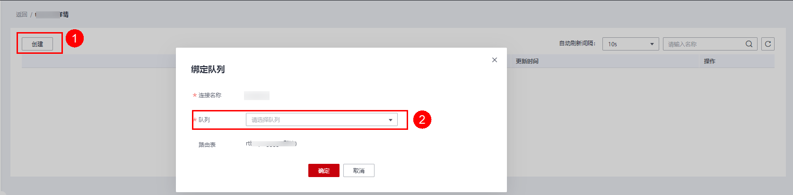
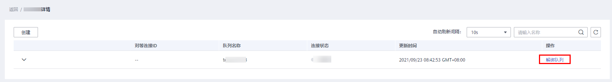

# 绑定/解绑队列

## 绑定队列

使用增强型跨源连接之前必须绑定队列且对等连接的状态是“active”。

-   方式一

    在“增强型跨源“页面，选择一条连接，单击该连接“操作”列中的“绑定队列”，在弹出的对话框中，选择要绑定的队列（支持多选），单击“确定”。

-   方式二

    单击选择的连接名称，进入该连接的“ 详情”页面。单击左上角的“创建”，在弹出的对话框中，选择要绑定的队列（支持多选），单击“确定”。

    

## 查看绑定队列详情

在“增强型跨源“页面，选中一条连接，单击选中的连接名称，可以查看绑定队列相关信息。

**表 1**  跨源连接队列详情列表参数

<table><thead align="left"><tr id="row135891123145816"><th class="cellrowborder" valign="top" width="13.850000000000001%" id="mcps1.2.3.1.1">
参数

</th>
<th class="cellrowborder" valign="top" width="86.15%" id="mcps1.2.3.1.2">
参数说明

</th>
</tr>
</thead>
<tbody><tr id="row259022345814"><td class="cellrowborder" valign="top" width="13.850000000000001%" headers="mcps1.2.3.1.1 ">
对等连接ID

</td>
<td class="cellrowborder" valign="top" width="86.15%" headers="mcps1.2.3.1.2 ">
增强型跨源在该队列所在集群中创建的对等连接ID。

 说明： 

每一个增强型跨源对每一个绑定的队列都会创建一个对等连接。该对等连接用于实现跨VPC通信，请确保数据源使用的安全组开放了DLI队列网段的访问，并且在使用跨源过程中不要删除该对等连接。

</td>
</tr>
<tr id="row0590172375818"><td class="cellrowborder" valign="top" width="13.850000000000001%" headers="mcps1.2.3.1.1 ">
队列名称

</td>
<td class="cellrowborder" valign="top" width="86.15%" headers="mcps1.2.3.1.2 ">
已绑定的队列名称。

</td>
</tr>
<tr id="row165901238588"><td class="cellrowborder" valign="top" width="13.850000000000001%" headers="mcps1.2.3.1.1 ">
连接状态

</td>
<td class="cellrowborder" valign="top" width="86.15%" headers="mcps1.2.3.1.2 ">
跨源连接的状态信息，包括以下三种状态：

<ul id="ul15899620876"><li>创建中</li><li>已激活</li><li>已失败</li></ul>

 说明： 

当连接状态显示为“已失败”时，单击左边对应的，可查看详细的错误信息。

</td>
</tr>
<tr id="row18590123185815"><td class="cellrowborder" valign="top" width="13.850000000000001%" headers="mcps1.2.3.1.1 ">
更新时间

</td>
<td class="cellrowborder" valign="top" width="86.15%" headers="mcps1.2.3.1.2 ">
每个连接的更新时间，可按更新时间顺序或倒序显示连接列表。

</td>
</tr>
<tr id="row15590152315812"><td class="cellrowborder" valign="top" width="13.850000000000001%" headers="mcps1.2.3.1.1 ">
操作

</td>
<td class="cellrowborder" valign="top" width="86.15%" headers="mcps1.2.3.1.2 ">
解绑队列：用于解除跨源连接与队列之间的绑定关系。

</td>
</tr>
</tbody>
</table>

## 解绑队列

不需要使用增强型跨源连接时，可将所绑定的队列进行解绑，释放资源。

-   方式一

    在“增强型跨源“页面，选择一条连接，单击该连接“操作”列中的“更多”\>“解绑队列”，在弹出的对话框中，选择要解绑的队列，单击“确定”。

-   方式二

    单击选择的连接名称，进入该连接的“ 详情”页面。选择要解绑的队列，单击该连接“操作”列中的“解绑队列”，在弹出的对话框中，选择要解绑的队列，单击“确定”。

    

