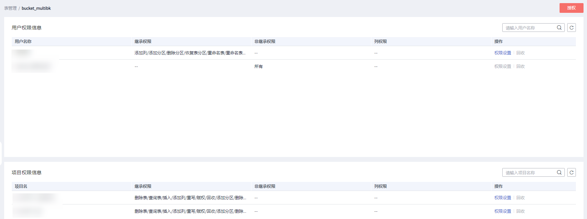

# 表权限管理

## 表权限操作场景

-   针对不同用户，可以通过权限设置分配不同的数据库，不同用户之间的作业效率互不影响，保障作业性能。
-   管理员用户和数据库的所有者拥有所有权限，不需要进行权限设置且其他用户无法修改其数据库权限。
-   给新用户设置数据库权限时，该用户所在用户组的所属区域需具有Tenant Guest权限。关于Tenant Guest权限的介绍和开通方法，详细参见《[权限策略](https://support.huaweicloud.com/usermanual-permissions/iam_01_0001.html)》和《统一身份认证服务用户指南》中的[创建用户组](https://support.huaweicloud.com/usermanual-iam/iam_03_0001.html)。

## 注意事项

如果需要查看主账号下数据库中的表，需要对当前子账号用户授权（显示权限），具体请参考[常用操作与系统权限关系](常用操作与系统权限关系.md)。

## 查看表权限

1.  在管理控制台左侧，单击“数据管理“\>“库表管理“。
2.  单击需要设置权限的表所在的数据库名，进入该数据库的“表管理”页面。
3.  单击所选表“操作”栏中的“权限管理”，将显示该表对应的权限信息。

    **图 1**  表权限管理  
    

    表权限设置有3种场景：为新用户或项目赋予权限，为已有权限的用户或项目修改权限，回收某用户或项目具备的所有权限。

## 为新用户或项目赋予权限

为新用户或项目赋予权限，新用户或项目指之前不具备此表任何权限的用户或项目。

1.  单击表权限管理页面右上角的“授权“按钮。
2.  在弹出的“授权“对话框中选择相应的权限。
    -   DLI表具体权限说明请参考[表1](#table06511040124817)。

        **图 2**  DLI表授权  
        

        **表 1**  参数配置

        
        <table><thead align="left"><tr id="row13648440124812"><th class="cellrowborder" valign="top" width="19.220000000000002%" id="mcps1.2.3.1.1">
参数

        </th>
        <th class="cellrowborder" valign="top" width="80.78%" id="mcps1.2.3.1.2">
描述

        </th>
        </tr>
        </thead>
        <tbody><tr id="row664912404480"><td class="cellrowborder" valign="top" width="19.220000000000002%" headers="mcps1.2.3.1.1 ">
授权选择

        </td>
        <td class="cellrowborder" valign="top" width="80.78%" headers="mcps1.2.3.1.2 ">
选择“用户授权”或“项目授权”。

        
 说明： 

选择“项目授权”时，只能查看被授权的表及其所在数据库的信息。

        

        </td>
        </tr>
        <tr id="row46491240124818"><td class="cellrowborder" valign="top" width="19.220000000000002%" headers="mcps1.2.3.1.1 ">
用户名/项目名

        </td>
        <td class="cellrowborder" valign="top" width="80.78%" headers="mcps1.2.3.1.2 "><ul id="ul176491140174812"><li>选择“用户授权”时，对表新增用户，输入对应IAM用户名称。</li><li>选择“项目授权”时，选择当前区域下需要授权的项目。</li></ul>
        </td>
        </tr>
        <tr id="row865011408487"><td class="cellrowborder" valign="top" width="19.220000000000002%" headers="mcps1.2.3.1.1 ">
权限信息

        </td>
        <td class="cellrowborder" valign="top" width="80.78%" headers="mcps1.2.3.1.2 ">
选中权限后即对用户进行赋权，取消后对用户权限进行收回。包含如下权限类型。

        <ul id="ul20650040164814"><li>显示表：显示当前表的信息。</li><li>查询表：在当前表内查询数据。</li><li>显示创建表语句：显示当前表的创建语句。</li><li>删除表：删除当前表。</li><li>重命名表：对当前表重新命名。</li><li>插入：在当前表内插入数据。</li><li>重写：在当前表内插入覆盖数据。</li><li>添加列：在当前表中增加列。</li><li>赋权：当前用户可将表的权限赋予其他用户。</li><li>回收：当前用户可回收其他用户具备的此表的权限，并且不能回收表所有者的权限。</li><li>查看其他用户具备的表权限：查看其他用户具备的当前表的权限。</li></ul>
        
分区表还具有以下权限：

        <ul id="ul1665024094810"><li>删除分区：删除分区表中的分区。</li><li>显示所有分区：显示分区表中的所有分区。</li></ul>
        </td>
        </tr>
        <tr id="row17651134010488"><td class="cellrowborder" valign="top" width="19.220000000000002%" headers="mcps1.2.3.1.1 ">
列权限

        </td>
        <td class="cellrowborder" valign="top" width="80.78%" headers="mcps1.2.3.1.2 "><ul id="ul20651240114812"><li>表中的列只能继承查询权限。</li><li>用户具有查询表的权限时，列权限自动隐藏。</li></ul>
        </td>
        </tr>
        </tbody>
        </table>

    -   OBS表具体权限说明请参考[表2](#table36563404488)。

        **图 3**  OBS表授权  
        

        **表 2**  参数配置

        
        <table><thead align="left"><tr id="row1065211403488"><th class="cellrowborder" valign="top" width="18.75%" id="mcps1.2.3.1.1">
参数

        </th>
        <th class="cellrowborder" valign="top" width="81.25%" id="mcps1.2.3.1.2">
描述

        </th>
        </tr>
        </thead>
        <tbody><tr id="row565224044819"><td class="cellrowborder" valign="top" width="18.75%" headers="mcps1.2.3.1.1 ">
授权选择

        </td>
        <td class="cellrowborder" valign="top" width="81.25%" headers="mcps1.2.3.1.2 ">
选择“用户授权”或“项目授权”。

        
 说明： 

选择“项目授权”时，只能查看被授权的表及其所在数据库的信息。

        

        </td>
        </tr>
        <tr id="row166532040114818"><td class="cellrowborder" valign="top" width="18.75%" headers="mcps1.2.3.1.1 ">
用户名/项目名

        </td>
        <td class="cellrowborder" valign="top" width="81.25%" headers="mcps1.2.3.1.2 "><ul id="ul126532403482"><li>选择“用户授权”时，对表新增用户，输入对应IAM用户名称。</li><li>选择“项目授权”时，选择当前区域下需要授权的项目。</li></ul>
        </td>
        </tr>
        <tr id="row116546401484"><td class="cellrowborder" valign="top" width="18.75%" headers="mcps1.2.3.1.1 ">
权限信息

        </td>
        <td class="cellrowborder" valign="top" width="81.25%" headers="mcps1.2.3.1.2 ">
选中权限后即对用户进行赋权，取消后对用户权限进行收回。包含如下权限类型。

        <ul id="ul186541940194819"><li>显示表：显示当前表的信息。</li><li>查询表：在当前表内查询数据。</li><li>显示创建表语句：显示当前表的创建语句。</li><li>删除表：删除当前表。</li><li>重命名表：对当前表重新命名。</li><li>插入：在当前表内插入数据。</li><li>重写：在当前表内插入覆盖数据。</li><li>添加列：在当前表中增加列。</li><li>赋权：当前用户可将表的权限赋予其他用户或项目。</li><li>回收：当前用户或项目可回收其他用户或项目具备的此表的权限，并且不能回收表所有者的权限。</li><li>查看其他用户具备的表权限：查看其他用户具备的当前表的权限。</li></ul>
        
分区表还具有以下权限：

        <ul id="ul76544409484"><li>添加分区：在分区表中添加新的分区。单表分区数最多允许7000个。</li><li>删除分区：删除分区表中的任意分区。</li><li>设置分区的路径：将分区表中的某个分区路径设置为用户指定的OBS路径。</li><li>重命名表分区：对分区表中的分区重新命名。</li><li>恢复表分区：从文件系统中导出分区信息保存到元数据中。</li><li>显示所有分区：显示分区表中的所有分区。</li></ul>
        </td>
        </tr>
        <tr id="row19656154034812"><td class="cellrowborder" valign="top" width="18.75%" headers="mcps1.2.3.1.1 ">
列权限

        </td>
        <td class="cellrowborder" valign="top" width="81.25%" headers="mcps1.2.3.1.2 "><ul id="ul196551740134810"><li>表中的列只能继承查询权限。</li><li>用户具有查询表的权限时，列权限自动隐藏。</li></ul>
        </td>
        </tr>
        </tbody>
        </table>

    -   View具体权限说明请参考[表3](#table266011407485)。

        > **说明：**   
        >View只能通过SQL语句进行创建，不能通过“创建表”页面进行创建。  

        **图 4**  View授权  
        

        **表 3**  参数配置

        
        <table><thead align="left"><tr id="row1265734044811"><th class="cellrowborder" valign="top" width="20%" id="mcps1.2.3.1.1">
参数

        </th>
        <th class="cellrowborder" valign="top" width="80%" id="mcps1.2.3.1.2">
描述

        </th>
        </tr>
        </thead>
        <tbody><tr id="row20659134011489"><td class="cellrowborder" valign="top" width="20%" headers="mcps1.2.3.1.1 ">
授权选择

        </td>
        <td class="cellrowborder" valign="top" width="80%" headers="mcps1.2.3.1.2 ">
选择“用户授权”或“项目授权”。

        </td>
        </tr>
        <tr id="row19659140144815"><td class="cellrowborder" valign="top" width="20%" headers="mcps1.2.3.1.1 ">
用户名/项目名

        </td>
        <td class="cellrowborder" valign="top" width="80%" headers="mcps1.2.3.1.2 "><ul id="ul265918401483"><li>选择“用户授权”时，对表新增用户，输入对应IAM用户名称。</li><li>选择“项目授权”时，选择当前区域下需要授权的项目。</li></ul>
        </td>
        </tr>
        <tr id="row1766034054813"><td class="cellrowborder" valign="top" width="20%" headers="mcps1.2.3.1.1 ">
非继承权限

        </td>
        <td class="cellrowborder" valign="top" width="80%" headers="mcps1.2.3.1.2 ">
选中权限后即对用户进行赋权，取消后对用户权限进行收回。包含如下权限类型。

        <ul id="ul14660204015484"><li>显示表：显示当前表的信息。</li><li>显示创建表语句：显示当前表的创建语句。</li><li>删除表：删除当前表。</li><li>查询表：在当前表内查询数据。</li><li>重命名表：对当前表重新进行命名。</li><li>赋权：当前用户或项目可将表的权限赋予其他用户或项目。</li><li>回收：当前用户或项目可回收其他用户或项目具备的此表的权限，并且不能回收表所有者的权限。</li><li>查看其他用户具备的表权限：查看其他用户具备的当前表的权限。</li></ul>
        </td>
        </tr>
        </tbody>
        </table>

3.  单击“确定“，完成表权限设置。

## 为已有权限的用户或项目修改权限

某用户或项目已具备此表的一些权限时，可为此用户或项目赋予或回收权限。

> **说明：**   
>当“权限设置“中的选项为灰色时，表示您不具备修改此表的权限。可以向管理员用户、表所有者等具有赋权权限的用户申请表的“赋权“和表权限的“回收“权限。  

1.  在“用户权限信息“列表中找到需要设置权限的用户：

    -   若用户为子用户且不是表的所有者，可进行“权限设置”。
    -   若用户为管理员用户或表的所有者，只能查看“权限信息”。

    在“项目权限信息“列表中找到需要设置权限的项目，进行“权限设置”。

2.  在子用户或项目的“操作”栏中单击“权限设置“，可弹出表“权限设置“对话框。
    -   DLI表用户或项目权限说明请参考[表1](#table06511040124817)。
    -   OBS表用户或项目权限说明请参考[表2](#table36563404488)。
    -   View用户或项目权限说明请参考[表3](#table266011407485)。

3.  单击“确定“，完成表权限设置。

## 回收某用户或项目具备的所有权限

回收某用户具备的所有权限，或回收某项目具备的所有权限。

-   在“用户权限信息“区域的用户列表中，选择需要回收权限的子用户，在“操作“栏中单击“回收“，确定后，此用户将不具备表的任意权限。

    > **说明：**   
    >以下情况中，“回收”为灰色，表示不可回收该用户的权限。  
    >-   用户为管理员用户  
    >-   子用户是表的所有者  
    >-   子用户只有可继承权限  

-   在“项目权限信息“区域的项目列表中，选择需要回收权限的项目，在“操作“栏中单击“回收“，确定后，此项目将不具备表的任意权限。

    > **说明：**   
    >当项目只有可继承权限时，“回收”为灰色，表示不可回收该项目的权限。  

