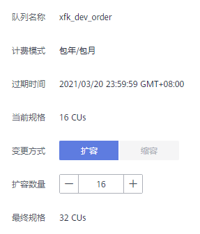
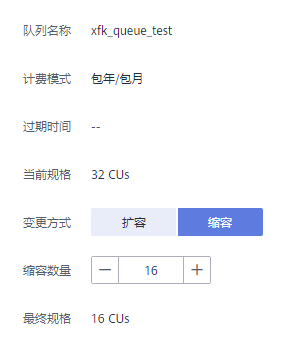

# 规格变更

## 前提条件

新创建的包年包月计费队列需要运行作业后才可进行规格变更。

## 注意事项

-   目前只支持64CUs以上规格包年包月队列进行规格变更。
-   如果在“规格变更”页面提示“Status of queue xxx is assigning, which is not available”，表示需要等待队列资源分配完毕才可进行扩缩容。

## 扩容

当前队列规格不满足业务需要时，可以通过手动变更队列规格来扩容当前队列。

> **说明：** 
>扩容属于耗时操作，在DLI“规格变更“页面执行扩容操作后，需要等待大约10分钟，具体时长和扩容的CU值有关，等待一段时间后，可以通过刷新“队列管理“页面，对比“规格“和“实际CUs“大小是否一致来判断是否扩容成功。或者在“作业管理”页面，查看“SCALE\_QUEUE”类型SQL作业的状态，如果作业状态为“规格变更中”，表示队列正在扩容中。

操作步骤如下：

1.  在DLI管理控制台左侧，选择“队列管理“。
2.  选择需要扩容的队列，单击“操作“列“更多”中的“规格变更”。
3.  在“规格变更“页面，“变更方式“选择“扩容”，设置扩容的CU值。

    **图 1**  扩容  
    

4.  确定费用后，单击“去支付”。

## 缩容

当计算业务较小，不需要那么大的队列规格时，可以通过手动变更队列规格来缩容当前队列。

> **说明：** 
>-   缩容属于耗时操作，在DLI“规格变更“页面执行缩容操作后，需要等待大约10分钟，具体时长和缩容的CU值有关，等待一段时间后，可以通过刷新“队列管理“页面，对比“规格“和“实际CUs“大小是否一致来判断是否缩容成功。或者在“作业管理”页面，查看“SCALE\_QUEUE”类型SQL作业的状态，如果作业状态为“规格变更中”，表示队列正在缩容中。
>-   系统不保证完全缩容到设定的目标大小。如果当前队列正在使用或者队列业务量比较大，会出现缩容不成功，或者缩容一部分规格的情况。
>-   系统默认最小CU值为16CU，即当队列规格为16CUs时，不能进行手动缩容。

操作步骤如下：

1.  在DLI管理控制台左侧，选择“队列管理“。
2.  选择需要缩容的队列，单击“操作“列“更多”中的“规格变更”。
3.  在“规格变更“页面，“变更方式“选择“缩容”，设置缩容的CU值。

    **图 2**  手动缩容  
    

4.  确定费用后，单击“去支付”。

