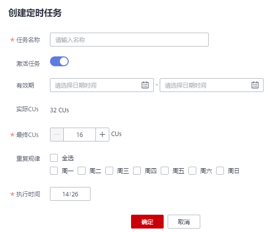

# 规格变更定时任务（定时扩容/缩容）

## 规格变更定时任务使用场景

通常，用户业务繁忙的场景是有周期性的，在某个周期内，用户需要更多的计算资源来处理业务，过了这个周期，则不需要那么多资源。如果用户购买的队列规格比较小，在业务繁忙时会存在资源不足的情况；而如果购买的队列规格比较大，又可能会存在资源浪费的情况。

基于以上场景，DLI提供了队列规格变更定时任务功能。用户可以根据自己的业务周期或者使用情况，基于现有队列规格，在不同的时间或者周期内设置不同的队列大小，以满足自己的业务需求，节约成本。

## 使用规格变更定时任务注意事项

-   对于每个按需队列，最多支持创建12个定时任务。
-   每个定时任务开始时，规格变更的实际开始的时间有5分钟误差。建议扩容时间定时至少比实际使用队列的时间提前20分钟。
-   每个定时任务之间需要至少有2小时的间隔。
-   队列的规格变更属于耗时操作，变更所消耗的时间取决于扩缩容目标规格与当前规格的差值大小，用户在“队列管理“页面中可以查看当前队列的规格。
-   如果当前队列有作业正在运行时，可能无法缩容到目标CU值，而是缩容到当前队列规格和目标规格中间的某个值，系统将在1小时后继续尝试进行缩容，直至下一个定时任务开始。
-   当一个定时任务没有扩容或者缩容到目标CU值时，系统会在1小时后再次触发扩缩计划，直到下一个定时任务开始。
-   定时任务的“任务名称“、“最终规格“和“执行时间“是创建和修改定时任务时的必选项，用户可根据业务需要进行填写。
-   定时任务的“重复规律“支持按周为周期进行调度。
    -   默认不选，表示“不重复”，即只在“执行时间”执行一次；
    -   如果全选，表示该计划每天都会执行；
    -   如果选择部分，则选择规律的计划在对应的时间每周都会被执行一次。

## 创建规格变更定时任务

-   如果只设定扩容或者缩容，只需创建一个规格变更定时任务。设定“任务名称“、“最终规格“和“执行时间“即可，具体请参考[表1](#table15710625151416)。
-   如果需要同时设定扩容和缩容，则需要创建两个规格变更定时任务，分别设定扩容和缩容的“任务名称“、“最终规格“和“执行时间“，具体请参考[表1](#table15710625151416)。

操作步骤如下：

1.  在DLI管理控制台左侧，选择“队列管理“。
2.  选择需要设置规格变更定时任务的队列，单击“操作“列“更多”中的“规格变更定时任务”。
3.  在“规格变更定时任务“页面，单击右上角的“创建定时任务“。
4.  在“创建定时任务“页面，设置参数。单击“确定”。

    **图 1**  创建定时任务  
    

    **表 1**  参数说明

    
    <table><thead align="left"><tr id="row1771212551410"><th class="cellrowborder" valign="top" width="14.149999999999999%" id="mcps1.2.3.1.1">
参数名称

    </th>
    <th class="cellrowborder" valign="top" width="85.85000000000001%" id="mcps1.2.3.1.2">
描述

    </th>
    </tr>
    </thead>
    <tbody><tr id="row207191525121418"><td class="cellrowborder" valign="top" width="14.149999999999999%" headers="mcps1.2.3.1.1 ">
任务名称

    </td>
    <td class="cellrowborder" valign="top" width="85.85000000000001%" headers="mcps1.2.3.1.2 ">
输入定时任务的名称。

    <ul id="ul6086155113624"><li>只能包含数字、英文字母和下划线，但不能是纯数字，不能以下划线开头，且不能为空。</li><li>输入长度不能超过128个字符。</li></ul>
    </td>
    </tr>
    <tr id="row1273232517141"><td class="cellrowborder" valign="top" width="14.149999999999999%" headers="mcps1.2.3.1.1 ">
激活

    </td>
    <td class="cellrowborder" valign="top" width="85.85000000000001%" headers="mcps1.2.3.1.2 ">
激活队列扩缩容定时任务。默认为“激活”，如果选择“不激活”，则系统不会触发执行当前设置的定时规格变更任务。

    </td>
    </tr>
    <tr id="row448155491219"><td class="cellrowborder" valign="top" width="14.149999999999999%" headers="mcps1.2.3.1.1 ">
有效期

    </td>
    <td class="cellrowborder" valign="top" width="85.85000000000001%" headers="mcps1.2.3.1.2 ">
设置执行定时任务的时间段。包括“日期”和“时间”。如果没有时间段的限制，该参数值为空即可，表示永久生效，如果用户需要指定当前任务的生效时间段，可根据业务需要进行选择。

    
 说明： 
<ul id="ul821572214316"><li>“有效期”中的“开始时间”需要晚于当前的系统时间。</li><li>如果只设置了扩容，在“有效期”结束之后，系统不会自动缩容，需要手动修改或设置缩容定时任务。反之亦然。即为单次执行定时扩缩容。</li><li>如果同时设置了扩容和缩容，在有效期内会按照设定扩缩容，在“有效期”结束之后，将保持最后一次设定的队列规格。</li></ul>
    

    </td>
    </tr>
    <tr id="row104915420127"><td class="cellrowborder" valign="top" width="14.149999999999999%" headers="mcps1.2.3.1.1 ">
当前规格

    </td>
    <td class="cellrowborder" valign="top" width="85.85000000000001%" headers="mcps1.2.3.1.2 ">
队列扩容或缩容前的规格。

    </td>
    </tr>
    <tr id="row196301113132119"><td class="cellrowborder" valign="top" width="14.149999999999999%" headers="mcps1.2.3.1.1 ">
最终规格

    </td>
    <td class="cellrowborder" valign="top" width="85.85000000000001%" headers="mcps1.2.3.1.2 ">
队列扩容或缩容后的规格。

    
 说明： 
<ul id="ul035715239466"><li>系统默认队列最大规格为512CUs。</li><li>系统默认队列最小规格为16CUs，所以当“原有规格”为16CUs时，不能进行缩容。</li><li>最终规格只能为16的倍数。</li></ul>
    

    </td>
    </tr>
    <tr id="row3630121319213"><td class="cellrowborder" valign="top" width="14.149999999999999%" headers="mcps1.2.3.1.1 ">
执行周期

    </td>
    <td class="cellrowborder" valign="top" width="85.85000000000001%" headers="mcps1.2.3.1.2 ">
选择执行定时扩缩容的周期。

    
 说明： 
<ul id="ul10455141717461"><li>如果只是单次执行扩容或者缩容，无需选择“执行周期”。</li><li>如果同时设置了扩缩容，可根据需要选择“执行周期”，还可与“有效期”进行配合使用。</li></ul>
    

    </td>
    </tr>
    <tr id="row663115138214"><td class="cellrowborder" valign="top" width="14.149999999999999%" headers="mcps1.2.3.1.1 ">
执行时间

    </td>
    <td class="cellrowborder" valign="top" width="85.85000000000001%" headers="mcps1.2.3.1.2 ">
执行定时扩容或者缩容的时间。

    </td>
    </tr>
    </tbody>
    </table>

    定时任务创建后，可以在“规格变更定时任务“页面查看当前队列的规格变化情况，以及计划最近一次的执行时间。

## 修改规格变更定时任务

如果设定的定时任务不再满足业务需求，可以在“规格变更定时任务“页面，单击对应定时任务“操作“列中的“修改”，进入“创建定时任务“页面进行修改。

## 删除规格变更定时任务

如果不再需要定时修改队列规格，可以在“规格变更定时任务“页面，单击对应定时任务“操作“列中的“删除”，进入“删除定时任务“页面，单击“确定”，进行删除。

