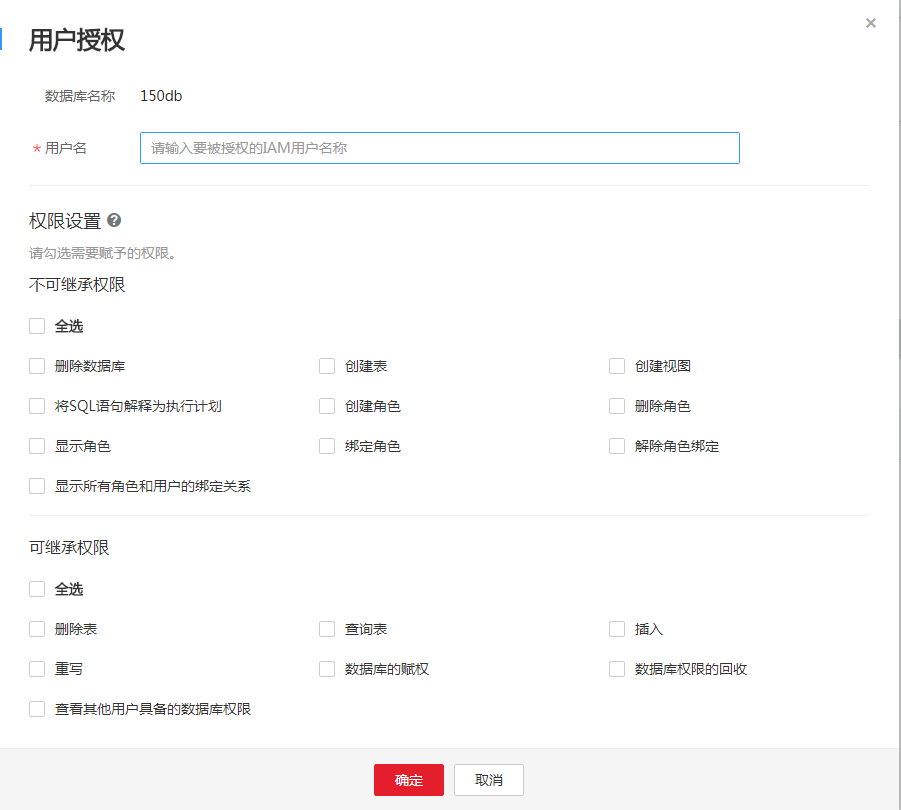
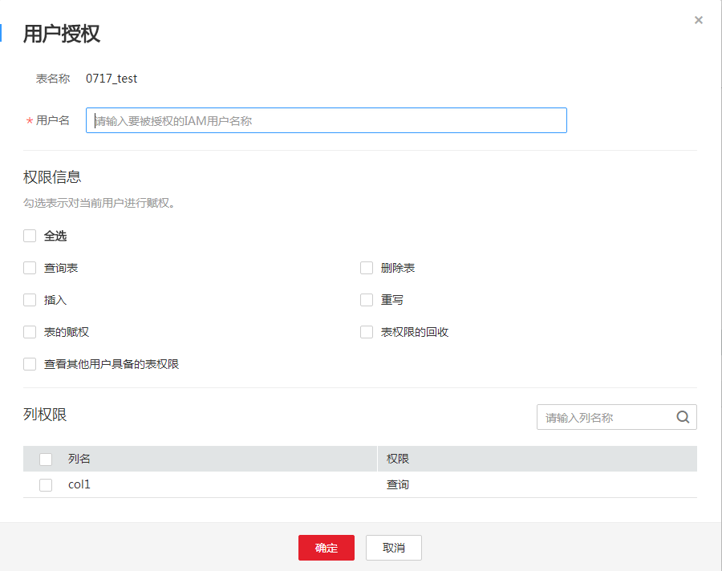
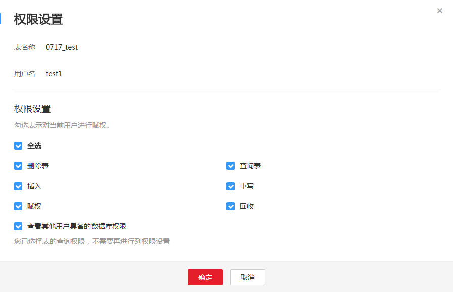

# 设置数据权限

## 操作场景

用户可针对数据库或表进行权限设置。

-   数据库和表赋权对象具有层级关系，用户赋予上一层级的权限会自动继承到下一层级对象上，层级关系为：数据库\>表\>列。
-   列只能继承查询权限。“可继承权限“详细信息参见数据库权限设置的[表2](#dli_01_0009_table4829074510515)。
-   回收权限时，只能在初始赋权的层级上回收。在哪一层赋权的，在哪一层进行权限回收。赋予权限和回收权限需要在同一层级操作。例如：在数据库上给用户赋予插入权限，那么在数据库下面的表就有了插入权限，回收这个插入权限，只能在数据库上回收，不能在表上回收。
-   数据库所有者、表所有者、被赋予“赋权权限“的用户都可以对数据库和表赋权。
-   管理员用户和数据库所有者拥有所有数据库权限，不需要再进行赋权和权限回收操作。
-   给新用户设置数据权限时，该用户所在用户组的所属区域需具有Tenant Guest权限。关于Tenant Guest权限的介绍和开通方法，详细参见《[权限说明](http://support.huaweicloud.com/usermanual-permissions/zh-cn_topic_0063498930.html)》和《统一身份认证服务用户指南》中的[如何创建用户组并授权](http://support.huaweicloud.com/usermanual-iam/zh-cn_topic_0046611269.html)。

## 设置数据库权限

1.  在SQL作业管理控制台的顶部菜单栏中，选择“数据管理“。
2.  选中数据库，在右侧数据库“权限信息“页面，您可以设置数据库权限。

    权限设置有3种场景：为新用户赋予权限、为已有权限的用户修改权限、回收某用户具备的所有权限。

    -   为新用户赋予权限，新用户指之前不具备此数据库权限的用户。
        1.  在“权限信息“右侧，单击“用户授权“。
        2.  在“用户授权“弹出框中，填写用户名，选择对应权限。

            待设置的参数说明如[表1](#dli_01_0009_table73921644690)所示。

            **图 1**  数据库权限授权  
            

            **表 1**  参数说明

            
            <table><thead align="left"><tr id="dli_01_0009_row3397144416920"><th class="cellrowborder" valign="top" width="20.11%" id="mcps1.2.3.1.1">
参数

            </th>
            <th class="cellrowborder" valign="top" width="79.89%" id="mcps1.2.3.1.2">
描述

            </th>
            </tr>
            </thead>
            <tbody><tr id="dli_01_0009_row640404417918"><td class="cellrowborder" valign="top" width="20.11%" headers="mcps1.2.3.1.1 ">
数据库名称

            </td>
            <td class="cellrowborder" valign="top" width="79.89%" headers="mcps1.2.3.1.2 ">
待设置权限的数据库名称。

            </td>
            </tr>
            <tr id="dli_01_0009_row10409104415914"><td class="cellrowborder" valign="top" width="20.11%" headers="mcps1.2.3.1.1 ">
用户名

            </td>
            <td class="cellrowborder" valign="top" width="79.89%" headers="mcps1.2.3.1.2 ">
对数据库新增用户时，输入用户名称。

            </td>
            </tr>
            <tr id="dli_01_0009_row24162449911"><td class="cellrowborder" valign="top" width="20.11%" headers="mcps1.2.3.1.1 ">
不可继承权限

            </td>
            <td class="cellrowborder" valign="top" width="79.89%" headers="mcps1.2.3.1.2 ">
选中权限即对用户进行赋权，取消勾选即对用户权限进行回收。不可继承权限是只作用在当前数据库的权限。不可继承权限有以下类别。

            <ul id="dli_01_0009_ul942119441791"><li>删除数据库：删除当前数据库。</li><li>创建表：在当前数据库创建表。</li><li>创建视图：在当前数据库下创建视图。</li><li>将SQL语句解释为执行计划：执行explain语句。</li><li>创建角色：在当前数据库创建角色。</li><li>删除角色：删除当前数据库下的角色。</li><li>显示角色：显示当前用户的角色。</li><li>绑定角色：在当前数据库绑定角色。</li><li>解除角色绑定：在当前数据库解除角色绑定。</li><li>显示所有角色和用户的绑定关系：显示所有角色和用户的绑定关系。</li></ul>
            </td>
            </tr>
            <tr id="dli_01_0009_row84385441796"><td class="cellrowborder" valign="top" width="20.11%" headers="mcps1.2.3.1.1 ">
可继承权限

            </td>
            <td class="cellrowborder" valign="top" width="79.89%" headers="mcps1.2.3.1.2 ">
选中权限即对用户进行赋权，取消勾选即对用户权限进行回收。可继承权限可作用到当前数据库及其所有的表上，但是表中的列只能继承其中的查询权限。可继承权限有以下类别。

            <ul id="dli_01_0009_ul544514410918"><li>删除表：删除数据库下的表。</li><li>查询表：在当前表内查询。</li><li>插入：在当前表内插入数据。</li><li>重写：在当前表内插入覆盖数据。</li><li>数据库的赋权：用户可将数据库的权限赋予其他用户。</li><li>数据库权限的回收：用户可回收其他用户具备的此数据库的权限，并且不能回收数据库所有者的权限。</li><li>查看其他用户具备的数据库权限：用户可查看其他用户具备的当前数据库的权限。</li></ul>
            </td>
            </tr>
            </tbody>
            </table>

    -   某用户已具备此数据库的一些权限，为此用户赋予或回收权限。
        1.  在“权限信息“列表中找到需要设置权限的用户。
        2.  单击“权限设置“，弹出“数据库权限设置“对话框。

            当“权限设置“中的选项为灰色时，表示您不具备修改此数据库的权限。可以向管理员用户、数据库所有者等具有赋权权限的用户申请“数据库的赋权“和“数据库权限的回收“权限。

            **图 2**  数据库权限设置  
            

            待设置的参数说明如[表2](#dli_01_0009_table4829074510515)所示。

            **表 2**  参数说明

            
            <table><thead align="left"><tr id="dli_01_0009_row4447732810515"><th class="cellrowborder" valign="top" width="20.11%" id="mcps1.2.3.1.1">
参数

            </th>
            <th class="cellrowborder" valign="top" width="79.89%" id="mcps1.2.3.1.2">
描述

            </th>
            </tr>
            </thead>
            <tbody><tr id="dli_01_0009_row6533120014359"><td class="cellrowborder" valign="top" width="20.11%" headers="mcps1.2.3.1.1 ">
数据库名称

            </td>
            <td class="cellrowborder" valign="top" width="79.89%" headers="mcps1.2.3.1.2 ">
待设置权限的数据库名称。

            </td>
            </tr>
            <tr id="dli_01_0009_row5916648010515"><td class="cellrowborder" valign="top" width="20.11%" headers="mcps1.2.3.1.1 ">
用户名

            </td>
            <td class="cellrowborder" valign="top" width="79.89%" headers="mcps1.2.3.1.2 ">
待设置权限的用户名称。

            </td>
            </tr>
            <tr id="dli_01_0009_row346352010515"><td class="cellrowborder" valign="top" width="20.11%" headers="mcps1.2.3.1.1 ">
不可继承权限

            </td>
            <td class="cellrowborder" valign="top" width="79.89%" headers="mcps1.2.3.1.2 ">
选中权限即对用户进行赋权，取消勾选即对用户权限进行回收。不可继承权限是只作用在当前数据库的权限。不可继承权限有以下类别。

            <ul id="dli_01_0009_ul2010855810520"><li>删除数据库：删除当前数据库。</li><li>创建表：在当前数据库创建表。</li><li>创建视图：在当前数据库下创建视图。</li><li>将SQL语句解释为执行计划：执行explain语句。</li><li>创建角色：在当前数据库创建角色。</li><li>删除角色：删除当前数据库下的角色。</li><li>显示角色：显示当前用户的角色。</li><li>绑定角色：在当前数据库绑定角色。</li><li>解除角色绑定：在当前数据库解除角色绑定。</li><li>显示所有角色和用户的绑定关系：显示所有角色和用户的绑定关系。</li></ul>
            </td>
            </tr>
            <tr id="dli_01_0009_row3669136810515"><td class="cellrowborder" valign="top" width="20.11%" headers="mcps1.2.3.1.1 ">
可继承权限

            </td>
            <td class="cellrowborder" valign="top" width="79.89%" headers="mcps1.2.3.1.2 ">
选中权限即对用户进行赋权，取消勾选即对用户权限进行回收。可继承权限可作用到当前数据库及其所有的表上，但是表中的列只能继承其中的查询权限。可继承权限有以下类别。

            <ul id="dli_01_0009_ul6433811310520"><li>删除表：删除数据库下的表。</li><li>查询表：在当前表内查询。</li><li>插入：在当前表内插入数据。</li><li>重写：在当前表内插入覆盖数据。</li><li>数据库的赋权：用户可将数据库的权限赋予其他用户。</li><li>数据库权限的回收：用户可回收其他用户具备的此数据库的权限，并且不能回收数据库所有者的权限。</li><li>查看其他用户具备的数据库权限：用户可查看其他用户具备的当前数据库的权限。</li></ul>
            </td>
            </tr>
            </tbody>
            </table>

    -   回收某用户具备的所有权限。

        在“权限信息“区域的用户列表中，选择需要回收权限的用户，在“操作“列单击“回收用户权限“，确定后，此用户将不具备数据库的任意权限。

3.  单击“确定“，完成权限设置。

## 设置表权限

1.  在SQL作业管理控制台的顶部菜单栏中，选择“数据管理“。
2.  单击表对应数据库的  ，展开该数据库下的表。
3.  选中目标表，在“详情“页面，显示该表的信息，您可以设置表权限。

    权限设置有3种场景：为新用户赋予权限，为已有权限的用户修改权限，回收某用户具备的所有权限。如下以DLI表设置权限为例。

    -   为新用户赋予权限，新用户指之前不具备此表任何权限的用户。

        单击“权限信息“右侧的“用户授权“按钮。弹出“用户授权“对话框。

        **图 3**  表权限授权  
        

        待设置的参数说明如[表3](#dli_01_0009_table59929191134115)所示。

        **表 3**  参数配置

        
        <table><thead align="left"><tr id="dli_01_0009_row36215553134115"><th class="cellrowborder" valign="top" width="21.060000000000002%" id="mcps1.2.3.1.1">
参数

        </th>
        <th class="cellrowborder" valign="top" width="78.94%" id="mcps1.2.3.1.2">
描述

        </th>
        </tr>
        </thead>
        <tbody><tr id="dli_01_0009_row61598315165931"><td class="cellrowborder" valign="top" width="21.060000000000002%" headers="mcps1.2.3.1.1 ">
表名称

        </td>
        <td class="cellrowborder" valign="top" width="78.94%" headers="mcps1.2.3.1.2 ">
待设置权限的表名称。

        </td>
        </tr>
        <tr id="dli_01_0009_row10277147134115"><td class="cellrowborder" valign="top" width="21.060000000000002%" headers="mcps1.2.3.1.1 ">
用户名

        </td>
        <td class="cellrowborder" valign="top" width="78.94%" headers="mcps1.2.3.1.2 ">
对表新增用户时，输入用户名称。

        </td>
        </tr>
        <tr id="dli_01_0009_row56945626134115"><td class="cellrowborder" valign="top" width="21.060000000000002%" headers="mcps1.2.3.1.1 ">
权限设置

        </td>
        <td class="cellrowborder" valign="top" width="78.94%" headers="mcps1.2.3.1.2 ">
选中权限后即对用户进行赋权，取消后对用户权限进行收回。包含如下权限类型。

        <ul id="dli_01_0009_ul21390899134732"><li>删除表：删除当前表。</li><li>查询表：在当前表内查询数据。</li><li>插入：在当前表内插入数据。</li><li>重写：在当前表内插入覆盖数据。</li><li>赋权：当前用户可将表的权限赋予其他用户。</li><li>回收：当前用户可回收其他用户具备的此表的权限，并且不能回收表所有者的权限。</li><li>查看其他用户具备的表权限：查看其它用户具备的当前表的权限。</li></ul>
        </td>
        </tr>
        <tr id="dli_01_0009_row53170989171453"><td class="cellrowborder" valign="top" width="21.060000000000002%" headers="mcps1.2.3.1.1 ">
列权限/继承权限

        </td>
        <td class="cellrowborder" valign="top" width="78.94%" headers="mcps1.2.3.1.2 "><ul id="dli_01_0009_ul6200068717152"><li>当表类型为view的时候没有列权限。</li><li>用户具有查询表的权限时，列权限自动隐藏。</li></ul>
        </td>
        </tr>
        </tbody>
        </table>

    -   某用户已具备此表的一些权限，为此用户赋予或回收权限。

        在“权限信息“列表中找到需要设置权限的用户，单击“权限设置“，弹出“表权限设置“对话框。

        当“权限设置“中的选项为灰色时，表示您不具备修改此表的权限。可以向管理员用户、表所有者等具有赋权权限的用户申请“表的赋权“和“表权限的回收“权限。

        **图 4**  表权限设置  
        

        待设置的参数说明如[表4](#dli_01_0009_table877193418208)所示。

        **表 4**  参数配置

        
        <table><thead align="left"><tr id="dli_01_0009_row167796345208"><th class="cellrowborder" valign="top" width="21.060000000000002%" id="mcps1.2.3.1.1">
参数

        </th>
        <th class="cellrowborder" valign="top" width="78.94%" id="mcps1.2.3.1.2">
描述

        </th>
        </tr>
        </thead>
        <tbody><tr id="dli_01_0009_row1786103410208"><td class="cellrowborder" valign="top" width="21.060000000000002%" headers="mcps1.2.3.1.1 ">
表名称

        </td>
        <td class="cellrowborder" valign="top" width="78.94%" headers="mcps1.2.3.1.2 ">
待设置权限的表名称。

        </td>
        </tr>
        <tr id="dli_01_0009_row1379211344206"><td class="cellrowborder" valign="top" width="21.060000000000002%" headers="mcps1.2.3.1.1 ">
用户名

        </td>
        <td class="cellrowborder" valign="top" width="78.94%" headers="mcps1.2.3.1.2 ">
待设置权限的用户名称。

        </td>
        </tr>
        <tr id="dli_01_0009_row480433419204"><td class="cellrowborder" valign="top" width="21.060000000000002%" headers="mcps1.2.3.1.1 ">
权限设置

        </td>
        <td class="cellrowborder" valign="top" width="78.94%" headers="mcps1.2.3.1.2 ">
选中权限后即对用户进行赋权，取消后对用户权限进行收回。包含如下权限类型。

        <ul id="dli_01_0009_ul7809183442019"><li>删除表：删除当前表。</li><li>查询表：在当前表内查询数据。</li><li>插入：在当前表内插入数据。</li><li>重写：在当前表内插入覆盖数据。</li><li>赋权：当前用户可将表的权限赋予其他用户。</li><li>回收：当前用户可回收其他用户具备的此表的权限，并且不能回收表所有者的权限。</li><li>查看其他用户具备的表权限：查看其它用户具备的当前表的权限。</li></ul>
        </td>
        </tr>
        </tbody>
        </table>

    -   回收某用户具备的所有权限。

        选中目标表，在“权限信息“区域的用户列表中，选择需要回收权限的用户，在“操作“列单击“回收用户权限”。确定后，此用户将不具备表的任意权限。

    DLI表、OBS表和View权限的设置请参见[表3](#dli_01_0009_table59929191134115)和[表4](#dli_01_0009_table877193418208)配置相关参数。DLI分区表权限的设置请参见[表5](#dli_01_0009_table6835420172015)配置相关参数。OBS分区表权限的设置请参见[表6](#dli_01_0009_table128361220102017)配置相关参数。

    **表 5**  DLI分区表权限设置参数说明

    
    <table><thead align="left"><tr id="dli_01_0009_row48336203204"><th class="cellrowborder" valign="top" width="21.05%" id="mcps1.2.3.1.1">
参数

    </th>
    <th class="cellrowborder" valign="top" width="78.95%" id="mcps1.2.3.1.2">
描述

    </th>
    </tr>
    </thead>
    <tbody><tr id="dli_01_0009_row983532015207"><td class="cellrowborder" valign="top" width="21.05%" headers="mcps1.2.3.1.1 ">
权限设置

    </td>
    <td class="cellrowborder" valign="top" width="78.95%" headers="mcps1.2.3.1.2 "><ul id="dli_01_0009_ul158330203209"><li>删除分区表的分区：删除当前分区表中任一分区。</li><li>显示所有分区：查看当前表的所有分区。</li></ul>
    </td>
    </tr>
    </tbody>
    </table>

    **表 6**  OBS分区表权限设置参数说明

    
    <table><thead align="left"><tr id="dli_01_0009_row983562013202"><th class="cellrowborder" valign="top" width="21.05%" id="mcps1.2.3.1.1">
参数

    </th>
    <th class="cellrowborder" valign="top" width="78.95%" id="mcps1.2.3.1.2">
描述

    </th>
    </tr>
    </thead>
    <tbody><tr id="dli_01_0009_row198358204202"><td class="cellrowborder" valign="top" width="21.05%" headers="mcps1.2.3.1.1 ">
权限设置

    </td>
    <td class="cellrowborder" valign="top" width="78.95%" headers="mcps1.2.3.1.2 "><ul id="dli_01_0009_ul1583513208204"><li>在分区表中添加分区：在当前分区表中再增加一个分区。</li><li>删除分区表的分区：删除当前分区表中任一分区。</li><li>设置分区的路径：设置和更改分区路径。</li><li>显示所有分区：查看当前表的所有分区。</li></ul>
    </td>
    </tr>
    </tbody>
    </table>

4.  单击“确定“，完成表权限设置。

