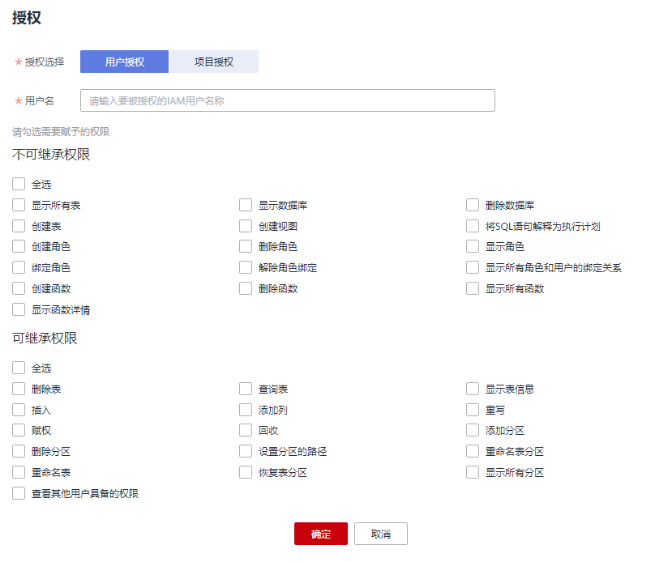
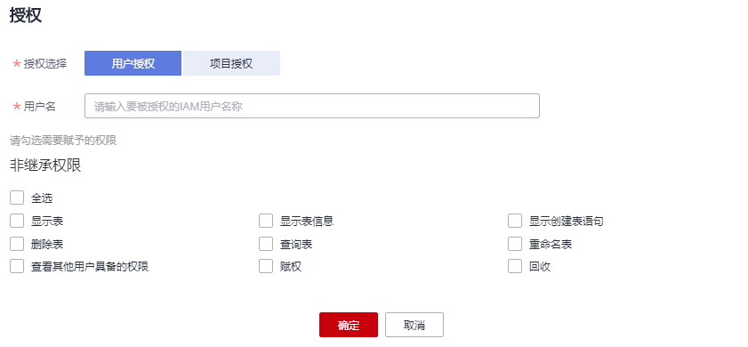

# 设置数据权限

## 操作场景

用户可针对数据库或表进行权限设置。

-   数据库和表赋权对象具有层级关系，用户赋予上一层级的权限会自动继承到下一层级对象上，层级关系为：数据库\>表\>列。
-   列只能继承查询权限。“可继承权限“详细信息参见数据库权限设置的[表1](#table88751410195512)。
-   回收权限时，只能在初始赋权的层级上回收。在哪一层赋权的，在哪一层进行权限回收。赋予权限和回收权限需要在同一层级操作。例如：在数据库上给用户赋予插入权限，那么在数据库下面的表就有了插入权限，回收这个插入权限，只能在数据库上回收，不能在表上回收。
-   数据库所有者、表所有者、被赋予“赋权权限“的用户都可以对数据库和表赋权。
-   管理员用户和数据库所有者拥有所有数据库权限，不需要再进行赋权和权限回收操作。
-   给新用户设置数据权限时，该用户所在用户组的所属区域需具有DLI Service User权限。关于DLI Service User权限的介绍和开通方法，详细参见《[权限说明](http://support.huaweicloud.com/usermanual-permissions/zh-cn_topic_0063498930.html)》中对数据湖探索DLI的描述和《统一身份认证服务用户指南》中的[如何创建用户组并授权](http://support.huaweicloud.com/usermanual-iam/zh-cn_topic_0046611269.html)。

## 设置数据库权限

1.  在SQL作业管理控制台的顶部菜单栏中，选择“数据管理“。
2.  单击所选数据库名称左侧，或“操作”栏中的“权限管理”，将显示该数据库对应的权限信息。

    **图 1**  数据库权限信息  
    

    权限设置有3种场景：为新用户赋予权限、为已有权限的用户修改权限、回收某用户具备的所有权限。

    -   为新用户赋予权限，新用户指之前不具备此数据库权限的用户。
        1.  在“权限信息“右侧，单击“用户授权“。
        2.  在“用户授权“弹出框中，填写用户名，选择相应权限。具体权限说明请参考[表1](#table88751410195512)。

            **图 2**  数据库用户授权  
            

            **表 1**  参数说明

            
            <table><thead align="left"><tr id="row1387220108558"><th class="cellrowborder" valign="top" width="16.96%" id="mcps1.2.3.1.1">
参数

            </th>
            <th class="cellrowborder" valign="top" width="83.04%" id="mcps1.2.3.1.2">
描述

            </th>
            </tr>
            </thead>
            <tbody><tr id="row108739104559"><td class="cellrowborder" valign="top" width="16.96%" headers="mcps1.2.3.1.1 ">
数据库名称

            </td>
            <td class="cellrowborder" valign="top" width="83.04%" headers="mcps1.2.3.1.2 ">
待设置权限的数据库名称。

            </td>
            </tr>
            <tr id="row10873810105520"><td class="cellrowborder" valign="top" width="16.96%" headers="mcps1.2.3.1.1 ">
用户名

            </td>
            <td class="cellrowborder" valign="top" width="83.04%" headers="mcps1.2.3.1.2 ">
对数据库新增用户时，输入对应的IAM用户名称。

            </td>
            </tr>
            <tr id="row12874910135518"><td class="cellrowborder" valign="top" width="16.96%" headers="mcps1.2.3.1.1 ">
不可继承权限

            </td>
            <td class="cellrowborder" valign="top" width="83.04%" headers="mcps1.2.3.1.2 ">
选中权限即对用户进行赋权，取消勾选即对用户权限进行回收。

            
不可继承权限是只作用在当前数据库的权限。不可继承权限有以下类别。

            <ul id="ul3874131035512"><li>删除数据库：删除当前数据库。</li><li>创建表：在当前数据库创建表。</li><li>创建视图：在当前数据库下创建视图。</li><li>将SQL语句解释为执行计划：执行explain语句。</li><li>创建角色：在当前数据库创建角色。</li><li>删除角色：删除当前数据库下的角色。</li><li>显示角色：显示当前用户的角色。</li><li>绑定角色：在当前数据库绑定角色。</li><li>解除角色绑定：在当前数据库解除角色绑定。</li><li>显示所有角色和用户的绑定关系：显示所有角色和用户的绑定关系。</li></ul>
            </td>
            </tr>
            <tr id="row487561075512"><td class="cellrowborder" valign="top" width="16.96%" headers="mcps1.2.3.1.1 ">
可继承权限

            </td>
            <td class="cellrowborder" valign="top" width="83.04%" headers="mcps1.2.3.1.2 ">
选中权限即对用户进行赋权，取消勾选即对用户权限进行回收。

            
可继承权限可作用到当前数据库及其所有的表上，但是表中的列只能继承其中的查询权限。可继承权限有以下类别。

            <ul id="ul14875111065516"><li>删除表：删除数据库下的表。</li><li>查询表：在当前表内查询。</li><li>插入：在当前表内插入数据。</li><li>添加列：在当前表中增加列。</li><li>重写：在当前表内插入覆盖数据。</li><li>数据库的赋权：用户可将数据库的权限赋予其他用户。</li><li>数据库权限的回收：用户可回收其他用户具备的此数据库的权限，并且不能回收数据库所有者的权限。</li><li>在分区表中添加分区：在分区表中添加新的分区。</li><li>删除分区表的分区：删除分区表中已有的分区。</li><li>设置分区的路径：将分区表中的某个分区路径设置为用户指定的OBS路径。</li><li>重命名表分区：对分区表中的分区重新命名。</li><li>重命名表：对表重新命名。</li><li>恢复表分区：从文件系统中导出分区信息保存到元数据中。</li><li>显示所有分区：显示分区表中的所有分区。</li><li>查看其他用户具备的数据库权限：用户可查看其他用户具备的当前数据库的权限。</li></ul>
            </td>
            </tr>
            </tbody>
            </table>

    -   某用户已具备此数据库的一些权限时，可为此用户赋予或回收权限。
        1.  在“权限信息“列表中找到需要设置权限的用户。
        2.  单击“操作”栏中的“权限设置“，弹出“数据库权限设置“对话框。

            当“权限设置“中的选项为灰色时，表示您不具备修改此数据库的权限。可以向管理员用户、数据库所有者等具有赋权权限的用户申请“数据库的赋权“和“数据库权限的回收“权限。

            具体权限说明请参考[表2](#table13880181016556)。

            **图 3**  数据库权限设置  
            

            **表 2**  参数说明

            
            <table><thead align="left"><tr id="row6876141017552"><th class="cellrowborder" valign="top" width="17.26%" id="mcps1.2.3.1.1">
参数

            </th>
            <th class="cellrowborder" valign="top" width="82.74000000000001%" id="mcps1.2.3.1.2">
描述

            </th>
            </tr>
            </thead>
            <tbody><tr id="row1387816108555"><td class="cellrowborder" valign="top" width="17.26%" headers="mcps1.2.3.1.1 ">
数据库名称

            </td>
            <td class="cellrowborder" valign="top" width="82.74000000000001%" headers="mcps1.2.3.1.2 ">
待设置权限的数据库名称。

            </td>
            </tr>
            <tr id="row7878131095510"><td class="cellrowborder" valign="top" width="17.26%" headers="mcps1.2.3.1.1 ">
用户名

            </td>
            <td class="cellrowborder" valign="top" width="82.74000000000001%" headers="mcps1.2.3.1.2 ">
待设置权限的用户名称。

            </td>
            </tr>
            <tr id="row1687941019557"><td class="cellrowborder" valign="top" width="17.26%" headers="mcps1.2.3.1.1 ">
不可继承权限

            </td>
            <td class="cellrowborder" valign="top" width="82.74000000000001%" headers="mcps1.2.3.1.2 ">
选中权限即对用户进行赋权，取消勾选即对用户权限进行回收。

            
不可继承权限是只作用在当前数据库的权限。不可继承权限有以下类别。

            <ul id="ul88796102555"><li>删除数据库：删除当前数据库。</li><li>创建表：在当前数据库创建表。</li><li>创建视图：在当前数据库下创建视图。</li><li>将SQL语句解释为执行计划：执行explain语句。</li><li>创建角色：在当前数据库创建角色。</li><li>删除角色：删除当前数据库下的角色。</li><li>显示角色：显示当前用户的角色。</li><li>绑定角色：在当前数据库绑定角色。</li><li>解除角色绑定：在当前数据库解除角色绑定。</li><li>显示所有角色和用户的绑定关系：显示所有角色和用户的绑定关系。</li></ul>
            </td>
            </tr>
            <tr id="row1988011075514"><td class="cellrowborder" valign="top" width="17.26%" headers="mcps1.2.3.1.1 ">
可继承权限

            </td>
            <td class="cellrowborder" valign="top" width="82.74000000000001%" headers="mcps1.2.3.1.2 ">
选中权限即对用户进行赋权，取消勾选即对用户权限进行回收。

            
可继承权限可作用到当前数据库及其所有的表上，但是表中的列只能继承其中的查询权限。可继承权限有以下类别。

            <ul id="ul1288041035514"><li>删除表：删除数据库下的表。</li><li>查询表：在当前表内查询。</li><li>插入：在当前表内插入数据。</li><li>添加列：在当前表中增加列。</li><li>重写：在当前表内插入覆盖数据。</li><li>数据库的赋权：用户可将数据库的权限赋予其他用户。</li><li>数据库权限的回收：用户可回收其他用户具备的此数据库的权限，并且不能回收数据库所有者的权限。</li><li>在分区表中添加分区：在分区表中添加新的分区。</li><li>删除分区表的分区：删除分区表中已有的分区。</li><li>设置分区的路径：将分区表中的某个分区路径设置为用户指定的OBS路径。</li><li>重命名表分区：对分区表中的分区重新命名。</li><li>重命名表：对表重新命名。</li><li>恢复表分区：从文件系统中导出分区信息保存到元数据中。</li><li>显示所有分区：显示分区表中的所有分区。</li><li>查看其他用户具备的数据库权限：用户可查看其他用户具备的当前数据库的权限。</li></ul>
            </td>
            </tr>
            </tbody>
            </table>

    -   回收某用户具备的所有权限。

        在“权限信息“区域的用户列表中，选择需要回收权限的用户，在“操作“栏中单击“回收用户权限“，确定后，此用户将不具备数据库的任意权限。

3.  单击“确定“，完成权限设置。

## 设置表权限

1.  在SQL作业管理控制台的顶部菜单栏中，选择“数据管理“。
2.  单击需要设置权限的表所在的数据库名，进入该数据库的“表管理”页面。
3.  单击所选表名称左侧，或“操作”栏中的“权限管理”，将显示该表对应的权限信息。

    **图 4**  表权限信息  
    

    权限设置有3种场景：为新用户赋予权限，为已有权限的用户修改权限，回收某用户具备的所有权限。

    -   为新用户赋予权限，新用户指之前不具备此表任何权限的用户。
        1.  单击“权限信息“右侧的“用户授权“按钮。
        2.  在弹出的“用户授权“对话框中选择相应的权限。
            -   DLI表具体权限说明请参考[表3](#table59929191134115)。

                **图 5**  DLI表用户授权  
                

                **表 3**  参数配置

                
                <table><thead align="left"><tr id="row36215553134115"><th class="cellrowborder" valign="top" width="12.34%" id="mcps1.2.3.1.1">
参数

                </th>
                <th class="cellrowborder" valign="top" width="87.66000000000001%" id="mcps1.2.3.1.2">
描述

                </th>
                </tr>
                </thead>
                <tbody><tr id="row61598315165931"><td class="cellrowborder" valign="top" width="12.34%" headers="mcps1.2.3.1.1 ">
表名称

                </td>
                <td class="cellrowborder" valign="top" width="87.66000000000001%" headers="mcps1.2.3.1.2 ">
待设置权限的表名称。

                </td>
                </tr>
                <tr id="row10277147134115"><td class="cellrowborder" valign="top" width="12.34%" headers="mcps1.2.3.1.1 ">
用户名

                </td>
                <td class="cellrowborder" valign="top" width="87.66000000000001%" headers="mcps1.2.3.1.2 ">
对表新增用户时，输入用户名称。

                </td>
                </tr>
                <tr id="row56945626134115"><td class="cellrowborder" valign="top" width="12.34%" headers="mcps1.2.3.1.1 ">
权限设置

                </td>
                <td class="cellrowborder" valign="top" width="87.66000000000001%" headers="mcps1.2.3.1.2 ">
选中权限后即对用户进行赋权，取消后对用户权限进行收回。包含如下权限类型。

                <ul id="ul21390899134732"><li>查询表：在当前表内查询数据。</li><li>删除表：删除当前表。</li><li>重命名表：对当前表重新命名。</li><li>插入：在当前表内插入数据。</li><li>重写：在当前表内插入覆盖数据。</li><li>添加列：在当前表中增加列。</li><li>表的赋权：当前用户可将表的权限赋予其他用户。</li><li>表权限的回收：当前用户可回收其他用户具备的此表的权限，并且不能回收表所有者的权限。</li><li>查看其他用户具备的表权限：查看其它用户具备的当前表的权限。</li></ul>
                
分区表还具有以下权限：

                <ul id="ul03154293274"><li>删除分区表的分区：删除分区表中的分区。</li><li>显示所有分区：显示分区表中的所有分区。</li></ul>
                </td>
                </tr>
                <tr id="row53170989171453"><td class="cellrowborder" valign="top" width="12.34%" headers="mcps1.2.3.1.1 ">
列权限

                </td>
                <td class="cellrowborder" valign="top" width="87.66000000000001%" headers="mcps1.2.3.1.2 "><ul id="ul6200068717152"><li>表中的列只能继承查询权限。</li><li>用户具有查询表的权限时，列权限自动隐藏。</li></ul>
                </td>
                </tr>
                </tbody>
                </table>

            -   OBS表具体权限说明请参考[表4](#table91862012127)。

                **图 6**  OBS表用户授权  
                

                **表 4**  参数配置

                
                <table><thead align="left"><tr id="row15196419129"><th class="cellrowborder" valign="top" width="11.41%" id="mcps1.2.3.1.1">
参数

                </th>
                <th class="cellrowborder" valign="top" width="88.59%" id="mcps1.2.3.1.2">
描述

                </th>
                </tr>
                </thead>
                <tbody><tr id="row162071019122"><td class="cellrowborder" valign="top" width="11.41%" headers="mcps1.2.3.1.1 ">
表名称

                </td>
                <td class="cellrowborder" valign="top" width="88.59%" headers="mcps1.2.3.1.2 ">
待设置权限的表名称。

                </td>
                </tr>
                <tr id="row1521414161212"><td class="cellrowborder" valign="top" width="11.41%" headers="mcps1.2.3.1.1 ">
用户名

                </td>
                <td class="cellrowborder" valign="top" width="88.59%" headers="mcps1.2.3.1.2 ">
对表新增用户时，输入用户名称。

                </td>
                </tr>
                <tr id="row622213131217"><td class="cellrowborder" valign="top" width="11.41%" headers="mcps1.2.3.1.1 ">
权限设置

                </td>
                <td class="cellrowborder" valign="top" width="88.59%" headers="mcps1.2.3.1.2 ">
选中权限后即对用户进行赋权，取消后对用户权限进行收回。包含如下权限类型。

                <ul id="ul523017111129"><li>查询表：在当前表内查询数据。</li><li>删除表：删除当前表。</li><li>重命名表：对当前表重新命名。</li><li>插入：在当前表内插入数据。</li><li>重写：在当前表内插入覆盖数据。</li><li>添加列：在当前表中增加列。</li><li>表的赋权：当前用户可将表的权限赋予其他用户。</li><li>表权限的回收：当前用户可回收其他用户具备的此表的权限，并且不能回收表所有者的权限。</li><li>查看其他用户具备的表权限：查看其它用户具备的当前表的权限。</li></ul>
                
分区表还具有以下权限：

                <ul id="ul15369173610318"><li>在分区表中添加分区：在分区表中添加新的分区。</li><li>删除分区表的分区：删除分区表中的任意分区。</li><li>设置分区表的路径：将分区表中的某个分区路径设置为用户指定的OBS路径。</li><li>重命名表分区：对分区表中的分区重新命名。</li><li>恢复表分区：从文件系统中导出分区信息保存到元数据中。</li><li>显示所有分区：显示分区表中的所有分区。</li></ul>
                </td>
                </tr>
                <tr id="row142546116128"><td class="cellrowborder" valign="top" width="11.41%" headers="mcps1.2.3.1.1 ">
列权限

                </td>
                <td class="cellrowborder" valign="top" width="88.59%" headers="mcps1.2.3.1.2 "><ul id="ul226117111215"><li>表中的列只能继承查询权限。</li><li>用户具有查询表的权限时，列权限自动隐藏。</li></ul>
                </td>
                </tr>
                </tbody>
                </table>

            -   View具体权限说明请参考[表5](#table7906535527)。

                **图 7**  View用户授权  
                

                **表 5**  参数配置

                
                <table><thead align="left"><tr id="row492419315218"><th class="cellrowborder" valign="top" width="12.34%" id="mcps1.2.3.1.1">
参数

                </th>
                <th class="cellrowborder" valign="top" width="87.66000000000001%" id="mcps1.2.3.1.2">
描述

                </th>
                </tr>
                </thead>
                <tbody><tr id="row79361534528"><td class="cellrowborder" valign="top" width="12.34%" headers="mcps1.2.3.1.1 ">
表名称

                </td>
                <td class="cellrowborder" valign="top" width="87.66000000000001%" headers="mcps1.2.3.1.2 ">
待设置权限的表名称。

                </td>
                </tr>
                <tr id="row19452313529"><td class="cellrowborder" valign="top" width="12.34%" headers="mcps1.2.3.1.1 ">
用户名

                </td>
                <td class="cellrowborder" valign="top" width="87.66000000000001%" headers="mcps1.2.3.1.2 ">
对表新增用户时，输入用户名称。

                </td>
                </tr>
                <tr id="row17955173175217"><td class="cellrowborder" valign="top" width="12.34%" headers="mcps1.2.3.1.1 ">
权限设置

                </td>
                <td class="cellrowborder" valign="top" width="87.66000000000001%" headers="mcps1.2.3.1.2 ">
选中权限后即对用户进行赋权，取消后对用户权限进行收回。包含如下权限类型。

                <ul id="ul1696412320520"><li>删除表：删除当前表。</li><li>查询表：在当前表内查询数据。</li><li>重命名表：对当前表重新进行命名。</li><li>表的赋权：当前用户可将表的权限赋予其他用户。</li><li>表权限的回收：当前用户可回收其他用户具备的此表的权限，并且不能回收表所有者的权限。</li><li>查看其他用户具备的表权限：查看其它用户具备的当前表的权限。</li></ul>
                </td>
                </tr>
                </tbody>
                </table>

    -   某用户已具备此表的一些权限时，可为此用户赋予或回收权限。
        1.  在“权限信息“列表中找到需要设置权限的用户，单击“操作”栏中的“权限设置“。
        2.  在弹出“权限设置“对话框设置权限。

            当“权限设置“中的选项为灰色时，表示您不具备修改此表的权限。可以向管理员用户、表所有者等具有赋权权限的用户申请“表的赋权“和“表权限的回收“权限。

            -   DLI表权限说明请参考[表6](#table877193418208)。

                **图 8**  DLI表权限设置  
                

                **表 6**  参数配置

                
                <table><thead align="left"><tr id="row167796345208"><th class="cellrowborder" valign="top" width="12.19%" id="mcps1.2.3.1.1">
参数

                </th>
                <th class="cellrowborder" valign="top" width="87.81%" id="mcps1.2.3.1.2">
描述

                </th>
                </tr>
                </thead>
                <tbody><tr id="row1786103410208"><td class="cellrowborder" valign="top" width="12.19%" headers="mcps1.2.3.1.1 ">
表名称

                </td>
                <td class="cellrowborder" valign="top" width="87.81%" headers="mcps1.2.3.1.2 ">
待设置权限的表名称。

                </td>
                </tr>
                <tr id="row1379211344206"><td class="cellrowborder" valign="top" width="12.19%" headers="mcps1.2.3.1.1 ">
用户名

                </td>
                <td class="cellrowborder" valign="top" width="87.81%" headers="mcps1.2.3.1.2 ">
待设置权限的用户名称。

                </td>
                </tr>
                <tr id="row480433419204"><td class="cellrowborder" valign="top" width="12.19%" headers="mcps1.2.3.1.1 ">
权限设置

                </td>
                <td class="cellrowborder" valign="top" width="87.81%" headers="mcps1.2.3.1.2 ">
选中权限后即对用户进行赋权，取消后对用户权限进行收回。包含如下权限类型。

                <ul id="ul6395235919"><li>查询表：在当前表内查询数据。</li><li>删除表：删除当前表。</li><li>重命名表：对当前表重新命名。</li><li>插入：在当前表内插入数据。</li><li>重写：在当前表内插入覆盖数据。</li><li>添加列：在当前表中增加列。</li><li>表的赋权：当前用户可将表的权限赋予其他用户。</li><li>表权限的回收：当前用户可回收其他用户具备的此表的权限，并且不能回收表所有者的权限。</li><li>查看其他用户具备的表权限：查看其它用户具备的当前表的权限。</li></ul>
                
分区表还具有以下权限：

                <ul id="ul04427320917"><li>删除分区表的分区：删除分区表中的分区。</li><li>显示所有分区：显示分区表中的所有分区。</li></ul>
                </td>
                </tr>
                <tr id="row1432512273314"><td class="cellrowborder" valign="top" width="12.19%" headers="mcps1.2.3.1.1 ">
列权限

                </td>
                <td class="cellrowborder" valign="top" width="87.81%" headers="mcps1.2.3.1.2 "><ul id="ul1716393043115"><li>表中的列只能继承查询权限。</li><li>用户具有查询表的权限时，列权限自动隐藏。</li></ul>
                </td>
                </tr>
                </tbody>
                </table>

            -   OBS表权限说明请参考[表7](#table2131194812334)。

                **图 9**  OBS表权限设置  
                

                **表 7**  参数配置

                
                <table><thead align="left"><tr id="row414474811339"><th class="cellrowborder" valign="top" width="11.41%" id="mcps1.2.3.1.1">
参数

                </th>
                <th class="cellrowborder" valign="top" width="88.59%" id="mcps1.2.3.1.2">
描述

                </th>
                </tr>
                </thead>
                <tbody><tr id="row7154114817335"><td class="cellrowborder" valign="top" width="11.41%" headers="mcps1.2.3.1.1 ">
表名称

                </td>
                <td class="cellrowborder" valign="top" width="88.59%" headers="mcps1.2.3.1.2 ">
待设置权限的表名称。

                </td>
                </tr>
                <tr id="row1516414819332"><td class="cellrowborder" valign="top" width="11.41%" headers="mcps1.2.3.1.1 ">
用户名

                </td>
                <td class="cellrowborder" valign="top" width="88.59%" headers="mcps1.2.3.1.2 ">
待设置权限的用户名称。

                </td>
                </tr>
                <tr id="row317414853315"><td class="cellrowborder" valign="top" width="11.41%" headers="mcps1.2.3.1.1 ">
权限设置

                </td>
                <td class="cellrowborder" valign="top" width="88.59%" headers="mcps1.2.3.1.2 ">
选中权限后即对用户进行赋权，取消后对用户权限进行收回。包含如下权限类型。

                <ul id="ul9183114819337"><li>查询表：在当前表内查询数据。</li><li>删除表：删除当前表。</li><li>重命名表：对当前表重新命名。</li><li>插入：在当前表内插入数据。</li><li>重写：在当前表内插入覆盖数据。</li><li>添加列：在当前表中增加列。</li><li>表的赋权：当前用户可将表的权限赋予其他用户。</li><li>表权限的回收：当前用户可回收其他用户具备的此表的权限，并且不能回收表所有者的权限。</li><li>查看其他用户具备的表权限：查看其它用户具备的当前表的权限。</li></ul>
                
分区表还具有以下权限：

                <ul id="ul19151131915915"><li>在分区表中添加分区：在分区表中添加新的分区。</li><li>删除分区表的分区：删除分区表中的任意分区。</li><li>设置分区表的路径：将分区表中的某个分区路径设置为用户指定的OBS路径。</li><li>重命名表分区：对分区表中的分区重新命名。</li><li>恢复表分区：从文件系统中导出分区信息保存到元数据中。</li><li>显示所有分区：显示分区表中的所有分区。</li></ul>
                </td>
                </tr>
                <tr id="row152171748113313"><td class="cellrowborder" valign="top" width="11.41%" headers="mcps1.2.3.1.1 ">
列权限

                </td>
                <td class="cellrowborder" valign="top" width="88.59%" headers="mcps1.2.3.1.2 "><ul id="ul13226174810336"><li>表中的列只能继承查询权限。</li><li>用户具有查询表的权限时，列权限自动隐藏。</li></ul>
                </td>
                </tr>
                </tbody>
                </table>

            -   View权限说明请参考[表8](#table1795884111590)。

                **图 10**  View权限设置  
                

                **表 8**  参数配置

                
                <table><thead align="left"><tr id="row1397424125912"><th class="cellrowborder" valign="top" width="12.34%" id="mcps1.2.3.1.1">
参数

                </th>
                <th class="cellrowborder" valign="top" width="87.66000000000001%" id="mcps1.2.3.1.2">
描述

                </th>
                </tr>
                </thead>
                <tbody><tr id="row10990041165912"><td class="cellrowborder" valign="top" width="12.34%" headers="mcps1.2.3.1.1 ">
表名称

                </td>
                <td class="cellrowborder" valign="top" width="87.66000000000001%" headers="mcps1.2.3.1.2 ">
待设置权限的表名称。

                </td>
                </tr>
                <tr id="row699974116597"><td class="cellrowborder" valign="top" width="12.34%" headers="mcps1.2.3.1.1 ">
用户名

                </td>
                <td class="cellrowborder" valign="top" width="87.66000000000001%" headers="mcps1.2.3.1.2 ">
待设置权限的用户名称。

                </td>
                </tr>
                <tr id="row5101842115916"><td class="cellrowborder" valign="top" width="12.34%" headers="mcps1.2.3.1.1 ">
权限设置

                </td>
                <td class="cellrowborder" valign="top" width="87.66000000000001%" headers="mcps1.2.3.1.2 ">
选中权限后即对用户进行赋权，取消后对用户权限进行收回。包含如下权限类型。

                <ul id="ul112194214592"><li>删除表：删除当前表。</li><li>查询表：在当前表内查询数据。</li><li>重命名表：对当前表重新命名。</li><li>表的赋权：当前用户可将表的权限赋予其他用户。</li><li>表权限的回收：当前用户可回收其他用户具备的此表的权限，并且不能回收表所有者的权限。</li><li>查看其他用户具备的表权限：查看其它用户具备的当前表的权限。</li></ul>
                </td>
                </tr>
                </tbody>
                </table>

    -   回收某用户具备的所有权限。

        选中目标表，在“权限信息“区域的用户列表中，选择需要回收权限的用户，在“操作“栏中单击“回收用户权限”。确定后，此用户将不具备表的任意权限。

4.  单击“确定“，完成表权限设置。

