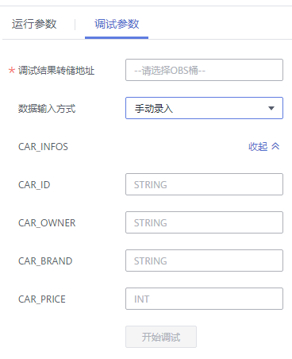

# 调试Flink作业

调试作业功能可以帮助用户在正式运行作业前，检测用户编写的SQL语句逻辑的正确性，避免用户运行Flink SQL作业产生不必要的费用。

> **说明：** 
>-   目前只有Flink SQL作业支持本功能。
>-   作业调试功能只用于验证SQL逻辑，不会有数据写入操作。

## 调试作业步骤

1.  在DLI管理控制台的左侧导航栏中，单击“作业管理“\>“Flink作业“，进入“Flink作业“页面。
2.  在已创建的Flink SQL作业“操作“列中，单击“编辑“，进入Flink SQL作业编辑页面。

    如果是正在创建的新作业，可直接在“编辑”页面中，对作业进行调试。

3.  单击“编辑“页面右上方的“调试“，对已经编辑好的SQL语句进行解析。“编辑“页面右侧自动跳转到“调试参数“页签。

    **图 1**  设置调试参数-OBS输入  
    

    **图 2**  设置调试参数-手动录入  
    

    -   “调试结果转储地址“：选择OBS桶用于保存调试日志，如果选择未授权的桶，单击“OBS授权“进行授权。
    -   “数据输入方式“：可选择保存在OBS桶中的CSV数据，也可手动录入。
        -   选择“OBS（CSV）“方式

            用户将OBS服务作为数据源，需要与OBS服务对接，在使用DLI服务前，需要先准备OBS数据，具体请参见[准备Flink作业数据](准备Flink作业数据.md)。OBS方式的数据输入格式为CSV，以换行分隔多条记录，以逗号分隔单条记录中不同字段。同时，用户需要选择OBS中具体的对象作为输入源数据。

            [图1](#fig12469739195913)中输入源数据以“CAR\_INFOS”为例，单击，在弹出的OBS桶中选择对应的数据。

        -   选择“手动录入“方式

            用户编写SQL语句作为数据源。手动录入方式需要填写单条记录的每一个字段值。

            [图2](#fig81431131143818)中输入源数据以“CAR\_INFOS”为例，需要依次填入对应的参数值。

4.  单击“开始调试“，调试完毕会弹出“调试结果“页面。
    -   如果调试结果符合预期，说明作业可以正常运行。
    -   如果调试结果不符合预期，说明作业业务逻辑可能存在问题，请修改SQL语句后再重新调试。

