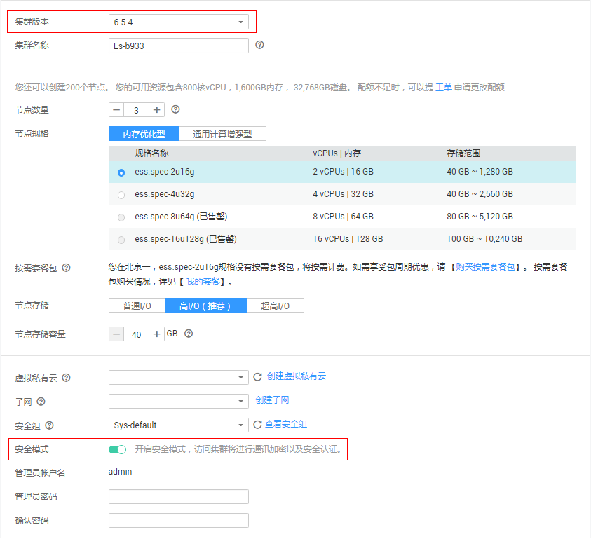
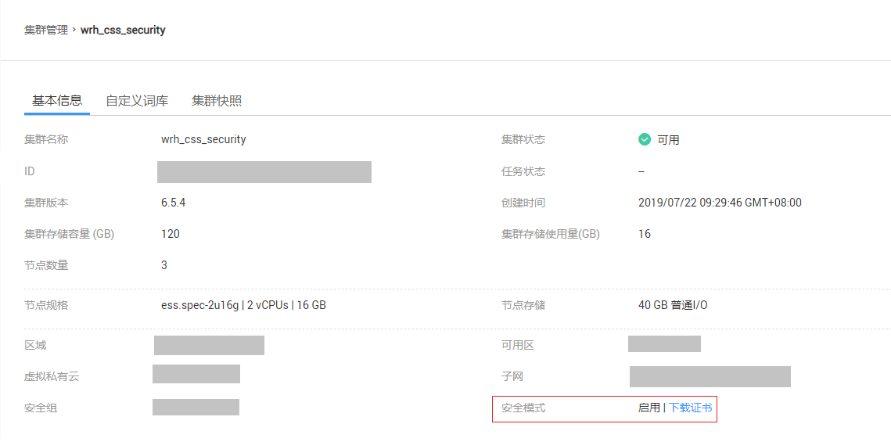
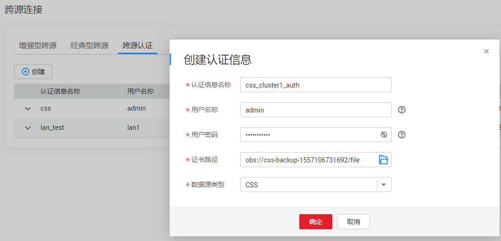

# 跨源认证

## 使用场景

目前仅用于访问安全CSS的环境的认证信息管理。创建安全CSS集群时，需要指定用户名、密码，安全CSS集群，会有一个证书可供下载。访问安全CSS集群，需要这三个信息，为了便于从DLI连接安全CSS集群，将这三个信息存储到DLI服务中，称为“跨源认证信息”。

## 创建跨源认证信息

1.  创建需要访问的数据源。目前仅支持安全CSS数据源，请先在CSS服务中购买集群，并开启安全模式。

    如果已有可用集群，可不用重新购买。

    **图 1**  CSS购买集群  
    

2.  下载CSS安全集群的证书，并上传到自定义的OBS桶中。关于如何创建OBS桶并上传数据，请参考《[对象存储服务快速入门](https://support.huaweicloud.com/qs-obs/obs_qs_0001.html)》。

    **图 2**  下载安全证书  
    

3.  在DLI管理控制台进入“Sql作业”或“Spark作业”页面，选择“跨源连接”。
4.  在“跨源认证”页签，单击“创建”，创建认证信息。

    **图 3**  创建认证信息  
    

    **表 1**  参数说明

    
    <table><thead align="left"><tr id="row1149712486527"><th class="cellrowborder" valign="top" width="15.920000000000002%" id="mcps1.2.3.1.1">
参数

    </th>
    <th class="cellrowborder" valign="top" width="84.08%" id="mcps1.2.3.1.2">
参数说明

    </th>
    </tr>
    </thead>
    <tbody><tr id="row1350324845215"><td class="cellrowborder" valign="top" width="15.920000000000002%" headers="mcps1.2.3.1.1 ">
认证信息名称

    </td>
    <td class="cellrowborder" valign="top" width="84.08%" headers="mcps1.2.3.1.2 ">
所创建的跨源认证信息名称。

    <ul id="ul185072486523"><li>名称只能包含数字、英文字母、下划线和中划线。不能为空。</li><li>输入长度不能超过128个字符。</li><li>建议名称中包含CSS安全集群的名称，便于区分不同集群的安全认证信息</li></ul>
    </td>
    </tr>
    <tr id="row105181748125210"><td class="cellrowborder" valign="top" width="15.920000000000002%" headers="mcps1.2.3.1.1 ">
用户名称

    </td>
    <td class="cellrowborder" valign="top" width="84.08%" headers="mcps1.2.3.1.2 ">
“安全集群”的用户名称

    </td>
    </tr>
    <tr id="row85241748185212"><td class="cellrowborder" valign="top" width="15.920000000000002%" headers="mcps1.2.3.1.1 ">
用户密码

    </td>
    <td class="cellrowborder" valign="top" width="84.08%" headers="mcps1.2.3.1.2 ">
“安全集群”的用户密码

    </td>
    </tr>
    <tr id="row7764655142317"><td class="cellrowborder" valign="top" width="15.920000000000002%" headers="mcps1.2.3.1.1 ">
证书路径

    </td>
    <td class="cellrowborder" valign="top" width="84.08%" headers="mcps1.2.3.1.2 ">
上传“安全证书”的OBS路径

    </td>
    </tr>
    <tr id="row17639862244"><td class="cellrowborder" valign="top" width="15.920000000000002%" headers="mcps1.2.3.1.1 ">
数据源类型

    </td>
    <td class="cellrowborder" valign="top" width="84.08%" headers="mcps1.2.3.1.2 ">
目前仅支持云搜索CSS

    </td>
    </tr>
    </tbody>
    </table>

## 查找认证信息

在“跨源认证信息“页面，可在搜索框中输入认证信息名称，查找与之匹配的认证信息。为了用户信息的安全，不会返回密码字段。

## 更新认证信息

在“跨源认证信息“页面，可单击“操作”列的“更新“，更新不需要的认证信息。目前仅支持更新用户名称和用户密码。若需要更新证书，请删除该认证信息，再重新创建。

> **说明：**   
>用户名和密码非必填，若不填，则表示不修改该字段。  

## 删除认证信息

在“跨源认证信息“页面，可单击“操作”列的“删除“，删除不需要的认证信息。

