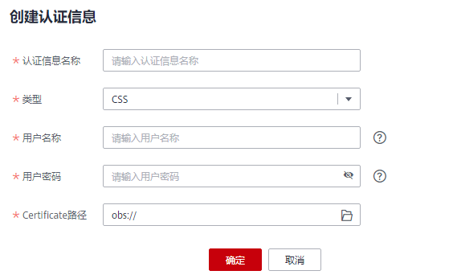
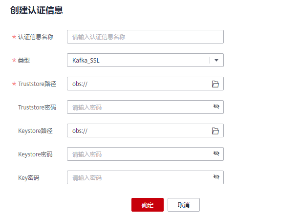

# 跨源认证

## 跨源认证使用场景

目前用于访问CSS和MRS安全环境的认证信息管理。

-   创建CSS安全集群时，需要指定用户名、密码、CSS安全集群，会有一个证书可供下载。访问CSS安全集群，需要这三个信息，为了便于从DLI连接CSS安全集群，将这三个信息存储到DLI服务中，即为连接CSS安全集群的“跨源认证信息”。
-   创建MRS安全集群时，需要开启Kerberos认证。下载认证凭证，认证凭证中包含“krb5.conf”和“user.keytab”文件。在从DLI连接MRS安全集群时，可将这两个文件存储到DLI服务中，即为连接MRS安全集群的“跨源认证信息”。
-   创建Kafka集群，需要开启SSL访问配置。可在MRS服务，Kafka组件的“服务配置”中进行配置，也可以通过搭建开源Kafka集群，修改配置文件进行开启。

## 创建跨源认证信息

1.  创建需要访问的数据源。

    > **说明：**   
    >如果已有可用集群，可不用重新购买。  

    -   创建CSS安全集群：在CSS服务中创建集群，“集群版本“选择“6.5.4”或“6.5.4”以上版本，并开启“安全模式“。
    -   创建MRS安全集群：在MRS服务中购买集群，选择“自定义购买”，“集群版本“选择“MRS 2.1.0”或“MRS 2.1.0”以上版本，并开启“Kerberos认证”。
    -   创建Kafka集群：可在MRS服务，Kafka组件的“服务配置”中进行配置。在MRS服务配置SSL具体操作可参考《[MapReduce服务用户指南](https://support.huaweicloud.com/usermanual-mrs/mrs_01_0593.html)》。

2.  下载认证凭证。
    -   CSS安全集群：在“集群管理“页面中，单击对应的集群名称，进入“基本信息“页面，找到“安全模式“，下载CSS安全集群的证书。
    -   MRS安全集群：在“集群列表“页面中，单击对应的集群名称，进入集群信息页面，可“下载认证凭证”。下载认证凭证后，需进行解压，得到“krb5.conf”和“user.keytab”文件。

3.  上传“认证凭证”。

    将获取到的认证凭证文件上传到自定义的OBS桶中。关于如何创建OBS桶并上传数据，请参考《[对象存储服务快速入门](https://support.huaweicloud.com/qs-obs/obs_qs_0001.html)》。

4.  在DLI管理控制台选择“跨源连接”。
5.  在“跨源认证”页签，单击“创建”，创建认证信息。
    -   CSS

        **图 1**  创建认证信息-CSS  
        

        **表 1**  参数说明

        
        <table><thead align="left"><tr id="row1149712486527"><th class="cellrowborder" valign="top" width="18.15%" id="mcps1.2.3.1.1">
参数

        </th>
        <th class="cellrowborder" valign="top" width="81.85%" id="mcps1.2.3.1.2">
参数说明

        </th>
        </tr>
        </thead>
        <tbody><tr id="row1350324845215"><td class="cellrowborder" valign="top" width="18.15%" headers="mcps1.2.3.1.1 ">
认证信息名称

        </td>
        <td class="cellrowborder" valign="top" width="81.85%" headers="mcps1.2.3.1.2 ">
所创建的跨源认证信息名称。

        <ul id="ul185072486523"><li>名称只能包含数字、英文字母和下划线，但不能是纯数字，且不能以下划线开头。</li><li>输入长度不能超过128个字符。</li><li>建议名称中包含CSS安全集群的名称，便于区分不同集群的安全认证信息。</li></ul>
        </td>
        </tr>
        <tr id="row1694853274012"><td class="cellrowborder" valign="top" width="18.15%" headers="mcps1.2.3.1.1 ">
数据源类型

        </td>
        <td class="cellrowborder" valign="top" width="81.85%" headers="mcps1.2.3.1.2 ">
选择CSS。

        </td>
        </tr>
        <tr id="row105181748125210"><td class="cellrowborder" valign="top" width="18.15%" headers="mcps1.2.3.1.1 ">
用户名称

        </td>
        <td class="cellrowborder" valign="top" width="81.85%" headers="mcps1.2.3.1.2 ">
“安全集群”的用户名称（admin）。

        </td>
        </tr>
        <tr id="row85241748185212"><td class="cellrowborder" valign="top" width="18.15%" headers="mcps1.2.3.1.1 ">
用户密码

        </td>
        <td class="cellrowborder" valign="top" width="81.85%" headers="mcps1.2.3.1.2 ">
“安全集群”的用户密码。

        </td>
        </tr>
        <tr id="row7764655142317"><td class="cellrowborder" valign="top" width="18.15%" headers="mcps1.2.3.1.1 ">
Certificate路径

        </td>
        <td class="cellrowborder" valign="top" width="81.85%" headers="mcps1.2.3.1.2 ">
上传“安全证书”的OBS路径。

        </td>
        </tr>
        </tbody>
        </table>

    -   MRS

        **图 2**  创建认证信息-Kerberos  
        

        **表 2**  参数说明

        
        <table><thead align="left"><tr id="row436013197429"><th class="cellrowborder" valign="top" width="21.69%" id="mcps1.2.3.1.1">
参数

        </th>
        <th class="cellrowborder" valign="top" width="78.31%" id="mcps1.2.3.1.2">
参数说明

        </th>
        </tr>
        </thead>
        <tbody><tr id="row14360121915427"><td class="cellrowborder" valign="top" width="21.69%" headers="mcps1.2.3.1.1 ">
认证信息名称

        </td>
        <td class="cellrowborder" valign="top" width="78.31%" headers="mcps1.2.3.1.2 ">
所创建的跨源认证信息名称。

        <ul id="ul23601119144216"><li>名称只能包含数字、英文字母和下划线，但不能是纯数字，且不能以下划线开头。</li><li>输入长度不能超过128个字符。</li><li>建议名称中包含MRS安全集群的名称，便于区分不同集群的安全认证信息。</li></ul>
        </td>
        </tr>
        <tr id="row2361141913428"><td class="cellrowborder" valign="top" width="21.69%" headers="mcps1.2.3.1.1 ">
数据源类型

        </td>
        <td class="cellrowborder" valign="top" width="78.31%" headers="mcps1.2.3.1.2 ">
选择kerberos。

        </td>
        </tr>
        <tr id="row8361171914213"><td class="cellrowborder" valign="top" width="21.69%" headers="mcps1.2.3.1.1 ">
用户名称

        </td>
        <td class="cellrowborder" valign="top" width="78.31%" headers="mcps1.2.3.1.2 ">
“安全集群”的用户名称（admin）。

        </td>
        </tr>
        <tr id="row1636281964217"><td class="cellrowborder" valign="top" width="21.69%" headers="mcps1.2.3.1.1 ">
krb5_conf路径

        </td>
        <td class="cellrowborder" valign="top" width="78.31%" headers="mcps1.2.3.1.2 ">
上传“krb5.conf”文件的OBS路径。

        </td>
        </tr>
        <tr id="row43621319164213"><td class="cellrowborder" valign="top" width="21.69%" headers="mcps1.2.3.1.1 ">
keytab路径

        </td>
        <td class="cellrowborder" valign="top" width="78.31%" headers="mcps1.2.3.1.2 ">
上传“user.keytab”文件的OBS路径。

        </td>
        </tr>
        </tbody>
        </table>

    -   Kafka

        **图 3**  创建认证信息-Kafka\_SSL  
        

        **表 3**  参数说明

        
        <table><thead align="left"><tr id="row1164213174912"><th class="cellrowborder" valign="top" width="21.69%" id="mcps1.2.3.1.1">
参数

        </th>
        <th class="cellrowborder" valign="top" width="78.31%" id="mcps1.2.3.1.2">
参数说明

        </th>
        </tr>
        </thead>
        <tbody><tr id="row1864311194920"><td class="cellrowborder" valign="top" width="21.69%" headers="mcps1.2.3.1.1 ">
认证信息名称

        </td>
        <td class="cellrowborder" valign="top" width="78.31%" headers="mcps1.2.3.1.2 ">
所创建的跨源认证信息名称。

        <ul id="ul1364361154915"><li>名称只能包含数字、英文字母和下划线，但不能是纯数字，且不能以下划线开头。</li><li>输入长度不能超过128个字符。</li></ul>
        </td>
        </tr>
        <tr id="row106431214495"><td class="cellrowborder" valign="top" width="21.69%" headers="mcps1.2.3.1.1 ">
数据源类型

        </td>
        <td class="cellrowborder" valign="top" width="78.31%" headers="mcps1.2.3.1.2 ">
选择Kafka_SSL。

        </td>
        </tr>
        <tr id="row146431815497"><td class="cellrowborder" valign="top" width="21.69%" headers="mcps1.2.3.1.1 ">
Truststore路径

        </td>
        <td class="cellrowborder" valign="top" width="78.31%" headers="mcps1.2.3.1.2 ">
上传SSL TRUSTSTORE文件的OBS路径。

        </td>
        </tr>
        <tr id="row17257511135011"><td class="cellrowborder" valign="top" width="21.69%" headers="mcps1.2.3.1.1 ">
Truststore密码

        </td>
        <td class="cellrowborder" valign="top" width="78.31%" headers="mcps1.2.3.1.2 ">
truststore密码。

        </td>
        </tr>
        <tr id="row36434119499"><td class="cellrowborder" valign="top" width="21.69%" headers="mcps1.2.3.1.1 ">
Keystore路径

        </td>
        <td class="cellrowborder" valign="top" width="78.31%" headers="mcps1.2.3.1.2 ">
上传SSL KEYSTORE(密钥和证书)文件的OBS路径。

        </td>
        </tr>
        <tr id="row26992269515"><td class="cellrowborder" valign="top" width="21.69%" headers="mcps1.2.3.1.1 ">
Keystore密码

        </td>
        <td class="cellrowborder" valign="top" width="78.31%" headers="mcps1.2.3.1.2 ">
keystore(密钥和证书)密码。

        </td>
        </tr>
        <tr id="row15644101184912"><td class="cellrowborder" valign="top" width="21.69%" headers="mcps1.2.3.1.1 ">
Key密码

        </td>
        <td class="cellrowborder" valign="top" width="78.31%" headers="mcps1.2.3.1.2 ">
keystore中的私钥密码。

        </td>
        </tr>
        </tbody>
        </table>

## 查找认证信息

在“跨源认证“页签，可在搜索框中输入认证信息名称，查找与之匹配的认证信息。为了用户信息的安全，不会返回密码字段。

## 更新认证信息

在“跨源认证“页签，单击需要修改的认证信息“操作”列中的“更新“，更改认证信息。目前仅支持更新改用户名称和用户密码。若需要更新证书，请删除该认证信息，再重新创建。

> **说明：**   
>用户名和密码非必填，若不填，则表示不修改该字段。  

## 删除认证信息

在“跨源认证“页签，单击需要修改的认证信息“操作”列中的“删除“，删除不需要的认证信息。

