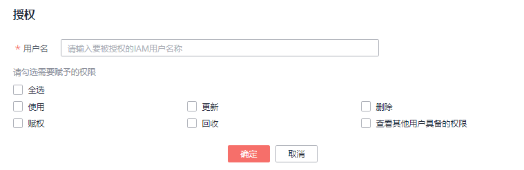

# 跨源认证权限管理

## 跨源认证权限管理操作场景

-   针对不同用户，可以通过权限设置分配不同的跨源认证，不同用户之间的作业效率互不影响，保障作业性能。
-   管理员用户和跨源认证的所有者拥有所有权限，不需要进行权限设置且其他用户无法修改其跨源认证权限。
-   给新用户设置跨源认证权限时，该用户所在用户组的所属区域需具有Tenant Guest权限。关于Tenant Guest权限的介绍和开通方法，详细参见《[权限策略](https://support.huaweicloud.com/usermanual-permissions/iam_01_0001.html)》和《统一身份认证服务用户指南》中的[创建用户组](https://support.huaweicloud.com/usermanual-iam/iam_03_0001.html)。

在“跨源认证“页签，单击需要修改的认证信息“操作”列中的“权限管理“，进入“用户权限信息”页面，对用户进行跨源认证授权、设置权限和回收权限。

## 跨源认证用户授权

单击页面右上角“授权”可对用户进行跨源认证授权。

**图 1**  跨源认证用户授权  

**表 1**  用户授权参数说明

<table><thead align="left"><tr id="row1771212551410"><th class="cellrowborder" valign="top" width="20%" id="mcps1.2.3.1.1">
参数名称

</th>
<th class="cellrowborder" valign="top" width="80%" id="mcps1.2.3.1.2">
描述

</th>
</tr>
</thead>
<tbody><tr id="row207191525121418"><td class="cellrowborder" valign="top" width="20%" headers="mcps1.2.3.1.1 ">
用户名

</td>
<td class="cellrowborder" valign="top" width="80%" headers="mcps1.2.3.1.2 ">
被授权的IAM用户的名称。

 说明： 

该用户名称是已存在的IAM用户名称。

</td>
</tr>
<tr id="row1273232517141"><td class="cellrowborder" valign="top" width="20%" headers="mcps1.2.3.1.1 ">
权限设置

</td>
<td class="cellrowborder" valign="top" width="80%" headers="mcps1.2.3.1.2 "><ul id="ul19734132517140"><li>使用：使用该跨源认证。</li><li>更新：更新该跨源认证。</li><li>删除：删除该跨源认证。</li><li>赋权：当前用户可将跨源认证的权限赋予其他用户。</li><li>回收：当前用户可回收其他用户具备的该跨源认证的权限，但不能回收该跨源认证所有者的权限。</li><li>查看其他用户具备的权限：当前用户可查看其他用户具备的该跨源认证的权限。</li></ul>
</td>
</tr>
</tbody>
</table>

## 设置跨源认证权限

单击对应子用户“操作”列中的“权限设置”可修改该用户的权限。详细权限描述如[表1](#table15710625151416)所示。

当“权限设置”中的选项为灰色时，表示您不具备修改此跨源认证权限的权限。可以向管理员用户、组所有者等具有赋权权限的用户申请“跨源认证的赋权”和“跨源认证权限的回收”权限。

## 回收跨源认证权限

单击对应子用户“操作”列中的“回收”将删除该用户的权限。该子用户将不具备该跨源认证的任意权限。

