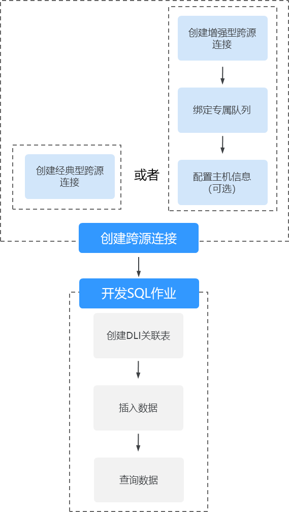
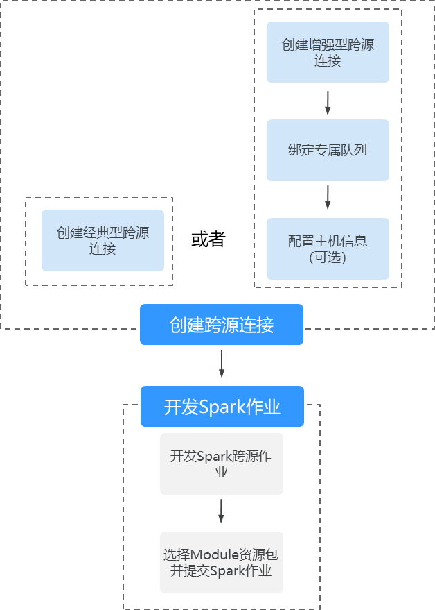
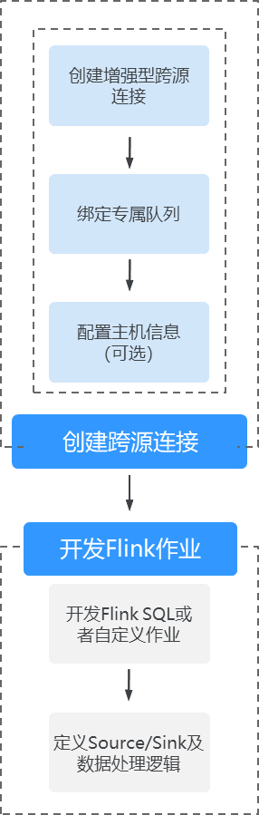

# 跨源连接和跨源分析概述

DLI支持原生Spark的DataSource能力，并在其基础上进行了扩展，能够通过SQL语句、Spark作业或者Flink作业访问其他数据存储服务并导入、查询、分析处理其中的数据。

## 跨源连接

在使用DLI进行跨源分析前，需要先建立跨源连接，打通数据源之间的网络。

DLI增强型跨源连接底层采用对等连接，直接打通DLI队列与目的数据源的VPC网络，通过点对点的方式实现数据互通，能够提供比经典型跨源更加灵活的使用场景与更加强劲的性能。

> **说明：** 
>-   系统default队列不支持创建跨源连接。
>-   跨源连接需要使用VPC、子网、路由、对等连接功能，因此需要获得VPC（虚拟私有云）的VPC Administrator权限。可在[服务授权](服务授权.md)中进行设置。

## 跨源分析

增强型跨源支持DLI服务已实现的所有跨源业务，并且通过可以UDF、Spark作业和Flink作业等方式实现与自建数据源之间的访问。增强型跨源仅支持包年包月队列和按需专属队列。

目前DLI支持跨源访问的数据源包括：CloudTable HBase，CloudTable OpenTSDB，CSS，DCS Redis，DDS Mongo，DIS，DMS，DWS，MRS HBase，MRS Kafka，MRS OpenTSDB，OBS，RDS MySQL，RDS PostGre，SMN。具体请参考[DLI支持访问的数据源](#section189164365815)。

> **说明：** 
>-   访问跨源表需要使用已经创建跨源连接的队列。
>-   跨源表不支持Preview预览功能。

## 跨源分析流程

使用DLI进行跨源分析，需要先建立跨源连接，再开发不同的作业访问数据源。操作步骤如下：

1.  创建跨源连接。包括以下两种创建方式：

    -   通过管理控制台创建跨源连接。
    -   通过API接口创建创建跨源连接。

    具体操作请参考[表2](#table193912435309)中对应“创建方式”的链接。

2.  开发DLI作业访问数据源。包括以下三种访问方式：

    -   开发SQL作业访问数据源。
    -   开发Spark作业访问数据源。
    -   开发Flink作业访问数据源

    具体操作请参考[表3](#table88971656153019)中对应“开发访问方式”的链接。

以下分别为开发SQL作业、Spark作业和Flink作业进行跨源连接的基本流程。

-   SQL作业

    **图 1**  SQL跨源分析流程  
    

-   Spark作业

    **图 2**  Spark跨源分析流程  
    

-   Flink作业

    **图 3**  Flink跨源分析流程  
    

## DLI支持访问的数据源

**表 1**  DLI支持的华为云服务数据源

<table><tbody><tr id="row167251612123519"><td class="cellrowborder" rowspan="2" valign="top">
<strong id="b168217232569">服务名称</strong>

</td>
<td class="cellrowborder" colspan="2" valign="top">
<strong id="b4823323185611">跨源连接</strong>

</td>
<td class="cellrowborder" colspan="4" valign="top">
<strong id="b2825102318569">跨源分析</strong>

</td>
</tr>
<tr id="row15180135119549"><td class="cellrowborder" valign="top">
<strong id="b18826223185618">经典型跨源连接</strong>

</td>
<td class="cellrowborder" valign="top">
<strong id="b1828323165616">增强型跨源连接</strong>

</td>
<td class="cellrowborder" valign="top">
<strong id="b1783052345610">Spark SQL作业</strong>

</td>
<td class="cellrowborder" valign="top">
<strong id="b183114232562">Spark jar作业</strong>

</td>
<td class="cellrowborder" valign="top">
<strong id="b183322375616">Flink SQL作业</strong>

</td>
<td class="cellrowborder" valign="top">
<strong id="b260218582597">Flink jar作业</strong>

</td>
</tr>
<tr id="row9725121218351"><td class="cellrowborder" valign="top" width="19.35%">
CloudTable HBase

</td>
<td class="cellrowborder" valign="top" width="13.56%">
√

</td>
<td class="cellrowborder" valign="top" width="15.299999999999999%">
√

</td>
<td class="cellrowborder" valign="top" width="13.309999999999999%">
√

</td>
<td class="cellrowborder" valign="top" width="12.770000000000001%">
√

</td>
<td class="cellrowborder" valign="top" width="12.889999999999999%">
√

</td>
<td class="cellrowborder" valign="top" width="12.82%">
x

</td>
</tr>
<tr id="row207251112173511"><td class="cellrowborder" valign="top" width="19.35%">
CloudTable OpenTSDB

</td>
<td class="cellrowborder" valign="top" width="13.56%">
√

</td>
<td class="cellrowborder" valign="top" width="15.299999999999999%">
√

</td>
<td class="cellrowborder" valign="top" width="13.309999999999999%">
√

</td>
<td class="cellrowborder" valign="top" width="12.770000000000001%">
√

</td>
<td class="cellrowborder" valign="top" width="12.889999999999999%">
√

</td>
<td class="cellrowborder" valign="top" width="12.82%">
x

</td>
</tr>
<tr id="row1311230030"><td class="cellrowborder" valign="top" width="19.35%">
CSS

</td>
<td class="cellrowborder" valign="top" width="13.56%">
√

</td>
<td class="cellrowborder" valign="top" width="15.299999999999999%">
√

</td>
<td class="cellrowborder" valign="top" width="13.309999999999999%">
√

</td>
<td class="cellrowborder" valign="top" width="12.770000000000001%">
√

</td>
<td class="cellrowborder" valign="top" width="12.889999999999999%">
√

</td>
<td class="cellrowborder" valign="top" width="12.82%">
x

</td>
</tr>
<tr id="row520714219914"><td class="cellrowborder" valign="top" width="19.35%">
DCS Redis

</td>
<td class="cellrowborder" valign="top" width="13.56%">
x

</td>
<td class="cellrowborder" valign="top" width="15.299999999999999%">
√

</td>
<td class="cellrowborder" valign="top" width="13.309999999999999%">
√

</td>
<td class="cellrowborder" valign="top" width="12.770000000000001%">
√

</td>
<td class="cellrowborder" valign="top" width="12.889999999999999%">
√

</td>
<td class="cellrowborder" valign="top" width="12.82%">
√

</td>
</tr>
<tr id="row2225186193"><td class="cellrowborder" valign="top" width="19.35%">
DDS Mongo

</td>
<td class="cellrowborder" valign="top" width="13.56%">
x

</td>
<td class="cellrowborder" valign="top" width="15.299999999999999%">
√

</td>
<td class="cellrowborder" valign="top" width="13.309999999999999%">
√

</td>
<td class="cellrowborder" valign="top" width="12.770000000000001%">
√

</td>
<td class="cellrowborder" valign="top" width="12.889999999999999%">
√

</td>
<td class="cellrowborder" valign="top" width="12.82%">
x

</td>
</tr>
<tr id="row19862122218111"><td class="cellrowborder" valign="top" width="19.35%">
DIS

</td>
<td class="cellrowborder" valign="top" width="13.56%">
x

</td>
<td class="cellrowborder" valign="top" width="15.299999999999999%">
√

</td>
<td class="cellrowborder" valign="top" width="13.309999999999999%">
x

</td>
<td class="cellrowborder" valign="top" width="12.770000000000001%">
x

</td>
<td class="cellrowborder" valign="top" width="12.889999999999999%">
√

</td>
<td class="cellrowborder" valign="top" width="12.82%">
x

</td>
</tr>
<tr id="row1529614721213"><td class="cellrowborder" valign="top" width="19.35%">
DMS

</td>
<td class="cellrowborder" valign="top" width="13.56%">
x

</td>
<td class="cellrowborder" valign="top" width="15.299999999999999%">
√

</td>
<td class="cellrowborder" valign="top" width="13.309999999999999%">
x

</td>
<td class="cellrowborder" valign="top" width="12.770000000000001%">
x

</td>
<td class="cellrowborder" valign="top" width="12.889999999999999%">
√

</td>
<td class="cellrowborder" valign="top" width="12.82%">
x

</td>
</tr>
<tr id="row1372511253512"><td class="cellrowborder" valign="top" width="19.35%">
DWS

</td>
<td class="cellrowborder" valign="top" width="13.56%">
√

</td>
<td class="cellrowborder" valign="top" width="15.299999999999999%">
√

</td>
<td class="cellrowborder" valign="top" width="13.309999999999999%">
√

</td>
<td class="cellrowborder" valign="top" width="12.770000000000001%">
√

</td>
<td class="cellrowborder" valign="top" width="12.889999999999999%">
√

</td>
<td class="cellrowborder" valign="top" width="12.82%">
√

</td>
</tr>
<tr id="row272614129356"><td class="cellrowborder" valign="top" width="19.35%">
MRS HBase

</td>
<td class="cellrowborder" valign="top" width="13.56%">
x

</td>
<td class="cellrowborder" valign="top" width="15.299999999999999%">
√

</td>
<td class="cellrowborder" valign="top" width="13.309999999999999%">
√

</td>
<td class="cellrowborder" valign="top" width="12.770000000000001%">
√

</td>
<td class="cellrowborder" valign="top" width="12.889999999999999%">
√

</td>
<td class="cellrowborder" valign="top" width="12.82%">
√

</td>
</tr>
<tr id="row11355916103715"><td class="cellrowborder" valign="top" width="19.35%">
MRS Kafka

</td>
<td class="cellrowborder" valign="top" width="13.56%">
x

</td>
<td class="cellrowborder" valign="top" width="15.299999999999999%">
√

</td>
<td class="cellrowborder" valign="top" width="13.309999999999999%">
x

</td>
<td class="cellrowborder" valign="top" width="12.770000000000001%">
x

</td>
<td class="cellrowborder" valign="top" width="12.889999999999999%">
√

</td>
<td class="cellrowborder" valign="top" width="12.82%">
√

</td>
</tr>
<tr id="row1935619169378"><td class="cellrowborder" valign="top" width="19.35%">
MRS OpenTSDB

</td>
<td class="cellrowborder" valign="top" width="13.56%">
√

</td>
<td class="cellrowborder" valign="top" width="15.299999999999999%">
√

</td>
<td class="cellrowborder" valign="top" width="13.309999999999999%">
√

</td>
<td class="cellrowborder" valign="top" width="12.770000000000001%">
√

</td>
<td class="cellrowborder" valign="top" width="12.889999999999999%">
x

</td>
<td class="cellrowborder" valign="top" width="12.82%">
x

</td>
</tr>
<tr id="row456545314205"><td class="cellrowborder" valign="top" width="19.35%">
OBS

</td>
<td class="cellrowborder" valign="top" width="13.56%">
x

</td>
<td class="cellrowborder" valign="top" width="15.299999999999999%">
√

</td>
<td class="cellrowborder" valign="top" width="13.309999999999999%">
x

</td>
<td class="cellrowborder" valign="top" width="12.770000000000001%">
x

</td>
<td class="cellrowborder" valign="top" width="12.889999999999999%">
√

</td>
<td class="cellrowborder" valign="top" width="12.82%">
x

</td>
</tr>
<tr id="row103572166371"><td class="cellrowborder" valign="top" width="19.35%">
RDS MySQL

</td>
<td class="cellrowborder" valign="top" width="13.56%">
√

</td>
<td class="cellrowborder" valign="top" width="15.299999999999999%">
√

</td>
<td class="cellrowborder" valign="top" width="13.309999999999999%">
√

</td>
<td class="cellrowborder" valign="top" width="12.770000000000001%">
√

</td>
<td class="cellrowborder" valign="top" width="12.889999999999999%">
√

</td>
<td class="cellrowborder" valign="top" width="12.82%">
x

</td>
</tr>
<tr id="row06857016383"><td class="cellrowborder" valign="top" width="19.35%">
RDS PostGre

</td>
<td class="cellrowborder" valign="top" width="13.56%">
√

</td>
<td class="cellrowborder" valign="top" width="15.299999999999999%">
√

</td>
<td class="cellrowborder" valign="top" width="13.309999999999999%">
√

</td>
<td class="cellrowborder" valign="top" width="12.770000000000001%">
√

</td>
<td class="cellrowborder" valign="top" width="12.889999999999999%">
√

</td>
<td class="cellrowborder" valign="top" width="12.82%">
x

</td>
</tr>
<tr id="row2456187112114"><td class="cellrowborder" valign="top" width="19.35%">
SMN

</td>
<td class="cellrowborder" valign="top" width="13.56%">
x

</td>
<td class="cellrowborder" valign="top" width="15.299999999999999%">
√

</td>
<td class="cellrowborder" valign="top" width="13.309999999999999%">
x

</td>
<td class="cellrowborder" valign="top" width="12.770000000000001%">
x

</td>
<td class="cellrowborder" valign="top" width="12.889999999999999%">
√

</td>
<td class="cellrowborder" valign="top" width="12.82%">
x

</td>
</tr>
</tbody>
</table>

## 跨源连接创建方式参考

**表 2**  跨源连接创建方式

<table><thead align="left"><tr id="row639215439302"><th class="cellrowborder" valign="top" width="15.1%" id="mcps1.2.4.1.1">
创建方式

</th>
<th class="cellrowborder" valign="top" width="43.25%" id="mcps1.2.4.1.2">
经典型跨源连接

</th>
<th class="cellrowborder" valign="top" width="41.65%" id="mcps1.2.4.1.3">
增强型跨源连接

</th>
</tr>
</thead>
<tbody><tr id="row1539364312304"><td class="cellrowborder" valign="top" width="15.1%" headers="mcps1.2.4.1.1 ">
管理控制台操作

</td>
<td class="cellrowborder" valign="top" width="43.25%" headers="mcps1.2.4.1.2 ">
<a href="经典型跨源连接.md">经典型跨源连接</a>

</td>
<td class="cellrowborder" valign="top" width="41.65%" headers="mcps1.2.4.1.3 ">
<a href="增强型跨源连接.md">增强型跨源连接</a>

</td>
</tr>
<tr id="row10394184333016"><td class="cellrowborder" valign="top" width="15.1%" headers="mcps1.2.4.1.1 ">
API接口

</td>
<td class="cellrowborder" valign="top" width="43.25%" headers="mcps1.2.4.1.2 ">
<a href="https://support.huaweicloud.com/api-dli/dli_02_0144.html" target="_blank" rel="noopener noreferrer">《经典型跨源连接相关API》</a>

</td>
<td class="cellrowborder" valign="top" width="41.65%" headers="mcps1.2.4.1.3 ">
<a href="https://support.huaweicloud.com/api-dli/dli_02_0187.html" target="_blank" rel="noopener noreferrer">《增强型跨源连接相关API》</a>

</td>
</tr>
</tbody>
</table>

## 跨源分析开发方式参考

**表 3**  跨源分析开发方式

<table><tbody><tr id="row10898135673017"><td class="cellrowborder" rowspan="2" valign="top">
<strong id="b5898556113020">服务名称</strong>

</td>
<td class="cellrowborder" colspan="4" valign="top">
<strong id="b9898556193018">开发访问方式</strong>

</td>
</tr>
<tr id="row58981756103016"><td class="cellrowborder" valign="top">
<strong id="b2899145653011">开发Spark SQL作业</strong>

</td>
<td class="cellrowborder" valign="top">
<strong id="b689917562303">开发Spark jar作业</strong>

</td>
<td class="cellrowborder" valign="top">
<strong id="b1454722523913">开发Flink SQL作业</strong>

</td>
<td class="cellrowborder" valign="top">
<strong id="b1063322917714">开发Flink jar作业</strong>

</td>
</tr>
<tr id="row789914565308"><td class="cellrowborder" valign="top" width="16.931693169316933%">
CloudTable HBase

</td>
<td class="cellrowborder" valign="top" width="27.242724272427242%"><ul id="ul198995569303"><li><a href="https://support.huaweicloud.com/sqlreference-dli/dli_08_0119.html" target="_blank" rel="noopener noreferrer">创建HBase关联表</a></li><li><a href="https://support.huaweicloud.com/sqlreference-dli/dli_08_0120.html" target="_blank" rel="noopener noreferrer">插入数据</a></li><li><a href="https://support.huaweicloud.com/sqlreference-dli/dli_08_0121.html" target="_blank" rel="noopener noreferrer">查询数据</a></li></ul>
</td>
<td class="cellrowborder" valign="top" width="21.232123212321234%"><ul id="ul14683175885417"><li><a href="https://support.huaweicloud.com/devg-dli/dli_09_0063.html" target="_blank" rel="noopener noreferrer">scala样例代码</a></li><li><a href="https://support.huaweicloud.com/devg-dli/dli_09_0078.html" target="_blank" rel="noopener noreferrer">pyspark样例代码</a></li></ul>
</td>
<td class="cellrowborder" valign="top" width="18.48184818481848%"><ul id="ul12449181718178"><li><a href="https://support.huaweicloud.com/sqlreference-dli/dli_08_0237.html" target="_blank" rel="noopener noreferrer">HBase输入流</a></li><li><a href="https://support.huaweicloud.com/sqlreference-dli/dli_08_0243.html" target="_blank" rel="noopener noreferrer">HBase输出流</a></li></ul>
</td>
<td class="cellrowborder" valign="top" width="16.111611161116112%">
-

</td>
</tr>
<tr id="row4900115611306"><td class="cellrowborder" valign="top" width="16.931693169316933%">
CloudTable OpenTSDB

</td>
<td class="cellrowborder" valign="top" width="27.242724272427242%"><ul id="ul79001756143011"><li><a href="https://support.huaweicloud.com/sqlreference-dli/dli_08_0122.html" target="_blank" rel="noopener noreferrer">创建OpenTSDB关联表</a></li><li><a href="https://support.huaweicloud.com/sqlreference-dli/dli_08_0123.html" target="_blank" rel="noopener noreferrer">插入数据</a></li><li><a href="https://support.huaweicloud.com/sqlreference-dli/dli_08_0124.html" target="_blank" rel="noopener noreferrer">查询数据</a></li></ul>
</td>
<td class="cellrowborder" valign="top" width="21.232123212321234%"><ul id="ul62141852101213"><li><a href="https://support.huaweicloud.com/devg-dli/dli_09_0065.html" target="_blank" rel="noopener noreferrer">scala样例代码</a></li><li><a href="https://support.huaweicloud.com/devg-dli/dli_09_0081.html" target="_blank" rel="noopener noreferrer">pyspark样例代码</a></li></ul>
</td>
<td class="cellrowborder" valign="top" width="18.48184818481848%"><ul id="ul2012534521718"><li><a href="https://support.huaweicloud.com/sqlreference-dli/dli_08_0244.html" target="_blank" rel="noopener noreferrer">OpenTSDB输出流</a></li></ul>
</td>
<td class="cellrowborder" valign="top" width="16.111611161116112%">
-

</td>
</tr>
<tr id="row2067075612920"><td class="cellrowborder" valign="top" width="16.931693169316933%">
CSS

</td>
<td class="cellrowborder" valign="top" width="27.242724272427242%"><ul id="ul159051056183017"><li><a href="https://support.huaweicloud.com/sqlreference-dli/dli_08_0201.html" target="_blank" rel="noopener noreferrer">创建CSS关联表</a></li><li><a href="https://support.huaweicloud.com/sqlreference-dli/dli_08_0202.html" target="_blank" rel="noopener noreferrer">插入数据</a></li><li><a href="https://support.huaweicloud.com/sqlreference-dli/dli_08_0203.html" target="_blank" rel="noopener noreferrer">查询数据</a></li></ul>
</td>
<td class="cellrowborder" valign="top" width="21.232123212321234%"><ul id="ul1415181217382"><li><a href="https://support.huaweicloud.com/devg-dli/dli_09_0061.html" target="_blank" rel="noopener noreferrer">scala样例代码</a></li><li><a href="https://support.huaweicloud.com/devg-dli/dli_09_0090.html" target="_blank" rel="noopener noreferrer">pyspark样例代码</a></li></ul>
</td>
<td class="cellrowborder" valign="top" width="18.48184818481848%">
<a href="https://support.huaweicloud.com/sqlreference-dli/dli_08_0252.html" target="_blank" rel="noopener noreferrer">Elasticsearch输出流</a>

</td>
<td class="cellrowborder" valign="top" width="16.111611161116112%">
-

</td>
</tr>
<tr id="row2718174814106"><td class="cellrowborder" valign="top" width="16.931693169316933%">
DCS Redis

</td>
<td class="cellrowborder" valign="top" width="27.242724272427242%"><ul id="ul791117560308"><li><a href="https://support.huaweicloud.com/sqlreference-dli/dli_08_0226.html" target="_blank" rel="noopener noreferrer">创建DCS关联表</a></li><li><a href="https://support.huaweicloud.com/sqlreference-dli/dli_08_0227.html" target="_blank" rel="noopener noreferrer">插入数据</a></li><li><a href="https://support.huaweicloud.com/sqlreference-dli/dli_08_0228.html" target="_blank" rel="noopener noreferrer">查询数据</a></li></ul>
</td>
<td class="cellrowborder" valign="top" width="21.232123212321234%"><ul id="ul7682193853619"><li><a href="https://support.huaweicloud.com/devg-dli/dli_09_0094.html" target="_blank" rel="noopener noreferrer">scala样例代码</a></li><li><a href="https://support.huaweicloud.com/devg-dli/dli_09_0097.html" target="_blank" rel="noopener noreferrer">pyspark样例代码</a></li><li><a href="https://support.huaweicloud.com/devg-dli/dli_09_0100.html" target="_blank" rel="noopener noreferrer">java样例代码</a></li></ul>
</td>
<td class="cellrowborder" valign="top" width="18.48184818481848%">
<a href="https://support.huaweicloud.com/sqlreference-dli/dli_08_0253.html" target="_blank" rel="noopener noreferrer">DCS输出流</a>

</td>
<td class="cellrowborder" valign="top" width="16.111611161116112%">
<a href="https://support.huaweicloud.com/devg-dli/dli_09_0150.html" target="_blank" rel="noopener noreferrer">自定义作业交互</a>

</td>
</tr>
<tr id="row0901195663014"><td class="cellrowborder" valign="top" width="16.931693169316933%">
DDS Mongo

</td>
<td class="cellrowborder" valign="top" width="27.242724272427242%"><ul id="ul149124566305"><li><a href="https://support.huaweicloud.com/sqlreference-dli/dli_08_0230.html" target="_blank" rel="noopener noreferrer">创建DDS关联表</a></li><li><a href="https://support.huaweicloud.com/sqlreference-dli/dli_08_0231.html" target="_blank" rel="noopener noreferrer">插入数据</a></li><li><a href="https://support.huaweicloud.com/sqlreference-dli/dli_08_0232.html" target="_blank" rel="noopener noreferrer">查询数据</a></li></ul>
</td>
<td class="cellrowborder" valign="top" width="21.232123212321234%"><ul id="ul4387131219158"><li><a href="https://support.huaweicloud.com/devg-dli/dli_09_0114.html" target="_blank" rel="noopener noreferrer">scala样例代码</a></li><li><a href="https://support.huaweicloud.com/devg-dli/dli_09_0117.html" target="_blank" rel="noopener noreferrer">pyspark样例代码</a></li><li><a href="https://support.huaweicloud.com/devg-dli/dli_09_0110.html" target="_blank" rel="noopener noreferrer">java样例代码</a></li></ul>
</td>
<td class="cellrowborder" valign="top" width="18.48184818481848%">
<a href="https://support.huaweicloud.com/sqlreference-dli/dli_08_0249.html" target="_blank" rel="noopener noreferrer">DDS输出流</a>

</td>
<td class="cellrowborder" valign="top" width="16.111611161116112%">
-

</td>
</tr>
<tr id="row31661915131119"><td class="cellrowborder" valign="top" width="16.931693169316933%">
DIS

</td>
<td class="cellrowborder" valign="top" width="27.242724272427242%">
-

</td>
<td class="cellrowborder" valign="top" width="21.232123212321234%">
-

</td>
<td class="cellrowborder" valign="top" width="18.48184818481848%">
<a href="https://support.huaweicloud.com/sqlreference-dli/dli_08_0235.html" target="_blank" rel="noopener noreferrer">DIS输入流</a>

</td>
<td class="cellrowborder" valign="top" width="16.111611161116112%">
-

</td>
</tr>
<tr id="row055715220110"><td class="cellrowborder" valign="top" width="16.931693169316933%">
DMS

</td>
<td class="cellrowborder" valign="top" width="27.242724272427242%">
-

</td>
<td class="cellrowborder" valign="top" width="21.232123212321234%">
-

</td>
<td class="cellrowborder" valign="top" width="18.48184818481848%"><ul id="ul12188655105512"><li><a href="https://support.huaweicloud.com/sqlreference-dli/dli_08_0270.html" target="_blank" rel="noopener noreferrer">DMS输入流</a></li><li><a href="https://support.huaweicloud.com/sqlreference-dli/dli_08_0271.html" target="_blank" rel="noopener noreferrer">DMS输出流</a></li></ul>
</td>
<td class="cellrowborder" valign="top" width="16.111611161116112%">
-

</td>
</tr>
<tr id="row12403141910121"><td class="cellrowborder" valign="top" width="16.931693169316933%">
DWS

</td>
<td class="cellrowborder" valign="top" width="27.242724272427242%"><ul id="ul16902105616301"><li><a href="https://support.huaweicloud.com/sqlreference-dli/dli_08_0193.html" target="_blank" rel="noopener noreferrer">创建DWS关联表</a></li><li><a href="https://support.huaweicloud.com/sqlreference-dli/dli_08_0194.html" target="_blank" rel="noopener noreferrer">插入数据</a></li><li><a href="https://support.huaweicloud.com/sqlreference-dli/dli_08_0195.html" target="_blank" rel="noopener noreferrer">查询数据</a></li></ul>
</td>
<td class="cellrowborder" valign="top" width="21.232123212321234%"><ul id="ul1571595021319"><li><a href="https://support.huaweicloud.com/devg-dli/dli_09_0069.html" target="_blank" rel="noopener noreferrer">scala样例代码</a></li><li><a href="https://support.huaweicloud.com/devg-dli/dli_09_0087.html" target="_blank" rel="noopener noreferrer">pyspark样例代码</a></li></ul>
</td>
<td class="cellrowborder" valign="top" width="18.48184818481848%"><ul id="ul710961121720"><li><a href="https://support.huaweicloud.com/sqlreference-dli/dli_08_0247.html" target="_blank" rel="noopener noreferrer">DWS输出流（通过JDBC方式转储）</a></li><li><a href="https://support.huaweicloud.com/sqlreference-dli/dli_08_0248.html" target="_blank" rel="noopener noreferrer">DWS输出流（通过OBS方式转储）</a></li></ul>
</td>
<td class="cellrowborder" valign="top" width="16.111611161116112%">
<a href="https://support.huaweicloud.com/devg-dli/dli_09_0150.html" target="_blank" rel="noopener noreferrer">自定义作业交互</a>

</td>
</tr>
<tr id="row209082562304"><td class="cellrowborder" valign="top" width="16.931693169316933%">
MRS HBase

</td>
<td class="cellrowborder" valign="top" width="27.242724272427242%"><ul id="ul15908165663013"><li><a href="https://support.huaweicloud.com/sqlreference-dli/dli_08_0119.html" target="_blank" rel="noopener noreferrer">创建HBase关联表</a></li><li><a href="https://support.huaweicloud.com/sqlreference-dli/dli_08_0120.html" target="_blank" rel="noopener noreferrer">插入数据</a></li><li><a href="https://support.huaweicloud.com/sqlreference-dli/dli_08_0121.html" target="_blank" rel="noopener noreferrer">查询数据</a></li></ul>
</td>
<td class="cellrowborder" valign="top" width="21.232123212321234%"><ul id="ul9863358195819"><li><a href="https://support.huaweicloud.com/devg-dli/dli_09_0063.html" target="_blank" rel="noopener noreferrer">scala样例代码</a></li><li><a href="https://support.huaweicloud.com/devg-dli/dli_09_0078.html" target="_blank" rel="noopener noreferrer">pyspark样例代码</a></li></ul>
</td>
<td class="cellrowborder" valign="top" width="18.48184818481848%">
<a href="https://support.huaweicloud.com/sqlreference-dli/dli_08_0255.html" target="_blank" rel="noopener noreferrer">MRS HBase输出流</a>

</td>
<td class="cellrowborder" valign="top" width="16.111611161116112%">
<a href="https://support.huaweicloud.com/devg-dli/dli_09_0150.html" target="_blank" rel="noopener noreferrer">自定义作业交互</a>

</td>
</tr>
<tr id="row8278101141317"><td class="cellrowborder" valign="top" width="16.931693169316933%">
MRS Kafka

</td>
<td class="cellrowborder" valign="top" width="27.242724272427242%">
-

</td>
<td class="cellrowborder" valign="top" width="21.232123212321234%">
-

</td>
<td class="cellrowborder" valign="top" width="18.48184818481848%">
<a href="https://support.huaweicloud.com/sqlreference-dli/dli_08_0254.html" target="_blank" rel="noopener noreferrer">MRS Kafka输出流</a>

</td>
<td class="cellrowborder" valign="top" width="16.111611161116112%">
<a href="https://support.huaweicloud.com/devg-dli/dli_09_0150.html" target="_blank" rel="noopener noreferrer">自定义作业交互</a>

</td>
</tr>
<tr id="row1090917567306"><td class="cellrowborder" valign="top" width="16.931693169316933%">
MRS OpenTSDB

</td>
<td class="cellrowborder" valign="top" width="27.242724272427242%"><ul id="ul189091256153018"><li><a href="https://support.huaweicloud.com/sqlreference-dli/dli_08_0122.html" target="_blank" rel="noopener noreferrer">创建OpenTSDB关联表</a></li><li><a href="https://support.huaweicloud.com/sqlreference-dli/dli_08_0123.html" target="_blank" rel="noopener noreferrer">插入数据</a></li><li><a href="https://support.huaweicloud.com/sqlreference-dli/dli_08_0124.html" target="_blank" rel="noopener noreferrer">查询数据</a></li></ul>
</td>
<td class="cellrowborder" valign="top" width="21.232123212321234%"><ul id="ul3282142615117"><li><a href="https://support.huaweicloud.com/devg-dli/dli_09_0065.html" target="_blank" rel="noopener noreferrer">scala样例代码</a></li><li><a href="https://support.huaweicloud.com/devg-dli/dli_09_0081.html" target="_blank" rel="noopener noreferrer">pyspark样例代码</a></li></ul>
</td>
<td class="cellrowborder" valign="top" width="18.48184818481848%">
-

</td>
<td class="cellrowborder" valign="top" width="16.111611161116112%">
-

</td>
</tr>
<tr id="row1859103212149"><td class="cellrowborder" valign="top" width="16.931693169316933%">
OBS

</td>
<td class="cellrowborder" valign="top" width="27.242724272427242%">
-

</td>
<td class="cellrowborder" valign="top" width="21.232123212321234%">
-

</td>
<td class="cellrowborder" valign="top" width="18.48184818481848%"><ul id="ul89501643530"><li><a href="https://support.huaweicloud.com/sqlreference-dli/dli_08_0236.html" target="_blank" rel="noopener noreferrer">OBS输入流</a></li><li><a href="https://support.huaweicloud.com/sqlreference-dli/dli_08_0242.html" target="_blank" rel="noopener noreferrer">OBS输出流</a></li></ul>
</td>
<td class="cellrowborder" valign="top" width="16.111611161116112%">
-

</td>
</tr>
<tr id="row179102561309"><td class="cellrowborder" valign="top" width="16.931693169316933%">
RDS MySQL

</td>
<td class="cellrowborder" valign="top" width="27.242724272427242%"><ul id="ul3903175643012"><li><a href="https://support.huaweicloud.com/sqlreference-dli/dli_08_0197.html" target="_blank" rel="noopener noreferrer">创建RDS关联表</a></li><li><a href="https://support.huaweicloud.com/sqlreference-dli/dli_08_0198.html" target="_blank" rel="noopener noreferrer">插入数据</a></li><li><a href="https://support.huaweicloud.com/sqlreference-dli/dli_08_0199.html" target="_blank" rel="noopener noreferrer">查询数据</a></li></ul>
</td>
<td class="cellrowborder" valign="top" width="21.232123212321234%"><ul id="ul68971222195918"><li><a href="https://support.huaweicloud.com/devg-dli/dli_09_0067.html" target="_blank" rel="noopener noreferrer">scala样例代码</a></li><li><a href="https://support.huaweicloud.com/devg-dli/dli_09_0084.html" target="_blank" rel="noopener noreferrer">pyspark样例代码</a></li></ul>
</td>
<td class="cellrowborder" valign="top" width="18.48184818481848%">
<a href="https://support.huaweicloud.com/sqlreference-dli/dli_08_0245.html" target="_blank" rel="noopener noreferrer">RDS输出流</a>

</td>
<td class="cellrowborder" valign="top" width="16.111611161116112%">
-

</td>
</tr>
<tr id="row950945113134"><td class="cellrowborder" valign="top" width="16.931693169316933%">
RDS PostGre

</td>
<td class="cellrowborder" valign="top" width="27.242724272427242%"><ul id="ul2090412565302"><li><a href="https://support.huaweicloud.com/sqlreference-dli/dli_08_0197.html" target="_blank" rel="noopener noreferrer">创建RDS关联表</a></li><li><a href="https://support.huaweicloud.com/sqlreference-dli/dli_08_0198.html" target="_blank" rel="noopener noreferrer">插入数据</a></li><li><a href="https://support.huaweicloud.com/sqlreference-dli/dli_08_0199.html" target="_blank" rel="noopener noreferrer">查询数据</a></li></ul>
</td>
<td class="cellrowborder" valign="top" width="21.232123212321234%"><ul id="ul87291726125915"><li><a href="https://support.huaweicloud.com/devg-dli/dli_09_0067.html" target="_blank" rel="noopener noreferrer">scala样例代码</a></li><li><a href="https://support.huaweicloud.com/devg-dli/dli_09_0084.html" target="_blank" rel="noopener noreferrer">pyspark样例代码</a></li></ul>
</td>
<td class="cellrowborder" valign="top" width="18.48184818481848%">
<a href="https://support.huaweicloud.com/sqlreference-dli/dli_08_0245.html" target="_blank" rel="noopener noreferrer">RDS输出流</a>

</td>
<td class="cellrowborder" valign="top" width="16.111611161116112%">
-

</td>
</tr>
<tr id="row138551524171415"><td class="cellrowborder" valign="top" width="16.931693169316933%">
SMN

</td>
<td class="cellrowborder" valign="top" width="27.242724272427242%">
-

</td>
<td class="cellrowborder" valign="top" width="21.232123212321234%">
-

</td>
<td class="cellrowborder" valign="top" width="18.48184818481848%">
<a href="https://support.huaweicloud.com/sqlreference-dli/dli_08_0251.html" target="_blank" rel="noopener noreferrer">SMN输出流</a>

</td>
<td class="cellrowborder" valign="top" width="16.111611161116112%">
-

</td>
</tr>
</tbody>
</table>

