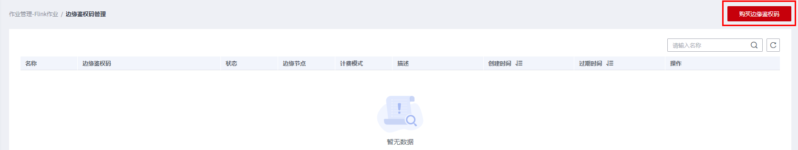

# 边缘鉴权码管理

当您需要在IEF边缘节点已部署的Flink应用上启动或停止Flink作业时，需要通过DLI服务端计费鉴权才可以使用，此时您需要购买边缘鉴权码。边缘鉴权码类似于使用边缘Flink应用的license。

## 注意事项

-   价格：20000元/年/节点，目前只支持按1年购买，计费周期从购买成功的时间点开始计算。
-   支持续费和退订。
-   同一时间段只支持绑定一个边缘节点，边缘节点只有绑定鉴权码之后才可以正常启动/停止作业。
-   支持解绑并重新绑定新节点。

    > **说明：** 
    >频繁多节点重复绑定解绑，会导致该鉴权码被鉴定为多节点复用而被锁定。

-   到期后未续费会导致鉴权码进入冻结期，冻结期内支持停止作业，但不支持启动作业。

## 购买边缘鉴权码

1.  在DLI管理控制台的左侧导航栏中，单击“作业管理“\>“Flink作业“，进入“Flink作业“页面。
2.  在“Flink作业“页面，单击右上角“边缘鉴权码管理“，进入边缘鉴权码管理页面。

    

3.  在“边缘鉴权码管理“页面，单击右上角“购买边缘鉴权码“， 进入购买页面。

    

4.  输入“名称“。名称只能包含数字、英文字母和下划线。但不能是纯数字，且不能以下划线开头。

    选择输入“描述“。

    “计费模式“默认为“包年“。

    “购买时长“默认为“1年“。

    可选择是否勾选“自动续费“。按年购买，自动续费周期为1年。

5.  单击右下方的“立即购买“，确认信息。
6.  单击“去支付“,进入支付页面。
7.  单击“确认支付“，提示“订单支付成功”，可以单击“查看订单详情”查看订单，也可以单击“返回数据湖探索控制台“返回至边缘鉴权码管理页面。

## 绑定节点

将在IEF创建的节点与在DLI所购买边缘鉴权码后，才可以启动或停止Flink作业。

1.  在边缘鉴权码管理页面，在所创建的鉴权码“操作”列中单击“绑定节点”。
2.  在弹出的“绑定节点”对话框中，选择需要绑定的边缘节点。
3.  单击“确定”。

## 解绑

当您需要更换节点时，可以先解绑旧的节点，重新绑定新的节点。

> **说明：** 
>解绑后，无法启动或停止目标应用上的Flink作业。

1.  在边缘鉴权码管理页面，在所创建的鉴权码“操作”列中单击“解绑”。
2.  在弹出的对话框中，单击“确定”。

## 续费

当购买的边缘鉴权码快到期时，如果需要继续使用，可进行续费操作。

1.  在边缘鉴权码管理页面，在所创建的鉴权码“操作”列中单击“更多”\>“续费”。
2.  在续费页面，确认信息。续费时长固定为“1年”。
3.  单击“去支付” 进入支付页面。

## 退订

不再需要使用边缘鉴权码时，可以进行退订操作。

1.  在边缘鉴权码管理页面，在所创建的鉴权码“操作”列中单击“更多”\>“退订”。
2.  在退订页面，确认信息，选择退订原因。

    > **说明：** 
    >续费资源不能享受5天无理由退订。

3.  单击“退订”，在弹出的对话框中再次确认信息，单击“退订”。
4.  可以在“ 订单详情 ”中查看退订的处理进度。或“返回退订管理”查看所有退订资源的信息。

