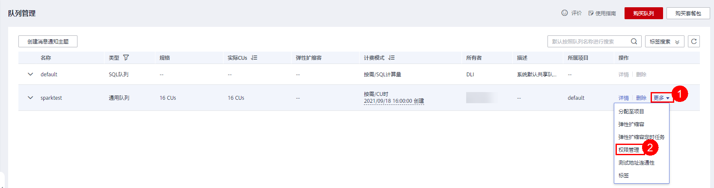
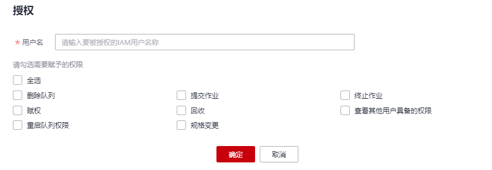
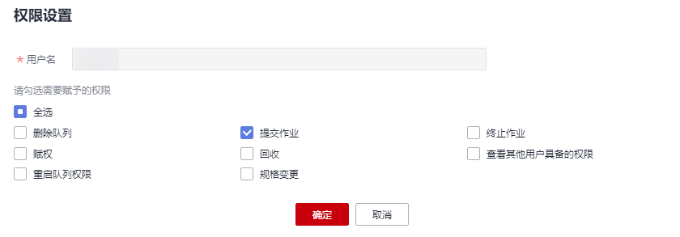

# 队列权限管理

## 队列权限管理操作场景

-   针对不同用户，可以通过权限设置分配不同的队列，不同用户之间的作业效率互不影响，保障作业性能。
-   管理员用户和队列的所有者拥有所有权限，不需要进行权限设置且其他用户无法修改其队列权限。
-   给新用户设置队列权限时，该用户所在用户组的所属区域需具有Tenant Guest权限。关于Tenant Guest权限的介绍和开通方法，详细参见《[权限策略](https://support.huaweicloud.com/usermanual-permissions/iam_01_0001.html)》和《统一身份认证服务用户指南》中的[创建用户组](https://support.huaweicloud.com/usermanual-iam/iam_03_0001.html)。

## 队列权限相关操作步骤

1.  在DLI管理控制台的左侧，选择“队列管理“。
2.  选择待设置的队列，单击其“操作”列中的“更多”\>“权限管理”。“用户权限信息”区域展示了当前具备此队列权限的用户列表。

    

    权限设置有3种场景：为新用户赋予权限，为已有权限的用户修改权限，回收某用户具备的所有权限。

    -   为新用户赋予权限

        新用户指之前不具备此队列权限的用户。

        1.  单击“权限信息”右侧的“授权”，弹出“授权“对话框。
        2.  填写“用户名“，并勾选对应权限。
        3.  单击“确定“，完成新用户的添加。

            待设置的参数说明如[表1](#table15710625151416)所示。

            **图 1**  队列权限授权  
            

            **表 1**  参数说明

            
            <table><thead align="left"><tr id="row1771212551410"><th class="cellrowborder" valign="top" width="20%" id="mcps1.2.3.1.1">
参数名称

            </th>
            <th class="cellrowborder" valign="top" width="80%" id="mcps1.2.3.1.2">
描述

            </th>
            </tr>
            </thead>
            <tbody><tr id="row207191525121418"><td class="cellrowborder" valign="top" width="20%" headers="mcps1.2.3.1.1 ">
用户名

            </td>
            <td class="cellrowborder" valign="top" width="80%" headers="mcps1.2.3.1.2 ">
被授权的用户名称。

            
 说明： 

该用户名称是已存在的IAM用户名称且该用户登录过DLI管理控制台。

            

            </td>
            </tr>
            <tr id="row1273232517141"><td class="cellrowborder" valign="top" width="20%" headers="mcps1.2.3.1.1 ">
权限设置

            </td>
            <td class="cellrowborder" valign="top" width="80%" headers="mcps1.2.3.1.2 "><ul id="ul19734132517140"><li>删除队列：删除此队列。</li><li>提交作业：向此队列提交作业。</li><li>终止作业：终止提交到此队列的作业。</li><li>赋权：当前用户可将队列的权限赋予其他用户。</li><li>回收：当前用户可回收其他用户具备的该队列的权限，但不能回收该队列所有者的权限。</li><li>查看其他用户具备的权限：当前用户可查看其他用户具备的该队列的权限。</li><li>重启队列权限：重启此队列的权限。</li><li>规格变更：修改队列规格的权限。</li></ul>
            </td>
            </tr>
            </tbody>
            </table>

    -   为已有权限的用户赋予权限或回收权限。
        1.  在对应队列“权限信息“区域的用户列表中，选择需要修改权限的用户，在“操作“列单击“权限设置“。
        2.  在队列“权限设置“对话框中，对当前用户具备的权限进行修改。详细权限描述如[表1](#table15710625151416)所示。

            当“权限设置“中的选项为灰色时，表示您不具备修改此队列权限的权限。可以向管理员用户、队列所有者等具有赋权权限的用户申请“队列的赋权”和“队列权限的回收”权限。

            **图 2**  队列权限设置  
            

        3.  单击“确定“完成权限设置。

    -   回收某用户具备的所有权限。

        在对应队列“权限信息“区域的用户列表中，选择需要删除权限的用户，在“操作“列单击“回收用户权限“。在“回收用户权限”对话框中单击“确定“后，此用户将不具备该队列的任意权限。

