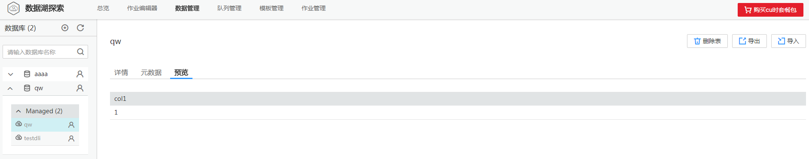
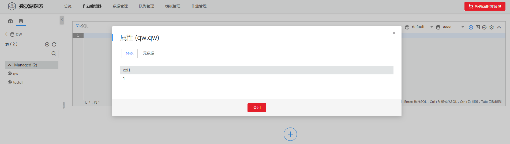

# 预览数据

## 操作场景

用户可预览表的前10条数据。

## 操作步骤

预览数据的入口有两个，分别在“数据管理“和“作业编辑器“页面。

-   在“数据管理“页面预览数据。
    1.  在DLI管理控制台的顶部菜单栏中，选择“数据管理“。
    2.  在“数据管理“页面，单击对应数据库的 ，展开该数据库下的表列表。
    3.  选中目标表，切换到“预览“页面，即可预览该表数据。

        **图 1**  预览数据-数据管理页面  
        

-   在“作业编辑器“页面预览数据。

    1.  在DLI管理控制台的顶部菜单栏中，选择“作业编辑器“。
    2.  在“作业编辑器“页面的左侧导航栏中，单击选择数据库，单击对应数据库名，将展开该数据库下的表列表。
    3.  单击目标表右侧的，切换到“预览“页面，即可预览该表数据。

        **图 2**  预览数据-作业编辑器页面  
        

    “预览页面“显示对应表的前10条数据。

