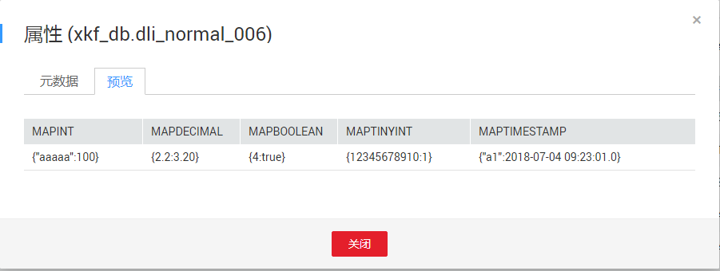

# 预览数据

## 操作场景

用户可预览表的前10条数据。

## 操作步骤

预览数据的入口有两个，分别在“数据管理“和“作业编辑器“页面。

-   在“数据管理“页面预览数据。
    1.  在SQL作业管理控制台的顶部菜单栏中，选择“数据管理“。
    2.  在“数据管理“页面，单击需导出数据对应数据库名称，进入该数据库“表管理”页面。
    3.  选中目标表，单击“操作”栏中的“更多“，选择“属性“。
    4.  切换到“预览”页签，即可预览该表数据。

-   在“作业编辑器“页面预览数据。
    1.  在SQL作业管理控制台的顶部菜单栏中，选择“作业编辑器“。
    2.  在“作业编辑器“页面的左侧导航栏中，单击选择数据库。
    3.  鼠标左键单击对应数据库名，将展开该数据库下的表列表。
    4.  鼠标右键单击对应表名，或者鼠标左键单击对应表右侧的，在列表菜单中选择“属性，”切换到“预览“页签，即可预览该表数据。

**图 1**  预览数据  

“预览页面“显示对应表的前10条数据。

